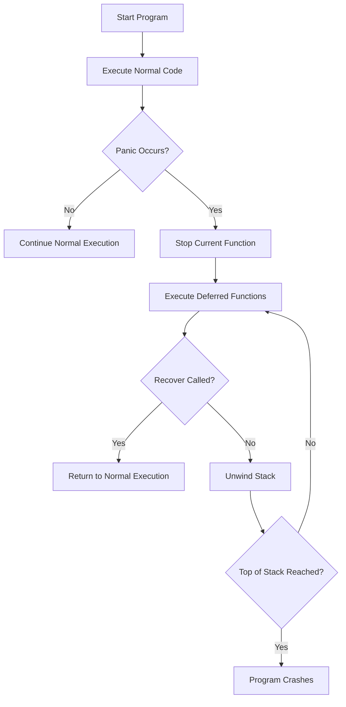

# Go Panic

## Introduction

When programming in Go, you'll primarily use error handling with the `error` type to manage expected issues. However, Go also provides a mechanism for handling unexpected or exceptional runtime errors: the **panic** system.

In this tutorial, we'll explore what panic is, when to use it (and when not to), and how to recover from panics to prevent your application from crashing. Understanding panic is crucial for writing robust Go applications that can gracefully handle unexpected situations.

## What is Panic?

A panic is a runtime error that stops the normal execution flow of your program. When a panic occurs:

1. The current function stops executing
2. Any deferred functions are executed 
3. The program continues unwinding the stack, running deferred functions along the way
4. When the top of the stack is reached, the program crashes with an error message

Think of a panic as Go's way of saying, "Something catastrophic happened that I don't know how to handle!"

## Creating a Panic

You can trigger a panic explicitly using the `panic()` function:

```go
func main() {
    fmt.Println("Starting the program")
    panic("Something went terribly wrong!")
    fmt.Println("This line will never execute")
}
```

**Output:**
```
Starting the program
panic: Something went terribly wrong!

goroutine 1 [running]:
main.main()
        /tmp/sandbox.go:8 +0x95
exit status 2
```

Notice how the second `fmt.Println` statement never executes because the panic immediately stops the normal flow of execution.

## When Panics Occur Naturally

Go will automatically panic in several situations:

1. Accessing an array out of bounds
2. Calling a method on a nil pointer
3. Concurrent map writes without synchronization
4. Deadlocks
5. Stack overflow

Here's an example of accessing an array out of bounds:

```go
func main() {
    slice := []int{1, 2, 3}
    fmt.Println("Slice:", slice)
    fmt.Println("Fourth element:", slice[3]) // This will cause a panic
    fmt.Println("This line won't execute")
}
```

**Output:**
```
Slice: [1 2 3]
panic: runtime error: index out of range [3] with length 3

goroutine 1 [running]:
main.main()
        /tmp/sandbox.go:7 +0x1b9
exit status 2
```

## The Defer Statement with Panic

The `defer` statement is particularly useful when dealing with panics because deferred functions still execute even when a panic occurs. This allows you to set up cleanup code that will run regardless of whether your function completes normally or panics.

```go
func main() {
    defer fmt.Println("This will still execute despite the panic")
    fmt.Println("Starting the program")
    panic("Oh no! Something went wrong")
    fmt.Println("This line will never execute")
}
```

**Output:**
```
Starting the program
This will still execute despite the panic
panic: Oh no! Something went wrong

goroutine 1 [running]:
main.main()
        /tmp/sandbox.go:8 +0xd5
exit status 2
```

## Recovering from a Panic

Go provides a built-in function called `recover()` that can catch a panic and return the value passed to `panic()`. However, `recover()` only works when called from within a deferred function.

```go
func main() {
    fmt.Println("Starting the program")
    
    defer func() {
        if r := recover(); r != nil {
            fmt.Println("Recovered from panic:", r)
        }
    }()
    
    fmt.Println("About to panic")
    panic("Disaster!")
    fmt.Println("This line won't execute")
}
```

**Output:**
```
Starting the program
About to panic
Recovered from panic: Disaster!
```

Notice that the program doesn't crash! The panic was caught by `recover()`, allowing the program to continue execution.

## Practical Example: Building a More Robust Function

Let's create a function that divides two numbers but uses panic and recover to handle division by zero:

```go
func safeDivide(a, b float64) (result float64) {
    // Set up the deferred recovery function
    defer func() {
        if r := recover(); r != nil {
            fmt.Println("Error:", r)
            result = 0 // Set a default value
        }
    }()
    
    // Check for division by zero and panic if needed
    if b == 0 {
        panic("Cannot divide by zero")
    }
    
    // Return the result
    return a / b
}

func main() {
    fmt.Println("10 / 2 =", safeDivide(10, 2))
    fmt.Println("10 / 0 =", safeDivide(10, 0))
    fmt.Println("Program continues executing!")
}
```

**Output:**
```
10 / 2 = 5
Error: Cannot divide by zero
10 / 0 = 0
Program continues executing!
```

## The Panic-Recover Flow

To understand panic and recover better, let's visualize the flow:



## Best Practices: When to Use Panic and Recover

Panic should **not** be your go-to error handling mechanism. Here are some guidelines:

### Use Panic When:

1. **During initialization**: If your program cannot start properly
2. **For truly unrecoverable situations**: When continuing would lead to undefined behavior
3. **In development or testing**: To catch bugs early

### Don't Use Panic When:

1. **Handling expected errors**: Use the `error` type instead
2. **API functions**: Library code generally shouldn't panic
3. **As a flow control mechanism**: Don't use panics for normal program flow

### Use Recover When:

1. **At API boundaries**: To prevent a panic from crashing your entire program
2. **When implementing middleware**: To catch panics from handlers
3. **To perform cleanup**: If you need to ensure resources are freed

## Real-World Application: HTTP Server with Panic Recovery

Here's a practical example showing how to use panic recovery in a web server:

```go
package main

import (
    "fmt"
    "net/http"
)

// panicHandler is an example handler that panics
func panicHandler(w http.ResponseWriter, r *http.Request) {
    panic("Oh no! Something unexpected happened!")
}

// safeHandler wraps an http.HandlerFunc with panic recovery
func safeHandler(h http.HandlerFunc) http.HandlerFunc {
    return func(w http.ResponseWriter, r *http.Request) {
        defer func() {
            if err := recover(); err != nil {
                fmt.Println("Recovered from panic:", err)
                http.Error(w, "Internal server error", http.StatusInternalServerError)
            }
        }()
        
        h(w, r)
    }
}

func main() {
    // Normal handler
    http.HandleFunc("/hello", func(w http.ResponseWriter, r *http.Request) {
        fmt.Fprintf(w, "Hello, World!")
    })
    
    // Panicking handler with recovery middleware
    http.HandleFunc("/panic", safeHandler(panicHandler))
    
    fmt.Println("Server starting on port 8080...")
    http.ListenAndServe(":8080", nil)
}
```

In this example, if you access `/panic`, the handler will panic but the server will not crash. Instead, it will recover from the panic, log the error, and return a 500 Internal Server Error response to the client.

## Summary

Understanding panic and recover in Go is essential for handling unexpected runtime errors. Here's what we covered:

- **Panic** is Go's mechanism for handling unexpected fatal errors
- A panic halts the normal execution flow and begins unwinding the stack
- **Deferred** functions still execute during a panic
- **Recover** allows you to catch a panic and continue execution
- Panic should be used sparingly for truly exceptional conditions
- The combination of defer, panic, and recover creates a powerful error handling system

## Exercises

1. Create a function that opens a file and panics if the file doesn't exist. Use recover to handle the panic gracefully.

2. Implement a "safe map" that doesn't panic when accessing a non-existent key. Instead, it should return a default value.

3. Write a function that takes a slice and an index, and safely gets the element at that index using panic and recover to handle out-of-bounds errors.

4. Create a simple calculator program that uses panic and recover to handle invalid operations (like division by zero).

5. Implement a middleware function similar to `safeHandler` above, but extend it to also log the stack trace when a panic occurs.

## Additional Resources

- [Go Documentation on Defer, Panic, and Recover](https://go.dev/blog/defer-panic-and-recover)
- [Effective Go: Panic](https://go.dev/doc/effective_go#panic)
- [Go By Example: Panic](https://gobyexample.com/panic)
- [Go By Example: Defer](https://gobyexample.com/defer)
- [Go By Example: Recover](https://gobyexample.com/recover)