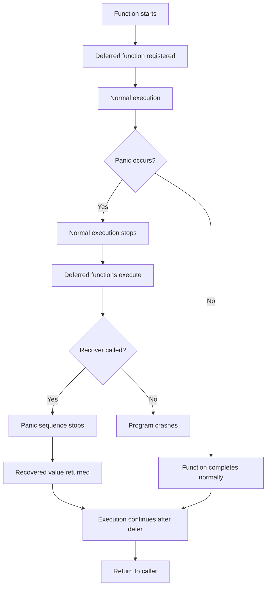

# Go Recover

## Introduction

When writing Go programs, you'll inevitably encounter errors. Go provides multiple ways to handle errors, and one of the most powerful mechanisms for handling unexpected catastrophic failures is the `recover` function. In this tutorial, we'll explore how `recover` works with the panic-and-recover mechanism in Go, allowing you to catch and handle panics that would otherwise crash your program.

## What is a Panic?

Before diving into recover, let's understand what a panic is. A panic in Go is a runtime error that occurs when something unexpected happens that the program cannot handle normally. For example:

- Accessing an array index that is out of bounds
- Calling a method on a nil pointer
- Division by zero
- Explicitly calling the `panic()` function

When a panic occurs, normal program execution stops, deferred functions are executed, and the program typically crashes with a stack trace.

## Enter Recover

Go's `recover` function provides a way to regain control of a panicking goroutine. It stops the panic sequence by restoring normal execution and retrieves the error value passed to the panic call.

The `recover` function works only when called from within a deferred function, making it a perfect companion to Go's defer statement.

## How Recover Works

Here's the basic syntax for using `recover`:

```go
func someFunction() {
    defer func() {
        if r := recover(); r != nil {
            // Handle the panic here
            fmt.Println("Recovered from:", r)
        }
    }()
    
    // Code that might panic
}
```

Let's break down what happens:

1. The `defer` statement ensures a function will be called when the surrounding function exits
2. Inside this deferred function, we call `recover()`
3. If there's no active panic, `recover()` returns `nil`
4. If there is an active panic, `recover()` captures the panic value and stops the panic sequence

## Basic Example of Recover

Let's see a simple example of `recover` in action:

```go
package main

import "fmt"

func main() {
    fmt.Println("Starting the program")
    panickingFunction()
    fmt.Println("Program continues execution")
}

func panickingFunction() {
    defer func() {
        if r := recover(); r != nil {
            fmt.Println("Recovered from:", r)
        }
    }()
    
    fmt.Println("About to panic")
    panic("something bad happened!")
    fmt.Println("This line won't be executed")
}
```

**Output:**
```
Starting the program
About to panic
Recovered from: something bad happened!
Program continues execution
```

Notice that:
- The program doesn't crash despite the panic
- The line after `panic()` never executes
- Execution continues in the main function after the panic is recovered

## When to Use Recover

Recover is especially useful in scenarios such as:

1. **Server applications** that need to continue running even if one request fails
2. **Library functions** that want to provide more user-friendly error messages
3. **Long-running applications** where you want to log errors but keep the program running

## Practical Examples

### Example 1: Web Server That Doesn't Crash

Let's create a simple web server that uses recover to prevent panics from crashing the entire server:

```go
package main

import (
    "fmt"
    "net/http"
)

func safeHandler(w http.ResponseWriter, r *http.Request) {
    defer func() {
        if err := recover(); err != nil {
            // Log the error
            fmt.Println("Panic occurred:", err)
            // Return an error to the user
            http.Error(w, "Something went wrong", http.StatusInternalServerError)
        }
    }()
    
    // This will cause a panic
    var p *int = nil
    fmt.Println(*p) // Nil pointer dereference
}

func main() {
    http.HandleFunc("/", safeHandler)
    fmt.Println("Server starting on port 8080...")
    http.ListenAndServe(":8080", nil)
}
```

In this example, even though the handler panics due to a nil pointer dereference, the server continues running and responds with a 500 error instead of crashing.

### Example 2: Safely Processing Items in a Batch

Here's an example of how to use recover when processing multiple items in a batch:

```go
package main

import "fmt"

func processItems(items []string) {
    for i, item := range items {
        func() {
            defer func() {
                if r := recover(); r != nil {
                    fmt.Printf("Error processing item %d (%s): %v
", i, item, r)
                }
            }()
            
            processItem(item)
            fmt.Printf("Successfully processed item %d: %s
", i, item)
        }()
    }
    
    fmt.Println("Batch processing complete")
}

func processItem(item string) {
    if item == "bad_data" {
        panic("cannot process bad data")
    }
    // Normal processing here
}

func main() {
    items := []string{"good_data", "bad_data", "more_good_data"}
    processItems(items)
}
```

**Output:**
```
Successfully processed item 0: good_data
Error processing item 1 (bad_data): cannot process bad data
Successfully processed item 2: more_good_data
Batch processing complete
```

This pattern allows the program to continue processing the remaining items even if one item causes a panic.

## Best Practices for Using Recover

1. **Only recover from expected panics** - Don't use recover as a general error handling mechanism; use error returns for expected error conditions
2. **Recover in deferred anonymous functions** - This keeps the recovery code close to where it applies
3. **Log recovered panics** - Always log the details of what was recovered for debugging
4. **Re-panic when appropriate** - If you can't handle a specific panic, consider re-panicking:

```go
defer func() {
    if r := recover(); r != nil {
        if knownPanic(r) {
            // Handle known panic type
            handleKnownPanic(r)
        } else {
            // Re-panic for unknown panic types
            panic(r)
        }
    }
}()
```

5. **Limit the scope of recovery** - Recover only in functions where you can properly handle the error

## Visualizing the Panic and Recover Flow

Here's a diagram showing how panic and recover work together:



## Common Mistakes and Pitfalls

### Mistake 1: Calling Recover Outside a Deferred Function

```go
func wrong() {
    // This will never work!
    if r := recover(); r != nil {
        fmt.Println("This won't recover anything")
    }
    
    // Code that might panic
    panic("oops")
}
```

Recover only works when called directly from a deferred function.

### Mistake 2: Recovering in the Wrong Scope

```go
func outer() {
    defer func() {
        if r := recover(); r != nil {
            fmt.Println("Recovered in outer")
        }
    }()
    
    inner()
}

func inner() {
    // This panic will be caught by outer's recover
    panic("inner panic")
}
```

This works, but it might be better to handle the panic closer to its source for better error information.

### Mistake 3: Using Recover for Normal Error Handling

Recover should be reserved for unexpected, catastrophic failures. For expected errors, use Go's standard error handling with returned error values.

## Recover vs. Traditional Error Handling

|                 | Recover                         | Error Returns                  |
|-----------------|----------------------------------|--------------------------------|
| **Use when**     | Handling unexpected failures     | Handling expected errors       |
| **Mechanism**    | Deferred function with recover() | Return error values as normal  |
| **Control flow** | Stops execution after panic      | Normal sequential execution    |
| **Readability**  | Can be harder to follow          | Clear and explicit             |
| **Performance**  | Higher overhead                  | Minimal overhead               |

## Summary

Go's recover mechanism provides a powerful way to handle panics and prevent program crashes. When used correctly, it allows your programs to gracefully handle unexpected errors and continue execution. Remember these key points:

- Recover only works when called directly from a deferred function
- It's meant for handling unexpected catastrophic failures, not for regular error handling
- The best practice is to recover only when you can meaningfully handle the error
- Always log recovered panics for debugging purposes

By mastering recover, you'll be able to write more robust Go applications that can handle errors gracefully without crashing.

## Additional Resources and Exercises

### Resources
- [Official Go Documentation on Defer, Panic, and Recover](https://go.dev/blog/defer-panic-and-recover)
- [Go by Example: Panic and Recover](https://gobyexample.com/panic)
- [Effective Go: Error Handling](https://golang.org/doc/effective_go#errors)

### Exercises

1. **Basic Recovery**: Write a function that calls `panic()` with different error messages and use `recover()` to print them.

2. **Selective Recovery**: Create a program that recovers from certain types of panics but allows others to crash the program.

3. **Web Server Practice**: Create a web server with multiple handlers that might panic. Use middleware to recover from these panics and log helpful error messages.

4. **Stack Trace**: Modify the recovery function to also print the stack trace using the `runtime/debug` package's `debug.Stack()` function.

5. **Custom Error Types**: Define custom error types and implement a system that can differentiate between different panic types during recovery.