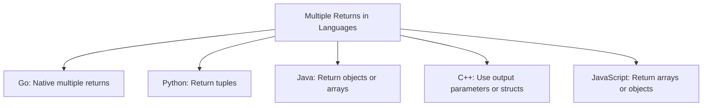

# Go Multiple Returns

## Introduction

One of Go's most powerful and distinctive features is the ability for functions to return multiple values. Unlike many traditional programming languages that restrict functions to returning a single value, Go allows functions to return several values at once. This feature simplifies error handling, eliminates the need for reference parameters, and makes your code more readable and maintainable.

In this tutorial, we'll explore how multiple return values work in Go, common patterns for using them, and practical examples to help you incorporate this feature into your own programs.

## Basic Syntax for Multiple Returns

In Go, a function can return multiple values by listing all return types in parentheses in the function declaration.

```go
func functionName(parameters) (returnType1, returnType2, ...) {
    // function body
    return value1, value2, ...
}
```

Let's look at a simple example:

```go
package main

import "fmt"

func getNameAndAge() (string, int) {
    return "John", 30
}

func main() {
    name, age := getNameAndAge()
    fmt.Printf("Name: %s, Age: %d
", name, age)
}
```

**Output:**
```
Name: John, Age: 30
```

In this example, the `getNameAndAge()` function returns two values: a string and an integer. When we call this function, we use multiple assignment to capture both return values in separate variables.

## Named Return Values

Go also supports named return values. When you declare a function with named return values, those variables are initialized with their zero values and can be used within the function body. A simple `return` statement without arguments will return the current values of those variables.

```go
func rectangleProperties(length, width float64) (area, perimeter float64) {
    area = length * width
    perimeter = 2 * (length + width)
    return // returns the named variables: area and perimeter
}
```

Here's a complete example:

```go
package main

import "fmt"

func rectangleProperties(length, width float64) (area, perimeter float64) {
    area = length * width
    perimeter = 2 * (length + width)
    return
}

func main() {
    area, perimeter := rectangleProperties(5.0, 3.0)
    fmt.Printf("Area: %.2f, Perimeter: %.2f
", area, perimeter)
}
```

**Output:**
```
Area: 15.00, Perimeter: 16.00
```

Named return values make your code more readable and self-documenting, as the purpose of each return value is clear from the function declaration.

## Ignoring Return Values

Sometimes you might need only some of the return values from a function. Go allows you to ignore unwanted return values by using the blank identifier `_`.

```go
package main

import "fmt"

func getCoordinates() (int, int, int) {
    return 10, 20, 30
}

func main() {
    // Only interested in x and z coordinates
    x, _, z := getCoordinates()
    fmt.Printf("X: %d, Z: %d
", x, z)
}
```

**Output:**
```
X: 10, Z: 30
```

In this example, we're ignoring the y-coordinate by using `_` in the assignment.

## Error Handling with Multiple Returns

One of the most common uses of multiple return values in Go is for error handling. By convention, the last return value is used to indicate whether the function executed successfully or encountered an error.

```go
package main

import (
    "errors"
    "fmt"
)

func divide(a, b float64) (float64, error) {
    if b == 0 {
        return 0, errors.New("division by zero")
    }
    return a / b, nil
}

func main() {
    // Successful case
    result, err := divide(10, 2)
    if err != nil {
        fmt.Println("Error:", err)
    } else {
        fmt.Printf("10 / 2 = %.2f
", result)
    }
    
    // Error case
    result, err = divide(10, 0)
    if err != nil {
        fmt.Println("Error:", err)
    } else {
        fmt.Printf("10 / 0 = %.2f
", result)
    }
}
```

**Output:**
```
10 / 2 = 5.00
Error: division by zero
```

This pattern is idiomatic in Go. It allows for clear and straightforward error handling without exceptions or special return codes.

## Practical Examples

### Example 1: Parsing User Input

```go
package main

import (
    "fmt"
    "strconv"
    "strings"
)

func parseUserInfo(input string) (string, int, error) {
    parts := strings.Split(input, ",")
    if len(parts) != 2 {
        return "", 0, fmt.Errorf("invalid input format: expected 'name,age'")
    }
    
    name := strings.TrimSpace(parts[0])
    if name == "" {
        return "", 0, fmt.Errorf("name cannot be empty")
    }
    
    ageStr := strings.TrimSpace(parts[1])
    age, err := strconv.Atoi(ageStr)
    if err != nil {
        return "", 0, fmt.Errorf("invalid age: %v", err)
    }
    
    if age < 0 || age > 150 {
        return "", 0, fmt.Errorf("age out of reasonable range (0-150)")
    }
    
    return name, age, nil
}

func main() {
    inputs := []string{
        "Alice, 30",
        "Bob, abc",
        "Charlie",
        ", 25",
        "Diana, 200",
    }
    
    for _, input := range inputs {
        name, age, err := parseUserInfo(input)
        if err != nil {
            fmt.Printf("Error parsing '%s': %v
", input, err)
        } else {
            fmt.Printf("Successfully parsed: Name = %s, Age = %d
", name, age)
        }
    }
}
```

**Output:**
```
Successfully parsed: Name = Alice, Age = 30
Error parsing 'Bob, abc': invalid age: strconv.Atoi: parsing "abc": invalid syntax
Error parsing 'Charlie': invalid input format: expected 'name,age'
Error parsing ', 25': name cannot be empty
Error parsing 'Diana, 200': age out of reasonable range (0-150)
```

This example demonstrates how multiple returns can help validate and parse user input while providing meaningful error messages.

### Example 2: File Operations

```go
package main

import (
    "fmt"
    "io/ioutil"
    "os"
    "strings"
)

func countFileStats(filename string) (int, int, int, error) {
    data, err := ioutil.ReadFile(filename)
    if err != nil {
        return 0, 0, 0, fmt.Errorf("error reading file: %v", err)
    }
    
    content := string(data)
    lines := strings.Split(content, "
")
    
    lineCount := len(lines)
    wordCount := 0
    charCount := len(content)
    
    for _, line := range lines {
        words := strings.Fields(line)
        wordCount += len(words)
    }
    
    return lineCount, wordCount, charCount, nil
}

func main() {
    // Create a temporary file for demonstration
    tempFile, err := ioutil.TempFile("", "example")
    if err != nil {
        fmt.Println("Error creating temp file:", err)
        return
    }
    defer os.Remove(tempFile.Name())
    
    content := "Hello world!
This is an example.
Multiple returns in Go are powerful."
    if _, err := tempFile.WriteString(content); err != nil {
        fmt.Println("Error writing to file:", err)
        return
    }
    
    if err := tempFile.Close(); err != nil {
        fmt.Println("Error closing file:", err)
        return
    }
    
    // Count file statistics
    lines, words, chars, err := countFileStats(tempFile.Name())
    if err != nil {
        fmt.Println("Error:", err)
    } else {
        fmt.Printf("File stats: %d lines, %d words, %d characters
", lines, words, chars)
    }
}
```

**Output:**
```
File stats: 3 lines, 12 words, 69 characters
```

This example shows how multiple returns can be used to return several statistics about a file in a single function call.

## Common Patterns and Best Practices

### 1. Result and Error Pattern

The most common pattern in Go is returning a result and an error. This is used extensively in the standard library:

```go
result, err := someFunction()
if err != nil {
    // handle error
    return
}
// use result
```

### 2. Found and Value Pattern

When searching for something that might not exist, a common pattern is to return whether the item was found and the item itself:

```go
func findUser(id int) (user User, found bool) {
    // Search for user
    if userExists {
        return foundUser, true
    }
    return User{}, false
}
```

Usage:

```go
if user, found := findUser(123); found {
    // Use user
} else {
    // Handle not found case
}
```

### 3. Keep Return Types Simple

While you can return many values, it's usually best to keep the number manageable. If you need to return more than 3-4 values, consider using a struct instead:

```go
// Instead of:
func complexOperation() (int, string, bool, float64, error) {
    // ...
}

// Consider:
type OperationResult struct {
    Count     int
    Name      string
    IsValid   bool
    Score     float64
}

func complexOperation() (OperationResult, error) {
    // ...
}
```

### 4. Consistent Order for Similar Functions

When you have multiple functions with similar purposes, keep the order of return values consistent:

```go
// Good - consistent order
func findUserByID(id int) (User, error)
func findUserByEmail(email string) (User, error)

// Bad - inconsistent order
func findUserByID(id int) (User, error)
func findUserByEmail(email string) (error, User)  // Inconsistent!
```

## Comparison with Other Languages

Many languages have different approaches to returning multiple values:



Go's approach is notable for its simplicity and clarity. You don't need to create temporary containers or use output parameters—multiple returns are a first-class language feature.

## Summary

Go's multiple return values feature provides several benefits:

1. **Simplified error handling**: The result-and-error pattern eliminates the need for exceptions or special error codes.
2. **Improved readability**: Functions can return related values directly without the need for wrapper objects.
3. **Better API design**: Functions can return natural combinations of values without artificial containers.
4. **Reduced boilerplate**: No need for "out" parameters or container classes like in some other languages.

When working with multiple returns, remember these key points:

- Use named returns for self-documenting code when appropriate
- The blank identifier (`_`) can ignore unwanted return values
- By convention, errors are the last return value
- Consider using a struct for functions that would otherwise return many values

## Exercises

1. Write a function called `minMax` that takes a slice of integers and returns both the minimum and maximum values in the slice.

2. Create a function called `parseTime` that accepts a string in the format "hh:mm" and returns the corresponding hours and minutes as integers, along with an error if the format is invalid.

3. Implement a function called `divide` that takes two integers and returns the quotient, remainder, and a boolean indicating whether the division was exact (remainder is zero).

4. Write a function called `fileInfo` that accepts a filename and returns the file size, creation time, and an error if the file cannot be accessed.

5. Create a `validateUser` function that takes a username and password and returns a boolean indicating if the credentials are valid, a user ID if valid, and an appropriate error message if invalid.

## Additional Resources

- [Go Tour: Multiple Results](https://tour.golang.org/basics/6)
- [Effective Go: Multiple Returns](https://golang.org/doc/effective_go.html#multiple-returns)
- [Go By Example: Multiple Return Values](https://gobyexample.com/multiple-return-values)
- [Go Standard Library](https://golang.org/pkg/): Many examples of multiple return values in the standard library