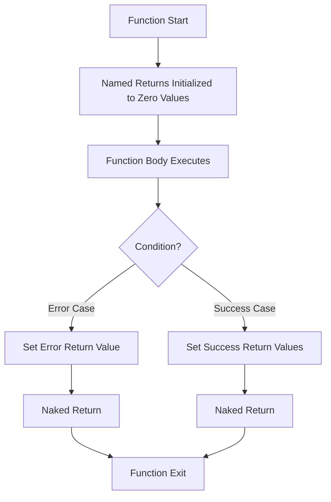

# Go Named Returns

## Introduction

In Go, functions can return multiple values, which is a powerful feature that sets it apart from many other programming languages. Building on this capability, Go also supports "named returns" - a feature that allows you to name your return values in the function declaration. This not only makes your code more readable but also provides some unique benefits that we'll explore in this tutorial.

Named returns are especially useful for beginner Go programmers as they help make function signatures more self-documenting and can simplify certain patterns in your code.

## Basic Syntax of Named Returns

In a regular Go function, you might define return types like this:

```go
func divide(a, b int) (int, error) {
    if b == 0 {
        return 0, errors.New("cannot divide by zero")
    }
    return a / b, nil
}
```

With named returns, you give names to these return values:

```go
func divide(a, b int) (result int, err error) {
    if b == 0 {
        err = errors.New("cannot divide by zero")
        return // naked return
    }
    result = a / b
    return // naked return
}
```

Notice how we define `result` and `err` in the function signature, and then we can use a "naked return" statement (just the `return` keyword without listing values).

## How Named Returns Work

When you declare named return values:

1. Go automatically initializes these variables with their zero values
2. You can assign values to them anywhere in the function
3. A naked `return` statement will automatically return the current values of these named variables

Let's see a complete example:

```go
package main

import (
    "errors"
    "fmt"
)

func divide(a, b int) (quotient int, err error) {
    // quotient is initialized to 0
    // err is initialized to nil
    
    if b == 0 {
        err = errors.New("cannot divide by zero")
        return // returns quotient=0, err=error
    }
    
    quotient = a / b
    return // returns quotient=a/b, err=nil
}

func main() {
    q, err := divide(10, 2)
    if err != nil {
        fmt.Println("Error:", err)
    } else {
        fmt.Println("Result:", q) // Output: Result: 5
    }
    
    q, err = divide(10, 0)
    if err != nil {
        fmt.Println("Error:", err) // Output: Error: cannot divide by zero
    } else {
        fmt.Println("Result:", q)
    }
}
```

## Benefits of Named Returns

### 1. Self-documenting Code

Named returns make your function signatures more descriptive:

```go
// Without named returns
func calculateStats(numbers []int) (float64, float64, float64)

// With named returns - much clearer!
func calculateStats(numbers []int) (mean float64, median float64, stdDev float64)
```

### 2. Simplified Error Handling

Error handling patterns become cleaner:

```go
func processFile(filename string) (content string, err error) {
    file, err := os.Open(filename)
    if err != nil {
        return // Returns empty content and the error
    }
    defer file.Close()
    
    data, err := io.ReadAll(file)
    if err != nil {
        return // Returns empty content and the new error
    }
    
    content = string(data)
    return // Returns the content and nil error
}
```

### 3. Easier Deferred Functions

Named returns work well with deferred functions that might need to modify return values:

```go
func processData(input []int) (result int, err error) {
    // Set up deferred function that might modify err
    defer func() {
        if r := recover(); r != nil {
            err = fmt.Errorf("processing failed: %v", r)
        }
    }()
    
    // Some processing that might panic
    for _, v := range input {
        if v < 0 {
            panic("negative input not allowed")
        }
        result += v
    }
    
    return // Will return the latest values of result and err
}
```

## Real-world Applications

### Example 1: Database Operations

Named returns are particularly useful for database operations:

```go
func getUserDetails(id int) (user User, found bool, err error) {
    db, err := sql.Open("postgres", connectionString)
    if err != nil {
        return // Returns zero User, found=false, and the error
    }
    defer db.Close()
    
    row := db.QueryRow("SELECT name, email, age FROM users WHERE id = $1", id)
    err = row.Scan(&user.Name, &user.Email, &user.Age)
    
    if err == sql.ErrNoRows {
        // User not found but no error
        return // Returns zero User, found=false, err=nil
    } else if err != nil {
        // Database error
        return // Returns zero User, found=false, and the error
    }
    
    found = true
    return // Returns populated User, found=true, err=nil
}
```

### Example 2: Data Processing Pipeline

Named returns help make complex pipelines more readable:

```go
func processDataSet(rawData []byte) (processed []float64, stats DataStats, err error) {
    // Parse input
    parsed, err := parseRawData(rawData)
    if err != nil {
        return // Early return with default values
    }
    
    // Process data
    processed, err = calculateResults(parsed)
    if err != nil {
        return // Early return with default values
    }
    
    // Calculate statistics
    stats = generateStats(processed)
    
    return // Return the full result set
}
```

## Best Practices

### When to Use Named Returns

✅ Use named returns when:
- Your function returns multiple values of the same type
- You have complex error handling patterns
- You need to modify return values in deferred functions
- You want to make your API more self-documenting

### When to Avoid Named Returns

❌ Avoid named returns when:
- Your function is very large (named returns can make large functions harder to follow)
- The return values are obvious from context
- You're not using naked returns (if you always specify values in return statements, named returns add little value)

### Naked Return Best Practices

The naked `return` statement (just `return` without values) should be used carefully:

```go
// Good: Small function with clear flow
func isPositive(num int) (result bool, err error) {
    if num < 0 {
        err = errors.New("negative number")
        return
    }
    result = true
    return
}

// Avoid in larger functions: Hard to track what's being returned
func complexFunction(data []int) (result int, transformed []int, err error) {
    // Many lines of code...
    
    if someCondition {
        // More code...
        result = 42
        transformed = someSlice
        // It's unclear what err is at this point
        return // Avoid naked returns in complex functions
    }
    
    // Better: Be explicit in complex functions
    return result, transformed, err
}
```

## Common Patterns with Named Returns

### The Preallocation Pattern

Named returns allow you to preallocate slices or maps and fill them in:

```go
func generateSequence(length int) (seq []int, err error) {
    if length < 0 {
        err = errors.New("length cannot be negative")
        return
    }
    
    // Preallocate the slice
    seq = make([]int, 0, length)
    
    for i := 0; i < length; i++ {
        seq = append(seq, i*i)
    }
    
    return
}
```

### The Transform Pattern

Named returns work well for transformations:

```go
func transformStrings(input []string) (output []string, err error) {
    output = make([]string, 0, len(input))
    
    for _, s := range input {
        transformed, err := processSingle(s)
        if err != nil {
            return nil, err // Explicit return for clarity
        }
        output = append(output, transformed)
    }
    
    return // Returns populated output and nil error
}
```

## Understanding the Flow

Here's a diagram showing the flow of execution with named returns:



## Summary

Named returns in Go provide several benefits:

1. **Self-documentation**: They make function signatures more descriptive
2. **Cleaner error handling**: They simplify early returns and error propagation
3. **Initialization**: Return variables are automatically initialized to zero values
4. **Deferred functions**: They work well with deferred functions that modify return values

However, they should be used judiciously - they're most valuable in small to medium-sized functions with multiple return values or complex error handling patterns.

## Exercises

1. Rewrite the following function to use named returns:
   ```go
   func divide(a, b float64) (float64, error) {
       if b == 0 {
           return 0, errors.New("division by zero")
       }
       return a / b, nil
   }
   ```

2. Create a function that finds the minimum, maximum, and average of a slice of integers using named returns.

3. Write a function that reads a file, counts the lines, words, and characters, and returns these counts using named returns.

## Additional Resources

- [Go by Example: Multiple Return Values](https://gobyexample.com/multiple-return-values)
- [Effective Go: Named Results](https://golang.org/doc/effective_go#named-results)
- [Go Tour: Named Return Values](https://tour.golang.org/basics/7)

Happy coding with Go named returns!