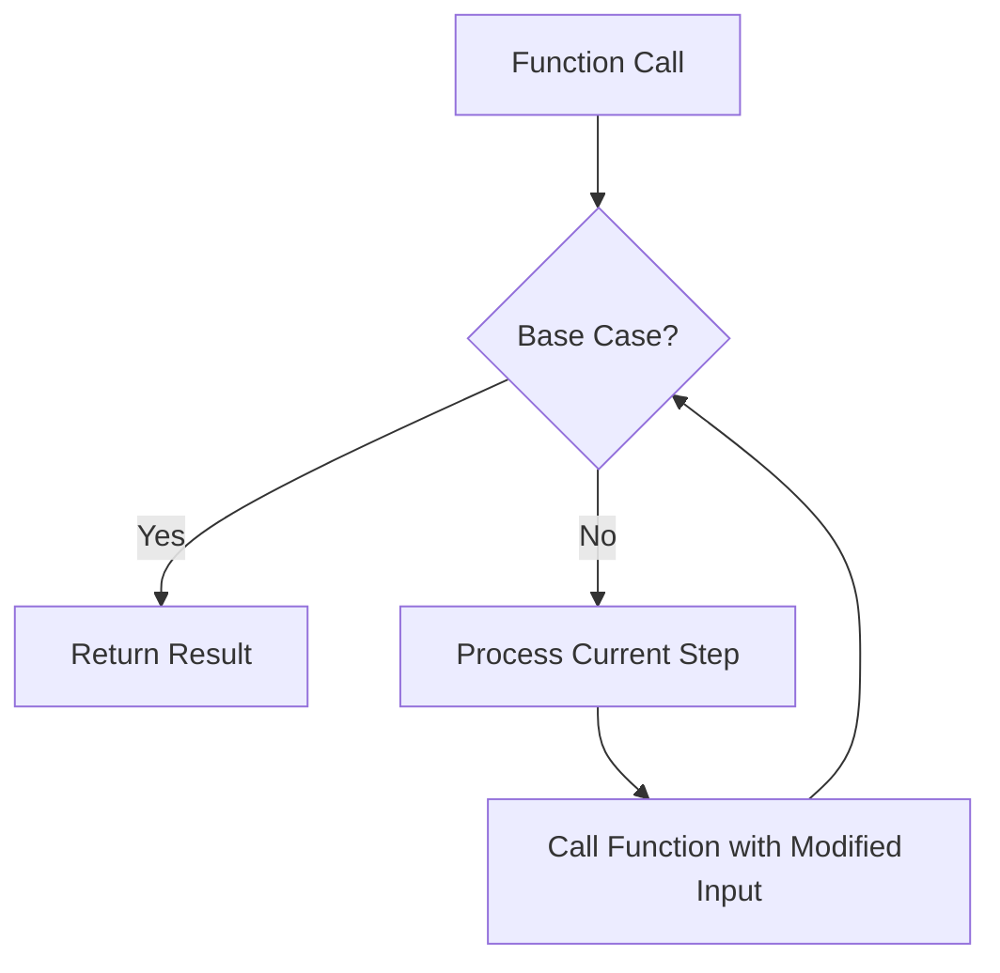

# Go Recursion

## Introduction

Recursion is a powerful programming technique where a function calls itself to solve problems by breaking them down into smaller, similar subproblems. In Go, recursion can lead to elegant solutions for complex problems that would otherwise require complicated iterative approaches.

This tutorial will guide you through the concept of recursion in Go, starting with basic examples and gradually moving to more practical applications. By the end, you'll understand when and how to use recursion effectively in your Go programs.

## What is Recursion?

Recursion occurs when a function calls itself directly or indirectly. Every recursive function has two main components:

1. **Base case(s)**: Condition(s) that stop the recursion
2. **Recursive case(s)**: Where the function calls itself with a modified input

Without a proper base case, recursion would continue indefinitely, causing a stack overflow error.

Let's visualize the concept of recursion:



## Basic Example: Factorial Calculation

The factorial of a number is a classic example of recursion. The factorial of a non-negative integer `n` (denoted as `n!`) is the product of all positive integers less than or equal to `n`.

For example:
- 0! = 1 (by definition)
- 1! = 1
- 2! = 2 × 1 = 2
- 3! = 3 × 2 × 1 = 6
- 4! = 4 × 3 × 2 × 1 = 24

Here's how to implement factorial using recursion in Go:

```go
package main

import "fmt"

// Factorial calculates n! using recursion
func Factorial(n int) int {
    // Base case
    if n == 0 {
        return 1
    }
    
    // Recursive case
    return n * Factorial(n-1)
}

func main() {
    fmt.Println("Factorial of 0:", Factorial(0))
    fmt.Println("Factorial of 5:", Factorial(5))
    fmt.Println("Factorial of 10:", Factorial(10))
}
```

**Output:**
```
Factorial of 0: 1
Factorial of 5: 120
Factorial of 10: 3628800
```

Let's trace through the execution of `Factorial(5)`:

1. Call `Factorial(5)`: 5 is not 0, so return `5 * Factorial(4)`
2. Call `Factorial(4)`: 4 is not 0, so return `4 * Factorial(3)`
3. Call `Factorial(3)`: 3 is not 0, so return `3 * Factorial(2)`
4. Call `Factorial(2)`: 2 is not 0, so return `2 * Factorial(1)`
5. Call `Factorial(1)`: 1 is not 0, so return `1 * Factorial(0)`
6. Call `Factorial(0)`: 0 is the base case, return 1
7. Now we can calculate the result by going back up the call stack:
- `Factorial(1)` = 1 * 1 = 1
- `Factorial(2)` = 2 * 1 = 2
- `Factorial(3)` = 3 * 2 = 6
- `Factorial(4)` = 4 * 6 = 24
- `Factorial(5)` = 5 * 24 = 120

## The Fibonacci Sequence

Another classic example of recursion is generating the Fibonacci sequence, where each number is the sum of the two preceding ones: 0, 1, 1, 2, 3, 5, 8, 13, 21, ...

Here's a recursive implementation in Go:

```go
package main

import "fmt"

// Fibonacci returns the nth Fibonacci number
func Fibonacci(n int) int {
    // Base cases
    if n <= 0 {
        return 0
    }
    if n == 1 {
        return 1
    }
    
    // Recursive case
    return Fibonacci(n-1) + Fibonacci(n-2)
}

func main() {
    fmt.Println("First 10 Fibonacci numbers:")
    for i := 0; i < 10; i++ {
        fmt.Printf("%d ", Fibonacci(i))
    }
}
```

**Output:**
```
First 10 Fibonacci numbers:
0 1 1 2 3 5 8 13 21 34
```

While this implementation is elegant and easy to understand, it's not efficient for large values of `n` due to redundant calculations. We'll address this limitation later in the tutorial.

## Understanding the Call Stack

When a function calls itself recursively, each call is added to the call stack. The call stack has a limited size, so very deep recursion can lead to a stack overflow error.

Let's visualize how the call stack works with a simple recursive function:

```go
package main

import "fmt"

func CountDown(n int) {
    fmt.Println("Count:", n)
    
    // Base case
    if n == 0 {
        fmt.Println("Done!")
        return
    }
    
    // Recursive call
    CountDown(n - 1)
    
    fmt.Println("Returning from call where n =", n)
}

func main() {
    CountDown(3)
}
```

**Output:**
```
Count: 3
Count: 2
Count: 1
Count: 0
Done!
Returning from call where n = 1
Returning from call where n = 2
Returning from call where n = 3
```

The call stack for `CountDown(3)` would look like:

```
┌─────────────────┐
│  CountDown(0)   │
├─────────────────┤
│  CountDown(1)   │
├─────────────────┤
│  CountDown(2)   │
├─────────────────┤
│  CountDown(3)   │
├─────────────────┤
│      main()     │
└─────────────────┘
```

After reaching the base case, the stack unwinds:

```
┌─────────────────┐
│      main()     │
└─────────────────┘
```

## Tail Recursion

Tail recursion is a special form of recursion where the recursive call is the last operation in the function. Some programming languages and compilers can optimize tail recursion to avoid stack overflow by reusing the current stack frame instead of adding a new one.

Go currently doesn't optimize tail recursion automatically, but writing tail-recursive functions is still a good practice for clarity.

Here's a tail-recursive version of the factorial function:

```go
package main

import "fmt"

// TailFactorial calculates factorial using tail recursion
func TailFactorial(n int) int {
    return factorialHelper(n, 1)
}

// Helper function for tail recursion
func factorialHelper(n, accumulator int) int {
    // Base case
    if n == 0 {
        return accumulator
    }
    
    // Tail recursive call
    return factorialHelper(n-1, n*accumulator)
}

func main() {
    fmt.Println("Factorial of 5:", TailFactorial(5))
}
```

**Output:**
```
Factorial of 5: 120
```

This approach passes an accumulator parameter that keeps track of the partial result, allowing the final return to happen immediately after the last recursive call completes.

## Practical Examples

### 1. Directory Traversal

Recursion is particularly useful for traversing hierarchical structures like file systems. Here's an example that lists all files in a directory and its subdirectories:

```go
package main

import (
    "fmt"
    "io/fs"
    "os"
    "path/filepath"
)

func listFiles(path string, indent string) error {
    // Open the directory
    entries, err := os.ReadDir(path)
    if err != nil {
        return err
    }
    
    // Iterate through directory entries
    for _, entry := range entries {
        // Print the current entry
        fmt.Println(indent + entry.Name())
        
        // If it's a directory, recursively list its contents
        if entry.IsDir() {
            newPath := filepath.Join(path, entry.Name())
            listFiles(newPath, indent+"  ")
        }
    }
    
    return nil
}

func main() {
    // Start listing from the current directory
    err := listFiles(".", "")
    if err != nil {
        fmt.Println("Error:", err)
    }
}
```

### 2. Binary Tree Traversal

Recursion is the natural choice for tree traversals. Here's an example of in-order traversal of a binary search tree:

```go
package main

import "fmt"

// TreeNode represents a node in a binary tree
type TreeNode struct {
    Value int
    Left  *TreeNode
    Right *TreeNode
}

// InOrderTraversal performs an in-order traversal of the tree
func InOrderTraversal(node *TreeNode) {
    // Base case: empty subtree
    if node == nil {
        return
    }
    
    // Recursively traverse left subtree
    InOrderTraversal(node.Left)
    
    // Process current node
    fmt.Print(node.Value, " ")
    
    // Recursively traverse right subtree
    InOrderTraversal(node.Right)
}

func main() {
    // Create a simple binary search tree
    root := &TreeNode{
        Value: 4,
        Left: &TreeNode{
            Value: 2,
            Left:  &TreeNode{Value: 1},
            Right: &TreeNode{Value: 3},
        },
        Right: &TreeNode{
            Value: 6,
            Left:  &TreeNode{Value: 5},
            Right: &TreeNode{Value: 7},
        },
    }
    
    fmt.Print("In-order traversal: ")
    InOrderTraversal(root)
    fmt.Println()
}
```

**Output:**
```
In-order traversal: 1 2 3 4 5 6 7
```

### 3. Solving Problems: Tower of Hanoi

The Tower of Hanoi is a classic puzzle that's elegantly solved using recursion:

```go
package main

import "fmt"

func moveDisks(n int, source, auxiliary, target string) {
    // Base case: only one disk to move
    if n == 1 {
        fmt.Printf("Move disk 1 from %s to %s
", source, target)
        return
    }
    
    // Move n-1 disks from source to auxiliary using target as the auxiliary
    moveDisks(n-1, source, target, auxiliary)
    
    // Move the nth disk from source to target
    fmt.Printf("Move disk %d from %s to %s
", n, source, target)
    
    // Move n-1 disks from auxiliary to target using source as the auxiliary
    moveDisks(n-1, auxiliary, source, target)
}

func main() {
    numDisks := 3
    moveDisks(numDisks, "A", "B", "C")
}
```

**Output:**
```
Move disk 1 from A to C
Move disk 2 from A to B
Move disk 1 from C to B
Move disk 3 from A to C
Move disk 1 from B to A
Move disk 2 from B to C
Move disk 1 from A to C
```

## When to Use Recursion (and When Not To)

### Advantages of Recursion:
- **Elegant Code**: Recursive solutions are often more concise and easier to understand for problems with recursive structure.
- **Natural Fit**: Some problems (tree traversals, combinatorial problems) are naturally recursive.
- **Divide and Conquer**: Recursion is perfect for problems that can be broken down into similar subproblems.

### Disadvantages of Recursion:
- **Stack Overflow**: Deep recursion can cause stack overflow errors.
- **Performance**: Recursive functions often have higher overhead than iterative solutions.
- **Multiple Calculations**: Simple recursive implementations can recalculate the same values multiple times (like in the Fibonacci example).

### Optimizing Recursive Solutions

For our Fibonacci example, we can optimize it using memoization (caching previously calculated results):

```go
package main

import "fmt"

// Optimized Fibonacci using memoization
func FibonacciMemo(n int) int {
    memo := make(map[int]int)
    return fibHelper(n, memo)
}

func fibHelper(n int, memo map[int]int) int {
    // Check if we've already calculated this value
    if val, found := memo[n]; found {
        return val
    }
    
    // Base cases
    if n <= 0 {
        return 0
    }
    if n == 1 {
        return 1
    }
    
    // Calculate and store the result
    result := fibHelper(n-1, memo) + fibHelper(n-2, memo)
    memo[n] = result
    
    return result
}

func main() {
    n := 40
    fmt.Printf("Fibonacci(%d) = %d
", n, FibonacciMemo(n))
}
```

**Output:**
```
Fibonacci(40) = 102334155
```

This optimized version is much faster for large values of `n` because it avoids redundant calculations.

## Converting Recursion to Iteration

Many recursive functions can be converted to iterative versions to improve performance and avoid stack overflow. Here's the factorial function implemented iteratively:

```go
package main

import "fmt"

// IterativeFactorial calculates factorial using iteration
func IterativeFactorial(n int) int {
    result := 1
    
    for i := 2; i <= n; i++ {
        result *= i
    }
    
    return result
}

func main() {
    fmt.Println("Factorial of 5:", IterativeFactorial(5))
}
```

**Output:**
```
Factorial of 5: 120
```

## Summary

Recursion is a powerful programming technique in Go that allows you to solve complex problems by breaking them down into smaller, similar subproblems. Key points to remember:

- Every recursive function needs at least one base case to prevent infinite recursion.
- Recursive solutions are often more elegant and intuitive for certain problems.
- Be mindful of the call stack limits when using recursion in Go.
- Consider using techniques like memoization to optimize recursive solutions.
- In some cases, converting recursive solutions to iterative ones can improve performance.

Recursion is particularly useful for:
- Tree and graph traversal
- Divide and conquer algorithms
- Combinatorial problems
- Problems with recursive mathematical definitions

## Exercises

1. Implement a recursive function to calculate the sum of natural numbers from 1 to n.
2. Write a recursive function to determine if a string is a palindrome.
3. Implement a recursive binary search algorithm.
4. Create a recursive function to find the greatest common divisor (GCD) of two numbers.
5. Implement a recursive solution for the "N Queens" problem.

## Additional Resources

- [Go Documentation on Functions](https://golang.org/doc/effective_go.html#functions)
- [Introduction to Algorithms](https://mitpress.mit.edu/books/introduction-algorithms-third-edition) - A comprehensive book that covers recursive algorithms
- [Recursive Algorithms in Go](https://golangbot.com/recursion/) - Blog post with more examples
- [Go Playground](https://play.golang.org/) - Practice your recursive functions online

Happy coding!