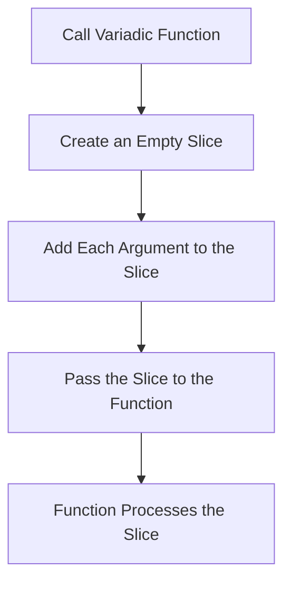

# Go Variadic Functions

## Introduction

In Go programming, there are times when you want to create a function that can accept any number of arguments. For example, you might want a function that can calculate the sum of any number of integers—whether it's 2 numbers or 20. This is where **variadic functions** come into play.

A **variadic function** is a function that accepts a variable number of arguments of the same type. In Go, you can create variadic functions using the `...` (ellipsis) syntax before the parameter type.

## Basic Syntax

Here's the basic syntax for defining a variadic function in Go:

```go
func functionName(paramName ...paramType) returnType {
    // Function body
}
```

The `...` before the parameter type indicates that the function can accept any number of parameters of that type, including zero.

## Your First Variadic Function

Let's create a simple variadic function that calculates the sum of any number of integers:

```go
package main

import "fmt"

func sum(numbers ...int) int {
    total := 0
    for _, num := range numbers {
        total += num
    }
    return total
}

func main() {
    // Call with different number of arguments
    fmt.Println("Sum of no numbers:", sum())
    fmt.Println("Sum of one number:", sum(5))
    fmt.Println("Sum of two numbers:", sum(10, 20))
    fmt.Println("Sum of five numbers:", sum(1, 2, 3, 4, 5))
}
```

Output:
```
Sum of no numbers: 0
Sum of one number: 5
Sum of two numbers: 30
Sum of five numbers: 15
```

### What's Happening?

1. We define a function `sum` that takes a variadic parameter `numbers` of type `int`.
2. Inside the function, we can treat `numbers` as a slice of integers.
3. We can call the function with any number of integer arguments.

## How Variadic Parameters Work

When you define a variadic parameter, Go converts the arguments into a slice of the specified type. Inside the function, you can work with this parameter as a normal slice.

```go
package main

import "fmt"

func printNumbers(numbers ...int) {
    fmt.Printf("Type of numbers: %T
", numbers)
    fmt.Printf("Value of numbers: %v
", numbers)
    
    // Iterate through the numbers
    for i, num := range numbers {
        fmt.Printf("numbers[%d] = %d
", i, num)
    }
}

func main() {
    printNumbers(1, 2, 3, 4, 5)
}
```

Output:
```
Type of numbers: []int
Value of numbers: [1 2 3 4 5]
numbers[0] = 1
numbers[1] = 2
numbers[2] = 3
numbers[3] = 4
numbers[4] = 5
```

## Important Rules for Variadic Functions

1. **Only the last parameter can be variadic**: If a function has multiple parameters, only the last one can be variadic.

```go
// Correct
func greet(message string, names ...string) {}

// Incorrect - won't compile
func incorrect(numbers ...int, message string) {}
```

2. **Only one variadic parameter allowed**: A function can have at most one variadic parameter.

## Passing Slices to Variadic Functions

If you already have a slice and want to pass it to a variadic function, you can use the spread operator (`...`) after the slice:

```go
package main

import "fmt"

func sum(numbers ...int) int {
    total := 0
    for _, num := range numbers {
        total += num
    }
    return total
}

func main() {
    // Create a slice of integers
    nums := []int{1, 2, 3, 4, 5}
    
    // Pass the slice to the variadic function
    result := sum(nums...)
    
    fmt.Printf("Sum of numbers in slice: %d
", result)
}
```

Output:
```
Sum of numbers in slice: 15
```

## Practical Examples

### Example 1: Building a Simple Logger

```go
package main

import "fmt"

func logger(level string, messages ...string) {
    for _, message := range messages {
        fmt.Printf("[%s] %s
", level, message)
    }
}

func main() {
    logger("INFO", "Application started", "Loading configuration")
    logger("WARNING", "Resource usage high")
    logger("ERROR", "Database connection failed", "Retrying in 5 seconds", "Connection timeout")
}
```

Output:
```
[INFO] Application started
[INFO] Loading configuration
[WARNING] Resource usage high
[ERROR] Database connection failed
[ERROR] Retrying in 5 seconds
[ERROR] Connection timeout
```

### Example 2: Custom Formatter

```go
package main

import (
    "fmt"
    "strings"
)

func formatString(format string, args ...interface{}) string {
    return fmt.Sprintf(format, args...)
}

func main() {
    name := "Alice"
    age := 28
    job := "Software Engineer"
    
    bio := formatString(
        "Name: %s
Age: %d
Job: %s",
        name, age, job,
    )
    
    fmt.Println(bio)
    
    // Using various format specifiers
    fmt.Println(formatString("Binary: %b, Hex: %x, Float: %.2f", 10, 16, 3.14159))
}
```

Output:
```
Name: Alice
Age: 28
Job: Software Engineer
Binary: 1010, Hex: 10, Float: 3.14
```

### Example 3: Join Strings with Custom Separator

```go
package main

import (
    "fmt"
    "strings"
)

func joinWithSeparator(separator string, elements ...string) string {
    return strings.Join(elements, separator)
}

func main() {
    // Join strings with different separators
    comma := joinWithSeparator(", ", "Apple", "Banana", "Cherry")
    dash := joinWithSeparator(" - ", "2023", "01", "15")
    path := joinWithSeparator("/", "users", "admin", "documents", "report.pdf")
    
    fmt.Println(comma)
    fmt.Println(dash)
    fmt.Println(path)
}
```

Output:
```
Apple, Banana, Cherry
2023 - 01 - 15
users/admin/documents/report.pdf
```

## How Variadic Functions Work Internally

When you call a variadic function, Go performs these steps:



This is why you can use the variadic parameter as a slice inside the function.

## Common Use Cases for Variadic Functions

1. **Mathematical operations**: Functions like `sum`, `average`, `min`, `max`, etc.
2. **String operations**: String joining, formatting, and manipulation.
3. **Logging and debugging**: Functions that accept multiple messages or values.
4. **Collection operations**: Functions that operate on variable numbers of items.
5. **Wrapper functions**: Functions that wrap other functions that take variadic arguments.

## Variadic Functions in the Standard Library

Go's standard library uses variadic functions extensively:

1. `fmt.Println(a ...interface{})`: Prints any number of values.
2. `fmt.Printf(format string, a ...interface{})`: Formats and prints values.
3. `append(slice []Type, elems ...Type)`: Appends elements to a slice.
4. `strings.Join(elems []string, sep string)`: Joins strings with a separator.

## Tips and Best Practices

1. **Use variadic functions when the number of inputs is truly variable**: If you know exactly how many parameters your function needs, use regular parameters instead.

2. **Document the expected types**: When using variadic interface{} parameters, document what types are expected.

3. **Consider performance**: Creating a slice for each call has some overhead. For performance-critical code, consider alternatives.

4. **Provide non-variadic alternatives**: For common use cases, consider providing non-variadic alternatives (e.g., `SumTwo`, `SumThree`).

## Summary

Variadic functions in Go allow you to create flexible functions that can accept any number of arguments. They're implemented by converting the variable arguments into a slice that you can work with inside the function.

Key points to remember:
- Use the `...` syntax before the parameter type to create a variadic parameter
- Only the last parameter can be variadic
- Inside the function, the variadic parameter is treated as a slice
- Use the spread operator (`...`) to pass a slice to a variadic function

Variadic functions are a powerful feature in Go that can make your code more flexible and expressive. They're especially useful for functions like formatters, loggers, and mathematical operations where the number of inputs can vary.

## Practice Exercises

1. Create a variadic function that finds the maximum value in a list of integers.
2. Write a function that concatenates any number of strings with a given separator.
3. Implement a variadic function that filters out odd numbers from a list of integers.
4. Create a custom printf-like function that formats strings and numbers.
5. Write a variadic function that groups inputs by type (ints, strings, booleans, etc.).

## Additional Resources

- [Go by Example: Variadic Functions](https://gobyexample.com/variadic-functions)
- [Go Tour: Variadic Functions](https://tour.golang.org/basics/15)
- [Effective Go: Variadic Functions](https://golang.org/doc/effective_go.html#append)
- [Go Documentation: fmt package](https://golang.org/pkg/fmt/) (for examples of variadic functions in the standard library)