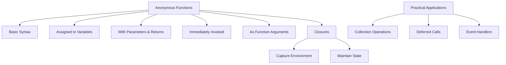

# Go Anonymous Functions

## Introduction

In Go programming, **anonymous functions** (also known as function literals or lambda functions) are functions without a name. They allow you to define a function inline without having to name it. This is particularly useful when you need a small function for a short period and don't want to pollute your namespace with function names.

Anonymous functions in Go are a powerful feature that stems from Go's treatment of functions as first-class citizens, meaning functions can be:
- Assigned to variables
- Passed as arguments to other functions
- Returned from other functions
- Stored in data structures

Let's explore how to create and use anonymous functions in Go, along with practical applications that make them valuable in everyday programming.

## Syntax of Anonymous Functions

The basic syntax of an anonymous function in Go looks like this:

```go
func(parameters) return_type {
    // function body
}
```

Here's how you might use it:

```go
package main

import "fmt"

func main() {
    // Defining an anonymous function
    func() {
        fmt.Println("Hello from an anonymous function!")
    }() // The parentheses () at the end immediately invoke the function
}
```

**Output:**
```
Hello from an anonymous function!
```

In the example above, we define and immediately invoke an anonymous function. The trailing parentheses `()` after the function definition cause the function to be executed immediately.

## Assigning Anonymous Functions to Variables

Anonymous functions can be assigned to variables, which lets you call them later:

```go
package main

import "fmt"

func main() {
    // Assigning an anonymous function to a variable
    greet := func(name string) {
        fmt.Printf("Hello, %s!
", name)
    }
    
    // Calling the function through the variable
    greet("Alice")
    greet("Bob")
}
```

**Output:**
```
Hello, Alice!
Hello, Bob!
```

By assigning the function to a variable, you can reuse it multiple times throughout your code.

## Anonymous Functions with Parameters and Return Values

Anonymous functions can accept parameters and return values just like regular functions:

```go
package main

import "fmt"

func main() {
    // Anonymous function with parameters and return value
    add := func(a, b int) int {
        return a + b
    }
    
    sum := add(5, 3)
    fmt.Println("Sum:", sum)
    
    // Anonymous function with multiple return values
    divide := func(a, b float64) (float64, error) {
        if b == 0 {
            return 0, fmt.Errorf("cannot divide by zero")
        }
        return a / b, nil
    }
    
    result, err := divide(10, 2)
    if err != nil {
        fmt.Println("Error:", err)
    } else {
        fmt.Println("Result of division:", result)
    }
}
```

**Output:**
```
Sum: 8
Result of division: 5
```

## Immediately Invoked Function Expressions (IIFE)

You can define and execute an anonymous function immediately. This pattern is known as an Immediately Invoked Function Expression (IIFE):

```go
package main

import "fmt"

func main() {
    // IIFE with arguments
    result := func(x, y int) int {
        return x * y
    }(10, 5)
    
    fmt.Println("Result of multiplication:", result)
}
```

**Output:**
```
Result of multiplication: 50
```

This pattern is useful when you want to create a separate scope to avoid variable conflicts or when you need to perform a one-time initialization.

## Anonymous Functions as Function Arguments

Anonymous functions can be passed as arguments to other functions, enabling powerful patterns like callbacks:

```go
package main

import "fmt"

func performOperation(a, b int, operation func(int, int) int) int {
    return operation(a, b)
}

func main() {
    // Using anonymous functions as callbacks
    sum := performOperation(5, 3, func(x, y int) int {
        return x + y
    })
    
    difference := performOperation(10, 4, func(x, y int) int {
        return x - y
    })
    
    product := performOperation(6, 7, func(x, y int) int {
        return x * y
    })
    
    fmt.Println("Sum:", sum)
    fmt.Println("Difference:", difference)
    fmt.Println("Product:", product)
}
```

**Output:**
```
Sum: 8
Difference: 6
Product: 42
```

This pattern is particularly useful in event-driven programming, error handling, and when implementing higher-order functions.

## Closures: Anonymous Functions that Access Their Environment

A powerful feature of anonymous functions in Go is their ability to form **closures**. A closure is a function that captures variables from its surrounding context:

```go
package main

import "fmt"

func main() {
    // Closure example
    counter := func() func() int {
        count := 0
        return func() int {
            count++
            return count
        }
    }()
    
    fmt.Println(counter()) // 1
    fmt.Println(counter()) // 2
    fmt.Println(counter()) // 3
}
```

**Output:**
```
1
2
3
```

In this example, the inner anonymous function forms a closure because it "closes over" the `count` variable from its surrounding scope. Each time the function is called, it increments and returns the same `count` variable.

Let's look at another example to understand closures better:

```go
package main

import "fmt"

func createMultiplier(factor int) func(int) int {
    return func(value int) int {
        return value * factor
    }
}

func main() {
    // Creating different multiplier functions
    double := createMultiplier(2)
    triple := createMultiplier(3)
    
    fmt.Println("Double of 5:", double(5))
    fmt.Println("Triple of 5:", triple(5))
}
```

**Output:**
```
Double of 5: 10
Triple of 5: 15
```

Here, `createMultiplier` returns an anonymous function that forms a closure with the `factor` parameter. Each returned function maintains its own reference to the `factor` value it was created with.

## Practical Applications of Anonymous Functions

### 1. Working with Collections

Anonymous functions are particularly useful when working with collections, such as in filtering, mapping, or sorting operations:

```go
package main

import (
    "fmt"
    "sort"
)

func main() {
    // Example: Filtering a slice
    numbers := []int{1, 2, 3, 4, 5, 6, 7, 8, 9, 10}
    
    var evenNumbers []int
    for _, num := range numbers {
        if func(x int) bool { return x%2 == 0 }(num) {
            evenNumbers = append(evenNumbers, num)
        }
    }
    
    fmt.Println("Even numbers:", evenNumbers)
    
    // Example: Custom sorting
    people := []struct {
        Name string
        Age  int
    }{
        {"Alice", 25},
        {"Bob", 30},
        {"Charlie", 22},
    }
    
    // Sort by age using anonymous function
    sort.Slice(people, func(i, j int) bool {
        return people[i].Age < people[j].Age
    })
    
    fmt.Println("People sorted by age:")
    for _, person := range people {
        fmt.Printf("%s: %d years
", person.Name, person.Age)
    }
}
```

**Output:**
```
Even numbers: [2 4 6 8 10]
People sorted by age:
Charlie: 22 years
Alice: 25 years
Bob: 30 years
```

### 2. Deferred Function Calls

Anonymous functions can be used with Go's `defer` statement for cleanup operations:

```go
package main

import "fmt"

func processFile() {
    fmt.Println("Opening file")
    
    // Using anonymous function with defer for cleanup
    defer func() {
        fmt.Println("Closing file")
        fmt.Println("Cleanup complete")
    }()
    
    fmt.Println("Processing file data")
    // If an error occurs here, the deferred function will still be called
}

func main() {
    processFile()
}
```

**Output:**
```
Opening file
Processing file data
Closing file
Cleanup complete
```

### 3. Event Handlers in Web Applications

Anonymous functions are commonly used as event handlers in web applications:

```go
package main

import (
    "fmt"
    "net/http"
)

func main() {
    // Using anonymous functions as HTTP handlers
    http.HandleFunc("/hello", func(w http.ResponseWriter, r *http.Request) {
        fmt.Fprintf(w, "Hello, World!")
    })
    
    http.HandleFunc("/goodbye", func(w http.ResponseWriter, r *http.Request) {
        fmt.Fprintf(w, "Goodbye, World!")
    })
    
    // Note: This is just an example and won't actually run the server
    fmt.Println("Server routes configured with anonymous function handlers")
}
```

## Best Practices and Considerations

When working with anonymous functions in Go, keep these considerations in mind:

1. **Readability**: While anonymous functions are convenient, deeply nested anonymous functions can make code harder to read. Consider extracting complex anonymous functions into named functions if they become too large.

2. **Variable Capture**: Be aware that anonymous functions capture variables by reference, not by value. Changes to captured variables will be visible to the anonymous function.

```go
package main

import "fmt"

func main() {
    functions := make([]func(), 3)
    
    // This creates a common pitfall
    for i := 0; i < 3; i++ {
        functions[i] = func() {
            fmt.Println(i) // Captures i by reference
        }
    }
    
    // All functions will print the same value (3)
    for _, f := range functions {
        f()
    }
    
    // Correct approach - create a new variable in each iteration
    functionsFixed := make([]func(), 3)
    for i := 0; i < 3; i++ {
        value := i // Create a new variable
        functionsFixed[i] = func() {
            fmt.Println(value)
        }
    }
    
    fmt.Println("Fixed version:")
    for _, f := range functionsFixed {
        f()
    }
}
```

**Output:**
```
3
3
3
Fixed version:
0
1
2
```

3. **Error Handling**: When using anonymous functions with `defer`, remember to handle panics if necessary:

```go
defer func() {
    if r := recover(); r != nil {
        fmt.Println("Recovered from panic:", r)
    }
}()
```

## Visual Representation of Anonymous Functions Concepts



## Summary

Anonymous functions in Go provide a flexible way to create and use functions on-the-fly without naming them. They're particularly useful for:

- Short-lived functions that don't need naming
- Callback functions and event handlers
- Creating closures that maintain state
- Deferred function calls and cleanup operations
- Working with collections and implementing higher-order functions

By understanding and leveraging anonymous functions, you can write more concise, modular, and expressive Go code.

## Exercises

To strengthen your understanding of anonymous functions in Go, try these exercises:

1. Create a program that uses an anonymous function to filter a slice of strings, keeping only those with more than 5 characters.

2. Implement a simple calculator that takes two numbers and an operation function as input, and returns the result of applying the operation.

3. Write a program that uses anonymous functions to transform a list of integers by doubling the even numbers and tripling the odd ones.

4. Create a counter function that uses closures to maintain its state between calls.

5. Implement a simple event system where functions can subscribe to events and be notified when events occur.

## Additional Resources

- [Go by Example: Functions](https://gobyexample.com/functions)
- [Tour of Go: Function Values](https://tour.golang.org/moretypes/24)
- [Effective Go: Functions](https://golang.org/doc/effective_go#functions)
- [Go Programming Language Specification: Function literals](https://golang.org/ref/spec#Function_literals)