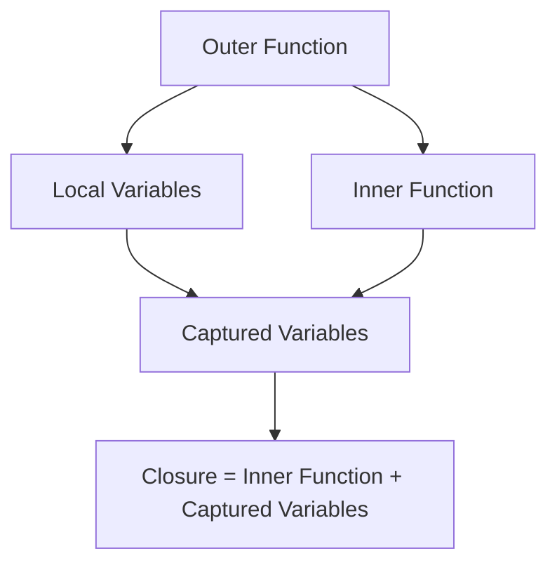

# Go Closures

## Introduction

In Go, a **closure** is a function value that references variables from outside its body. The function can access and assign values to these referenced variables, even when executed outside the scope in which they were created. Closures are a powerful concept in functional programming that allows for elegant and compact code.

Think of a closure as a function that "closes over" or "captures" the variables it needs from its surrounding environment. This creates a special relationship between the function and those variables, allowing the function to remember and manipulate them even after the outer function has finished executing.

## Understanding Closures

To understand closures, we first need to remember that functions in Go are first-class citizens. This means you can:

- Assign functions to variables
- Pass functions as arguments to other functions
- Return functions from other functions

A closure is created when a function is declared inside another function and references variables from the outer function. Let's start with a simple example:

```go
package main

import "fmt"

func main() {
    // Variable declared in the outer function
    message := "Hello, World!"
    
    // This function is a closure because it references 'message'
    // from the outer function
    displayMessage := func() {
        fmt.Println(message)
    }
    
    // Call the closure
    displayMessage()
}
```

**Output:**
```
Hello, World!
```

In this example, the anonymous function assigned to `displayMessage` is a closure because it "closes over" the `message` variable from its surrounding scope.

## The Power of Variable Capture

What makes closures powerful is that they not only capture variables by reference but also maintain access to those variables even after the outer function has returned. Let's see this in action:

```go
package main

import "fmt"

// Function that returns another function (a closure)
func createCounter() func() int {
    // This variable is captured by the closure
    count := 0
    
    // Return a function that has access to the 'count' variable
    return func() int {
        count++
        return count
    }
}

func main() {
    // Create two separate counters
    counter1 := createCounter()
    counter2 := createCounter()
    
    fmt.Println(counter1()) // 1
    fmt.Println(counter1()) // 2
    fmt.Println(counter1()) // 3
    
    fmt.Println(counter2()) // 1 (separate instance)
    fmt.Println(counter2()) // 2
    
    fmt.Println(counter1()) // 4 (continues from previous value)
}
```

**Output:**
```
1
2
3
1
2
4
```

In this example:

1. `createCounter` defines a local variable `count` initialized to 0
2. It returns an anonymous function (closure) that increments and returns `count`
3. Even though `createCounter` has finished executing, the returned function still has access to the `count` variable
4. Each call to `createCounter` creates a new instance of `count`, so each counter maintains its own state

This demonstrates one of the key features of closures: they maintain their own independent copies of the variables they capture.

## Visualizing Closures

Closures can be visualized as functions that carry a hidden backpack of variables:

