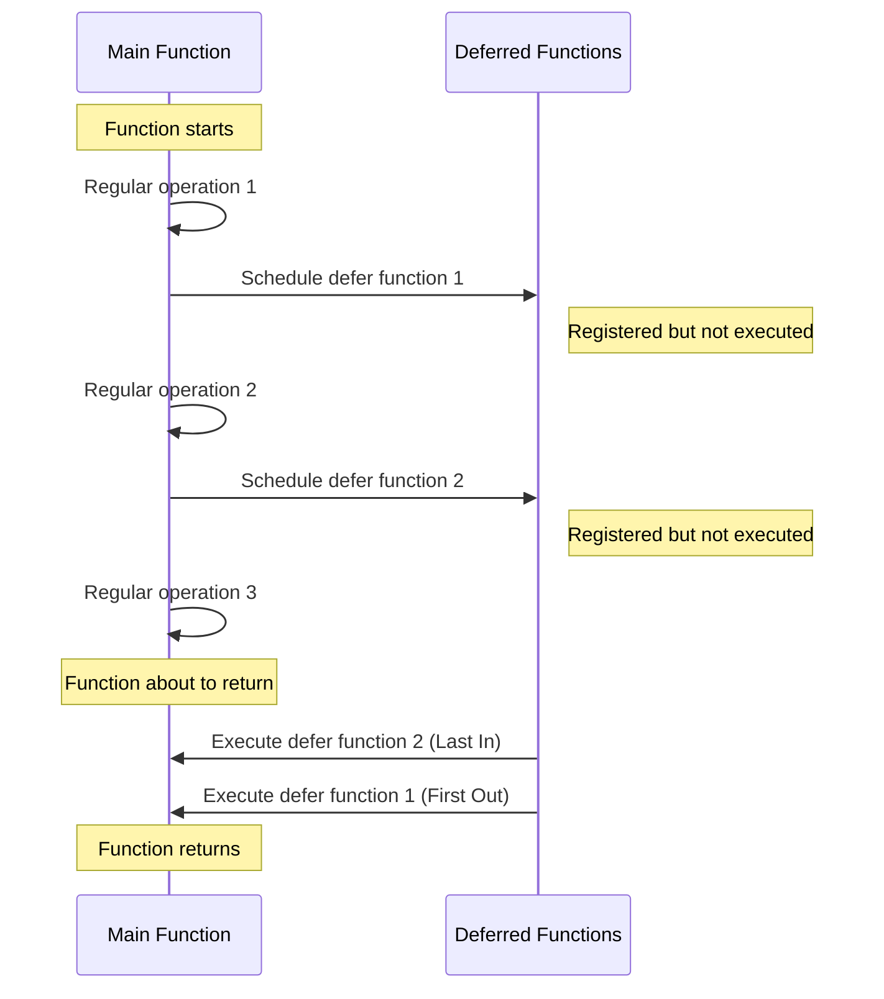

# Go Defer

## Introduction

The `defer` statement is one of Go's distinctive features that helps developers write cleaner, more maintainable code. When you mark a function call with the `defer` keyword, Go schedules that function to be executed just before the surrounding function returns. This powerful mechanism simplifies resource management, error handling, and cleanup operations that would otherwise require complex try-finally blocks in other languages.

In this tutorial, we'll explore how the `defer` statement works, its execution order, common use cases, and best practices.

## Basic Syntax and Behavior

The syntax for using `defer` is straightforward:

```go
defer functionCall()
```

Here's a simple example:

```go
package main

import "fmt"

func main() {
    fmt.Println("Start")
    defer fmt.Println("This will be printed last")
    fmt.Println("End")
}
```

Output:
```
Start
End
This will be printed last
```

In this example, even though the deferred function call appears second in the code, it executes last—after the surrounding function (`main`) completes all its other operations but before it actually returns.

## Key Characteristics of Defer

### 1. LIFO Execution Order (Last In, First Out)

When multiple `defer` statements appear in a function, they execute in reverse order (like a stack):

```go
package main

import "fmt"

func main() {
    fmt.Println("Counting:")
    
    for i := 1; i <= 3; i++ {
        defer fmt.Println(i)
    }
    
    fmt.Println("Done counting")
}
```

Output:
```
Counting:
Done counting
3
2
1
```

Notice how the numbers are printed in reverse order (3, 2, 1) because the last deferred statement is executed first.

### 2. Arguments Are Evaluated Immediately

Although the deferred function isn't executed until the surrounding function returns, any arguments to the deferred function are evaluated immediately when the `defer` statement is encountered:

```go
package main

import "fmt"

func main() {
    x := 1
    defer fmt.Println("x =", x) // x evaluated as 1 here
    
    x = 2
    fmt.Println("Current x =", x)
}
```

Output:
```
Current x = 2
x = 1
```

Even though `x` was changed to 2 before the deferred function executed, the deferred function still prints "x = 1" because the value was captured when the `defer` statement was encountered.

## Common Use Cases

### 1. Resource Cleanup

The most common use of `defer` is to ensure resources are properly released, regardless of how a function exits:

```go
package main

import (
    "fmt"
    "os"
)

func readFile(filename string) error {
    file, err := os.Open(filename)
    if err != nil {
        return err
    }
    defer file.Close() // File will always be closed when function exits
    
    // Read and process the file...
    fmt.Println("Reading file:", filename)
    
    return nil
}

func main() {
    err := readFile("example.txt")
    if err != nil {
        fmt.Println("Error:", err)
    }
}
```

In this example, `file.Close()` is guaranteed to be called before `readFile()` returns, whether it completes normally or encounters an error during file processing.

### 2. Mutex Unlocking

`defer` is ideal for ensuring mutexes are unlocked:

```go
package main

import (
    "fmt"
    "sync"
    "time"
)

func safeAccess(m *sync.Mutex) {
    m.Lock()
    defer m.Unlock() // Ensures mutex is unlocked even if panic occurs
    
    // Critical section
    fmt.Println("Accessing shared resource...")
    time.Sleep(time.Second) // Simulate work
    fmt.Println("Done with shared resource")
}

func main() {
    mutex := &sync.Mutex{}
    safeAccess(mutex)
}
```

### 3. Timing Function Execution

You can use `defer` to measure function execution time:

```go
package main

import (
    "fmt"
    "time"
)

func timeTrack(start time.Time, name string) {
    elapsed := time.Since(start)
    fmt.Printf("%s took %s
", name, elapsed)
}

func expensiveOperation() {
    defer timeTrack(time.Now(), "expensiveOperation")
    
    // Simulate work
    fmt.Println("Performing expensive operation...")
    time.Sleep(2 * time.Second)
}

func main() {
    expensiveOperation()
}
```

Output:
```
Performing expensive operation...
expensiveOperation took 2.000123456s
```

### 4. Panic Recovery

`defer` plays a crucial role in Go's panic recovery mechanism:

```go
package main

import "fmt"

func recoverExample() {
    defer func() {
        if r := recover(); r != nil {
            fmt.Println("Recovered from:", r)
        }
    }()
    
    fmt.Println("About to panic")
    panic("something went wrong")
    fmt.Println("This line will never execute")
}

func main() {
    recoverExample()
    fmt.Println("Program continues running")
}
```

Output:
```
About to panic
Recovered from: something went wrong
Program continues running
```

## Practical Examples

### Example 1: Database Connection Management

```go
package main

import (
    "database/sql"
    "fmt"
    _ "github.com/go-sql-driver/mysql"
    "log"
)

func queryDatabase() {
    // Open doesn't actually establish a connection
    db, err := sql.Open("mysql", "user:password@tcp(127.0.0.1:3306)/dbname")
    if err != nil {
        log.Fatal(err)
    }
    defer db.Close() // Close connection when function exits
    
    // Now use the database
    rows, err := db.Query("SELECT name FROM users LIMIT 10")
    if err != nil {
        log.Fatal(err)
    }
    defer rows.Close() // Close the rows when done
    
    // Process rows...
    fmt.Println("Processing database results...")
}
```

### Example 2: HTTP Request with Proper Body Closing

```go
package main

import (
    "fmt"
    "io/ioutil"
    "net/http"
)

func fetchWebpage(url string) (string, error) {
    resp, err := http.Get(url)
    if err != nil {
        return "", err
    }
    defer resp.Body.Close() // Always close the response body
    
    body, err := ioutil.ReadAll(resp.Body)
    if err != nil {
        return "", err
    }
    
    return string(body), nil
}

func main() {
    content, err := fetchWebpage("https://example.com")
    if err != nil {
        fmt.Println("Error:", err)
        return
    }
    
    fmt.Println("Website length:", len(content))
}
```

### Example 3: Using Defer for Cleanup in a Processing Pipeline

```go
package main

import (
    "fmt"
    "os"
)

func processData(filename string) error {
    // Open the input file
    inputFile, err := os.Open(filename)
    if err != nil {
        return fmt.Errorf("failed to open input file: %w", err)
    }
    defer inputFile.Close()
    
    // Create temporary file
    tempFile, err := os.Create(filename + ".tmp")
    if err != nil {
        return fmt.Errorf("failed to create temp file: %w", err)
    }
    defer func() {
        tempFile.Close()
        // Clean up temp file if something goes wrong
        os.Remove(tempFile.Name())
    }()
    
    // Process data and write to temp file...
    fmt.Println("Processing data...")
    
    // Create output file
    outputFile, err := os.Create(filename + ".processed")
    if err != nil {
        return fmt.Errorf("failed to create output file: %w", err)
    }
    defer outputFile.Close()
    
    // Finalize processing...
    fmt.Println("Data processing complete!")
    
    return nil
}

func main() {
    err := processData("data.txt")
    if err != nil {
        fmt.Println("Error:", err)
    }
}
```

## Best Practices and Common Pitfalls

### Do's:

1. **Use defer for cleanup operations**: Like closing files, network connections, and database resources.
2. **Keep deferred functions simple**: Avoid complex logic in deferred functions.
3. **Place defer statements near the resource acquisition**: This improves code readability.

### Don'ts:

1. **Don't defer in loops for long-running programs**: Each defer statement consumes memory until the function returns.

```go
// BAD: This could lead to memory issues in long loops
func processLargeDataset(filenames []string) {
    for _, filename := range filenames {
        file, err := os.Open(filename)
        if err != nil {
            continue
        }
        defer file.Close() // Will only close after ALL files are processed!
        
        // Process file...
    }
}

// GOOD: Close each file within the loop
func processLargeDataset(filenames []string) {
    for _, filename := range filenames {
        func() {
            file, err := os.Open(filename)
            if err != nil {
                return
            }
            defer file.Close() // Closes when this anonymous function returns
            
            // Process file...
        }()
    }
}
```

2. **Be careful with deferred functions that modify named return values**:

```go
func example() (result int) {
    defer func() { result *= 2 }() // Modifies the return value
    return 5
}
// This returns 10, not 5!
```

