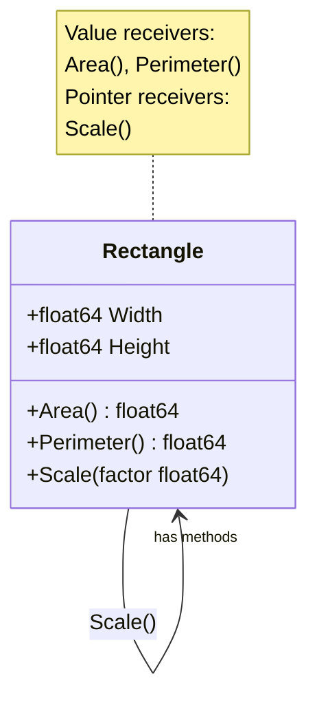

# Go Methods

## Introduction

In Go, a **method** is a function that's associated with a particular type. Methods are a way to add behavior to types in Go, which is especially important since Go doesn't have classes in the traditional object-oriented sense. Methods help us write code that feels object-oriented while maintaining Go's simplicity and efficiency.

Methods differ from regular functions in one important way: they have a special **receiver** argument that appears between the `func` keyword and the method name. The receiver connects the method to the specified type.

In this tutorial, we'll explore:
- How to define and call methods
- Pointer receivers vs. value receivers
- Method sets
- Best practices for using methods

## Defining Methods in Go

Let's start by understanding the syntax for defining a method in Go:

```go
func (receiver ReceiverType) MethodName(parameters) ReturnType {
    // Method body
}
```

The key components are:
- `receiver`: Variable that gives you access to the properties of the type
- `ReceiverType`: The type this method is associated with
- Everything else works like a regular function

### Basic Method Example

Let's create a simple `Rectangle` type and add a method to it:

```go
package main

import (
    "fmt"
)

// Rectangle defines a rectangle shape
type Rectangle struct {
    Width  float64
    Height float64
}

// Area is a method that calculates the area of a Rectangle
func (r Rectangle) Area() float64 {
    return r.Width * r.Height
}

func main() {
    rect := Rectangle{Width: 10, Height: 5}
    
    // Call the Area method on our rectangle
    area := rect.Area()
    
    fmt.Printf("Rectangle dimensions: %.2f × %.2f
", rect.Width, rect.Height)
    fmt.Printf("Rectangle area: %.2f
", area)
}
```

**Output:**
```
Rectangle dimensions: 10.00 × 5.00
Rectangle area: 50.00
```

In this example, we:
1. Define a `Rectangle` struct type with `Width` and `Height` fields
2. Add an `Area()` method that returns the rectangle's area
3. Create a rectangle instance and call the method on it

This approach is cleaner and more intuitive than having a separate function like `CalculateRectangleArea(r Rectangle)`.

## Value Receivers vs. Pointer Receivers

Go allows two types of receivers for methods:

1. **Value receivers** - like the `Area()` method above, where we used `(r Rectangle)`
2. **Pointer receivers** - where we use `(r *Rectangle)`

The choice between them is important and affects how your methods work.

### Value Receivers

When you use a value receiver, the method operates on a copy of the original value. This means the method cannot modify the original value.

```go
// Perimeter calculates the perimeter using a value receiver
func (r Rectangle) Perimeter() float64 {
    return 2 * (r.Width + r.Height)
}
```

### Pointer Receivers

When you use a pointer receiver, the method operates on a reference to the original value. This means the method can modify the original value.

```go
// Scale adjusts the rectangle's dimensions by a factor
func (r *Rectangle) Scale(factor float64) {
    r.Width *= factor
    r.Height *= factor
}
```

### Example: Value vs. Pointer Receivers

Let's see how they differ in practice:

```go
package main

import (
    "fmt"
)

type Rectangle struct {
    Width  float64
    Height float64
}

// Area uses a value receiver
func (r Rectangle) Area() float64 {
    return r.Width * r.Height
}

// Scale uses a pointer receiver to modify the rectangle
func (r *Rectangle) Scale(factor float64) {
    r.Width *= factor
    r.Height *= factor
}

// This method tries to modify the rectangle but uses a value receiver
// so changes won't affect the original rectangle
func (r Rectangle) ScaleWithValueReceiver(factor float64) {
    r.Width *= factor
    r.Height *= factor
    fmt.Printf("Inside method: dimensions are now %.2f × %.2f
", r.Width, r.Height)
}

func main() {
    rect := Rectangle{Width: 10, Height: 5}
    fmt.Printf("Original dimensions: %.2f × %.2f
", rect.Width, rect.Height)
    
    // This won't modify the original rectangle
    rect.ScaleWithValueReceiver(2)
    fmt.Printf("After ScaleWithValueReceiver: %.2f × %.2f
", rect.Width, rect.Height)
    
    // This will modify the original rectangle
    rect.Scale(2)
    fmt.Printf("After Scale with pointer receiver: %.2f × %.2f
", rect.Width, rect.Height)
    
    // Area calculation with the new dimensions
    fmt.Printf("New area: %.2f
", rect.Area())
}
```

**Output:**
```
Original dimensions: 10.00 × 5.00
Inside method: dimensions are now 20.00 × 10.00
After ScaleWithValueReceiver: 10.00 × 5.00
After Scale with pointer receiver: 20.00 × 10.00
New area: 200.00
```

Notice that:
1. `ScaleWithValueReceiver` changes the dimensions inside the method, but the original rectangle remains unchanged
2. `Scale` with a pointer receiver successfully modifies the original rectangle

## When to Use Pointer Receivers vs. Value Receivers

Here are some guidelines for choosing between pointer and value receivers:

### Use Pointer Receivers When:

1. You need to modify the receiver (like our `Scale` method)
2. The receiver is a large struct or array (to avoid copying large amounts of data)
3. For consistency with other methods of the same type (if some methods need pointers, use pointers for all methods)

### Use Value Receivers When:

1. The receiver is a small, fixed-size type (like integers, booleans, small structs)
2. The method doesn't need to modify the receiver
3. The receiver is a map, function, or channel (these are reference types already)
4. The receiver is meant to be immutable

## Methods on Non-Struct Types

An interesting feature of Go is that you can define methods on almost any type, not just structs. Here's an example with a custom integer type:

```go
package main

import (
    "fmt"
)

// MyInt is a custom integer type
type MyInt int

// IsPositive checks if the number is positive
func (m MyInt) IsPositive() bool {
    return m > 0
}

// Double doubles the value and returns a new MyInt
func (m MyInt) Double() MyInt {
    return m * 2
}

func main() {
    var num MyInt = 10
    
    fmt.Printf("Is %d positive? %t
", num, num.IsPositive())
    doubled := num.Double()
    fmt.Printf("Double of %d is %d
", num, doubled)
    
    var negNum MyInt = -5
    fmt.Printf("Is %d positive? %t
", negNum, negNum.IsPositive())
}
```

**Output:**
```
Is 10 positive? true
Double of 10 is 20
Is -5 positive? false
```

This ability to add methods to any user-defined type gives Go a lot of flexibility.

## Method Chaining

Methods that return the receiver type allow for method chaining, which can lead to more concise and readable code:

```go
package main

import (
    "fmt"
)

type Rectangle struct {
    Width  float64
    Height float64
}

// Methods that return a pointer to Rectangle for chaining
func (r *Rectangle) SetWidth(width float64) *Rectangle {
    r.Width = width
    return r
}

func (r *Rectangle) SetHeight(height float64) *Rectangle {
    r.Height = height
    return r
}

func (r *Rectangle) Scale(factor float64) *Rectangle {
    r.Width *= factor
    r.Height *= factor
    return r
}

func (r Rectangle) Area() float64 {
    return r.Width * r.Height
}

func main() {
    // Create and configure a rectangle using method chaining
    rect := &Rectangle{}
    rect.SetWidth(10).SetHeight(5).Scale(1.5)
    
    fmt.Printf("Rectangle dimensions: %.2f × %.2f
", rect.Width, rect.Height)
    fmt.Printf("Rectangle area: %.2f
", rect.Area())
}
```

**Output:**
```
Rectangle dimensions: 15.00 × 7.50
Rectangle area: 112.50
```

Method chaining allows us to perform multiple operations in a single line, which can make the code more readable and concise.

## Common Patterns with Methods

### The Builder Pattern

Methods can be used to implement the builder pattern, which is useful for creating complex objects step by step:

```go
package main

import (
    "fmt"
)

type Person struct {
    Name    string
    Age     int
    Address string
    Phone   string
    Email   string
}

func NewPersonBuilder() *Person {
    return &Person{}
}

func (p *Person) WithName(name string) *Person {
    p.Name = name
    return p
}

func (p *Person) WithAge(age int) *Person {
    p.Age = age
    return p
}

func (p *Person) WithAddress(address string) *Person {
    p.Address = address
    return p
}

func (p *Person) WithPhone(phone string) *Person {
    p.Phone = phone
    return p
}

func (p *Person) WithEmail(email string) *Person {
    p.Email = email
    return p
}

func (p Person) String() string {
    return fmt.Sprintf("Name: %s, Age: %d, Address: %s, Phone: %s, Email: %s",
        p.Name, p.Age, p.Address, p.Phone, p.Email)
}

func main() {
    person := NewPersonBuilder().
        WithName("John Doe").
        WithAge(30).
        WithAddress("123 Main St").
        WithPhone("555-1234").
        WithEmail("john@example.com")
    
    fmt.Println(person)
}
```

**Output:**
```
Name: John Doe, Age: 30, Address: 123 Main St, Phone: 555-1234, Email: john@example.com
```

### Implementing the String Interface

One common method to implement is the `String()` method, which is part of the `fmt.Stringer` interface. This allows your type to define how it should be printed:

```go
package main

import (
    "fmt"
)

type Point struct {
    X, Y int
}

// String implements the fmt.Stringer interface
func (p Point) String() string {
    return fmt.Sprintf("Point(%d, %d)", p.X, p.Y)
}

func main() {
    p := Point{X: 10, Y: 20}
    fmt.Println(p) // This will call p.String()
}
```

**Output:**
```
Point(10, 20)
```

## Visual Representation of Methods

Let's visualize how methods relate to types using a Mermaid diagram:



This diagram shows the `Rectangle` type and its methods, indicating which ones use value receivers and which use pointer receivers.

## Best Practices for Go Methods

1. **Be consistent with receiver types**: If some methods of a type need pointer receivers, consider using pointer receivers for all methods of that type for consistency.

2. **Keep methods simple**: Methods should do one thing and do it well.

3. **Use methods to implement interfaces**: Methods are how Go types implement interfaces, which is the primary mechanism for polymorphism in Go.

4. **Name methods appropriately**: Method names should be concise and descriptive. Use standard naming conventions like `String()` for string representation.

5. **Avoid unnecessary methods**: Don't create methods when a simple function would suffice. Methods imply a strong relationship to the type.

6. **Document your methods**: Use comments to describe what methods do, especially if they're part of your public API.

## Summary

Methods in Go provide a way to add behavior to types, offering some of the benefits of object-oriented programming while maintaining Go's simplicity. Here's a quick recap:

- Methods are functions with a special receiver parameter
- Value receivers operate on a copy, pointer receivers operate on the original
- Use pointer receivers when you need to modify the receiver or when the receiver is large
- Methods can be defined on almost any user-defined type, not just structs
- Method chaining can lead to more readable and concise code
- Methods are how types implement interfaces in Go

By understanding methods, you've taken a significant step toward mastering Go's approach to organizing and structuring code.

## Exercises

To reinforce your understanding of Go methods, try these exercises:

1. Create a `Circle` type with a radius field and methods to calculate area and circumference.

2. Implement a `Counter` type with methods to increment, decrement, and reset the counter.

3. Create a `Stack` type with methods to push, pop, and peek elements.

4. Implement a `Temperature` type with methods to convert between Celsius, Fahrenheit, and Kelvin.

5. Create a `BankAccount` type with methods for deposit, withdrawal, and checking the balance.

## Additional Resources

To learn more about Go methods and related concepts, check out these resources:

- [Go Tour: Methods](https://tour.golang.org/methods/1)
- [Effective Go: Methods](https://golang.org/doc/effective_go.html#methods)
- [Go by Example: Methods](https://gobyexample.com/methods)
- [The Go Programming Language Specification: Method declarations](https://golang.org/ref/spec#Method_declarations)