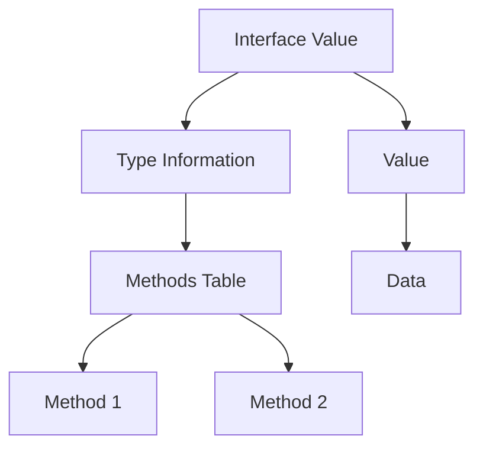

# Go Interfaces

## Introduction

Interfaces are one of the most powerful concepts in Go. They allow you to define behavior without specifying implementation details, which leads to more flexible, modular, and testable code. Unlike object-oriented languages that use inheritance, Go uses interfaces as a way to achieve polymorphism and abstraction.

In this guide, we'll explore Go interfaces from the ground up. We'll learn how they work, why they're useful, and how to implement them effectively in your Go programs.

## What is an Interface?

An interface in Go is a type that defines a set of method signatures but doesn't provide implementations. It specifies what a type should do, not how it should do it. Any type that implements all the methods of an interface implicitly satisfies that interface - there's no need to explicitly declare that a type implements an interface.

Here's the basic syntax for defining an interface:

```go
type InterfaceName interface {
    Method1() ReturnType
    Method2(param1 Type1, param2 Type2) ReturnType
    // ... more methods
}
```

## Creating Your First Interface

Let's start with a simple example. We'll create a `Shape` interface that requires any implementing type to have an `Area()` method:

```go
package main

import (
    "fmt"
    "math"
)

// Shape interface defines behavior for geometric shapes
type Shape interface {
    Area() float64
}

// Rectangle implements Shape
type Rectangle struct {
    Width  float64
    Height float64
}

// Area calculates the area of a rectangle
func (r Rectangle) Area() float64 {
    return r.Width * r.Height
}

// Circle implements Shape
type Circle struct {
    Radius float64
}

// Area calculates the area of a circle
func (c Circle) Area() float64 {
    return math.Pi * c.Radius * c.Radius
}

func main() {
    r := Rectangle{Width: 5, Height: 4}
    c := Circle{Radius: 3}
    
    // Print the areas
    fmt.Printf("Rectangle area: %.2f
", r.Area())
    fmt.Printf("Circle area: %.2f
", c.Area())
    
    // Using interface
    shapes := []Shape{r, c}
    for _, shape := range shapes {
        fmt.Printf("Area: %.2f
", shape.Area())
    }
}
```

Output:
```
Rectangle area: 20.00
Circle area: 28.27
Area: 20.00
Area: 28.27
```

In this example:
1. We define a `Shape` interface with a single method `Area()` that returns a `float64`
2. We implement two types: `Rectangle` and `Circle`, each with their own `Area()` method
3. Both types implicitly satisfy the `Shape` interface
4. We can store both types in a slice of `Shape` and call their `Area()` methods

## Interface Values

An interface value in Go consists of two components:
1. The concrete type stored in the interface (the dynamic type)
2. The value of that type (the dynamic value)

Let's visualize how interfaces work under the hood:



When you call a method on an interface, Go uses the type information to determine which concrete method to execute.

## The Empty Interface

The empty interface, written as `interface{}` or `any` (in Go 1.18+), has no methods. Since every type implements at least zero methods, every type satisfies the empty interface. This makes it useful when you need to accept values of unknown types:

```go
package main

import "fmt"

func printAny(v interface{}) {
    fmt.Printf("Value: %v, Type: %T
", v, v)
}

func main() {
    printAny(42)
    printAny("hello")
    printAny(true)
    printAny(3.14)
}
```

Output:
```
Value: 42, Type: int
Value: hello, Type: string
Value: true, Type: bool
Value: 3.14, Type: float64
```

## Type Assertions and Type Switches

When working with interfaces, you often need to access the underlying concrete value. Go provides two ways to do this:

### Type Assertions

A type assertion extracts the underlying value of a specific type from an interface:

```go
package main

import "fmt"

func main() {
    var i interface{} = "hello"
    
    // Type assertion
    s, ok := i.(string)
    if ok {
        fmt.Printf("String value: %s
", s)
    } else {
        fmt.Println("Not a string")
    }
    
    // This will fail
    n, ok := i.(int)
    if ok {
        fmt.Printf("Integer value: %d
", n)
    } else {
        fmt.Println("Not an integer")
    }
}
```

Output:
```
String value: hello
Not an integer
```

### Type Switches

A type switch performs multiple type assertions in series:

```go
package main

import "fmt"

func describeType(i interface{}) {
    switch v := i.(type) {
    case int:
        fmt.Printf("Integer: %d
", v)
    case string:
        fmt.Printf("String: %s
", v)
    case bool:
        fmt.Printf("Boolean: %v
", v)
    default:
        fmt.Printf("Unknown type: %T
", v)
    }
}

func main() {
    describeType(42)
    describeType("hello")
    describeType(true)
    describeType(3.14)
}
```

Output:
```
Integer: 42
String: hello
Boolean: true
Unknown type: float64
```

## Interface Composition

Go allows you to compose interfaces by embedding them within each other. This helps in creating more specialized interfaces from simpler ones:

```go
package main

import "fmt"

// Basic interfaces
type Reader interface {
    Read(p []byte) (n int, err error)
}

type Writer interface {
    Write(p []byte) (n int, err error)
}

// Composed interface
type ReadWriter interface {
    Reader
    Writer
}

// A simple implementation
type FileOperator struct {
    data []byte
}

func (fo *FileOperator) Read(p []byte) (n int, err error) {
    n = copy(p, fo.data)
    return n, nil
}

func (fo *FileOperator) Write(p []byte) (n int, err error) {
    fo.data = append(fo.data, p...)
    return len(p), nil
}

func main() {
    fo := &FileOperator{}
    
    // Write some data
    data := []byte("Hello, Go Interfaces!")
    fo.Write(data)
    
    // Read the data back
    readBuffer := make([]byte, 100)
    n, _ := fo.Read(readBuffer)
    
    fmt.Printf("Read %d bytes: %s
", n, readBuffer[:n])
    
    // We can use fo with any interface it satisfies
    var reader Reader = fo
    var writer Writer = fo
    var readWriter ReadWriter = fo
    
    fmt.Printf("Implements Reader: %T
", reader)
    fmt.Printf("Implements Writer: %T
", writer)
    fmt.Printf("Implements ReadWriter: %T
", readWriter)
}
```

Output:
```
Read 20 bytes: Hello, Go Interfaces!
Implements Reader: *main.FileOperator
Implements Writer: *main.FileOperator
Implements ReadWriter: *main.FileOperator
```

## Real-World Example: HTTP Handlers

One of the most common uses of interfaces in Go is with HTTP handlers. The standard library defines the `http.Handler` interface:

```go
package main

import (
    "fmt"
    "log"
    "net/http"
)

// CustomHandler implements http.Handler
type CustomHandler struct {
    Name string
}

// ServeHTTP implements the http.Handler interface
func (h *CustomHandler) ServeHTTP(w http.ResponseWriter, r *http.Request) {
    fmt.Fprintf(w, "Hello from %s handler!", h.Name)
    log.Printf("Request processed by %s handler
", h.Name)
}

func main() {
    // Create handlers
    homeHandler := &CustomHandler{Name: "Home"}
    aboutHandler := &CustomHandler{Name: "About"}
    
    // Register routes
    http.Handle("/", homeHandler)
    http.Handle("/about", aboutHandler)
    
    fmt.Println("Server started at :8080")
    // This line would start the server in a real application
    // http.ListenAndServe(":8080", nil)
    
    // For demonstration, we'll just show what would happen
    fmt.Println("
Example requests:")
    fmt.Println("GET / -> 'Hello from Home handler!'")
    fmt.Println("GET /about -> 'Hello from About handler!'")
}
```

Output:
```
Server started at :8080

Example requests:
GET / -> 'Hello from Home handler!'
GET /about -> 'Hello from About handler!'
```

This is a simplified example, but it demonstrates how interfaces enable the HTTP server to handle different types of requests without knowing the implementation details.

## Best Practices for Interfaces

### 1. Keep Interfaces Small

The Go proverb says: "The bigger the interface, the weaker the abstraction." Small interfaces are more flexible and easier to implement.

```go
// Good: Small, focused interface
type Sorter interface {
    Sort([]int)
}

// Less ideal: Too many methods in one interface
type DataProcessor interface {
    Sort([]int)
    Filter([]int, func(int) bool) []int
    Map([]int, func(int) int) []int
    Reduce([]int, func(int, int) int, int) int
}
```

### 2. Define Interfaces Based on Behavior, Not Data

Interfaces should describe what a type can do, not what it is or what it has.

```go
// Good: Describes behavior
type Validator interface {
    Validate() error
}

// Less ideal: Focuses on data
type UserLike interface {
    GetName() string
    GetAge() int
    GetEmail() string
}
```

### 3. Accept Interfaces, Return Structs

When designing functions and methods, it's often best to accept interfaces as parameters and return concrete types:

```go
// Good practice
func ProcessData(reader io.Reader) *Result {
    // ...
}

// Rather than
func ProcessData(data *MyDataType) *Result {
    // ...
}
```

This approach maximizes flexibility for the caller while giving you concrete types to work with.

## Common Go Standard Library Interfaces

The Go standard library includes many useful interfaces:

1. `io.Reader` and `io.Writer`: For reading from and writing to data streams
2. `fmt.Stringer`: For custom string representations of types
3. `sort.Interface`: For custom sorting logic
4. `http.Handler`: For handling HTTP requests
5. `error`: For representing error conditions

Here's a quick example of implementing `fmt.Stringer`:

```go
package main

import "fmt"

type Person struct {
    Name string
    Age  int
}

// String implements fmt.Stringer
func (p Person) String() string {
    return fmt.Sprintf("%s (%d years old)", p.Name, p.Age)
}

func main() {
    p := Person{Name: "Alice", Age: 30}
    fmt.Println(p) // Calls p.String()
}
```

Output:
```
Alice (30 years old)
```

## Summary

Interfaces in Go provide a powerful way to express abstraction and polymorphism. They define behaviors that types can implement, allowing you to write more flexible, testable, and modular code. Key points to remember:

- Interfaces specify what methods a type must have
- Implementation is implicit - no "implements" keyword needed
- The empty interface (`interface{}` or `any`) can hold values of any type
- Small interfaces are more useful than large ones
- Interface composition allows building complex interfaces from simple ones
- Go's standard library makes extensive use of interfaces

By mastering interfaces, you'll be able to write more idiomatic Go code that's easier to extend and maintain.

## Exercises

1. Create a `Logger` interface with a `Log(message string)` method. Implement this interface with two types: `ConsoleLogger` and `FileLogger`.

2. Design a simple plugin system using interfaces. Create a `Plugin` interface and several implementations that can be loaded dynamically.

3. Implement the `sort.Interface` to sort a custom collection of objects.

4. Create a data processing pipeline using interfaces to read data from various sources, transform it, and write it to different destinations.

## Additional Resources

- [Effective Go: Interfaces](https://golang.org/doc/effective_go.html#interfaces)
- [The Go Blog: Interfaces](https://blog.golang.org/go-interfaces)
- [Go by Example: Interfaces](https://gobyexample.com/interfaces)
- [Standard Library Interfaces](https://pkg.go.dev/io)
- [Rob Pike's talk: "Concurrency is not Parallelism"](https://blog.golang.org/waza-talk) (uses interfaces in examples)

Happy coding with Go interfaces!