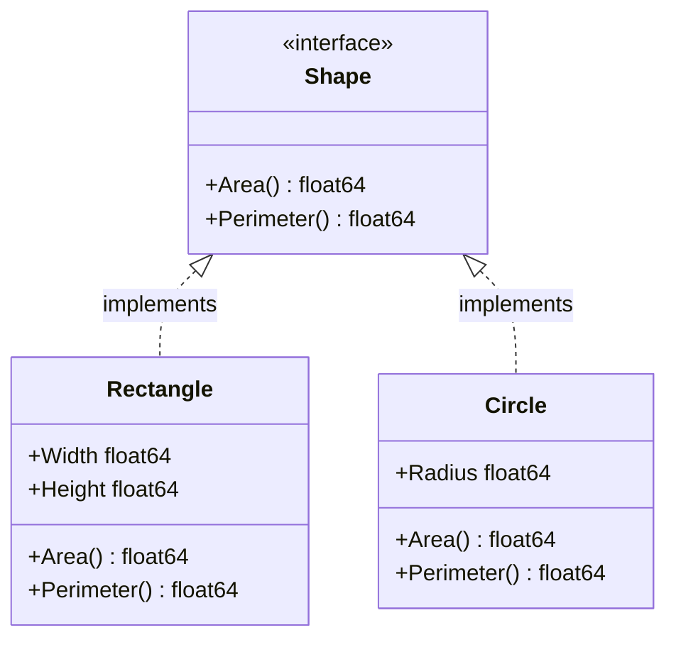

# Go Interface Types

## Introduction

In Go, interfaces provide a powerful way to define behavior without specifying implementation details. Unlike many other object-oriented languages, Go's approach to interfaces is implicit rather than explicit, making them both flexible and straightforward to use.

An interface type in Go is defined as a set of method signatures. A value of interface type can hold any value that implements those methods. This enables polymorphism - the ability to write code that can work with different types as long as they satisfy a common interface.

## What are Interfaces?

An interface is a collection of method signatures that a type can implement. When a type provides definitions for all the methods in an interface, it is said to implement that interface. Unlike languages like Java or C#, Go doesn't require explicit declarations to implement an interface - it's all implicit.

Let's look at a simple example:

```go
// Define an interface
type Shape interface {
    Area() float64
    Perimeter() float64
}
```

This interface defines a contract: any type that wants to be considered a `Shape` must provide `Area()` and `Perimeter()` methods, both returning `float64` values.

## Implementing Interfaces

To implement an interface in Go, you simply need to implement all the methods required by that interface. There's no explicit keyword like `implements` in other languages.

```go
// Rectangle type
type Rectangle struct {
    Width  float64
    Height float64
}

// Implement Area method for Rectangle
func (r Rectangle) Area() float64 {
    return r.Width * r.Height
}

// Implement Perimeter method for Rectangle
func (r Rectangle) Perimeter() float64 {
    return 2*r.Width + 2*r.Height
}

// Circle type
type Circle struct {
    Radius float64
}

// Implement Area method for Circle
func (c Circle) Area() float64 {
    return math.Pi * c.Radius * c.Radius
}

// Implement Perimeter method for Circle
func (c Circle) Perimeter() float64 {
    return 2 * math.Pi * c.Radius
}
```

Now both `Rectangle` and `Circle` implement the `Shape` interface implicitly because they provide both required methods.

## Using Interfaces

Once you've defined and implemented interfaces, you can use them to write more flexible code. Here's how you might use our `Shape` interface:

```go
// Function that works with any Shape
func PrintShapeInfo(s Shape) {
    fmt.Printf("Area: %.2f
", s.Area())
    fmt.Printf("Perimeter: %.2f
", s.Perimeter())
}

func main() {
    r := Rectangle{Width: 5, Height: 3}
    c := Circle{Radius: 2}
    
    fmt.Println("Rectangle information:")
    PrintShapeInfo(r)
    
    fmt.Println("
Circle information:")
    PrintShapeInfo(c)
}
```

**Output**:
```
Rectangle information:
Area: 15.00
Perimeter: 16.00

Circle information:
Area: 12.57
Perimeter: 12.57
```

Notice how we can pass both a `Rectangle` and a `Circle` to the same function because they both implement the `Shape` interface. This is polymorphism in action.

## The Empty Interface

Go has a special interface called the empty interface, which is an interface with no methods:

```go
interface{}
```

Since it has no methods, every type implements the empty interface implicitly. This makes it useful when you need to handle values of unknown type, similar to `Object` in some other languages.

```go
// Function that accepts any type
func PrintAny(any interface{}) {
    fmt.Printf("Value: %v, Type: %T
", any, any)
}

func main() {
    PrintAny(42)
    PrintAny("Hello")
    PrintAny(true)
    PrintAny(Rectangle{Width: 5, Height: 3})
}
```

**Output**:
```
Value: 42, Type: int
Value: Hello, Type: string
Value: true, Type: bool
Value: {5 3}, Type: main.Rectangle
```

## Type Assertions and Type Switches

When working with interface values, you often need to access the concrete value or check its type. Go provides type assertions and type switches for this purpose.

### Type Assertions

A type assertion provides access to an interface value's underlying concrete value:

```go
var i interface{} = "hello"

// Type assertion
s, ok := i.(string)
if ok {
    fmt.Println("String value:", s)
} else {
    fmt.Println("Not a string")
}

// This will panic if i is not an int
n := i.(int)  // Avoid this form unless you're sure
```

**Output**:
```
String value: hello
panic: interface conversion: interface {} is string, not int
```

### Type Switches

Type switches allow you to check the type of an interface value and handle each type differently:

```go
func HandleAny(v interface{}) {
    switch value := v.(type) {
    case int:
        fmt.Printf("Integer: %d
", value)
    case string:
        fmt.Printf("String: %s
", value)
    case bool:
        fmt.Printf("Boolean: %v
", value)
    default:
        fmt.Printf("Unknown type: %T
", value)
    }
}

func main() {
    HandleAny(42)
    HandleAny("hello")
    HandleAny(true)
    HandleAny(3.14)
}
```

**Output**:
```
Integer: 42
String: hello
Boolean: true
Unknown type: float64
```

## Interface Composition

Go interfaces can be composed of other interfaces, allowing for more modular designs:

```go
type Reader interface {
    Read(p []byte) (n int, err error)
}

type Writer interface {
    Write(p []byte) (n int, err error)
}

// ReadWriter combines Reader and Writer
type ReadWriter interface {
    Reader
    Writer
}
```

A type that implements both `Read` and `Write` methods automatically implements the `ReadWriter` interface.

## Real-World Example: Building a Simple Plugin System

Interfaces are perfect for creating extensible systems. Let's build a simple plugin system:

```go
// Plugin interface
type Plugin interface {
    Name() string
    Execute() error
}

// LoggerPlugin implementation
type LoggerPlugin struct {
    LogLevel string
}

func (lp LoggerPlugin) Name() string {
    return "Logger Plugin"
}

func (lp LoggerPlugin) Execute() error {
    fmt.Printf("Logging with level: %s
", lp.LogLevel)
    return nil
}

// NotifierPlugin implementation
type NotifierPlugin struct {
    Recipients []string
}

func (np NotifierPlugin) Name() string {
    return "Notifier Plugin"
}

func (np NotifierPlugin) Execute() error {
    fmt.Printf("Sending notifications to: %v
", np.Recipients)
    return nil
}

// Application that uses plugins
type App struct {
    Plugins []Plugin
}

func (app *App) AddPlugin(p Plugin) {
    app.Plugins = append(app.Plugins, p)
}

func (app *App) RunPlugins() {
    for _, p := range app.Plugins {
        fmt.Printf("Running plugin: %s
", p.Name())
        err := p.Execute()
        if err != nil {
            fmt.Printf("Error: %v
", err)
        }
    }
}

func main() {
    app := &App{}
    
    // Add plugins
    app.AddPlugin(LoggerPlugin{LogLevel: "DEBUG"})
    app.AddPlugin(NotifierPlugin{Recipients: []string{"admin@example.com", "user@example.com"}})
    
    // Run all plugins
    app.RunPlugins()
}
```

**Output**:
```
Running plugin: Logger Plugin
Logging with level: DEBUG
Running plugin: Notifier Plugin
Sending notifications to: [admin@example.com user@example.com]
```

This simple plugin system demonstrates how interfaces enable extensibility - the `App` knows nothing about the specific types of plugins, only that they satisfy the `Plugin` interface.

## Common Interface Patterns in Go Standard Library

The Go standard library makes extensive use of interfaces. Some common examples include:

1. `io.Reader` and `io.Writer`: For data input and output
2. `fmt.Stringer`: For custom string representations of types
3. `sort.Interface`: For custom sorting logic
4. `http.Handler`: For handling HTTP requests

Let's look at the `fmt.Stringer` interface:

```go
// Built-in fmt.Stringer interface
type Stringer interface {
    String() string
}
```

Example implementation:

```go
type Person struct {
    Name string
    Age  int
}

// Implement the Stringer interface
func (p Person) String() string {
    return fmt.Sprintf("%s, age %d", p.Name, p.Age)
}

func main() {
    p := Person{Name: "Alice", Age: 30}
    fmt.Println(p)  // Calls p.String() automatically
}
```

**Output**:
```
Alice, age 30
```

The `fmt` package checks if a value implements the `Stringer` interface and calls its `String()` method if available.

## Interface Design Principles

When designing interfaces in Go, follow these principles:

1. **Keep interfaces small**: Interfaces with fewer methods are more reusable
2. **Accept interfaces, return structs**: Functions should accept interface types but return concrete types
3. **Design for composition**: Small, focused interfaces can be composed into larger ones
4. **Interface naming**: Single-method interfaces often end in "-er" (Reader, Writer, Closer)

## Visualizing Interface Implementation

Here's a diagram showing the relationship between interfaces and implementing types:



## Summary

Go interfaces provide a flexible way to define behavior without specifying implementation. Key points to remember:

- Interfaces define method signatures, not implementations
- Implementation is implicit - no special keywords needed
- Interfaces enable polymorphism, allowing different types to be treated uniformly
- The empty interface (`interface{}`) can hold values of any type
- Type assertions and type switches help work with interface values
- Small, focused interfaces lead to more flexible code
- Interfaces are a key mechanism for decoupling components in Go

## Exercises

1. Create a `Geometry` interface with methods for calculating volume and surface area. Implement it for different 3D shapes like cubes, spheres, and cylinders.

2. Implement the `sort.Interface` for a custom collection type to enable sorting.

3. Design a simple file system interface with operations like Read, Write, and Delete. Implement it for both a local file system and an in-memory mock file system.

4. Create a `Serializable` interface with methods to convert objects to and from JSON and XML formats.

5. Implement the builtin `error` interface for custom error types in your application.

## Additional Resources

- [Go by Example: Interfaces](https://gobyexample.com/interfaces)
- [Effective Go: Interfaces](https://golang.org/doc/effective_go.html#interfaces)
- [Go Interface Design Patterns](https://rakyll.org/interface-pollution/)
- [Standard Library Interfaces](https://pkg.go.dev/io)
- [The Go Programming Language Specification](https://golang.org/ref/spec#Interface_types)