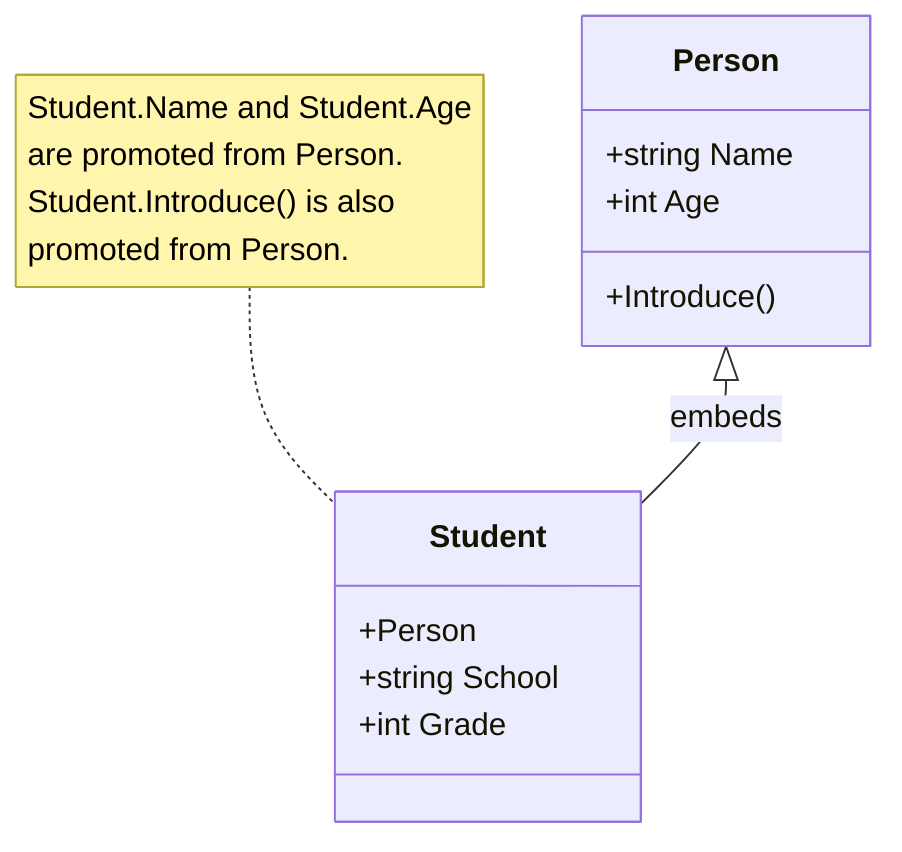

# Go Type Embedding

## Introduction

In object-oriented programming, inheritance is a fundamental concept that allows one class to inherit properties and methods from another class. However, Go takes a different approach: instead of traditional inheritance, Go uses a concept called **type embedding** to achieve similar functionality through composition.

Type embedding enables you to include one type within another, allowing the outer type to "inherit" the methods and fields of the embedded type. This creates a powerful mechanism for code reuse while maintaining Go's simplicity and clarity.

In this tutorial, we'll explore Go type embedding in depth, examining how it works with both structs and interfaces, and how it can be applied in practical scenarios.

## Basic Type Embedding

Let's start with a simple example of type embedding using structs:

```go
package main

import "fmt"

// Base type
type Person struct {
    Name string
    Age  int
}

// Method for the base type
func (p Person) Introduce() {
    fmt.Printf("Hello, my name is %s and I am %d years old.
", p.Name, p.Age)
}

// Embedding Person in Student
type Student struct {
    Person  // Embedded type (no field name)
    School  string
    Grade   int
}

func main() {
    // Create a Student
    student := Student{
        Person: Person{
            Name: "Alice",
            Age:  20,
        },
        School: "Go University",
        Grade:  3,
    }
    
    // Access fields directly
    fmt.Println("Name:", student.Name)
    fmt.Println("Age:", student.Age)
    fmt.Println("School:", student.School)
    
    // Call the embedded type's method
    student.Introduce()
}
```

**Output:**
```
Name: Alice
Age: 20
School: Go University
Hello, my name is Alice and I am 20 years old.
```

In this example:
1. We define a `Person` type with `Name` and `Age` fields, plus an `Introduce()` method
2. We create a `Student` type that embeds the `Person` type
3. The `Student` type now has access to all fields and methods of `Person`
4. We can directly access `Name` and `Age` from a `Student` instance, as if they were defined directly on `Student`

Notice that when we embed a type, we don't provide a field name - we just specify the type. This is what makes embedding different from regular composition.

## Field Promotion

When you embed a type, its fields and methods are "promoted" to the outer type. This means:

1. You can access the embedded type's fields and methods directly from the outer type
2. The outer type satisfies any interfaces that the embedded type satisfies

However, if the outer type has fields or methods with the same names as the embedded type, the outer type's fields/methods take precedence.

```go
package main

import "fmt"

type Base struct {
    Value int
}

func (b Base) Describe() {
    fmt.Printf("Base value: %d
", b.Value)
}

type Container struct {
    Base
    Value string // Shadows the embedded Base.Value
}

func (c Container) Describe() { // Overrides Base.Describe
    fmt.Printf("Container value: %s, Base value: %d
", c.Value, c.Base.Value)
}

func main() {
    c := Container{
        Base:  Base{Value: 42},
        Value: "hello",
    }
    
    // Accessing fields
    fmt.Println("Container.Value:", c.Value)     // "hello" (Container's field)
    fmt.Println("Container.Base.Value:", c.Base.Value) // 42 (Base's field)
    
    // Calling methods
    c.Describe()      // Calls Container's method
    c.Base.Describe() // Calls Base's method
}
```

**Output:**
```
Container.Value: hello
Container.Base.Value: 42
Container value: hello, Base value: 42
Base value: 42
```

In this example:
1. Both `Base` and `Container` have a field named `Value` and a method named `Describe()`
2. When we access `c.Value`, we get `Container`'s `Value` field
3. To access `Base`'s `Value` field, we need to use `c.Base.Value`
4. Similarly, `c.Describe()` calls `Container`'s method, and `c.Base.Describe()` calls `Base`'s method

## Multiple Embedding

Go allows you to embed multiple types in a single struct:

```go
package main

import "fmt"

type Walker struct{}
func (w Walker) Walk() {
    fmt.Println("Walking...")
}

type Talker struct{}
func (t Talker) Talk() {
    fmt.Println("Talking...")
}

type Human struct {
    Walker
    Talker
    Name string
}

func main() {
    h := Human{Name: "Bob"}
    h.Walk() // From Walker
    h.Talk() // From Talker
    fmt.Println("Name:", h.Name)
}
```

**Output:**
```
Walking...
Talking...
Name: Bob
```

This approach provides a way to achieve behavior similar to multiple inheritance, but with a clearer composition model.

## Interface Embedding

Just like structs, interfaces can also embed other interfaces. This creates a new interface that includes all the methods of the embedded interfaces.

```go
package main

import "fmt"

// Define simple interfaces
type Reader interface {
    Read() string
}

type Writer interface {
    Write(data string)
}

// Embed interfaces to create a new interface
type ReadWriter interface {
    Reader
    Writer
}

// Implement a type that satisfies the combined interface
type Document struct {
    content string
}

func (d *Document) Read() string {
    return d.content
}

func (d *Document) Write(data string) {
    d.content = data
}

func main() {
    // Create a document
    doc := &Document{}
    
    // Use it as a ReadWriter
    var rw ReadWriter = doc
    
    // Write data
    rw.Write("Hello, Go embedding!")
    
    // Read data
    fmt.Println(rw.Read())
}
```

**Output:**
```
Hello, Go embedding!
```

In this example:
1. We define `Reader` and `Writer` interfaces
2. We create a new `ReadWriter` interface that embeds both of them
3. Any type that implements both `Read()` and `Write()` methods automatically satisfies the `ReadWriter` interface
4. Our `Document` type implements both methods, so it can be used as a `ReadWriter`

This is a common pattern in Go's standard library. For example, the `io` package defines `io.Reader`, `io.Writer`, and `io.ReadWriter` using this approach.

## Practical Example: Building a Web Server

Let's see a more practical example using embedding to build a simple HTTP server with logging capabilities:

```go
package main

import (
    "fmt"
    "log"
    "net/http"
    "time"
)

// Logger embeds http.Handler and adds logging
type Logger struct {
    http.Handler
    LogPrefix string
}

// ServeHTTP overrides the embedded Handler's ServeHTTP
func (l Logger) ServeHTTP(w http.ResponseWriter, r *http.Request) {
    startTime := time.Now()
    fmt.Printf("[%s] %s %s - Started
", l.LogPrefix, r.Method, r.URL.Path)
    
    // Call the embedded handler's ServeHTTP
    l.Handler.ServeHTTP(w, r)
    
    duration := time.Since(startTime)
    fmt.Printf("[%s] %s %s - Completed in %v
", l.LogPrefix, r.Method, r.URL.Path, duration)
}

// HomeHandler is a simple http.Handler
type HomeHandler struct{}

func (h HomeHandler) ServeHTTP(w http.ResponseWriter, r *http.Request) {
    w.Write([]byte("Welcome to Go Type Embedding!"))
}

func main() {
    // Create our handlers
    home := HomeHandler{}
    
    // Wrap with logger
    loggedHome := Logger{
        Handler:   home,
        LogPrefix: "HOME",
    }
    
    // Start the server
    fmt.Println("Server starting on :8080...")
    http.Handle("/", loggedHome)
    log.Fatal(http.ListenAndServe(":8080", nil))
}
```

If you run this code and visit `http://localhost:8080/` in your browser, you'll see:

**Console Output:**
```
Server starting on :8080...
[HOME] GET / - Started
[HOME] GET / - Completed in 123.45µs
```

**Browser Output:**
```
Welcome to Go Type Embedding!
```

This example demonstrates how embedding allows us to:
1. Take an existing implementation (`http.Handler`)
2. Embed it in our custom type (`Logger`)
3. Extend its behavior (adding logging before and after the request)
4. Use it seamlessly with the standard library

This pattern is called the **Decorator Pattern**, and embedding makes it very clean and straightforward in Go.

## Embedding vs. Composition

It's important to understand the difference between embedding and traditional composition:

```go
// Embedding
type Car struct {
    Engine // Embedded - methods and fields are promoted
}

// Composition
type Car struct {
    engine Engine // Not embedded - methods and fields are not promoted
}
```

With embedding (`Engine`), you can directly call methods like `car.Start()`.
With composition (`engine Engine`), you would need to call `car.engine.Start()`.

Embedding provides convenience through field and method promotion, but it's essentially a syntactic sugar over composition. You're still creating a has-a relationship, not an is-a relationship as in traditional inheritance.

## When to Use Type Embedding

Use embedding when:

1. **You want to reuse behavior**: Embedding allows you to reuse code from existing types.
2. **You're implementing the Decorator Pattern**: As shown in the HTTP server example.
3. **You want to satisfy an interface**: Embedding a type that already implements an interface is a quick way to make your type satisfy that interface.

Avoid embedding when:

1. **You need to hide or protect embedded fields**: Embedded fields are always accessible from the outside.
2. **You're trying to model an 'is-a' relationship**: Go's embedding is more about 'has-a' with convenient access.

## Mermaid Diagram: Type Embedding Visualization

Here's a visualization of how type embedding works:



## Summary

Go type embedding is a powerful feature that enables code reuse through composition rather than inheritance. It allows you to:

- Include one type inside another without giving it a field name
- Access the embedded type's fields and methods directly from the outer type
- Satisfy interfaces that the embedded type satisfies
- Build complex behaviors through composition of simpler types

The key advantages of embedding are:

1. **Simplicity**: It avoids the complexity of class hierarchies found in traditional inheritance
2. **Explicit**: The relationship between types is clear and transparent
3. **Flexibility**: You can embed multiple types to compose behavior from various sources

By favoring composition over inheritance, Go encourages you to build systems from small, reusable components, making your code more maintainable and easier to reason about.

## Exercises

To practice your understanding of Go type embedding, try these exercises:

1. Create a `Vehicle` type with basic properties and methods, then create specific vehicle types (`Car`, `Motorcycle`, etc.) by embedding `Vehicle`.

2. Implement a middleware chain for HTTP requests using embedding. Create different middleware components that can be composed together.

3. Explore the Go standard library to find examples of interface embedding, such as in the `io` package.

4. Create a logging system with different log levels by embedding a base logger and extending its functionality.

## Additional Resources

- [Go Documentation on Embedding](https://golang.org/doc/effective_go.html#embedding)
- [Go by Example: Structs](https://gobyexample.com/structs)
- [The Go Programming Language Specification](https://golang.org/ref/spec)
- [Go Interface Composition](https://golang.org/doc/effective_go.html#interface_methods)