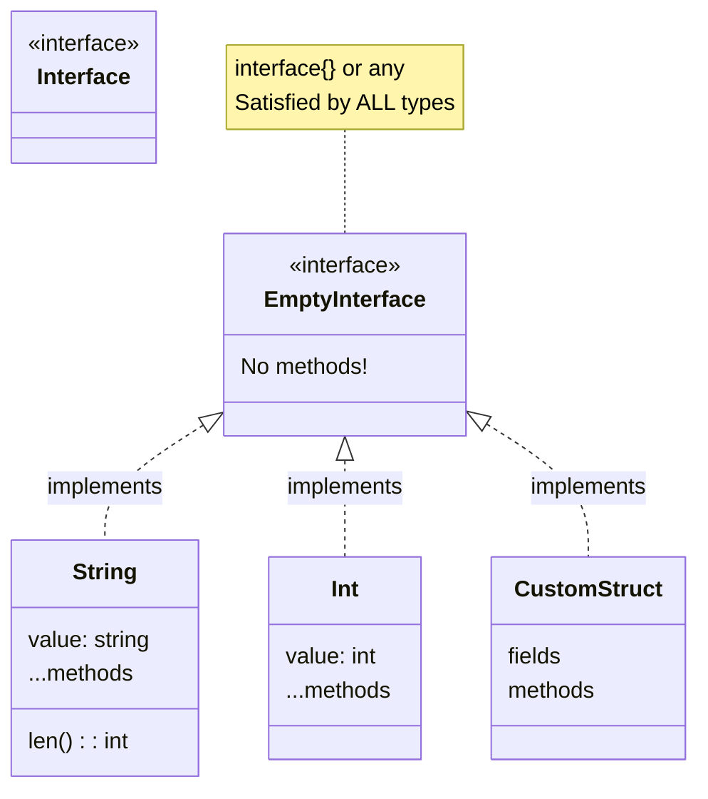

# Go Empty Interface

## Introduction

In Go, the empty interface (written as `interface{}` or `any` in Go 1.18+) is a powerful concept that allows for flexibility when working with different types. Unlike most statically typed languages where types must be explicitly defined, the empty interface allows you to handle values of any type. This makes it an essential tool for building flexible and reusable code in Go.

The empty interface is unique because it has no methods. Since it defines no methods, every type in Go inherently satisfies the empty interface. This means you can use the empty interface to represent any value, regardless of its type.

## Understanding the Empty Interface

### What is the Empty Interface?

An interface in Go is a type that defines a set of methods. The empty interface (`interface{}`) defines no methods, meaning that any type satisfies it by default.

```go
// Declaration of an empty interface
var i interface{}
// or in Go 1.18+
var j any
```

Since the empty interface has no requirements, any value can be assigned to a variable of type `interface{}`:

```go
package main

import "fmt"

func main() {
    var i interface{}
    
    // The empty interface can hold an integer
    i = 42
    fmt.Println("Value:", i)
    
    // The empty interface can hold a string
    i = "hello"
    fmt.Println("Value:", i)
    
    // The empty interface can hold a boolean
    i = true
    fmt.Println("Value:", i)
    
    // The empty interface can hold a custom struct
    i = struct{ name string }{"Go"}
    fmt.Println("Value:", i)
}
```

Output:
```
Value: 42
Value: hello
Value: true
Value: {Go}
```

### Type Assertions with Empty Interface

When you have a value stored in an empty interface, you need to use a type assertion to access the underlying concrete value:

```go
package main

import "fmt"

func main() {
    var i interface{} = "hello"
    
    // Type assertion - extracting the string
    s, ok := i.(string)
    if ok {
        fmt.Println("Value is a string:", s)
    }
    
    // Incorrect type assertion
    n, ok := i.(int)
    if !ok {
        fmt.Println("Value is not an integer, n =", n)
    }
    
    // Panic: direct type assertion without check
    // This will panic if the type is wrong
    // s = i.(string) // Safe because i contains a string
    // n = i.(int)    // Would panic because i doesn't contain an int
}
```

Output:
```
Value is a string: hello
Value is not an integer, n = 0
```

### Type Switches

A more elegant way to handle multiple potential types is to use a type switch:

```go
package main

import "fmt"

func describeType(i interface{}) {
    switch v := i.(type) {
    case int:
        fmt.Printf("Integer: %v (multiplied by 2: %v)
", v, v*2)
    case string:
        fmt.Printf("String: %v (length: %v)
", v, len(v))
    case bool:
        fmt.Printf("Boolean: %v (negated: %v)
", v, !v)
    default:
        fmt.Printf("Unknown type: %T
", v)
    }
}

func main() {
    describeType(42)
    describeType("hello")
    describeType(true)
    describeType(3.14)
    describeType([]int{1, 2, 3})
}
```

Output:
```
Integer: 42 (multiplied by 2: 84)
String: hello (length: 5)
Boolean: true (negated: false)
Unknown type: float64
Unknown type: []int
```

## Common Use Cases for the Empty Interface

### Implementing Generic Functions

Before Go 1.18 (which introduced generics), the empty interface was the primary way to write functions that could accept any type of argument:

```go
package main

import "fmt"

// PrintAny can print any type of value
func PrintAny(v interface{}) {
    fmt.Printf("Value: %v, Type: %T
", v, v)
}

func main() {
    PrintAny(42)
    PrintAny("hello")
    PrintAny(true)
    PrintAny([]string{"a", "b", "c"})
    PrintAny(map[string]int{"apple": 1, "banana": 2})
}
```

Output:
```
Value: 42, Type: int
Value: hello, Type: string
Value: true, Type: bool
Value: [a b c], Type: []string
Value: map[apple:1 banana:2], Type: map[string]int
```

### Collection Types

Go's standard library uses the empty interface for data structures that need to store values of multiple types:

```go
package main

import "fmt"

func main() {
    // A slice that can contain any type
    mixedSlice := []interface{}{
        42,
        "hello",
        true,
        []int{1, 2, 3},
        map[string]int{"a": 1, "b": 2},
    }
    
    for i, v := range mixedSlice {
        fmt.Printf("mixedSlice[%d] = %v (type: %T)
", i, v, v)
    }
    
    // A map with string keys and any type of value
    mixedMap := map[string]interface{}{
        "number":  42,
        "text":    "hello",
        "flag":    true,
        "numbers": []int{1, 2, 3},
    }
    
    for k, v := range mixedMap {
        fmt.Printf("mixedMap[%q] = %v (type: %T)
", k, v, v)
    }
}
```

Output (order may vary for the map):
```
mixedSlice[0] = 42 (type: int)
mixedSlice[1] = hello (type: string)
mixedSlice[2] = true (type: bool)
mixedSlice[3] = [1 2 3] (type: []int)
mixedSlice[4] = map[a:1 b:2] (type: map[string]int)
mixedMap["number"] = 42 (type: int)
mixedMap["text"] = hello (type: string)
mixedMap["flag"] = true (type: bool)
mixedMap["numbers"] = [1 2 3] (type: []int)
```

### JSON and Data Serialization

The empty interface is used extensively in Go's encoding/json package to handle arbitrary JSON data:

```go
package main

import (
    "encoding/json"
    "fmt"
)

func main() {
    // JSON string with mixed types
    jsonData := `{
        "name": "John",
        "age": 30,
        "isStudent": false,
        "courses": ["Math", "Science"],
        "address": {
            "city": "New York",
            "zip": "10001"
        }
    }`
    
    // Unmarshal into a map with empty interface values
    var result map[string]interface{}
    if err := json.Unmarshal([]byte(jsonData), &result); err != nil {
        fmt.Println("Error:", err)
        return
    }
    
    // Access and process the data
    fmt.Printf("Name: %v (type: %T)
", result["name"], result["name"])
    fmt.Printf("Age: %v (type: %T)
", result["age"], result["age"])
    
    // Access nested slice - requires type assertion
    if courses, ok := result["courses"].([]interface{}); ok {
        fmt.Println("Courses:")
        for i, course := range courses {
            fmt.Printf("  %d. %v
", i+1, course)
        }
    }
    
    // Access nested map - requires type assertion
    if address, ok := result["address"].(map[string]interface{}); ok {
        fmt.Printf("City: %v
", address["city"])
        fmt.Printf("ZIP: %v
", address["zip"])
    }
}
```

Output:
```
Name: John (type: string)
Age: 30 (type: float64)
Courses:
  1. Math
  2. Science
City: New York
ZIP: 10001
```

Note: When unmarshaling JSON into `interface{}` values, numbers become `float64`, objects become `map[string]interface{}`, and arrays become `[]interface{}`.

## Visualizing the Empty Interface

