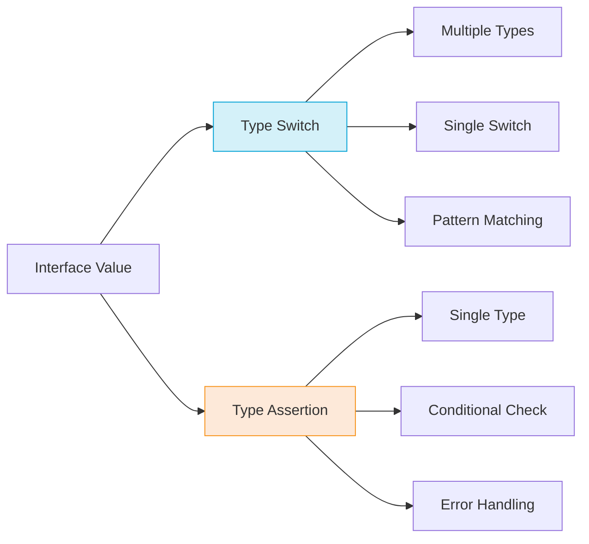

# Go Type Switches

## Introduction

When working with interfaces in Go, you'll often need to determine and handle the concrete type stored within an interface variable. A **type switch** is a powerful construct in Go that allows you to compare the concrete type of an interface against multiple type cases in a single operation.

Type switches build upon the concept of type assertions, but provide a more elegant and concise way to handle multiple types without a series of if-else statements. This makes your code more readable and maintainable, especially when dealing with interfaces that could contain various types.

## Understanding Type Switches

A type switch evaluates the type of an interface value and executes the corresponding case block based on that type. This is particularly useful when you need to perform different operations depending on the concrete type stored in an interface.

### Basic Syntax

```go
switch v := interfaceValue.(type) {
case Type1:
    // v has Type1
case Type2:
    // v has Type2
case nil:
    // interfaceValue is nil
default:
    // none of the cases match
}
```

The special syntax `interfaceValue.(type)` is only valid within a switch statement.

## Basic Example

Let's start with a simple example to demonstrate how a type switch works:

```go
package main

import (
    "fmt"
)

func printType(i interface{}) {
    switch v := i.(type) {
    case int:
        fmt.Printf("Value %d is an int
", v)
    case string:
        fmt.Printf("Value '%s' is a string
", v)
    case bool:
        fmt.Printf("Value %t is a boolean
", v)
    case float64:
        fmt.Printf("Value %f is a float64
", v)
    case nil:
        fmt.Println("Value is nil")
    default:
        fmt.Printf("Value is of unknown type %T
", v)
    }
}

func main() {
    printType(42)
    printType("hello")
    printType(true)
    printType(3.14)
    printType(nil)
    printType([]int{1, 2, 3})
}
```

Output:
```
Value 42 is an int
Value 'hello' is a string
Value true is a boolean
Value 3.140000 is a float64
Value is nil
Value is of unknown type []int
```

In this example:
1. We define a function `printType` that takes an `interface{}` parameter, which can hold any type
2. Inside the function, we use a type switch to determine the concrete type of the value
3. Each case handles a different type, and the variable `v` is assigned the value with the appropriate type
4. We call the function with different types of arguments to demonstrate how the switch behaves

## Multiple Types in a Case

A type switch allows you to handle multiple types in a single case:

```go
package main

import (
    "fmt"
)

func categorizeType(i interface{}) string {
    switch i.(type) {
    case int, int8, int16, int32, int64:
        return "integer type"
    case uint, uint8, uint16, uint32, uint64:
        return "unsigned integer type"
    case float32, float64:
        return "floating-point type"
    case string:
        return "string type"
    case bool:
        return "boolean type"
    default:
        return "other type"
    }
}

func main() {
    fmt.Println(categorizeType(42))         // int
    fmt.Println(categorizeType(int8(42)))   // int8
    fmt.Println(categorizeType(3.14))       // float64
    fmt.Println(categorizeType("Go"))       // string
    fmt.Println(categorizeType(true))       // bool
    fmt.Println(categorizeType([]int{1, 2})) // slice
}
```

Output:
```
integer type
integer type
floating-point type
string type
boolean type
other type
```

Note that when grouping multiple types in a case, the variable in the switch expression isn't available within the case block with a specific type. If you need to access the value with its specific type, you'll need to use separate cases.

## Working with Custom Types and Structs

Type switches are especially useful when working with custom types and structs. Here's an example:

```go
package main

import (
    "fmt"
)

type Person struct {
    Name string
    Age  int
}

type Animal struct {
    Species string
    Age     int
}

func describeEntity(entity interface{}) {
    switch v := entity.(type) {
    case Person:
        fmt.Printf("Person: %s, %d years old
", v.Name, v.Age)
    case Animal:
        fmt.Printf("Animal: %s, %d years old
", v.Species, v.Age)
    case *Person:
        fmt.Printf("Pointer to Person: %s, %d years old
", v.Name, v.Age)
    case *Animal:
        fmt.Printf("Pointer to Animal: %s, %d years old
", v.Species, v.Age)
    default:
        fmt.Printf("Unknown entity type: %T
", v)
    }
}

func main() {
    person := Person{Name: "Alice", Age: 30}
    animal := Animal{Species: "Dog", Age: 5}
    
    describeEntity(person)
    describeEntity(animal)
    describeEntity(&person)
    describeEntity(&animal)
    describeEntity(42)
}
```

Output:
```
Person: Alice, 30 years old
Animal: Dog, 5 years old
Pointer to Person: Alice, 30 years old
Pointer to Animal: Dog, 5 years old
Unknown entity type: int
```

This example shows:
1. How to handle different struct types in a type switch
2. How to distinguish between value and pointer types
3. How to access fields of the concrete type within each case

## Real-World Example: Processing Different Message Types

Let's look at a more practical example. Imagine you're building a messaging system that needs to process different types of messages:

```go
package main

import (
    "fmt"
    "time"
)

// Message interface
type Message interface {
    GetTimestamp() time.Time
}

// TextMessage represents a text message
type TextMessage struct {
    Content   string
    Timestamp time.Time
}

func (tm TextMessage) GetTimestamp() time.Time {
    return tm.Timestamp
}

// ImageMessage represents an image message
type ImageMessage struct {
    URL       string
    Size      int
    Timestamp time.Time
}

func (im ImageMessage) GetTimestamp() time.Time {
    return im.Timestamp
}

// LocationMessage represents a location message
type LocationMessage struct {
    Latitude  float64
    Longitude float64
    Timestamp time.Time
}

func (lm LocationMessage) GetTimestamp() time.Time {
    return lm.Timestamp
}

// Process different message types
func processMessage(msg Message) {
    fmt.Printf("Processing message from: %v
", msg.GetTimestamp())
    
    switch m := msg.(type) {
    case TextMessage:
        fmt.Printf("Text message: %s
", m.Content)
    case ImageMessage:
        fmt.Printf("Image message: %s (%d KB)
", m.URL, m.Size/1024)
    case LocationMessage:
        fmt.Printf("Location message: %.6f, %.6f
", m.Latitude, m.Longitude)
    default:
        fmt.Printf("Unknown message type: %T
", m)
    }
    fmt.Println("---")
}

func main() {
    messages := []Message{
        TextMessage{
            Content:   "Hello, how are you?",
            Timestamp: time.Now().Add(-2 * time.Hour),
        },
        ImageMessage{
            URL:       "https://example.com/image.jpg",
            Size:      2048000, // 2MB
            Timestamp: time.Now().Add(-1 * time.Hour),
        },
        LocationMessage{
            Latitude:  37.7749,
            Longitude: -122.4194,
            Timestamp: time.Now(),
        },
    }
    
    for _, msg := range messages {
        processMessage(msg)
    }
}
```

Output (timestamps will vary):
```
Processing message from: 2023-07-25 09:00:00 +0000 UTC
Text message: Hello, how are you?
---
Processing message from: 2023-07-25 10:00:00 +0000 UTC
Image message: https://example.com/image.jpg (2000 KB)
---
Processing message from: 2023-07-25 11:00:00 +0000 UTC
Location message: 37.774900, -122.419400
---
```

This example demonstrates a real-world use case where:
1. We have a common `Message` interface implemented by different types
2. Each message type contains different data but shares a common method
3. We use a type switch to process each message differently based on its concrete type
4. The variable in each case is typed correctly, allowing us to access the specific fields of each message type

## Type Switches vs. Type Assertions

Type switches and type assertions both help you work with the concrete types stored in interfaces, but they serve different purposes:

