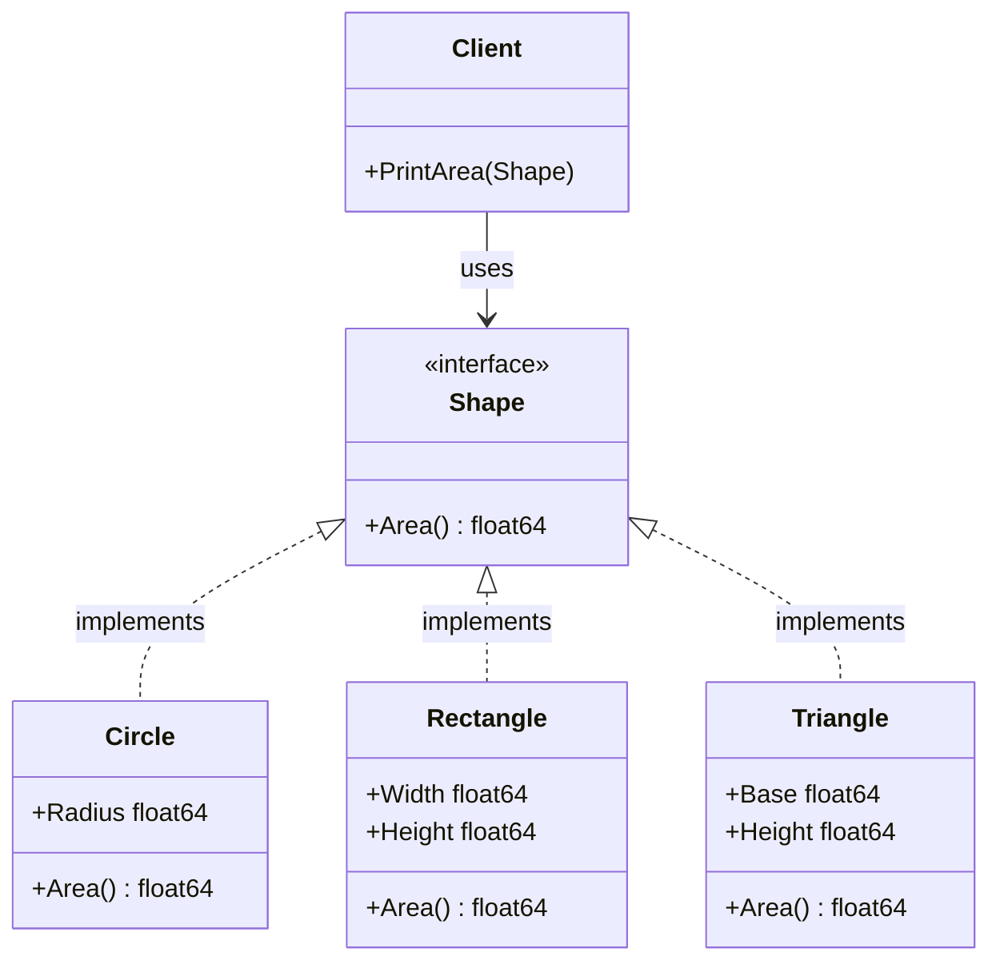

# Go Polymorphism

## Introduction

Polymorphism is one of the core concepts in object-oriented programming that allows objects of different types to be treated as objects of a common type. The word "polymorphism" comes from Greek, meaning "many forms." In Go, polymorphism is achieved through interfaces rather than inheritance (which Go doesn't support).

This guide will explain how polymorphism works in Go, why it's useful, and how to implement it in your own programs. By the end, you'll understand how to write flexible, modular code using Go's interface-based approach to polymorphism.

## Understanding Polymorphism in Go

Unlike traditional object-oriented languages like Java or C++ that implement polymorphism through class inheritance, Go takes a different approach with **implicit interface implementation**. This means:

1. You define interfaces as collections of method signatures
2. Any type that implements all methods of an interface automatically satisfies that interface
3. No explicit declaration is needed to say that a type implements an interface

This design creates a more flexible and decoupled system, where types don't need to know about the interfaces they satisfy.

## Basic Interface Implementation

Let's start with a simple example:

```go
package main

import (
    "fmt"
    "math"
)

// Shape interface defines a method to calculate area
type Shape interface {
    Area() float64
}

// Circle type
type Circle struct {
    Radius float64
}

// Rectangle type
type Rectangle struct {
    Width  float64
    Height float64
}

// Area method for Circle
func (c Circle) Area() float64 {
    return math.Pi * c.Radius * c.Radius
}

// Area method for Rectangle
func (r Rectangle) Area() float64 {
    return r.Width * r.Height
}

// Function that works with any Shape
func PrintArea(s Shape) {
    fmt.Printf("Area: %.2f
", s.Area())
}

func main() {
    c := Circle{Radius: 5}
    r := Rectangle{Width: 4, Height: 6}
    
    // Both types can be used where a Shape is expected
    PrintArea(c) // Output: Area: 78.54
    PrintArea(r) // Output: Area: 24.00
}
```

In this example:
- We define a `Shape` interface with a single method `Area()`
- Both `Circle` and `Rectangle` implement the `Area()` method
- Even though neither type explicitly states that it implements `Shape`, both can be used wherever a `Shape` is expected
- The `PrintArea` function works with any type that satisfies the `Shape` interface

This is polymorphism in action - different types behaving according to a common interface.

## Interface Values and Type Assertions

An interface value in Go consists of two components: a concrete type and a value of that type. Let's explore how this enables polymorphic behavior:

```go
package main

import "fmt"

type Speaker interface {
    Speak() string
}

type Dog struct {
    Name string
}

func (d Dog) Speak() string {
    return d.Name + " says Woof!"
}

type Cat struct {
    Name string
}

func (c Cat) Speak() string {
    return c.Name + " says Meow!"
}

func main() {
    // Create a slice of Speakers
    speakers := []Speaker{
        Dog{Name: "Buddy"},
        Cat{Name: "Whiskers"},
        Dog{Name: "Max"},
    }
    
    // Polymorphic behavior
    for _, s := range speakers {
        fmt.Println(s.Speak())
    }
    
    // Type assertions
    for _, s := range speakers {
        if dog, ok := s.(Dog); ok {
            fmt.Println(dog.Name, "is a dog")
        } else if cat, ok := s.(Cat); ok {
            fmt.Println(cat.Name, "is a cat")
        }
    }
}
```

Output:
```
Buddy says Woof!
Whiskers says Meow!
Max says Woof!
Buddy is a dog
Whiskers is a cat
Max is a dog
```

This example demonstrates:
1. Creating a slice of interface values containing different types
2. Calling the interface method on each, with behavior depending on the concrete type
3. Using type assertions to access the underlying concrete type when needed

## The Empty Interface

The empty interface `interface{}` (or `any` in Go 1.18+) has no methods, so every type implements it. This makes it useful for functions that need to work with values of unknown types:

```go
package main

import "fmt"

func describe(i interface{}) {
    fmt.Printf("Value: %v, Type: %T
", i, i)
}

func main() {
    describe(42)
    describe("Hello")
    describe(true)
    describe(3.14)
}
```

Output:
```
Value: 42, Type: int
Value: Hello, Type: string
Value: true, Type: bool
Value: 3.14, Type: float64
```

While useful, the empty interface should be used sparingly, as it bypasses Go's type safety.

## Type Switches for Polymorphic Behavior

Type switches provide a cleaner way to handle multiple possible types:

```go
package main

import "fmt"

type Geometry interface {
    Area() float64
    Perimeter() float64
}

type Rectangle struct {
    Width, Height float64
}

func (r Rectangle) Area() float64 {
    return r.Width * r.Height
}

func (r Rectangle) Perimeter() float64 {
    return 2*r.Width + 2*r.Height
}

type Circle struct {
    Radius float64
}

func (c Circle) Area() float64 {
    return 3.14 * c.Radius * c.Radius
}

func (c Circle) Perimeter() float64 {
    return 2 * 3.14 * c.Radius
}

func describe(g Geometry) {
    fmt.Printf("Area: %.2f
", g.Area())
    fmt.Printf("Perimeter: %.2f
", g.Perimeter())
    
    // Type switch to access specific properties
    switch shape := g.(type) {
    case Rectangle:
        fmt.Printf("Rectangle dimensions: %.1f x %.1f
", shape.Width, shape.Height)
    case Circle:
        fmt.Printf("Circle radius: %.1f
", shape.Radius)
    default:
        fmt.Println("Unknown shape")
    }
    fmt.Println()
}

func main() {
    r := Rectangle{Width: 5, Height: 3}
    c := Circle{Radius: 4}
    
    describe(r)
    describe(c)
}
```

Output:
```
Area: 15.00
Perimeter: 16.00
Rectangle dimensions: 5.0 x 3.0

Area: 50.24
Perimeter: 25.12
Circle radius: 4.0
```

## Polymorphism with Method Sets

In Go, the set of methods a type implements determines which interfaces it satisfies. This method set can differ between a type `T` and a pointer to that type `*T`:

```go
package main

import "fmt"

type Counter interface {
    Increment()
    GetCount() int
}

type SimpleCounter struct {
    count int
}

// Increment needs to modify the counter
func (c *SimpleCounter) Increment() {
    c.count++
}

// GetCount just returns the value
func (c SimpleCounter) GetCount() int {
    return c.count
}

func main() {
    // A pointer to SimpleCounter implements Counter
    var c1 Counter = &SimpleCounter{}
    c1.Increment()
    c1.Increment()
    fmt.Println("Count:", c1.GetCount()) // Output: Count: 2
    
    // This would not compile:
    // var c2 Counter = SimpleCounter{}
    // Because SimpleCounter doesn't implement Increment, only *SimpleCounter does
}
```

Important rules to remember:
- If a method modifies its receiver, it should use a pointer receiver
- A value of type `T` only has methods defined with value receivers
- A value of type `*T` has methods defined with both value and pointer receivers
- This affects which interfaces are implemented by `T` vs `*T`

## Real-World Example: File Processors

Let's look at a practical example of polymorphism for processing different file types:

```go
package main

import (
    "fmt"
    "strings"
)

// FileProcessor interface defines methods for any file processor
type FileProcessor interface {
    Process(data string) string
    GetExtension() string
}

// CSVProcessor handles CSV files
type CSVProcessor struct {
    Delimiter string
}

func (p CSVProcessor) Process(data string) string {
    // Replace delimiter with tab for better display
    return strings.ReplaceAll(data, p.Delimiter, "\t")
}

func (p CSVProcessor) GetExtension() string {
    return ".csv"
}

// JSONProcessor handles JSON files
type JSONProcessor struct {
    PrettyPrint bool
}

func (p JSONProcessor) Process(data string) string {
    if !p.PrettyPrint {
        return data
    }
    
    // Simple indent for demonstration (not real JSON formatting)
    result := ""
    indent := 0
    for _, char := range data {
        if char == '{' || char == '[' {
            indent += 2
            result += string(char) + "
" + strings.Repeat(" ", indent)
        } else if char == '}' || char == ']' {
            indent -= 2
            result += "
" + strings.Repeat(" ", indent) + string(char)
        } else if char == ',' {
            result += string(char) + "
" + strings.Repeat(" ", indent)
        } else {
            result += string(char)
        }
    }
    return result
}

func (p JSONProcessor) GetExtension() string {
    return ".json"
}

// ProcessFile is a polymorphic function that works with any FileProcessor
func ProcessFile(filename string, processor FileProcessor, data string) {
    // Check if filename has the correct extension
    if !strings.HasSuffix(filename, processor.GetExtension()) {
        fmt.Printf("Warning: Filename %s doesn't match expected extension %s
", 
                   filename, processor.GetExtension())
    }
    
    fmt.Printf("Processing %s...
", filename)
    result := processor.Process(data)
    fmt.Printf("Result:
%s

", result)
}

func main() {
    csvData := "name,age,city
Alice,28,New York
Bob,35,San Francisco"
    jsonData := `{"users":[{"name":"Alice","age":28},{"name":"Bob","age":35}]}`
    
    csvProcessor := CSVProcessor{Delimiter: ","}
    jsonProcessor := JSONProcessor{PrettyPrint: true}
    
    ProcessFile("users.csv", csvProcessor, csvData)
    ProcessFile("users.json", jsonProcessor, jsonData)
    
    // Polymorphism allows us to store different processors in a slice
    processors := []FileProcessor{csvProcessor, jsonProcessor}
    for _, p := range processors {
        fmt.Printf("Processor handles %s files
", p.GetExtension())
    }
}
```

This example demonstrates how interfaces enable you to:
1. Define a common set of behaviors (processing files)
2. Implement those behaviors differently for different types
3. Write functions that work with any type implementing the interface
4. Store and manipulate different types through the common interface

## Visualizing Go Polymorphism

Here's a diagram showing how polymorphism works in Go:



This diagram illustrates how:
- Multiple concrete types implement the same interface
- Client code depends only on the interface, not concrete types
- New shapes can be added without changing existing code

## Common Polymorphism Patterns in Go

### 1. Strategy Pattern

The strategy pattern lets you define a family of algorithms, encapsulate each one, and make them interchangeable:

```go
package main

import "fmt"

// PaymentMethod interface
type PaymentMethod interface {
    Pay(amount float64) string
}

// CreditCard implementation
type CreditCard struct {
    Name, Number, CVV, Expiry string
}

func (c CreditCard) Pay(amount float64) string {
    return fmt.Sprintf("Paid $%.2f using Credit Card %s", amount, c.Number)
}

// PayPal implementation
type PayPal struct {
    Email string
}

func (p PayPal) Pay(amount float64) string {
    return fmt.Sprintf("Paid $%.2f using PayPal account %s", amount, p.Email)
}

// CheckoutService uses payment methods polymorphically
type CheckoutService struct {
    paymentMethod PaymentMethod
}

func (c *CheckoutService) SetPaymentMethod(pm PaymentMethod) {
    c.paymentMethod = pm
}

func (c *CheckoutService) Checkout(amount float64) string {
    return c.paymentMethod.Pay(amount)
}

func main() {
    creditCard := CreditCard{
        Name:   "John Doe",
        Number: "1234-5678-9012-3456",
        CVV:    "123",
        Expiry: "12/24",
    }
    
    paypal := PayPal{
        Email: "john.doe@example.com",
    }
    
    checkout := CheckoutService{}
    
    // Use credit card
    checkout.SetPaymentMethod(creditCard)
    fmt.Println(checkout.Checkout(100.50))
    
    // Switch to PayPal
    checkout.SetPaymentMethod(paypal)
    fmt.Println(checkout.Checkout(100.50))
}
```

### 2. Decorator Pattern

The decorator pattern lets you attach new behaviors to objects by placing them inside wrapper objects:

```go
package main

import "fmt"

// Component interface
type Notifier interface {
    Send(message string) string
}

// Concrete component
type EmailNotifier struct {
    Email string
}

func (e EmailNotifier) Send(message string) string {
    return fmt.Sprintf("Sending email to %s: %s", e.Email, message)
}

// Base decorator
type NotifierDecorator struct {
    Wrapped Notifier
}

func (d NotifierDecorator) Send(message string) string {
    return d.Wrapped.Send(message)
}

// Concrete decorators
type LogDecorator struct {
    NotifierDecorator
}

func (d LogDecorator) Send(message string) string {
    result := d.Wrapped.Send(message)
    return fmt.Sprintf("LOGGED: %s", result)
}

type EncryptionDecorator struct {
    NotifierDecorator
}

func (d EncryptionDecorator) Send(message string) string {
    // In a real app, this would encrypt the message
    encryptedMsg := fmt.Sprintf("[ENCRYPTED] %s", message)
    return d.Wrapped.Send(encryptedMsg)
}

func main() {
    // Create base notifier
    emailNotifier := EmailNotifier{Email: "user@example.com"}
    
    // Add logging
    loggedNotifier := LogDecorator{
        NotifierDecorator: NotifierDecorator{
            Wrapped: emailNotifier,
        },
    }
    
    // Add encryption on top of logging
    encryptedLoggedNotifier := EncryptionDecorator{
        NotifierDecorator: NotifierDecorator{
            Wrapped: loggedNotifier,
        },
    }
    
    // Send notification through the decorated chain
    result := encryptedLoggedNotifier.Send("Hello world")
    fmt.Println(result)
}
```

## Best Practices for Go Polymorphism

1. **Keep interfaces small**: The Go proverb says, "The bigger the interface, the weaker the abstraction." Small interfaces (1-3 methods) are more reusable.

2. **Accept interfaces, return structs**: Design functions to accept interface parameters for flexibility but return concrete types for clarity.

3. **Define interfaces where they're used**: Define interfaces in the package that uses them, not the package that implements them.

4. **Use embedding for interface composition**: Combine smaller interfaces to create larger ones.

5. **Don't use interfaces for the sake of interfaces**: Only introduce an interface when you need the polymorphic behavior it provides.

## Common Pitfalls

1. **Overusing interfaces**: Not everything needs an interface. Use them when you need polymorphism or when testing requires mocking.

2. **Forgetting pointer vs. value receiver differences**: Remember that pointer receivers are needed for methods that modify state.

3. **Using empty interfaces without type assertions**: The empty interface provides no type safety and requires type assertions or type switches to be useful.

4. **Designing complex inheritance-like structures**: Go's interface system works best with composition rather than trying to simulate inheritance hierarchies.

## Summary

Polymorphism in Go works through interfaces, providing a flexible way to achieve behavior reuse without inheritance. Key points to remember:

- Go uses implicit interface implementation
- Any type that implements all methods of an interface automatically satisfies it
- Interfaces should be small and focused
- Method receivers (value vs. pointer) affect which interfaces a type implements
- Polymorphism enables writing functions that work with different types
- Design patterns like Strategy and Decorator use polymorphism effectively

With Go's approach to polymorphism, you can write flexible, modular code without many of the complexities found in inheritance-based object-oriented languages.

## Exercises

1. **Shape Calculator**: Extend the shape example to include more shapes (Triangle, Square) and add more methods (Perimeter, Scale).

2. **Animal Sounds**: Create an interface `Animal` with a `Sound()` method and implement it for different animals.

3. **Sort Interface**: Implement Go's built-in `sort.Interface` for a custom type to experience using a standard library interface.

4. **HTTP Handlers**: Create different types that implement the `http.Handler` interface for handling different API endpoints.

5. **Database Abstraction**: Define a `Storage` interface and implement it for different storage options (in-memory, file-based, SQL).

## Additional Resources

- [Go Tour: Interfaces](https://tour.golang.org/methods/9)
- [Effective Go: Interfaces](https://golang.org/doc/effective_go.html#interfaces)
- [The Go Blog: Laws of Reflection](https://blog.golang.org/laws-of-reflection)
- Book: "Go in Action" by William Kennedy, Brian Ketelsen, and Erik St. Martin
- Book: "The Go Programming Language" by Alan A. A. Donovan and Brian W. Kernighan