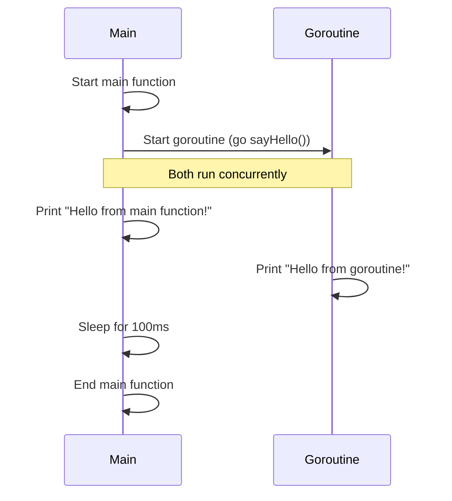

# Go Goroutines

Goroutines are one of Go's most powerful and distinctive features. They form the foundation of Go's concurrency model, allowing you to run multiple functions concurrently in a simple, efficient way.

## What are Goroutines?

A goroutine is a lightweight thread of execution managed by the Go runtime. Think of goroutines as very small threads that are much more efficient than operating system threads.

Unlike traditional threads that might require megabytes of memory, goroutines start with just a few kilobytes of stack space, which can grow and shrink as needed. This allows you to create thousands or even millions of goroutines without overwhelming your system's resources.

## Why Use Goroutines?

- **Concurrency**: Execute multiple tasks simultaneously
- **Simplicity**: Much easier to use than traditional threads
- **Efficiency**: Lightweight and require minimal resources
- **Scalability**: Create thousands of concurrent operations with minimal overhead

## Basic Syntax

Starting a goroutine is remarkably simple. Just add the `go` keyword before a function call:

```go
func main() {
    // Regular function call - runs synchronously
    normalFunction()
    
    // Goroutine - runs concurrently
    go concurrentFunction()
    
    // Program continues here without waiting for concurrentFunction to finish
}
```

## Your First Goroutine

Let's see a complete example:

```go
package main

import (
    "fmt"
    "time"
)

func sayHello() {
    fmt.Println("Hello from goroutine!")
}

func main() {
    // Start a goroutine
    go sayHello()
    
    // Main function continues immediately without waiting
    fmt.Println("Hello from main function!")
    
    // Sleep to give the goroutine time to execute
    // (We'll discuss better synchronization methods later)
    time.Sleep(100 * time.Millisecond)
}
```

Output:
```
Hello from main function!
Hello from goroutine!
```

Notice that "Hello from main function!" appears first. This happens because the main function continues executing while the goroutine runs concurrently.

Sometimes you might see the goroutine's output first, or you might not see it at all if the main function finishes too quickly. This non-deterministic behavior is characteristic of concurrent programming.

## Understanding Goroutine Execution

Let's visualize how goroutines work:



The main function and goroutine run concurrently, but there's no guarantee about which will finish first or in what order they'll execute.

## Multiple Goroutines

You can start multiple goroutines to perform different tasks concurrently:

```go
package main

import (
    "fmt"
    "time"
)

func count(name string, count int) {
    for i := 1; i <= count; i++ {
        fmt.Printf("%s: %d
", name, i)
        time.Sleep(100 * time.Millisecond)
    }
}

func main() {
    go count("goroutine-1", 3)
    go count("goroutine-2", 3)
    
    // Count in the main function too
    count("main", 3)
    
    // Since we're counting in main, we don't need an additional sleep
}
```

Output (may vary):
```
main: 1
goroutine-1: 1
goroutine-2: 1
main: 2
goroutine-2: 2
goroutine-1: 2
main: 3
goroutine-1: 3
goroutine-2: 3
```

## Anonymous Goroutines

You can also create anonymous functions and run them as goroutines:

```go
package main

import (
    "fmt"
    "time"
)

func main() {
    // Anonymous function as a goroutine
    go func() {
        fmt.Println("Hello from anonymous goroutine!")
    }()
    
    // Anonymous function with arguments
    go func(message string) {
        fmt.Println(message)
    }("Hello with arguments!")
    
    // Give the goroutines time to execute
    time.Sleep(100 * time.Millisecond)
}
```

Output:
```
Hello from anonymous goroutine!
Hello with arguments!
```

## Common Goroutine Patterns

### Loop with Goroutines

A common pattern is to start goroutines in a loop:

```go
package main

import (
    "fmt"
    "time"
)

func worker(id int) {
    fmt.Printf("Worker %d starting
", id)
    time.Sleep(time.Second)
    fmt.Printf("Worker %d done
", id)
}

func main() {
    // Start 3 workers
    for i := 1; i <= 3; i++ {
        go worker(i)
    }
    
    // Wait for all to complete
    time.Sleep(2 * time.Second)
}
```

Output:
```
Worker 1 starting
Worker 2 starting
Worker 3 starting
Worker 1 done
Worker 2 done
Worker 3 done
```

### Variable Capture in Goroutines

Be careful with variables in loops when starting goroutines. This is a common mistake:

```go
package main

import (
    "fmt"
    "time"
)

func main() {
    // INCORRECT: All goroutines will likely print the same number
    for i := 1; i <= 3; i++ {
        go func() {
            fmt.Println("Incorrect value:", i)
        }()
    }
    
    // CORRECT: Pass the variable as an argument
    for i := 1; i <= 3; i++ {
        go func(num int) {
            fmt.Println("Correct value:", num)
        }(i)
    }
    
    time.Sleep(time.Second)
}
```

Likely output:
```
Incorrect value: 4
Incorrect value: 4
Incorrect value: 4
Correct value: 1
Correct value: 2
Correct value: 3
```

The "incorrect" version captures the variable `i` from the loop, which changes before the goroutines run. By the time they execute, `i` might be 4 (loop end value). The "correct" version passes the current value of `i` as an argument.

## Practical Example: Web Scraper

Let's build a simple concurrent web scraper that fetches multiple URLs at once:

```go
package main

import (
    "fmt"
    "io"
    "net/http"
    "time"
)

func fetchURL(url string) {
    start := time.Now()
    resp, err := http.Get(url)
    if err != nil {
        fmt.Printf("Error fetching %s: %v
", url, err)
        return
    }
    defer resp.Body.Close()
    
    body, err := io.ReadAll(resp.Body)
    if err != nil {
        fmt.Printf("Error reading body from %s: %v
", url, err)
        return
    }
    
    elapsed := time.Since(start)
    fmt.Printf("Fetched %s: %d bytes in %v
", url, len(body), elapsed)
}

func main() {
    urls := []string{
        "https://golang.org",
        "https://google.com",
        "https://github.com",
    }
    
    // Sequential fetching
    start := time.Now()
    fmt.Println("Sequential fetching:")
    for _, url := range urls {
        fetchURL(url)
    }
    fmt.Printf("Sequential fetching took: %v

", time.Since(start))
    
    // Concurrent fetching with goroutines
    start = time.Now()
    fmt.Println("Concurrent fetching:")
    for _, url := range urls {
        go fetchURL(url)
    }
    
    // Wait for goroutines to finish (not the best way, we'll improve this later)
    time.Sleep(5 * time.Second)
    fmt.Printf("Concurrent fetching took: %v
", time.Since(start))
}
```

Example output:
```
Sequential fetching:
Fetched https://golang.org: 12345 bytes in 345.6ms
Fetched https://google.com: 45678 bytes in 234.5ms
Fetched https://github.com: 78901 bytes in 456.7ms
Sequential fetching took: 1.036s

Concurrent fetching:
Fetched https://google.com: 45678 bytes in 234.5ms
Fetched https://golang.org: 12345 bytes in 345.6ms
Fetched https://github.com: 78901 bytes in 456.7ms
Concurrent fetching took: 5.000s
```

Notice that with concurrent fetching:
1. The URLs are fetched in parallel, not in sequence
2. The total time is much lower (though in this example, we wait the full 5 seconds)
3. The order of completion may vary

## Common Gotchas and Best Practices

### 1. Goroutines and Program Termination

A Go program exits when the main function returns, even if goroutines are still running. They will be terminated abruptly!

```go
package main

import (
    "fmt"
    "time"
)

func main() {
    go func() {
        // This may never complete
        for i := 1; i <= 5; i++ {
            fmt.Println(i)
            time.Sleep(100 * time.Millisecond)
        }
    }()
    
    // Main function exits after 250ms
    time.Sleep(250 * time.Millisecond)
    fmt.Println("Main function exiting")
    // Program ends here, goroutine is terminated
}
```

Output:
```
1
2
Main function exiting
```

The goroutine only prints 1 and 2 before the main function exits, terminating the program.

### 2. Avoiding time.Sleep for Synchronization

Using `time.Sleep()` for synchronization is not reliable. In the next tutorial, we'll explore channels and `sync.WaitGroup` for proper coordination.

### 3. Limiting the Number of Goroutines

While goroutines are lightweight, creating too many can still exhaust system resources. For tasks like processing large datasets, consider using worker pools to limit the number of concurrent goroutines.

### 4. Debugging Goroutines

Concurrent code can be difficult to debug. Go provides tools to help:

- `GOMAXPROCS` environment variable controls the maximum number of operating system threads that can execute Go code simultaneously
- `go tool trace` for execution tracing
- Race detector with `go run -race` or `go build -race`

## Summary

Goroutines are a fundamental building block of Go's concurrency model:

- They are lightweight threads managed by the Go runtime
- They're started with the `go` keyword
- They run concurrently with the rest of the program
- They make concurrent programming simple and efficient
- They provide a foundation for Go's powerful concurrency patterns

In the next tutorial, we'll explore channels, which allow goroutines to communicate and synchronize with each other.

## Exercises

1. Write a program that starts 10 goroutines, each printing their ID (1-10) after sleeping for a random duration between 100ms and 1s.

2. Implement a concurrent file reader that reads multiple text files simultaneously using goroutines and prints their contents.

3. Modify the web scraper example to handle more URLs and add error handling for timeouts.

4. Try creating a program with nested goroutines (goroutines that start other goroutines) and observe the behavior.

## Additional Resources

- [Go Tour: Concurrency](https://tour.golang.org/concurrency/1)
- [Effective Go: Concurrency](https://golang.org/doc/effective_go#concurrency)
- [Go by Example: Goroutines](https://gobyexample.com/goroutines)
- Book: "Concurrency in Go" by Katherine Cox-Buday