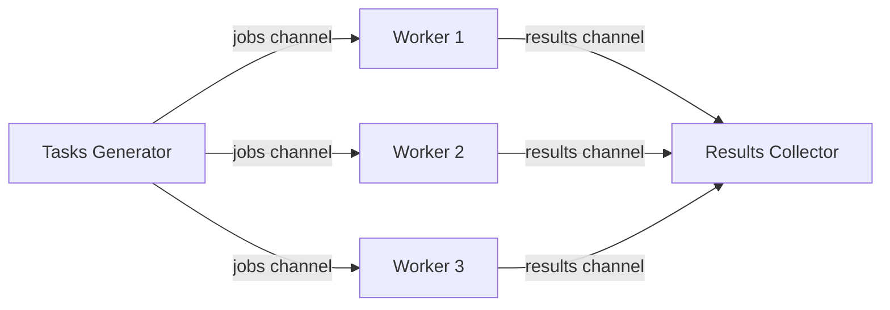

# Go Channels

## Introduction

In Go's concurrency model, **channels** are a fundamental concept that allow goroutines to communicate with each other and synchronize their execution. Think of channels as pipes that connect concurrent goroutines, allowing them to send and receive values with proper synchronization.

Channels solve a common problem in concurrent programming: safely sharing data between multiple threads of execution. Instead of sharing memory and using locks, Go encourages **communicating by sharing channels**.

> "Don't communicate by sharing memory; share memory by communicating." - Go proverb

## What Are Channels?

Channels in Go are typed conduits that allow you to send and receive values between goroutines. They act as both communication and synchronization mechanisms, ensuring that data is safely passed between concurrent parts of your program.

### Channel Creation

You create a channel using the built-in `make` function:

```go
// Create an unbuffered channel of integers
ch := make(chan int)

// Create a buffered channel of strings with capacity 10
bufferedCh := make(chan string, 10)
```

## Types of Channels

Go provides two types of channels:

1. **Unbuffered channels**: Send operations block until there's a corresponding receive.
2. **Buffered channels**: Have a capacity and only block when the buffer is full.

Let's explore both types with examples.

## Unbuffered Channels

An unbuffered channel requires both the sender and receiver to be ready at the same time for the communication to take place. This creates a perfect synchronization point between goroutines.

```go
package main

import (
    "fmt"
    "time"
)

func main() {
    // Create an unbuffered channel
    ch := make(chan string)

    // Start a goroutine that sends a message
    go func() {
        fmt.Println("Goroutine: Sending message...")
        time.Sleep(2 * time.Second) // Simulate work
        ch <- "Hello from goroutine!" // This blocks until main goroutine receives
        fmt.Println("Goroutine: Message sent!")
    }()

    fmt.Println("Main: Waiting for message...")
    msg := <-ch // This blocks until the goroutine sends
    fmt.Println("Main: Received message:", msg)
}
```

**Output:**
```
Main: Waiting for message...
Goroutine: Sending message...
Goroutine: Message sent!
Main: Received message: Hello from goroutine!
```

In this example, the main goroutine and the anonymous goroutine synchronize perfectly - the send operation (`ch <- "Hello from goroutine!"`) blocks until the receive operation (`msg := <-ch`) is ready.

## Buffered Channels

Buffered channels have a capacity defined when they're created. Sends to a buffered channel only block when the buffer is full, and receives only block when the buffer is empty.

```go
package main

import (
    "fmt"
    "time"
)

func main() {
    // Create a buffered channel with capacity 2
    ch := make(chan string, 2)
    
    // Send 2 messages immediately (won't block because buffer has space)
    ch <- "First message"
    ch <- "Second message"
    
    fmt.Println("Sent two messages without blocking")
    
    // This would block until space is available
    // Uncomment to see blocking behavior:
    // ch <- "Third message"
    // fmt.Println("This line won't be reached until someone receives a message")
    
    // Receive messages
    fmt.Println("Received:", <-ch)
    fmt.Println("Received:", <-ch)
}
```

**Output:**
```
Sent two messages without blocking
Received: First message
Received: Second message
```

Buffered channels are useful when:
- You know the exact number of goroutines you've launched
- You need to limit the amount of work that's queued up
- The sender and receiver work at different speeds

## Channel Direction

Channels can be defined with a direction, restricting them to either sending or receiving operations. This is useful when passing channels to functions.

```go
package main

import "fmt"

// This function can only receive from the channel
func receiver(ch <-chan string) {
    msg := <-ch
    fmt.Println("Received:", msg)
}

// This function can only send to the channel
func sender(ch chan<- string) {
    ch <- "Hello, channel!"
}

func main() {
    ch := make(chan string)
    
    go sender(ch)
    receiver(ch)
}
```

**Output:**
```
Received: Hello, channel!
```

## Closing Channels

When you're done sending values on a channel, you can close it to indicate no more values will be sent. Receivers can test whether a channel has been closed.

```go
package main

import "fmt"

func main() {
    jobs := make(chan int, 5)
    done := make(chan bool)

    // Consumer goroutine
    go func() {
        for {
            j, more := <-jobs
            if more {
                fmt.Println("Received job", j)
            } else {
                fmt.Println("All jobs received")
                done <- true
                return
            }
        }
    }()

    // Send 3 jobs
    for j := 1; j <= 3; j++ {
        jobs <- j
        fmt.Println("Sent job", j)
    }
    close(jobs)
    fmt.Println("Sent all jobs")

    // Wait for all jobs to be processed
    <-done
}
```

**Output:**
```
Sent job 1
Sent job 2
Sent job 3
Sent all jobs
Received job 1
Received job 2
Received job 3
All jobs received
```

## Ranging Over Channels

A cleaner way to receive values from a channel until it's closed is to use a `for range` loop:

```go
package main

import "fmt"

func main() {
    ch := make(chan int, 3)
    
    // Send values
    ch <- 1
    ch <- 2
    ch <- 3
    close(ch)
    
    // Receive values using range
    for num := range ch {
        fmt.Println("Received:", num)
    }
}
```

**Output:**
```
Received: 1
Received: 2
Received: 3
```

## Select Statement

The `select` statement lets a goroutine wait on multiple channel operations. It's similar to a `switch` statement but for channels.

```go
package main

import (
    "fmt"
    "time"
)

func main() {
    ch1 := make(chan string)
    ch2 := make(chan string)

    // Send on ch1 after 1 second
    go func() {
        time.Sleep(1 * time.Second)
        ch1 <- "Message from channel 1"
    }()

    // Send on ch2 after 2 seconds
    go func() {
        time.Sleep(2 * time.Second)
        ch2 <- "Message from channel 2"
    }()

    // Use select to await both channels
    for i := 0; i < 2; i++ {
        select {
        case msg1 := <-ch1:
            fmt.Println("Received:", msg1)
        case msg2 := <-ch2:
            fmt.Println("Received:", msg2)
        }
    }
}
```

**Output:**
```
Received: Message from channel 1
Received: Message from channel 2
```

The `select` statement blocks until one of its cases can run, then it executes that case. If multiple cases are ready, it chooses one at random.

## Timeouts with Select

You can implement timeouts using the `select` statement and `time.After`:

```go
package main

import (
    "fmt"
    "time"
)

func main() {
    ch := make(chan string)
    
    go func() {
        time.Sleep(2 * time.Second)
        ch <- "Response after 2 seconds"
    }()
    
    select {
    case response := <-ch:
        fmt.Println(response)
    case <-time.After(1 * time.Second):
        fmt.Println("Timeout: operation took too long")
    }
}
```

**Output:**
```
Timeout: operation took too long
```

## Practical Example: Worker Pool

Let's create a worker pool pattern using goroutines and channels, which is a common concurrency pattern in Go:

