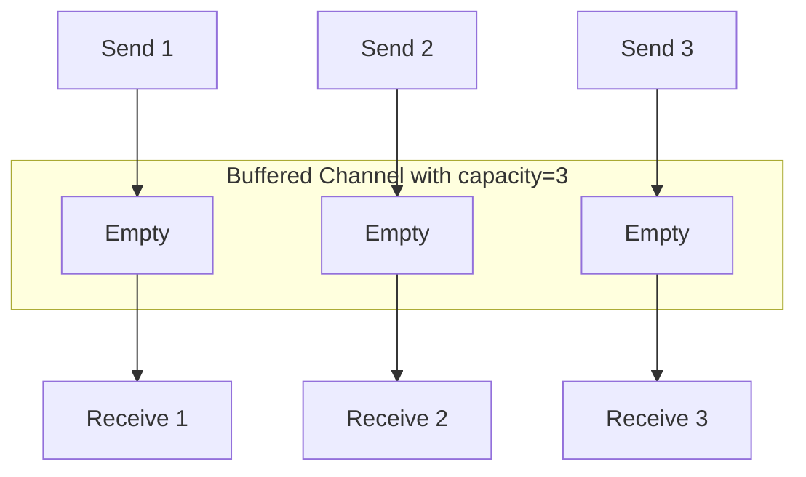

# Go Buffered Channels

## Introduction

In Go's concurrency model, channels are the primary mechanism for communication between goroutines. While regular (unbuffered) channels provide synchronous communication, **buffered channels** add capacity to temporarily store values, allowing for more flexible communication patterns.

Buffered channels act like small queues that can hold a predefined number of values before blocking. This feature makes them an essential tool for managing concurrent operations, controlling flow, and developing efficient concurrent applications.

## Basic Concept of Buffered Channels

A buffered channel in Go has a capacity defined when it's created. This capacity determines how many values can be sent into the channel without a corresponding receive operation.

### Unbuffered vs. Buffered Channels

To understand buffered channels better, let's first compare them with unbuffered channels:

| Unbuffered Channels                         | Buffered Channels                          |
|---------------------------------------------|--------------------------------------------|
| No capacity (capacity = 0)                  | Defined capacity (capacity > 0)            |
| Sending blocks until someone receives       | Sending blocks only when buffer is full    |
| Receiving blocks until someone sends        | Receiving blocks only when buffer is empty |
| Provides synchronization between goroutines | Provides decoupling between goroutines     |

## Creating Buffered Channels

Here's how to create a buffered channel in Go:

```go
// Create a buffered channel with a capacity of 3
ch := make(chan int, 3)
```

The second parameter to the `make` function specifies the channel's buffer size.

## Working with Buffered Channels

Let's explore how buffered channels work with a simple example:

```go
package main

import (
    "fmt"
    "time"
)

func main() {
    // Create a buffered channel with capacity 3
    ch := make(chan int, 3)
    
    // Send values to the channel (won't block until buffer is full)
    ch <- 1
    fmt.Println("Sent 1 to channel")
    ch <- 2
    fmt.Println("Sent 2 to channel")
    ch <- 3
    fmt.Println("Sent 3 to channel")
    
    // Receiving values from the channel
    fmt.Println("Received:", <-ch) // 1
    fmt.Println("Received:", <-ch) // 2
    fmt.Println("Received:", <-ch) // 3
}
```

Output:
```
Sent 1 to channel
Sent 2 to channel
Sent 3 to channel
Received: 1
Received: 2
Received: 3
```

In this example, we can send three values to the channel without blocking, since the buffer has a capacity of 3.

## Buffer Behavior and Blocking

Let's see what happens when we try to send more than the buffer capacity:

```go
package main

import (
    "fmt"
    "time"
)

func main() {
    ch := make(chan int, 2)
    
    ch <- 1
    fmt.Println("Sent 1")
    ch <- 2
    fmt.Println("Sent 2")
    
    go func() {
        // This will allow the next send to proceed
        time.Sleep(time.Second)
        fmt.Println("Goroutine receiving:", <-ch)
    }()
    
    fmt.Println("About to send 3 - this will block until space is available")
    ch <- 3 // This will block until there's space in the buffer
    fmt.Println("Sent 3")
    
    // Allow time for goroutine to finish
    time.Sleep(2 * time.Second)
}
```

Output:
```
Sent 1
Sent 2
About to send 3 - this will block until space is available
Goroutine receiving: 1
Sent 3
```

This example demonstrates that when the buffer is full (after sending 1 and 2), any further send operation blocks until space becomes available (which happens when the goroutine receives a value).

## Channel Capacity and Length

Go provides two useful functions to work with buffered channels:

- `cap(ch)`: Returns the buffer capacity
- `len(ch)`: Returns the current number of elements in the buffer

Here's how to use them:

```go
package main

import "fmt"

func main() {
    ch := make(chan int, 5)
    
    ch <- 10
    ch <- 20
    
    fmt.Printf("Channel capacity: %d
", cap(ch))
    fmt.Printf("Channel length: %d
", len(ch))
    
    <-ch // Remove one element
    
    fmt.Printf("Channel length after removal: %d
", len(ch))
}
```

Output:
```
Channel capacity: 5
Channel length: 2
Channel length after removal: 1
```

## Visual Representation

Let's visualize how a buffered channel works using a diagram:



As values are sent, they fill the buffer from left to right. As they're received, they're removed from the left side (FIFO - First In, First Out).

## Practical Applications

### 1. Flow Control (Rate Limiting)

Buffered channels can be used to control the rate of operations, like limiting the number of concurrent API requests:

```go
package main

import (
    "fmt"
    "time"
)

func worker(id int, jobs <-chan int, results chan<- int) {
    for j := range jobs {
        fmt.Printf("Worker %d started job %d
", id, j)
        time.Sleep(time.Second) // Simulate work
        fmt.Printf("Worker %d finished job %d
", id, j)
        results <- j * 2
    }
}

func main() {
    const numJobs = 5
    const numWorkers = 3
    
    // Create buffered channels
    jobs := make(chan int, numJobs)
    results := make(chan int, numJobs)
    
    // Start workers
    for w := 1; w <= numWorkers; w++ {
        go worker(w, jobs, results)
    }
    
    // Send jobs
    for j := 1; j <= numJobs; j++ {
        jobs <- j
    }
    close(jobs)
    
    // Collect results
    for a := 1; a <= numJobs; a++ {
        <-results
    }
}
```

In this example, the buffered channels allow us to:
- Queue up to 5 jobs for processing
- Allow 3 workers to process jobs concurrently
- Collect results as they complete

### 2. Batch Processing

Buffered channels can be used to process data in batches:

```go
package main

import "fmt"

func processBatch(batch []int, results chan<- int) {
    sum := 0
    for _, num := range batch {
        sum += num
    }
    results <- sum
}

func main() {
    data := []int{1, 2, 3, 4, 5, 6, 7, 8, 9, 10, 11, 12, 13, 14, 15}
    batchSize := 5
    numBatches := (len(data) + batchSize - 1) / batchSize
    
    results := make(chan int, numBatches)
    
    // Process data in batches
    for i := 0; i < len(data); i += batchSize {
        end := i + batchSize
        if end > len(data) {
            end = len(data)
        }
        
        batch := data[i:end]
        go processBatch(batch, results)
    }
    
    // Collect batch results
    totalSum := 0
    for i := 0; i < numBatches; i++ {
        batchSum := <-results
        fmt.Printf("Batch sum: %d
", batchSum)
        totalSum += batchSum
    }
    
    fmt.Printf("Total sum: %d
", totalSum)
}
```

This example demonstrates batch processing where:
- Data is divided into batches of size 5
- Each batch is processed concurrently
- Results are collected via a buffered channel

## Best Practices and Considerations

### 1. Choosing the Right Buffer Size

The appropriate buffer size depends on your specific use case:

- Too small: May cause unnecessary blocking
- Too large: May consume excessive memory
- Just right: Provides enough capacity to handle normal workload variations

### 2. Avoiding Deadlocks

Buffered channels aren't immune to deadlocks. Common deadlock scenarios include:

- Buffer full, all goroutines trying to send
- Buffer empty, all goroutines trying to receive
- Circular dependencies between channels

### 3. Closing Buffered Channels

Closing a buffered channel is similar to closing an unbuffered channel:

```go
ch := make(chan int, 3)
ch <- 1
ch <- 2
close(ch)

// Can still receive values after closing
fmt.Println(<-ch) // 1
fmt.Println(<-ch) // 2
fmt.Println(<-ch) // 0 (zero value)
```

After a channel is closed:
- All buffered values can still be received
- Further receive operations return the zero value of the channel type
- The second return value from a receive operation indicates whether the value came from a sender (`true`) or a closed channel (`false`):

```go
value, ok := <-ch
if !ok {
    fmt.Println("Channel is closed and empty")
}
```

## Common Mistakes

### 1. Forgetting to Close Channels

```go
func producer(ch chan<- int) {
    for i := 0; i < 5; i++ {
        ch <- i
    }
    // Forgot to close(ch)
}

func main() {
    ch := make(chan int, 5)
    go producer(ch)
    
    // Iterating with range will deadlock if channel isn't closed
    for v := range ch {
        fmt.Println(v)
    }
}
```

### 2. Sending to a Full Buffer in the Same Goroutine

```go
func main() {
    ch := make(chan int, 2)
    
    ch <- 1
    ch <- 2
    
    // This will deadlock - buffer is full and no other goroutine to receive
    ch <- 3
    
    fmt.Println(<-ch)
}
```

## Summary

Buffered channels in Go provide a powerful mechanism for asynchronous communication between goroutines. They offer:

- **Temporary storage** for sent values
- **Decoupling** between sending and receiving operations
- **Flow control** for managing concurrent operations
- **Flexibility** in designing concurrent algorithms

By understanding how buffered channels work and when to use them, you can write more efficient, flexible, and robust concurrent Go programs.

## Exercises

1. **Basic Buffer**: Create a buffered channel with capacity 5. Send 5 integers to it, then receive and print them.

2. **Worker Pool**: Implement a worker pool that processes a set of tasks concurrently, with a configurable number of workers and a buffered channel for tasks.

3. **Batch Processor**: Create a program that reads data from a large slice, processes it in batches using goroutines, and combines the results.

4. **Rate Limiter**: Implement a simple rate limiter using a buffered channel that allows only N operations per second.

5. **Channel Pipeline**: Build a pipeline of processing stages connected by buffered channels, where each stage performs a transformation on the data.

## Additional Resources

- [Go Tour: Buffered Channels](https://tour.golang.org/concurrency/3)
- [Effective Go: Channels](https://golang.org/doc/effective_go.html#channels)
- [Go by Example: Buffered Channels](https://gobyexample.com/channel-buffering)
- [The Go Blog: Go Concurrency Patterns](https://blog.golang.org/pipelines)
- Book: "Concurrency in Go" by Katherine Cox-Buday