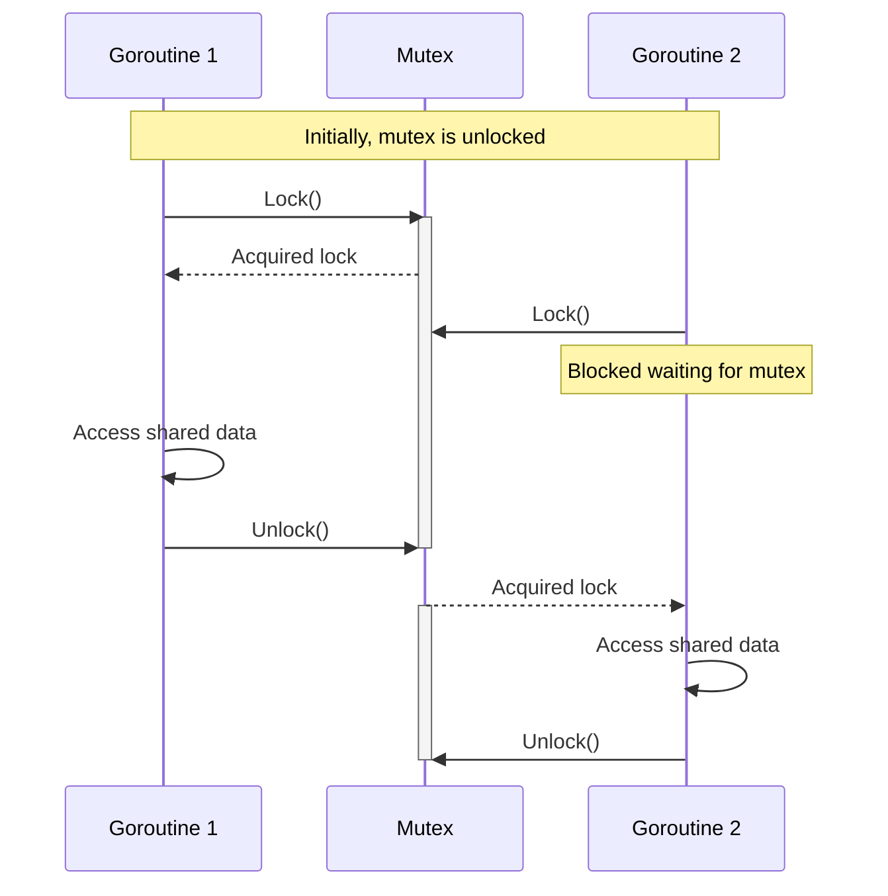

# Go Mutexes

## Introduction

When working with concurrent programs in Go, multiple goroutines often need to access and modify the same data. Without proper synchronization, this can lead to race conditions - unpredictable behavior that occurs when the timing or ordering of events affects a program's correctness.

**Mutexes** (short for "mutual exclusion") are one of Go's fundamental synchronization mechanisms that help prevent race conditions by ensuring that only one goroutine can access a shared resource at a time.

In this article, you'll learn:
- What mutexes are and why they're necessary
- How to implement basic and read-write mutexes in Go
- Common patterns and best practices
- Real-world examples of mutex usage

## Understanding the Problem: Race Conditions

Before diving into mutexes, let's understand the problem they solve. Consider this simple counter program:

```go
package main

import (
    "fmt"
    "sync"
)

func main() {
    counter := 0
    var wg sync.WaitGroup
    
    // Launch 1000 goroutines that each increment the counter
    for i := 0; i < 1000; i++ {
        wg.Add(1)
        go func() {
            counter++ // This is not safe!
            wg.Done()
        }()
    }
    
    wg.Wait()
    fmt.Println("Final counter value:", counter)
}
```

**Output:**
```
Final counter value: 952
```

Wait, that's not right! We launched 1000 goroutines to increment the counter, so the final value should be 1000. What happened?

The problem is that `counter++` is not an atomic operation. It actually consists of three steps:
1. Read the current value of counter
2. Increment the value by 1
3. Write the new value back to counter

When multiple goroutines execute these steps concurrently, they can interfere with each other, leading to lost updates. This is a classic race condition.

## Introducing Mutex

Go's standard library provides the `sync.Mutex` type to address this problem. A mutex provides two main operations:
- `Lock()`: Acquires the lock, blocking if necessary until the lock is available
- `Unlock()`: Releases the lock, allowing other goroutines to acquire it

Let's fix our counter example using a mutex:

```go
package main

import (
    "fmt"
    "sync"
)

func main() {
    counter := 0
    var mu sync.Mutex // Declare a mutex
    var wg sync.WaitGroup
    
    // Launch 1000 goroutines that each increment the counter
    for i := 0; i < 1000; i++ {
        wg.Add(1)
        go func() {
            mu.Lock()   // Acquire the lock
            counter++   // Safely increment the counter
            mu.Unlock() // Release the lock
            wg.Done()
        }()
    }
    
    wg.Wait()
    fmt.Println("Final counter value:", counter)
}
```

**Output:**
```
Final counter value: 1000
```

Now we get the expected result! The mutex ensures that only one goroutine can execute the critical section (`counter++`) at a time, preventing race conditions.

## Mutex Best Practices

Here are some important best practices when using mutexes:

### 1. Always unlock after locking

Failing to unlock a mutex will cause your program to deadlock. A common pattern is to use `defer` to ensure the mutex is always unlocked:

```go
func safeIncrement(counter *int, mu *sync.Mutex) {
    mu.Lock()
    defer mu.Unlock() // Will be executed when the function returns
    *counter++
}
```

### 2. Keep critical sections small

The longer a goroutine holds a lock, the longer other goroutines must wait. Keep your critical sections (the code between `Lock()` and `Unlock()`) as small as possible.

### 3. Be aware of nested locks

Be careful when acquiring multiple locks to avoid deadlocks. If you need multiple locks, always acquire them in the same order throughout your code.

## Read-Write Mutex (RWMutex)

Go also provides a read-write mutex (`sync.RWMutex`) which allows multiple readers or a single writer to access the resource:

- Multiple goroutines can acquire a read lock simultaneously (`RLock()` and `RUnlock()`)
- Only one goroutine can acquire a write lock (`Lock()` and `Unlock()`), and no readers can hold the lock while a writer has it

This is useful when you have data that is read frequently but written to infrequently.

```go
package main

import (
    "fmt"
    "sync"
    "time"
)

func main() {
    var counter int
    var rwMu sync.RWMutex
    var wg sync.WaitGroup
    
    // Writer goroutine
    wg.Add(1)
    go func() {
        for i := 0; i < 5; i++ {
            rwMu.Lock() // Exclusive lock
            counter++
            fmt.Printf("Writer: incremented counter to %d
", counter)
            rwMu.Unlock()
            time.Sleep(100 * time.Millisecond)
        }
        wg.Done()
    }()
    
    // Multiple reader goroutines
    for i := 0; i < 3; i++ {
        wg.Add(1)
        readerID := i
        go func() {
            for j := 0; j < 10; j++ {
                rwMu.RLock() // Shared read lock
                fmt.Printf("Reader %d: counter = %d
", readerID, counter)
                rwMu.RUnlock()
                time.Sleep(50 * time.Millisecond)
            }
            wg.Done()
        }()
    }
    
    wg.Wait()
}
```

**Output (abbreviated):**
```
Reader 0: counter = 0
Reader 1: counter = 0
Reader 2: counter = 0
Writer: incremented counter to 1
Reader 0: counter = 1
Reader 1: counter = 1
Reader 2: counter = 1
Writer: incremented counter to 2
...
```

In this example, multiple reader goroutines can access the counter simultaneously, but when the writer needs to modify it, it gets exclusive access.

## Visualizing Mutex Operation

