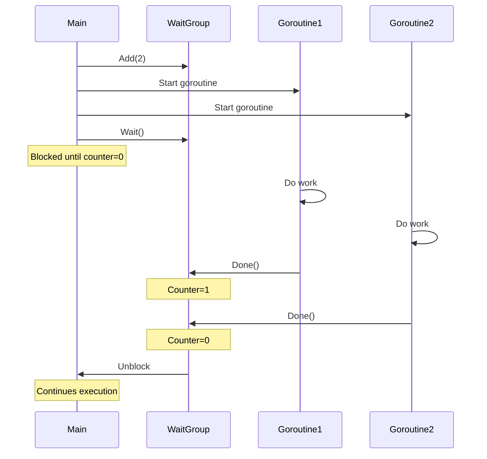

# Go WaitGroups

## Introduction

When working with concurrent programming in Go, one common challenge is knowing when all your concurrent tasks have completed. This is where `sync.WaitGroup` comes in - a powerful synchronization primitive that allows you to wait for a collection of goroutines to finish before proceeding.

A WaitGroup acts like a counter that tracks how many goroutines are still running. It provides three main methods:
- `Add()` - Increases the counter
- `Done()` - Decreases the counter
- `Wait()` - Blocks until the counter reaches zero

In this tutorial, we'll learn how to use WaitGroups to coordinate goroutines effectively, a fundamental skill for mastering Go concurrency.

## Basic WaitGroup Usage

Let's start with a simple example that demonstrates the core functionality of WaitGroups:

```go
package main

import (
    "fmt"
    "sync"
    "time"
)

func main() {
    var wg sync.WaitGroup
    
    // Launch 3 worker goroutines
    for i := 1; i <= 3; i++ {
        // Increment the WaitGroup counter
        wg.Add(1)
        
        // Launch a worker goroutine
        go worker(i, &wg)
    }
    
    // Wait for all worker goroutines to finish
    wg.Wait()
    
    fmt.Println("All workers have completed their tasks")
}

func worker(id int, wg *sync.WaitGroup) {
    // Ensure we call Done when the function returns
    defer wg.Done()
    
    fmt.Printf("Worker %d starting
", id)
    
    // Simulate work with a sleep
    time.Sleep(time.Second * time.Duration(id))
    
    fmt.Printf("Worker %d finished
", id)
}
```

**Output:**
```
Worker 2 starting
Worker 1 starting
Worker 3 starting
Worker 1 finished
Worker 2 finished
Worker 3 finished
All workers have completed their tasks
```

### How This Works:

1. We create a WaitGroup `wg` in the `main` function.
2. For each worker we want to launch, we call `wg.Add(1)` to increment the counter.
3. We pass the WaitGroup pointer to each worker goroutine.
4. Inside each worker, we call `wg.Done()` when the work is complete (using `defer` ensures this happens even if the function panics).
5. In the main function, `wg.Wait()` blocks until all goroutines have called `Done()` and the counter reaches zero.

## Common Patterns and Best Practices

### Pre-Add Pattern

When you know the number of goroutines in advance, you can call `Add()` once with the total count:

```go
package main

import (
    "fmt"
    "sync"
)

func main() {
    var wg sync.WaitGroup
    
    // Add the total number of goroutines at once
    wg.Add(3)
    
    for i := 1; i <= 3; i++ {
        go func(id int) {
            defer wg.Done()
            fmt.Printf("Task %d completed
", id)
        }(i)
    }
    
    wg.Wait()
    fmt.Println("All tasks completed")
}
```

### Important WaitGroup Rules

1. **Never make the counter negative**: Calling `Done()` more times than `Add()` will cause a panic.
2. **Pass WaitGroups by pointer**: Always pass WaitGroups by pointer to avoid copying.
3. **Call Add before starting goroutines**: This prevents race conditions where `Wait()` might return before all goroutines have started.

## Real-World Example: Concurrent Web Scraper

Here's a practical example that uses WaitGroups to implement a simple concurrent web scraper:

```go
package main

import (
    "fmt"
    "net/http"
    "sync"
    "time"
)

func main() {
    // List of websites to fetch
    websites := []string{
        "https://golang.org",
        "https://google.com",
        "https://github.com",
        "https://stackoverflow.com",
    }
    
    var wg sync.WaitGroup
    
    // Add the count of websites
    wg.Add(len(websites))
    
    // Record start time
    startTime := time.Now()
    
    // Launch a goroutine for each website
    for _, site := range websites {
        go fetchSite(site, &wg)
    }
    
    // Wait for all goroutines to complete
    wg.Wait()
    
    // Calculate total time
    elapsed := time.Since(startTime)
    fmt.Printf("Fetched %d websites in %v
", len(websites), elapsed)
}

func fetchSite(url string, wg *sync.WaitGroup) {
    // Ensure we mark this goroutine as done when the function returns
    defer wg.Done()
    
    // Make the HTTP request
    start := time.Now()
    resp, err := http.Get(url)
    
    if err != nil {
        fmt.Printf("Error fetching %s: %v
", url, err)
        return
    }
    defer resp.Body.Close()
    
    // Report result
    elapsed := time.Since(start)
    fmt.Printf("Fetched %s - Status: %d - %v
", url, resp.StatusCode, elapsed)
}
```

**Sample Output:**
```
Fetched https://github.com - Status: 200 - 245.123ms
Fetched https://golang.org - Status: 200 - 312.876ms
Fetched https://google.com - Status: 200 - 201.543ms
Fetched https://stackoverflow.com - Status: 200 - 456.321ms
Fetched 4 websites in 456.789ms
```

In this example, we're fetching multiple websites concurrently using goroutines and a WaitGroup to synchronize them. Notice how the total time is approximately equal to the time taken by the slowest website fetch, not the sum of all fetch times.

## Advanced WaitGroup Patterns

### Cancellation with Context

We can combine WaitGroups with Go's context package for more advanced control:

```go
package main

import (
    "context"
    "fmt"
    "sync"
    "time"
)

func main() {
    var wg sync.WaitGroup
    
    // Create a context with cancellation
    ctx, cancel := context.WithTimeout(context.Background(), 2*time.Second)
    defer cancel()
    
    // Launch 5 workers
    for i := 1; i <= 5; i++ {
        wg.Add(1)
        go workerWithContext(ctx, i, &wg)
    }
    
    // Wait for all workers to finish
    wg.Wait()
    fmt.Println("All done")
}

func workerWithContext(ctx context.Context, id int, wg *sync.WaitGroup) {
    defer wg.Done()
    
    // Create a ticker for this worker's updates
    ticker := time.NewTicker(500 * time.Millisecond)
    defer ticker.Stop()
    
    fmt.Printf("Worker %d starting
", id)
    
    // Simulate a worker that runs for a variable amount of time
    workTime := time.Duration(id) * time.Second
    
    select {
    case <-time.After(workTime):
        fmt.Printf("Worker %d completed normally
", id)
    case <-ctx.Done():
        fmt.Printf("Worker %d cancelled: %v
", id, ctx.Err())
    }
}
```

**Output:**
```
Worker 1 starting
Worker 2 starting
Worker 3 starting
Worker 4 starting
Worker 5 starting
Worker 1 completed normally
Worker 2 completed normally
Worker 3 cancelled: context deadline exceeded
Worker 4 cancelled: context deadline exceeded
Worker 5 cancelled: context deadline exceeded
All done
```

This example shows a more sophisticated pattern where we use both a WaitGroup for synchronization and a context for cancellation.

## Visualizing WaitGroups

Let's visualize how WaitGroups work with a simple diagram:



## Common Mistakes to Avoid

### 1. Forgetting to call Done()

If you forget to call `Done()` for a goroutine, `Wait()` will block forever. Using `defer wg.Done()` at the beginning of your goroutine functions helps avoid this problem.

### 2. Negative WaitGroup counter

Calling `Done()` more times than `Add()` will cause a panic. Always ensure they balance out.

```go
// This will panic
func badExample() {
    var wg sync.WaitGroup
    wg.Add(1)
    go func() {
        wg.Done()
        wg.Done() // Panic: negative WaitGroup counter
    }()
    wg.Wait()
}
```

### 3. Copying a WaitGroup

WaitGroups should not be copied after first use. Always pass them by pointer:

```go
// Correct way
func goodExample() {
    var wg sync.WaitGroup
    wg.Add(1)
    go func(wg *sync.WaitGroup) {
        defer wg.Done()
        // Work here
    }(&wg)
    wg.Wait()
}

// Incorrect way - wg is copied
func badExample() {
    var wg sync.WaitGroup
    wg.Add(1)
    go func(wg sync.WaitGroup) { // wg is passed by value!
        defer wg.Done() // This modifies the copy, not the original
        // Work here
    }(wg)
    wg.Wait() // This will block forever
}
```

## Summary

WaitGroups are a powerful synchronization mechanism in Go that allow you to:

1. Launch multiple goroutines concurrently
2. Track when all goroutines have completed
3. Synchronize your main thread to wait for completion

Key points to remember:
- Use `Add()` to increment the counter before starting goroutines
- Use `Done()` to decrement the counter when a goroutine completes
- Use `Wait()` to block until all goroutines have completed
- Always pass WaitGroups by pointer
- Use `defer wg.Done()` to ensure the counter is decremented even if there's a panic

By mastering WaitGroups, you'll be able to write more reliable concurrent programs in Go.

## Exercises

1. Create a program that uses WaitGroups to launch 10 goroutines, each printing numbers from 1 to 5 with a random delay between prints.

2. Implement a concurrent file processor that reads multiple files simultaneously using goroutines and WaitGroups, then aggregates their contents.

3. Extend the web scraper example to extract and count specific HTML elements (like links or images) from each website.

## Additional Resources

- [Go Sync Package Documentation](https://golang.org/pkg/sync/)
- [Effective Go: Concurrency](https://golang.org/doc/effective_go#concurrency)
- [Go by Example: WaitGroups](https://gobyexample.com/waitgroups)
- [Concurrency in Go](https://www.oreilly.com/library/view/concurrency-in-go/9781491941294/) by Katherine Cox-Buday