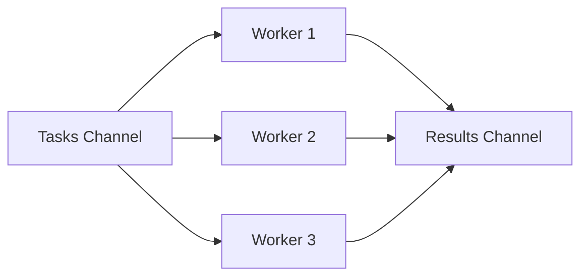

# Go Worker Pools

## Introduction

Worker pools are a powerful concurrency pattern in Go that allows you to control and limit the number of goroutines running simultaneously. This pattern is essential for efficiently managing resource-intensive tasks, preventing system overload, and optimizing performance in concurrent applications.

In this tutorial, we'll explore how worker pools work, why they're important, and how to implement them in Go. By the end, you'll understand how to efficiently distribute work across multiple goroutines and manage concurrent execution in a controlled manner.

## Understanding Worker Pools

A worker pool is a collection of goroutines (workers) that wait for tasks to be assigned to them. Each worker processes tasks independently, allowing for parallel execution. Once a worker completes a task, it becomes available to process the next one.

Here's why worker pools are useful:

1. **Resource Control**: Limit the number of concurrent operations to avoid overwhelming system resources
2. **Load Distribution**: Efficiently distribute tasks across available workers
3. **Performance Optimization**: Process multiple tasks in parallel while maintaining control
4. **Graceful Shutdown**: Coordinate the completion of all tasks before program termination

<div className="info-box">
  <strong>Key Concept:</strong> Worker pools help you control the degree of concurrency in your application, preventing the unbounded creation of goroutines that could lead to resource exhaustion.
</div>

## Basic Worker Pool Architecture

<div className="mermaid">

</div>

The basic architecture of a worker pool consists of:

1. **Tasks Channel**: Distributes work to available workers
2. **Worker Goroutines**: Process tasks concurrently
3. **Results Channel**: Collects the results of completed tasks
4. **Synchronization Mechanism**: Coordinates worker startup and shutdown

## Implementing a Basic Worker Pool

Let's build a simple worker pool that processes jobs (in this case, calculating the square of numbers):

```go
package main

import (
	"fmt"
	"time"
)

// Job represents a task to be processed
type Job struct {
	ID     int
	Number int
}

// Result represents the outcome of processing a job
type Result struct {
	JobID  int
	Number int
	Square int
}

func main() {
	// Create channels for jobs and results
	jobs := make(chan Job, 100)
	results := make(chan Result, 100)

	// Start 3 worker goroutines
	numWorkers := 3
	for w := 1; w <= numWorkers; w++ {
		go worker(w, jobs, results)
	}

	// Send 5 jobs
	numJobs := 5
	for j := 1; j <= numJobs; j++ {
		jobs <- Job{ID: j, Number: j}
	}
	close(jobs)

	// Collect all results
	for a := 1; a <= numJobs; a++ {
		result := <-results
		fmt.Printf("Result: Job ID %d, Number %d, Square %d
",
			result.JobID, result.Number, result.Square)
	}
}

// worker processes jobs from the jobs channel and sends results
// to the results channel
func worker(id int, jobs <-chan Job, results chan<- Result) {
	for job := range jobs {
		fmt.Printf("Worker %d processing job %d
", id, job.ID)
		time.Sleep(time.Second) // Simulate work
		results <- Result{
			JobID:  job.ID,
			Number: job.Number,
			Square: job.Number * job.Number,
		}
	}
}
```

**Sample Output:**
```
Worker 1 processing job 1
Worker 3 processing job 3
Worker 2 processing job 2
Worker 1 processing job 4
Worker 3 processing job 5
Result: Job ID 1, Number 1, Square 1
Result: Job ID 3, Number 3, Square 9
Result: Job ID 2, Number 2, Square 4
Result: Job ID 4, Number 4, Square 16
Result: Job ID 5, Number 5, Square 25
```

### Code Explanation

1. We define `Job` and `Result` types to represent our tasks and their outcomes.
2. We create buffered channels for jobs and results.
3. We start a fixed number of worker goroutines.
4. Each worker processes jobs from the jobs channel and sends the results to the results channel.
5. The main goroutine sends jobs and collects results.

## Using WaitGroups for Coordination

The previous example works, but it assumes we know exactly how many results to expect. Let's improve our worker pool by using `sync.WaitGroup` to properly coordinate the completion of all tasks:

```go
package main

import (
	"fmt"
	"sync"
	"time"
)

// Job represents a task to be processed
type Job struct {
	ID     int
	Number int
}

// Result represents the outcome of processing a job
type Result struct {
	JobID  int
	Number int
	Square int
}

func main() {
	// Create channels for jobs and results
	jobs := make(chan Job, 100)
	results := make(chan Result, 100)

	// WaitGroup to wait for all workers to finish
	var wg sync.WaitGroup

	// Start 3 worker goroutines
	numWorkers := 3
	for w := 1; w <= numWorkers; w++ {
		wg.Add(1)
		go worker(w, jobs, results, &wg)
	}

	// Send 5 jobs
	numJobs := 5
	for j := 1; j <= numJobs; j++ {
		jobs <- Job{ID: j, Number: j}
	}
	close(jobs)

	// Start a goroutine to close the results channel after all workers are done
	go func() {
		wg.Wait()
		close(results)
	}()

	// Collect all results
	for result := range results {
		fmt.Printf("Result: Job ID %d, Number %d, Square %d
",
			result.JobID, result.Number, result.Square)
	}
}

// worker processes jobs from the jobs channel and sends results
// to the results channel
func worker(id int, jobs <-chan Job, results chan<- Result, wg *sync.WaitGroup) {
	defer wg.Done()
	for job := range jobs {
		fmt.Printf("Worker %d processing job %d
", id, job.ID)
		time.Sleep(time.Second) // Simulate work
		results <- Result{
			JobID:  job.ID,
			Number: job.Number,
			Square: job.Number * job.Number,
		}
	}
}
```

### Key Improvements:

1. We use a `sync.WaitGroup` to track when all workers have finished.
2. We close the results channel only after all workers are done, allowing us to range over the results.
3. This pattern ensures we don't miss any results and properly coordinate shutdown.

## Real-World Example: Image Processing

Let's look at a more practical example: using a worker pool to process multiple images concurrently. We'll simulate image processing by applying a "filter" to each image:

```go
package main

import (
	"fmt"
	"sync"
	"time"
)

// ImageTask represents an image to be processed
type ImageTask struct {
	ID   int
	Name string
	Size int // Size in KB
}

// ProcessedImage represents a processed image
type ProcessedImage struct {
	TaskID       int
	OriginalName string
	NewName      string
	ProcessTime  time.Duration
}

// Simulates applying a filter to an image
func applyFilter(img ImageTask) ProcessedImage {
	// Processing time proportional to image size
	processTime := time.Duration(img.Size/10) * time.Millisecond
	time.Sleep(processTime)
	
	return ProcessedImage{
		TaskID:       img.ID,
		OriginalName: img.Name,
		NewName:      fmt.Sprintf("%s_filtered.jpg", img.Name[:len(img.Name)-4]),
		ProcessTime:  processTime,
	}
}

func worker(id int, images <-chan ImageTask, results chan<- ProcessedImage, wg *sync.WaitGroup) {
	defer wg.Done()
	for img := range images {
		fmt.Printf("Worker %d processing image: %s
", id, img.Name)
		processed := applyFilter(img)
		results <- processed
	}
}

func main() {
	// Create sample images
	sampleImages := []ImageTask{
		{ID: 1, Name: "vacation.jpg", Size: 2500},
		{ID: 2, Name: "family.jpg", Size: 3200},
		{ID: 3, Name: "birthday.jpg", Size: 1800},
		{ID: 4, Name: "wedding.jpg", Size: 4500},
		{ID: 5, Name: "graduation.jpg", Size: 2800},
		{ID: 6, Name: "party.jpg", Size: 1500},
		{ID: 7, Name: "trip.jpg", Size: 3600},
		{ID: 8, Name: "concert.jpg", Size: 2200},
	}

	// Create channels
	imageTasks := make(chan ImageTask, len(sampleImages))
	processedImages := make(chan ProcessedImage, len(sampleImages))

	// Start worker pool with 3 workers
	var wg sync.WaitGroup
	numWorkers := 3
	for w := 1; w <= numWorkers; w++ {
		wg.Add(1)
		go worker(w, imageTasks, processedImages, &wg)
	}

	// Send all images to be processed
	startTime := time.Now()
	for _, img := range sampleImages {
		imageTasks <- img
	}
	close(imageTasks)

	// Wait for all workers to finish and close results channel
	go func() {
		wg.Wait()
		close(processedImages)
	}()

	// Collect and report results
	totalProcessed := 0
	for processed := range processedImages {
		totalProcessed++
		fmt.Printf("Processed: %s → %s (took %v)
", 
			processed.OriginalName, 
			processed.NewName, 
			processed.ProcessTime)
	}

	totalTime := time.Since(startTime)
	fmt.Printf("
Summary: Processed %d images in %v using %d workers
", 
		totalProcessed, totalTime, numWorkers)
	
	// Calculate theoretical time if done sequentially
	var sequentialTime time.Duration
	for _, img := range sampleImages {
		sequentialTime += time.Duration(img.Size/10) * time.Millisecond
	}
	fmt.Printf("Sequential processing would take approximately: %v
", sequentialTime)
	fmt.Printf("Speedup factor: %.2fx
", float64(sequentialTime)/float64(totalTime))
}
```

**Sample Output:**
```
Worker 1 processing image: vacation.jpg
Worker 2 processing image: family.jpg
Worker 3 processing image: birthday.jpg
Processed: vacation.jpg → vacation_filtered.jpg (took 250ms)
Worker 1 processing image: wedding.jpg
Processed: birthday.jpg → birthday_filtered.jpg (took 180ms)
Worker 3 processing image: graduation.jpg
Processed: family.jpg → family_filtered.jpg (took 320ms)
Worker 2 processing image: party.jpg
Processed: party.jpg → party_filtered.jpg (took 150ms)
Worker 2 processing image: trip.jpg
Processed: graduation.jpg → graduation_filtered.jpg (took 280ms)
Worker 3 processing image: concert.jpg
Processed: wedding.jpg → wedding_filtered.jpg (took 450ms)
Processed: concert.jpg → concert_filtered.jpg (took 220ms)
Processed: trip.jpg → trip_filtered.jpg (took 360ms)

Summary: Processed 8 images in 970ms using 3 workers
Sequential processing would take approximately: 2.21s
Speedup factor: 2.28x
```

### Key Takeaways from the Image Processing Example:

1. **Parallel Processing**: We process multiple images simultaneously, which leads to a significant speedup.
2. **Resource Utilization**: We limit concurrent processing to 3 workers, preventing system overload.
3. **Task Distribution**: The worker pool automatically distributes tasks to available workers.
4. **Performance Gain**: The example shows a clear performance advantage over sequential processing.

## Advanced Worker Pool Patterns

### Worker Pool with Timeouts

In real-world applications, you might want to implement timeouts to prevent workers from getting stuck on problematic tasks:

```go
package main

import (
	"fmt"
	"sync"
	"time"
)

func worker(id int, jobs <-chan int, results chan<- int, wg *sync.WaitGroup) {
	defer wg.Done()
	for j := range jobs {
		fmt.Printf("Worker %d started job %d
", id, j)
		
		// Create a channel for the job result
		done := make(chan bool)
		
		// Process the job in a separate goroutine
		go func() {
			// Simulate work that might take a variable amount of time
			time.Sleep(time.Duration(j*200) * time.Millisecond)
			done <- true
		}()
		
		// Wait for job completion or timeout
		select {
		case <-done:
			// Job completed successfully
			fmt.Printf("Worker %d finished job %d
", id, j)
			results <- j * j
		case <-time.After(1 * time.Second):
			// Job timed out
			fmt.Printf("Worker %d timeout on job %d
", id, j)
			results <- -j // Indicate error with negative result
		}
	}
}

func main() {
	jobs := make(chan int, 10)
	results := make(chan int, 10)
	
	var wg sync.WaitGroup
	numWorkers := 3
	
	// Start workers
	for w := 1; w <= numWorkers; w++ {
		wg.Add(1)
		go worker(w, jobs, results, &wg)
	}
	
	// Send jobs
	for j := 1; j <= 9; j++ {
		jobs <- j
	}
	close(jobs)
	
	// Collect results
	go func() {
		wg.Wait()
		close(results)
	}()
	
	// Process results
	for r := range results {
		if r < 0 {
			fmt.Printf("Result: Job %d timed out
", -r)
		} else {
			fmt.Printf("Result: %d
", r)
		}
	}
}
```

This implementation uses the `select` statement with a timeout to prevent workers from getting stuck on a single job.

### Dynamically Adjusting the Worker Pool

In some cases, you might want to adjust the number of workers based on the system load:

```go
package main

import (
	"fmt"
	"sync"
	"sync/atomic"
	"time"
)

type WorkerPool struct {
	jobs      chan int
	results   chan int
	wg        sync.WaitGroup
	activeJobs int32
	maxWorkers int
	minWorkers int
}

func NewWorkerPool(minWorkers, maxWorkers int) *WorkerPool {
	return &WorkerPool{
		jobs:       make(chan int, 100),
		results:    make(chan int, 100),
		activeJobs: 0,
		maxWorkers: maxWorkers,
		minWorkers: minWorkers,
	}
}

func (wp *WorkerPool) worker(id int) {
	defer wp.wg.Done()
	
	for j := range wp.jobs {
		atomic.AddInt32(&wp.activeJobs, 1)
		fmt.Printf("Worker %d processing job %d
", id, j)
		
		// Simulate work
		time.Sleep(500 * time.Millisecond)
		wp.results <- j * j
		
		atomic.AddInt32(&wp.activeJobs, -1)
	}
}

func (wp *WorkerPool) Start() {
	// Start minimum number of workers
	for i := 1; i <= wp.minWorkers; i++ {
		wp.wg.Add(1)
		go wp.worker(i)
	}
	
	// Monitor job queue and start additional workers if needed
	go wp.monitor()
}

func (wp *WorkerPool) monitor() {
	workerCount := wp.minWorkers
	
	for {
		time.Sleep(200 * time.Millisecond)
		queueSize := len(wp.jobs)
		activeJobs := atomic.LoadInt32(&wp.activeJobs)
		
		// If queue is filling up, add more workers
		if queueSize > 5 && workerCount < wp.maxWorkers {
			workerCount++
			wp.wg.Add(1)
			fmt.Printf("Starting additional worker #%d
", workerCount)
			go wp.worker(workerCount)
		}
		
		// If all jobs are processed, exit the monitor
		if queueSize == 0 && activeJobs == 0 && workerCount <= wp.minWorkers {
			break
		}
	}
}

func (wp *WorkerPool) Submit(job int) {
	wp.jobs <- job
}

func (wp *WorkerPool) Close() {
	close(wp.jobs)
	wp.wg.Wait()
	close(wp.results)
}

func (wp *WorkerPool) Results() <-chan int {
	return wp.results
}

func main() {
	// Create a pool with min 2, max 5 workers
	pool := NewWorkerPool(2, 5)
	pool.Start()
	
	// Submit jobs with a varying rate
	go func() {
		for i := 1; i <= 20; i++ {
			pool.Submit(i)
			
			// Submit jobs quickly for a burst, then slow down
			if i < 10 {
				time.Sleep(100 * time.Millisecond) // Fast submission
			} else {
				time.Sleep(600 * time.Millisecond) // Slow submission
			}
		}
		pool.Close()
	}()
	
	// Collect results
	for r := range pool.Results() {
		fmt.Printf("Got result: %d
", r)
	}
}
```

This dynamic worker pool adjusts the number of workers based on the queue size, allowing it to handle bursts of activity more efficiently.

## Best Practices for Worker Pools

1. **Determine Optimal Worker Count**: The ideal number of workers depends on your specific workload and system. As a starting point, you can use the number of CPU cores available:

```go
numWorkers := runtime.NumCPU()
```

2. **Use Buffered Channels**: Buffered channels help smooth out uneven processing rates between producers and consumers.

3. **Graceful Shutdown**: Always ensure all workers finish their tasks properly before the program exits.

4. **Error Handling**: Include a mechanism for workers to report errors without crashing the entire pool.

5. **Monitoring and Metrics**: Track worker pool performance to identify bottlenecks.

6. **Avoid Worker Starvation**: Ensure that work is distributed fairly among workers.

7. **Consider Task Prioritization**: Some tasks may be more important than others and should be processed first.

## Common Pitfalls

1. **Creating Too Many Workers**: Having too many concurrent goroutines can lead to excessive context switching and memory usage.

2. **Forgetting to Close Channels**: Failing to close channels can lead to goroutine leaks.

3. **Deadlocks**: Be careful with channel operations to avoid situations where workers are waiting for each other.

4. **Race Conditions**: Use proper synchronization mechanisms when accessing shared resources.

5. **Not Handling Panics**: A panic in one worker can bring down the entire application.

## Summary

Worker pools are a fundamental concurrency pattern in Go that help you efficiently distribute work across multiple goroutines while maintaining control over resource usage. By limiting the number of concurrent operations, you can optimize performance and prevent system overload.

In this tutorial, we've covered:

- The concept and benefits of worker pools
- Basic worker pool implementation using goroutines and channels
- Coordinating workers using WaitGroups
- Real-world applications like image processing
- Advanced patterns like timeouts and dynamic worker pools
- Best practices and common pitfalls

Worker pools are just one of many concurrency patterns available in Go. As you become more familiar with Go's concurrency features, you'll discover more sophisticated patterns for handling complex concurrent workflows.

## Exercises

1. Modify the basic worker pool to handle errors gracefully.
2. Implement a worker pool that can prioritize certain tasks.
3. Create a worker pool that can be paused and resumed.
4. Build a web server that uses a worker pool to handle incoming requests.
5. Implement a worker pool that can process different types of tasks.

## Additional Resources

- [Go Concurrency Patterns: Pipelines and cancellation](https://blog.golang.org/pipelines)
- [Go Concurrency Patterns: Context](https://blog.golang.org/context)
- [Concurrency in Go](https://www.oreilly.com/library/view/concurrency-in-go/9781491941294/) by Katherine Cox-Buday
- [Go by Example: Worker Pools](https://gobyexample.com/worker-pools)
- [The Go Programming Language](https://www.gopl.io/) by Alan A. A. Donovan and Brian W. Kernighan