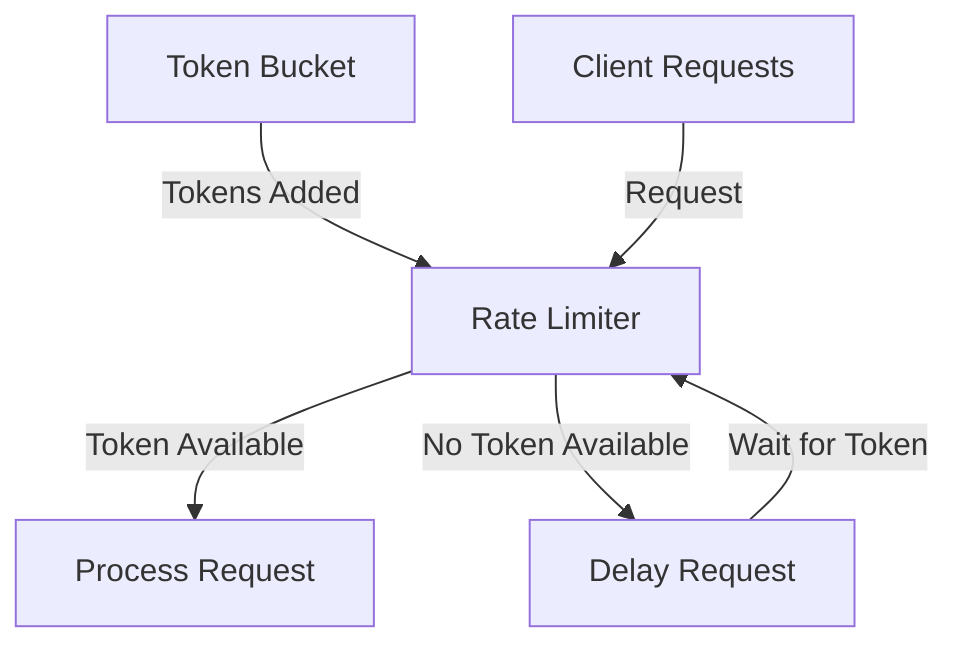

# Go Rate Limiting

## Introduction

Rate limiting is a critical technique in modern software development that controls the number of requests or operations that can be performed within a specific time period. In high-traffic applications, rate limiting helps prevent server overload, protects against certain types of attacks, and ensures fair usage of resources.

In this tutorial, we'll explore how to implement rate limiting in Go using the language's powerful concurrency features. We'll cover different rate limiting strategies, their implementations, and real-world applications where rate limiting is essential.

## What is Rate Limiting?

Rate limiting restricts how many operations can be performed in a given time frame. For example:
- Allowing only 10 requests per second to an API
- Processing a maximum of 100 database writes per minute
- Limiting file uploads to 5 per hour per user

Rate limiting is commonly used in:
- Public APIs to ensure fair usage
- Backend services to prevent cascading failures
- User authentication systems to prevent brute force attacks
- Resource-intensive operations to manage system load

## Basic Rate Limiting in Go

Let's start with a simple implementation of rate limiting using Go's time package and channels.

### Token Bucket Rate Limiter

The token bucket algorithm is one of the most common rate limiting approaches. It works like this:
1. A bucket holds tokens (representing allowed operations)
2. Tokens are added to the bucket at a fixed rate
3. When an operation needs to be performed, it must take a token from the bucket
4. If the bucket is empty, the operation must wait or be rejected

Here's a simple implementation:

```go
package main

import (
	"fmt"
	"time"
)

func main() {
	// Create a rate limiter that allows 2 operations per second
	limiter := time.Tick(500 * time.Millisecond)
	
	// Simulate 5 requests
	for i := 1; i <= 5; i++ {
		// Wait for a token from the rate limiter
		<-limiter
		
		fmt.Printf("Request %d processed at %s
", i, time.Now().Format("15:04:05.000"))
	}
}
```

**Output:**
```
Request 1 processed at 15:04:05.500
Request 2 processed at 15:04:06.000
Request 3 processed at 15:04:06.500
Request 4 processed at 15:04:07.000
Request 5 processed at 15:04:07.500
```

In this example, we use `time.Tick()` to create a channel that receives a value every 500 milliseconds (2 per second). Each operation waits for a value from this channel before proceeding, effectively limiting the rate to 2 operations per second.

### Bursty Rate Limiter

Sometimes we want to allow temporary bursts of activity while maintaining a long-term rate limit. We can implement a bursty rate limiter like this:

```go
package main

import (
	"fmt"
	"time"
)

func main() {
	// Create a channel to hold tokens
	const burstLimit = 3
	const tokenRate = 200 * time.Millisecond
	
	// Create token bucket with initial burst capacity
	tokenBucket := make(chan time.Time, burstLimit)
	
	// Initially fill the bucket with tokens
	for i := 0; i < burstLimit; i++ {
		tokenBucket <- time.Now()
	}
	
	// Refill the token bucket at the defined rate
	go func() {
		ticker := time.NewTicker(tokenRate)
		defer ticker.Stop()
		
		for t := range ticker.C {
			select {
			case tokenBucket <- t:
				// Token added to bucket
			default:
				// Bucket full, discard token
			}
		}
	}()
	
	// Simulate 8 requests
	for i := 1; i <= 8; i++ {
		// Take a token
		<-tokenBucket
		
		fmt.Printf("Request %d processed at %s
", i, time.Now().Format("15:04:05.000"))
	}
}
```

**Output:**
```
Request 1 processed at 15:04:05.000
Request 2 processed at 15:04:05.000
Request 3 processed at 15:04:05.000
Request 4 processed at 15:04:05.200
Request 5 processed at 15:04:05.400
Request 6 processed at 15:04:05.600
Request 7 processed at 15:04:05.800
Request 8 processed at 15:04:06.000
```

This implementation:
1. Creates a buffered channel to store tokens
2. Initially fills the bucket with tokens to allow an immediate burst
3. Uses a goroutine to refill the bucket at the specified rate
4. Each operation takes a token from the bucket before proceeding

## Using the rate Package

Go's standard library doesn't include a rate-limiting package, but the `golang.org/x/time/rate` package provides a well-designed rate limiter implementation that's widely used.

Let's see how to use it:

```go
package main

import (
	"context"
	"fmt"
	"time"
	
	"golang.org/x/time/rate"
)

func main() {
	// Create a limiter that allows 2 events per second with a burst of 4
	limiter := rate.NewLimiter(rate.Limit(2), 4)
	
	// Simulate 10 requests
	for i := 1; i <= 10; i++ {
		// Wait for permission to proceed
		err := limiter.Wait(context.Background())
		if err != nil {
			fmt.Printf("Rate limiting error: %v
", err)
			continue
		}
		
		fmt.Printf("Request %d processed at %s
", i, time.Now().Format("15:04:05.000"))
	}
}
```

**Output:**
```
Request 1 processed at 15:04:05.000
Request 2 processed at 15:04:05.000
Request 3 processed at 15:04:05.000
Request 4 processed at 15:04:05.000
Request 5 processed at 15:04:05.500
Request 6 processed at 15:04:06.000
Request 7 processed at 15:04:06.500
Request 8 processed at 15:04:07.000
Request 9 processed at 15:04:07.500
Request 10 processed at 15:04:08.000
```

The `rate` package provides several methods for rate limiting:
- `Wait`: Blocks until a token is available
- `Allow`: Non-blocking check if an operation can proceed
- `Reserve`: Reserves a token for future use

## Per-Client Rate Limiting

In real-world applications, you often need to limit rates per client/user rather than globally. Here's how to implement per-client rate limiting using the `rate` package:

```go
package main

import (
	"context"
	"fmt"
	"golang.org/x/time/rate"
	"sync"
	"time"
)

// ClientLimiter manages rate limiters for multiple clients
type ClientLimiter struct {
	limiters map[string]*rate.Limiter
	mu       sync.Mutex
	limit    rate.Limit
	burst    int
}

// NewClientLimiter creates a new client limiter
func NewClientLimiter(r rate.Limit, b int) *ClientLimiter {
	return &ClientLimiter{
		limiters: make(map[string]*rate.Limiter),
		limit:    r,
		burst:    b,
	}
}

// GetLimiter returns the rate limiter for the specified client
func (cl *ClientLimiter) GetLimiter(clientID string) *rate.Limiter {
	cl.mu.Lock()
	defer cl.mu.Unlock()

	limiter, exists := cl.limiters[clientID]
	if !exists {
		limiter = rate.NewLimiter(cl.limit, cl.burst)
		cl.limiters[clientID] = limiter
	}

	return limiter
}

func main() {
	// Create a client limiter that allows 2 requests per second with burst of 3
	clientLimiter := NewClientLimiter(rate.Limit(2), 3)
	
	// Simulate requests from different clients
	clients := []string{"client1", "client2", "client3"}
	
	var wg sync.WaitGroup
	
	for _, clientID := range clients {
		wg.Add(1)
		go func(id string) {
			defer wg.Done()
			
			limiter := clientLimiter.GetLimiter(id)
			
			for i := 1; i <= 5; i++ {
				limiter.Wait(context.Background())
				fmt.Printf("Client %s - Request %d processed at %s
", 
					id, i, time.Now().Format("15:04:05.000"))
			}
		}(clientID)
	}
	
	wg.Wait()
}
```

**Output:**
```
Client client1 - Request 1 processed at 15:04:05.000
Client client2 - Request 1 processed at 15:04:05.000
Client client3 - Request 1 processed at 15:04:05.000
Client client1 - Request 2 processed at 15:04:05.000
Client client2 - Request 2 processed at 15:04:05.000
Client client3 - Request 2 processed at 15:04:05.000
Client client1 - Request 3 processed at 15:04:05.000
Client client2 - Request 3 processed at 15:04:05.000
Client client3 - Request 3 processed at 15:04:05.000
Client client1 - Request 4 processed at 15:04:05.500
Client client2 - Request 4 processed at 15:04:05.500
Client client3 - Request 4 processed at 15:04:05.500
Client client1 - Request 5 processed at 15:04:06.000
Client client2 - Request 5 processed at 15:04:06.000
Client client3 - Request 5 processed at 15:04:06.000
```

This implementation:
1. Creates a `ClientLimiter` struct to manage rate limiters for different clients
2. Uses a map to store a separate rate limiter for each client
3. Protects the map with a mutex to make it concurrent-safe
4. Creates new limiters on demand when a client is first seen

## Visualizing Rate Limiting

Rate limiting can be easier to understand with a visual representation. Here's a diagram showing how the token bucket algorithm works:



## Rate Limiting HTTP Servers

Let's see a practical example of rate limiting in an HTTP server:

```go
package main

import (
	"golang.org/x/time/rate"
	"log"
	"net/http"
	"sync"
)

// ClientLimiter manages rate limiters for multiple clients
type ClientLimiter struct {
	limiters map[string]*rate.Limiter
	mu       sync.Mutex
	limit    rate.Limit
	burst    int
}

// NewClientLimiter creates a new client limiter
func NewClientLimiter(r rate.Limit, b int) *ClientLimiter {
	return &ClientLimiter{
		limiters: make(map[string]*rate.Limiter),
		limit:    r,
		burst:    b,
	}
}

// GetLimiter returns the rate limiter for the specified client
func (cl *ClientLimiter) GetLimiter(clientID string) *rate.Limiter {
	cl.mu.Lock()
	defer cl.mu.Unlock()

	limiter, exists := cl.limiters[clientID]
	if !exists {
		limiter = rate.NewLimiter(cl.limit, cl.burst)
		cl.limiters[clientID] = limiter
	}

	return limiter
}

// RateLimitMiddleware limits request rates by client IP
func RateLimitMiddleware(next http.Handler, cl *ClientLimiter) http.Handler {
	return http.HandlerFunc(func(w http.ResponseWriter, r *http.Request) {
		// Get client IP
		clientIP := r.RemoteAddr
		
		// Get limiter for this client
		limiter := cl.GetLimiter(clientIP)
		
		// Check if request is allowed
		if !limiter.Allow() {
			http.Error(w, "Rate limit exceeded", http.StatusTooManyRequests)
			return
		}
		
		// Process the request
		next.ServeHTTP(w, r)
	})
}

func main() {
	// Create a client limiter: 3 requests per second with burst of 5
	clientLimiter := NewClientLimiter(rate.Limit(3), 5)
	
	// Define a simple handler
	helloHandler := http.HandlerFunc(func(w http.ResponseWriter, r *http.Request) {
		w.Write([]byte("Hello, world!"))
	})
	
	// Apply rate limiting middleware
	http.Handle("/", RateLimitMiddleware(helloHandler, clientLimiter))
	
	// Start server
	log.Println("Server starting on port 8080...")
	log.Fatal(http.ListenAndServe(":8080", nil))
}
```

This HTTP server:
1. Limits each client IP to 3 requests per second with a burst capacity of 5
2. Returns a 429 Too Many Requests status code when the rate limit is exceeded
3. Uses the `Allow()` method for non-blocking rate checking

To test this server:
1. Run the server
2. Use a tool like `ab` (Apache Benchmark) to send multiple concurrent requests
3. Observe that some requests will receive 429 status codes when the rate limit is exceeded

## Distributed Rate Limiting

The examples we've seen so far work for a single application instance. In distributed systems with multiple instances, you might need a centralized rate limiter using Redis or another shared data store.

While a complete Redis-based rate limiter is beyond the scope of this tutorial, here's a simplified conceptual example:

```go
package main

import (
	"context"
	"fmt"
	"time"
	
	"github.com/go-redis/redis/v8"
)

// RedisRateLimiter implements rate limiting using Redis
type RedisRateLimiter struct {
	redisClient *redis.Client
	keyPrefix   string
	limit       int
	window      time.Duration
}

// NewRedisRateLimiter creates a new Redis-based rate limiter
func NewRedisRateLimiter(redisClient *redis.Client, keyPrefix string, limit int, window time.Duration) *RedisRateLimiter {
	return &RedisRateLimiter{
		redisClient: redisClient,
		keyPrefix:   keyPrefix,
		limit:       limit,
		window:      window,
	}
}

// Allow checks if a request is allowed for a given key
func (rrl *RedisRateLimiter) Allow(ctx context.Context, key string) (bool, error) {
	redisKey := fmt.Sprintf("%s:%s", rrl.keyPrefix, key)
	
	// Get the current time in milliseconds
	now := time.Now().UnixNano() / int64(time.Millisecond)
	windowStart := now - int64(rrl.window/time.Millisecond)
	
	// Create a pipeline for atomic operations
	pipe := rrl.redisClient.Pipeline()
	
	// Add the current timestamp to the sorted set
	pipe.ZAdd(ctx, redisKey, &redis.Z{
		Score:  float64(now),
		Member: now,
	})
	
	// Remove old entries outside the current window
	pipe.ZRemRangeByScore(ctx, redisKey, "0", fmt.Sprintf("%d", windowStart))
	
	// Count the number of entries in the current window
	countCmd := pipe.ZCard(ctx, redisKey)
	
	// Set expiration on the key to ensure cleanup
	pipe.Expire(ctx, redisKey, rrl.window*2)
	
	// Execute the pipeline
	_, err := pipe.Exec(ctx)
	if err != nil {
		return false, err
	}
	
	// Get the count of operations in the current window
	count, err := countCmd.Result()
	if err != nil {
		return false, err
	}
	
	// Check if the count is within the limit
	return count <= int64(rrl.limit), nil
}

func main() {
	// This is a conceptual example that would require a Redis server
	redisClient := redis.NewClient(&redis.Options{
		Addr: "localhost:6379",
	})
	
	// Create a rate limiter: 5 requests per minute per user
	limiter := NewRedisRateLimiter(
		redisClient,
		"rate-limit",
		5,
		time.Minute,
	)
	
	// Example usage
	ctx := context.Background()
	userID := "user123"
	
	for i := 1; i <= 7; i++ {
		allowed, err := limiter.Allow(ctx, userID)
		if err != nil {
			fmt.Printf("Error: %v
", err)
			continue
		}
		
		if allowed {
			fmt.Printf("Request %d allowed for user %s
", i, userID)
		} else {
			fmt.Printf("Request %d denied for user %s (rate limit exceeded)
", i, userID)
		}
	}
}
```

The Redis-based rate limiter:
1. Uses a sorted set to store timestamps of operations
2. Removes old timestamps outside the current time window
3. Counts operations within the window to enforce the rate limit
4. Works across multiple application instances that share the same Redis server

## Summary

Rate limiting is an essential technique in modern software development that helps control resource usage, prevent system overload, and ensure fair access to services. In this tutorial, we've explored:

1. Basic rate limiting concepts and strategies
2. Simple rate limiting using Go's time package and channels
3. More advanced rate limiting with the `golang.org/x/time/rate` package
4. Per-client rate limiting for more granular control
5. Applying rate limiting to HTTP servers
6. Conceptual approaches to distributed rate limiting

By implementing rate limiting in your Go applications, you can build more robust, stable, and fair systems that can handle high traffic without becoming overwhelmed.

## Exercises

1. Modify the HTTP server example to use different rate limits for different API endpoints.
2. Implement a rate limiter that allows a certain number of requests per day (hint: think about how to reset the limiter).
3. Create a rate limiter that dynamically adjusts its limits based on current system load.
4. Extend the Redis rate limiter to support different limits for different user tiers (e.g., free vs. premium users).
5. Implement a circuit breaker pattern alongside rate limiting to handle service failures gracefully.

## Additional Resources

- [Go Rate Package Documentation](https://pkg.go.dev/golang.org/x/time/rate)
- [Redis Documentation for Rate Limiting Patterns](https://redis.io/commands/incr)
- [System Design: Rate Limiting](https://www.educative.io/courses/grokking-modern-system-design-interview-for-engineers-managers/rate-limiting)
- [Go Concurrency Patterns](https://blog.golang.org/pipelines)
- [GitHub's API Rate Limiting](https://docs.github.com/en/rest/overview/resources-in-the-rest-api#rate-limiting) (A real-world example)