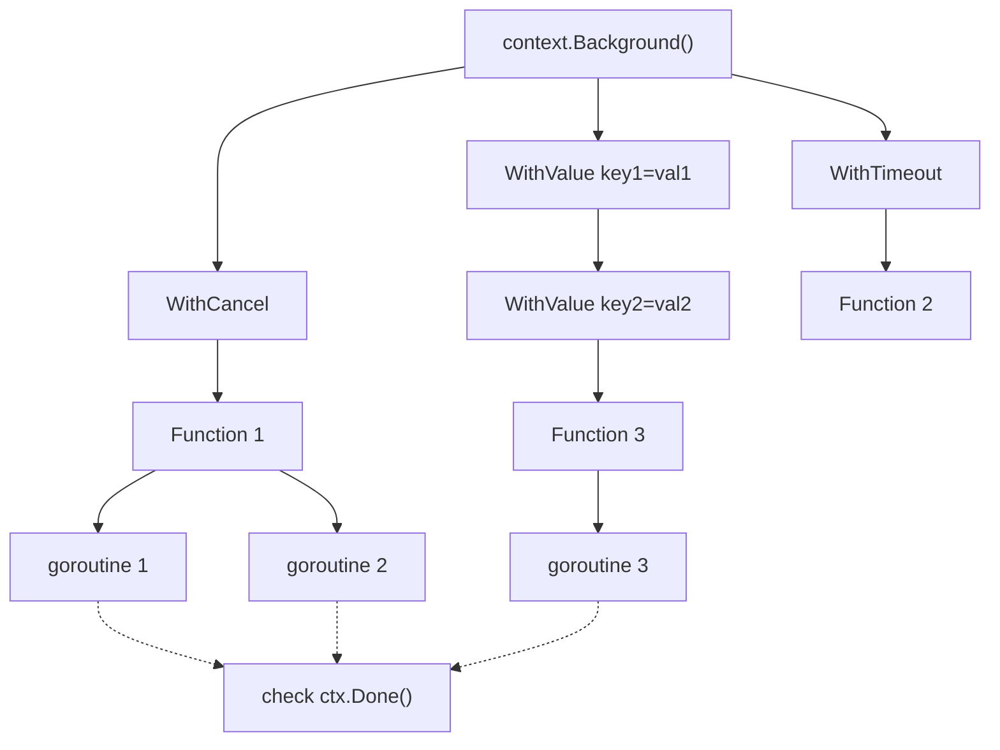

# Go Context

## Introduction

When working with concurrent operations in Go, you often need a way to manage and coordinate multiple goroutines. This is where Go's `context` package becomes invaluable. Introduced in Go 1.7, the `context` package provides a standard way to carry deadlines, cancellation signals, and request-scoped values across API boundaries and between processes.

In this tutorial, we'll explore how to use the Go `context` package to:

- Cancel long-running operations
- Set deadlines and timeouts
- Pass request-scoped values between functions
- Handle concurrency in a clean, structured way

## What is Context?

A `Context` in Go is an interface that contains deadlines, cancellation signals, and request-scoped values. The primary purpose of a `Context` is to tell a blocking operation to abandon its work when it's no longer needed.

Let's look at the `Context` interface definition:

```go
type Context interface {
    Deadline() (deadline time.Time, ok bool)
    Done() <-chan struct{}
    Err() error
    Value(key interface{}) interface{}
}
```

- `Deadline()`: Returns the time when the context will be canceled (if a deadline is set)
- `Done()`: Returns a channel that's closed when the context is canceled
- `Err()`: Returns the error explaining why the context was canceled
- `Value()`: Returns the value associated with a key

## Creating Contexts

The `context` package provides several functions to create new contexts:

### 1. Background Context

`context.Background()` is a starting point for all contexts. It's never canceled, has no values, and has no deadline.

```go
ctx := context.Background()
```

### 2. TODO Context

`context.TODO()` is similar to `Background()` but indicates that we're not sure which context to use yet.

```go
ctx := context.TODO()
```

### 3. WithCancel Context

`WithCancel` creates a new context that can be canceled manually.

```go
ctx, cancel := context.WithCancel(context.Background())
// Don't forget to call cancel when you're done
defer cancel()
```

### 4. WithTimeout Context

`WithTimeout` creates a context that will be automatically canceled after a specified duration.

```go
// Create a context that will be canceled after 5 seconds
ctx, cancel := context.WithTimeout(context.Background(), 5*time.Second)
defer cancel()
```

### 5. WithDeadline Context

`WithDeadline` creates a context that will be canceled at a specific time.

```go
// Create a context that will be canceled at a specific time
deadline := time.Now().Add(10 * time.Second)
ctx, cancel := context.WithDeadline(context.Background(), deadline)
defer cancel()
```

### 6. WithValue Context

`WithValue` creates a context with a key-value pair that can be passed through a call chain.

```go
ctx := context.WithValue(context.Background(), "userId", "12345")
```

## Context Cancellation

Let's see how we can use context to cancel operations. Here's a simple example:

```go
package main

import (
    "context"
    "fmt"
    "time"
)

func main() {
    // Create a context with cancellation capability
    ctx, cancel := context.WithCancel(context.Background())
    
    // Start a goroutine that does some work
    go worker(ctx, "Task 1")
    
    // Let the worker run for 3 seconds, then cancel it
    time.Sleep(3 * time.Second)
    cancel()
    
    // Wait a bit to see the effect of cancellation
    time.Sleep(1 * time.Second)
    fmt.Println("Main function exiting")
}

func worker(ctx context.Context, name string) {
    for {
        select {
        case <-ctx.Done():
            fmt.Printf("%s: Work canceled
", name)
            return
        case <-time.After(1 * time.Second):
            fmt.Printf("%s: Working...
", name)
        }
    }
}
```

**Output:**
```
Task 1: Working...
Task 1: Working...
Task 1: Working...
Task 1: Work canceled
Main function exiting
```

In this example:
1. We create a context with cancellation capability
2. Start a worker goroutine that checks for cancellation signals
3. After 3 seconds, we cancel the context
4. The worker detects the cancellation and exits gracefully

## Using Timeouts

Timeouts are crucial when working with external services like databases or APIs. Here's how to use `WithTimeout`:

```go
package main

import (
    "context"
    "fmt"
    "time"
)

func main() {
    // Create a context with a 2-second timeout
    ctx, cancel := context.WithTimeout(context.Background(), 2*time.Second)
    defer cancel()
    
    // Try to perform a task that takes longer than the timeout
    result, err := performTask(ctx)
    if err != nil {
        fmt.Println("Error:", err)
        return
    }
    
    fmt.Println("Result:", result)
}

func performTask(ctx context.Context) (string, error) {
    // Simulate a task that takes 3 seconds
    select {
    case <-time.After(3 * time.Second):
        return "Task completed", nil
    case <-ctx.Done():
        return "", ctx.Err() // This will return context.DeadlineExceeded
    }
}
```

**Output:**
```
Error: context deadline exceeded
```

This code shows:
1. How to set a timeout for an operation
2. How to check if the context is done before the operation completes
3. How to return the appropriate error when the context expires

## Passing Values with Context

Let's see how to use context to pass values through function calls:

```go
package main

import (
    "context"
    "fmt"
)

func main() {
    // Create a context with a value
    ctx := context.WithValue(context.Background(), "userId", "12345")
    
    // Pass the context to other functions
    processRequest(ctx)
}

func processRequest(ctx context.Context) {
    // Retrieve the value from the context
    userId, ok := ctx.Value("userId").(string)
    if !ok {
        fmt.Println("No user ID found in context")
        return
    }
    
    fmt.Printf("Processing request for user: %s
", userId)
    
    // Pass the context further down the call stack
    fetchUserData(ctx)
}

func fetchUserData(ctx context.Context) {
    // Again, retrieve the value from the context
    userId, ok := ctx.Value("userId").(string)
    if !ok {
        fmt.Println("No user ID found in context")
        return
    }
    
    fmt.Printf("Fetching data for user: %s
", userId)
}
```

**Output:**
```
Processing request for user: 12345
Fetching data for user: 12345
```

This example demonstrates:
1. How to add a value to a context
2. How to retrieve values from the context in different functions
3. How context values propagate through the call chain

## Real-World Example: HTTP Server with Timeouts

Let's see a practical example of using context in an HTTP server:

```go
package main

import (
    "context"
    "fmt"
    "log"
    "net/http"
    "time"
)

func main() {
    // Create a simple HTTP server
    http.HandleFunc("/", handleRequest)
    
    // Start the server
    log.Println("Server starting on :8080")
    log.Fatal(http.ListenAndServe(":8080", nil))
}

func handleRequest(w http.ResponseWriter, r *http.Request) {
    // Get the context from the request with a timeout
    ctx, cancel := context.WithTimeout(r.Context(), 2*time.Second)
    defer cancel()
    
    // Start a goroutine to process the request
    resultChan := make(chan string, 1)
    go func() {
        // Simulate a database query or API call
        time.Sleep(3 * time.Second)
        resultChan <- "Request processed successfully"
    }()
    
    // Wait for either the work to complete or the context to timeout
    select {
    case result := <-resultChan:
        fmt.Fprintln(w, result)
    case <-ctx.Done():
        log.Println("Request timed out or canceled")
        http.Error(w, "Request timed out", http.StatusGatewayTimeout)
    }
}
```

When you run this server and make a request to http://localhost:8080, it will timeout after 2 seconds and return a 504 Gateway Timeout error, because our simulated work takes 3 seconds.

This demonstrates how to:
1. Use context in an HTTP server
2. Set timeouts for handling requests
3. Cancel long-running operations when the client disconnects or timeout occurs

## Context Propagation

