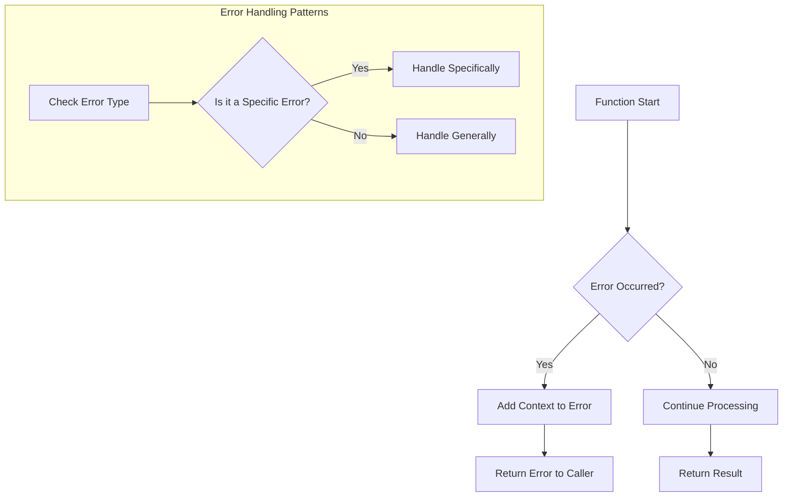

# Go Error Types

## Introduction

Error handling is a critical aspect of writing robust Go programs. Unlike many other programming languages that use exceptions, Go takes a different approach by making errors explicit values that must be checked and handled. This design philosophy encourages developers to think about possible failure scenarios and handle them appropriately.

In this guide, we'll explore the different types of errors in Go, how they work, and how to use them effectively in your programs. By the end, you'll have a solid understanding of Go's error handling mechanisms and be able to implement proper error handling in your own applications.

## The Error Interface

At the heart of Go's error handling is the `error` interface. It's a built-in interface defined in the Go standard library as:

```go
type error interface {
    Error() string
}
```

This simple interface only requires one method: `Error()`, which returns a string describing the error. Any type that implements this method satisfies the `error` interface and can be used as an error in Go.

## Basic Error Types

### 1. Simple String Errors

The simplest way to create errors in Go is using the `errors.New()` function from the standard library:

```go
package main

import (
    "errors"
    "fmt"
)

func main() {
    err := errors.New("something went wrong")
    
    if err != nil {
        fmt.Println(err)
    }
}
```

**Output:**
```
something went wrong
```

Another way to create simple errors is with `fmt.Errorf()`, which allows you to format error messages:

```go
package main

import (
    "fmt"
)

func divide(a, b int) (int, error) {
    if b == 0 {
        return 0, fmt.Errorf("cannot divide %d by zero", a)
    }
    return a / b, nil
}

func main() {
    result, err := divide(10, 0)
    
    if err != nil {
        fmt.Println("Error:", err)
    } else {
        fmt.Println("Result:", result)
    }
}
```

**Output:**
```
Error: cannot divide 10 by zero
```

### 2. Custom Error Types

For more complex error handling, you can create custom error types by defining structures that implement the `error` interface:

```go
package main

import (
    "fmt"
)

// Define a custom error type
type DivisionError struct {
    Dividend int
    Divisor  int
    Message  string
}

// Implement the Error method to satisfy the error interface
func (e *DivisionError) Error() string {
    return fmt.Sprintf("%s: %d / %d", e.Message, e.Dividend, e.Divisor)
}

func divide(a, b int) (int, error) {
    if b == 0 {
        return 0, &DivisionError{
            Dividend: a,
            Divisor:  b,
            Message:  "cannot divide by zero",
        }
    }
    return a / b, nil
}

func main() {
    result, err := divide(10, 0)
    
    if err != nil {
        fmt.Println("Error occurred:", err)
        
        // Type assertion to access custom error fields
        if divErr, ok := err.(*DivisionError); ok {
            fmt.Printf("Additional info - Dividend: %d, Divisor: %d
", 
                      divErr.Dividend, divErr.Divisor)
        }
    } else {
        fmt.Println("Result:", result)
    }
}
```

**Output:**
```
Error occurred: cannot divide by zero: 10 / 0
Additional info - Dividend: 10, Divisor: 0
```

Custom error types provide several advantages:
- They allow you to include additional context about the error
- They can be identified through type assertions
- They can include additional methods for error handling

## Error Wrapping (Go 1.13+)

Starting with Go 1.13, the standard library added support for error wrapping, which allows errors to contain other errors. This is useful for adding context to errors while preserving the original error information.

### Using fmt.Errorf with %w

The `%w` verb in `fmt.Errorf()` wraps an error with additional context:

```go
package main

import (
    "errors"
    "fmt"
)

func readConfig(path string) error {
    // Simulate a file not found error
    err := errors.New("file not found")
    return fmt.Errorf("failed to read config from %s: %w", path, err)
}

func main() {
    err := readConfig("/etc/app/config.json")
    
    if err != nil {
        fmt.Println(err)
        
        // Unwrap to get the original error
        originalErr := errors.Unwrap(err)
        if originalErr != nil {
            fmt.Println("Original error:", originalErr)
        }
    }
}
```

**Output:**
```
failed to read config from /etc/app/config.json: file not found
Original error: file not found
```

### Examining Wrapped Errors

Go provides two useful functions for working with wrapped errors:

1. `errors.Is()` - Checks if an error or any error it wraps matches a target error
2. `errors.As()` - Tries to find an error of a specific type in the error chain

Example using `errors.Is()`:

```go
package main

import (
    "errors"
    "fmt"
    "os"
)

func openFile(path string) error {
    err := os.ErrNotExist // Simulate a "file not found" error
    return fmt.Errorf("failed to open file %s: %w", path, err)
}

func main() {
    err := openFile("data.txt")
    
    if err != nil {
        fmt.Println(err)
        
        // Check if the error or any wrapped error is os.ErrNotExist
        if errors.Is(err, os.ErrNotExist) {
            fmt.Println("The file does not exist, creating it...")
            // Code to create the file would go here
        }
    }
}
```

**Output:**
```
failed to open file data.txt: file does not exist
The file does not exist, creating it...
```

Example using `errors.As()`:

```go
package main

import (
    "errors"
    "fmt"
    "os"
)

// Custom error type
type PathError struct {
    Path string
}

func (e *PathError) Error() string {
    return fmt.Sprintf("invalid path: %s", e.Path)
}

func validatePath(path string) error {
    // Simulate an invalid path
    pathErr := &PathError{Path: path}
    return fmt.Errorf("validation failed: %w", pathErr)
}

func main() {
    err := validatePath("/invalid/path")
    
    if err != nil {
        fmt.Println(err)
        
        // Try to extract a PathError from the error chain
        var pathErr *PathError
        if errors.As(err, &pathErr) {
            fmt.Printf("Path validation error for: %s
", pathErr.Path)
        }
    }
}
```

**Output:**
```
validation failed: invalid path: /invalid/path
Path validation error for: /invalid/path
```

## Sentinel Errors

Go's standard library defines some predefined error values known as "sentinel errors." These are specific error values that can be checked using the equality operator (`==`) or `errors.Is()`.

Common examples include:
- `io.EOF` - Indicates the end of a file or stream
- `os.ErrNotExist` - Indicates a file does not exist
- `os.ErrPermission` - Indicates permission issues

Example using a sentinel error:

```go
package main

import (
    "fmt"
    "io"
    "strings"
)

func readUntilEOF(r io.Reader) error {
    buf := make([]byte, 1024)
    
    for {
        _, err := r.Read(buf)
        if err != nil {
            if err == io.EOF {
                // This is an expected error, not a failure
                fmt.Println("Reached the end of the input")
                return nil
            }
            // Any other error is unexpected
            return fmt.Errorf("error reading data: %w", err)
        }
        fmt.Println("Read some data")
    }
}

func main() {
    // Create a reader with a short string
    r := strings.NewReader("hello")
    
    err := readUntilEOF(r)
    if err != nil {
        fmt.Println("Error:", err)
    } else {
        fmt.Println("Operation completed successfully")
    }
}
```

**Output:**
```
Read some data
Reached the end of the input
Operation completed successfully
```

## Error Groups (concurrent error handling)

When dealing with concurrent operations, the `errgroup` package from `golang.org/x/sync` provides a way to manage errors from multiple goroutines:

```go
package main

import (
    "context"
    "fmt"
    "net/http"
    "time"
    
    "golang.org/x/sync/errgroup"
)

func checkWebsite(url string) error {
    resp, err := http.Get(url)
    if err != nil {
        return fmt.Errorf("error fetching %s: %w", url, err)
    }
    defer resp.Body.Close()
    
    if resp.StatusCode != http.StatusOK {
        return fmt.Errorf("bad status for %s: %d", url, resp.StatusCode)
    }
    
    return nil
}

func main() {
    // Create a list of websites to check
    websites := []string{
        "https://golang.org",
        "https://nonexistent-site-12345.com", // This will fail
        "https://github.com",
    }
    
    // Create a context with timeout
    ctx, cancel := context.WithTimeout(context.Background(), 10*time.Second)
    defer cancel()
    
    // Create an error group
    g, ctx := errgroup.WithContext(ctx)
    
    // Check each website concurrently
    for _, url := range websites {
        url := url // Create a new variable to avoid closure issues
        
        g.Go(func() error {
            return checkWebsite(url)
        })
    }
    
    // Wait for all goroutines to complete or for an error
    if err := g.Wait(); err != nil {
        fmt.Println("Error during website checks:", err)
    } else {
        fmt.Println("All websites checked successfully")
    }
}
```

**Output:**
```
Error during website checks: error fetching https://nonexistent-site-12345.com: Get "https://nonexistent-site-12345.com": dial tcp: lookup nonexistent-site-12345.com: no such host
```

## Real-World Error Handling Patterns

### 1. Database Operations

Here's a practical example of error handling in a database operation:

```go
package main

import (
    "database/sql"
    "errors"
    "fmt"
    
    _ "github.com/lib/pq" // PostgreSQL driver
)

// Custom error types for database operations
type NotFoundError struct {
    ID   int
    Type string
}

func (e *NotFoundError) Error() string {
    return fmt.Sprintf("%s with ID %d not found", e.Type, e.ID)
}

// User represents a user in our system
type User struct {
    ID   int
    Name string
}

// GetUserByID retrieves a user from the database
func GetUserByID(db *sql.DB, id int) (*User, error) {
    var user User
    
    err := db.QueryRow("SELECT id, name FROM users WHERE id = $1", id).Scan(&user.ID, &user.Name)
    if err != nil {
        if errors.Is(err, sql.ErrNoRows) {
            // Wrap the standard error with our custom error
            return nil, &NotFoundError{ID: id, Type: "User"}
        }
        return nil, fmt.Errorf("database error retrieving user %d: %w", id, err)
    }
    
    return &user, nil
}

func main() {
    // In a real application, you would have a valid database connection
    // For this example, we'll simulate the error
    
    // Simulate the GetUserByID function with an error
    user, err := func(id int) (*User, error) {
        return nil, &NotFoundError{ID: id, Type: "User"}
    }(42)
    
    if err != nil {
        fmt.Println("Error:", err)
        
        // Check if it's a NotFoundError
        var notFoundErr *NotFoundError
        if errors.As(err, &notFoundErr) {
            fmt.Printf("Please check if the user ID %d is correct
", notFoundErr.ID)
        }
    } else {
        fmt.Printf("Found user: %s (ID: %d)
", user.Name, user.ID)
    }
}
```

**Output:**
```
Error: User with ID 42 not found
Please check if the user ID 42 is correct
```

### 2. API Response Errors

When building REST APIs, it's common to map errors to appropriate HTTP responses:

```go
package main

import (
    "encoding/json"
    "errors"
    "fmt"
    "log"
    "net/http"
)

// API error types
type NotFoundError struct {
    Resource string
    ID       string
}

func (e *NotFoundError) Error() string {
    return fmt.Sprintf("%s with ID %s not found", e.Resource, e.ID)
}

type ValidationError struct {
    Field   string
    Message string
}

func (e *ValidationError) Error() string {
    return fmt.Sprintf("validation error on field %s: %s", e.Field, e.Message)
}

// Simulated service function
func getProduct(id string) (map[string]interface{}, error) {
    // Simulate a product not found error
    if id == "999" {
        return nil, &NotFoundError{Resource: "Product", ID: id}
    }
    
    // Simulate a validation error
    if id == "invalid" {
        return nil, &ValidationError{Field: "id", Message: "product ID must be numeric"}
    }
    
    // Success case
    return map[string]interface{}{
        "id":    id,
        "name":  "Sample Product",
        "price": 29.99,
    }, nil
}

// HTTP handler
func productHandler(w http.ResponseWriter, r *http.Request) {
    // Get the product ID from the URL query parameters
    id := r.URL.Query().Get("id")
    if id == "" {
        http.Error(w, "missing product ID", http.StatusBadRequest)
        return
    }
    
    // Try to get the product
    product, err := getProduct(id)
    if err != nil {
        // Handle different error types
        var notFoundErr *NotFoundError
        var validationErr *ValidationError
        
        switch {
        case errors.As(err, &notFoundErr):
            // Return 404 Not Found for missing resources
            w.WriteHeader(http.StatusNotFound)
            json.NewEncoder(w).Encode(map[string]string{"error": err.Error()})
            
        case errors.As(err, &validationErr):
            // Return 400 Bad Request for validation errors
            w.WriteHeader(http.StatusBadRequest)
            json.NewEncoder(w).Encode(map[string]string{"error": err.Error()})
            
        default:
            // Log unexpected errors and return 500 Internal Server Error
            log.Printf("Unexpected error: %v", err)
            w.WriteHeader(http.StatusInternalServerError)
            json.NewEncoder(w).Encode(map[string]string{"error": "internal server error"})
        }
        return
    }
    
    // Success case - return the product
    w.Header().Set("Content-Type", "application/json")
    json.NewEncoder(w).Encode(product)
}

func main() {
    // For demonstration, we'll simulate API responses
    
    // Simulate a successful request
    fmt.Println("Response for valid product (ID: 123):")
    product, _ := getProduct("123")
    productJSON, _ := json.MarshalIndent(product, "", "  ")
    fmt.Printf("HTTP 200 OK
%s

", productJSON)
    
    // Simulate a not found error
    fmt.Println("Response for non-existent product (ID: 999):")
    _, err := getProduct("999")
    if err != nil {
        fmt.Printf("HTTP 404 Not Found
{\"error\": \"%s\"}

", err.Error())
    }
    
    // Simulate a validation error
    fmt.Println("Response for invalid product ID:")
    _, err = getProduct("invalid")
    if err != nil {
        fmt.Printf("HTTP 400 Bad Request
{\"error\": \"%s\"}
", err.Error())
    }
}
```

**Output:**
```
Response for valid product (ID: 123):
HTTP 200 OK
{
  "id": "123",
  "name": "Sample Product",
  "price": 29.99
}

Response for non-existent product (ID: 999):
HTTP 404 Not Found
{"error": "Product with ID 999 not found"}

Response for invalid product ID:
HTTP 400 Bad Request
{"error": "validation error on field id: product ID must be numeric"}
```

## Error Handling Best Practices

When working with errors in Go, keep these best practices in mind:

