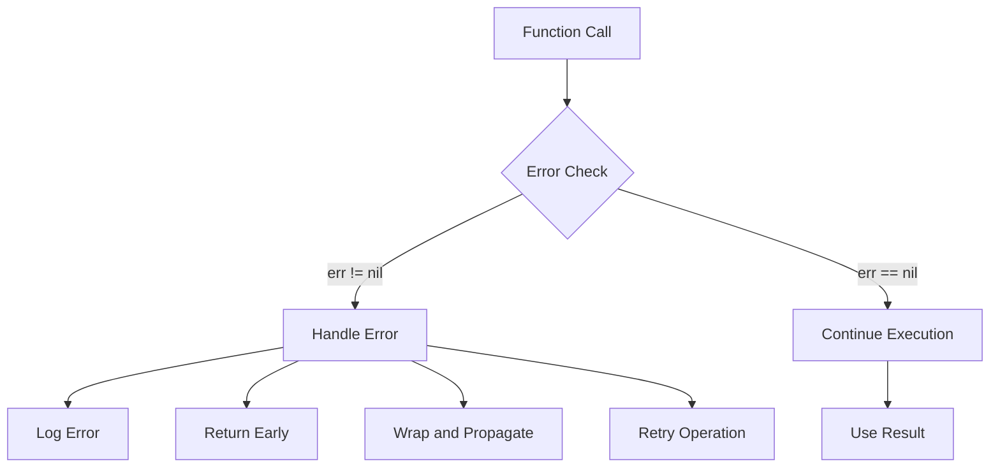

# Go Error Handling

## Introduction

Error handling is a critical aspect of writing robust Go programs. Unlike many other programming languages that use exceptions, Go takes a different approach by making errors explicit values that must be checked and handled. This design choice encourages developers to think about potential failure points and handle them appropriately.

In this guide, we'll explore how error handling works in Go, covering the basic concepts, patterns, and best practices. By the end, you'll have a solid understanding of how to implement effective error handling in your Go applications.

## The Basics of Error Handling in Go

### What is an Error in Go?

In Go, an error is simply a value that implements the built-in `error` interface. This interface is defined as:

```go
type error interface {
    Error() string
}
```

Any type that implements the `Error()` method, which returns a string, can be used as an error. This simple but powerful design allows for great flexibility in error handling.

### Returning Errors

The most common pattern in Go is to return an error as the last return value of a function:

```go
func doSomething() (ResultType, error) {
    // Function implementation
    if somethingWentWrong {
        return zeroValueOfResultType, errors.New("something went wrong")
    }
    return result, nil
}
```

### Checking for Errors

To handle errors, you check if the returned error is not `nil`:

```go
result, err := doSomething()
if err != nil {
    // Handle the error
    fmt.Println("Error:", err)
    return // or handle the error in another way
}
// Continue with normal execution using result
```

Let's see a complete example:

```go
package main

import (
    "errors"
    "fmt"
)

func divide(a, b float64) (float64, error) {
    if b == 0 {
        return 0, errors.New("division by zero")
    }
    return a / b, nil
}

func main() {
    result, err := divide(10, 2)
    if err != nil {
        fmt.Println("Error occurred:", err)
        return
    }
    fmt.Println("Result:", result)
    
    result, err = divide(10, 0)
    if err != nil {
        fmt.Println("Error occurred:", err)
        return
    }
    fmt.Println("Result:", result) // This won't be reached
}
```

Output:
```
Result: 5
Error occurred: division by zero
```

## Creating Errors

Go provides several ways to create errors:

### Using errors.New()

The simplest way to create an error is to use the `errors.New()` function:

```go
import "errors"

err := errors.New("something went wrong")
```

### Using fmt.Errorf()

For formatted error messages, you can use `fmt.Errorf()`:

```go
import "fmt"

err := fmt.Errorf("failed to process value %v: %s", value, reason)
```

### Custom Error Types

For more complex error handling, you can create custom error types:

```go
type MyError struct {
    Code    int
    Message string
}

func (e *MyError) Error() string {
    return fmt.Sprintf("code %d: %s", e.Code, e.Message)
}

func doSomething() error {
    return &MyError{
        Code:    500,
        Message: "something went wrong",
    }
}
```

## Error Handling Patterns

### Sentinel Errors

Sentinel errors are predefined error values that can be compared directly:

```go
package main

import (
    "errors"
    "fmt"
)

var ErrNotFound = errors.New("not found")

func findItem(id string) (string, error) {
    // Simulate item not found
    return "", ErrNotFound
}

func main() {
    item, err := findItem("123")
    if err != nil {
        if errors.Is(err, ErrNotFound) {
            fmt.Println("Item not found, try another ID")
        } else {
            fmt.Println("Unknown error:", err)
        }
        return
    }
    fmt.Println("Found item:", item)
}
```

Output:
```
Item not found, try another ID
```

### Error Wrapping

Go 1.13 introduced error wrapping, which allows you to add context to errors while preserving the original error:

```go
package main

import (
    "errors"
    "fmt"
)

var ErrNotFound = errors.New("not found")

func findItem(id string) (string, error) {
    return "", ErrNotFound
}

func processItem(id string) (string, error) {
    item, err := findItem(id)
    if err != nil {
        return "", fmt.Errorf("failed to process item %s: %w", id, err)
    }
    return item, nil
}

func main() {
    item, err := processItem("123")
    if err != nil {
        fmt.Println("Error:", err)
        
        // Check if the original error was ErrNotFound
        if errors.Is(err, ErrNotFound) {
            fmt.Println("Original error was 'not found'")
        }
        return
    }
    fmt.Println("Processed item:", item)
}
```

Output:
```
Error: failed to process item 123: not found
Original error was 'not found'
```

### Type Assertions for Custom Errors

You can use type assertions to check for specific error types:

```go
package main

import (
    "fmt"
)

type NotFoundError struct {
    Item string
}

func (e NotFoundError) Error() string {
    return fmt.Sprintf("%s not found", e.Item)
}

func findUser(id string) (string, error) {
    return "", NotFoundError{Item: "User"}
}

func main() {
    user, err := findUser("123")
    if err != nil {
        // Type assertion
        if nfErr, ok := err.(NotFoundError); ok {
            fmt.Printf("Specific error: %s
", nfErr.Item)
        } else {
            fmt.Println("Some other error:", err)
        }
        return
    }
    fmt.Println("User:", user)
}
```

Output:
```
Specific error: User
```

Using `errors.As()` (introduced in Go 1.13) is more flexible:

```go
if var nfErr NotFoundError; errors.As(err, &nfErr) {
    fmt.Printf("Specific error: %s
", nfErr.Item)
}
```

## Error Handling Flow

Let's visualize the typical error handling flow in Go:

