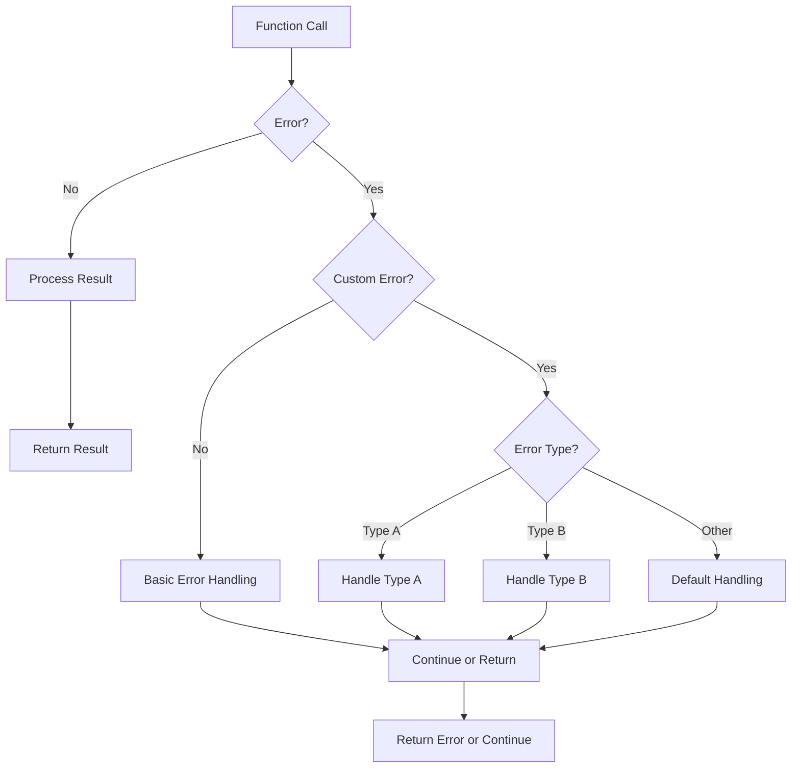

# Go Custom Errors

## Introduction

When developing applications in Go, effective error handling is crucial for building robust and maintainable software. While Go's standard library provides basic error functionality, creating custom errors allows you to communicate more specific information about what went wrong and why. This guide will walk you through the process of creating and using custom errors in Go, a fundamental skill for Go programmers at any level.

## Understanding Errors in Go

In Go, an error is anything that implements the `error` interface, which is defined as:

```go
type error interface {
    Error() string
}
```

This simple interface only requires one method: `Error()`, which returns a string description of the error. This simplicity makes it easy to create your own custom error types.

## Why Use Custom Errors?

Before diving into implementation, let's understand why custom errors are valuable:

1. **Improved error context**: Custom errors can carry additional information about what went wrong
2. **Better error handling**: Custom error types enable more precise error checking through type assertions
3. **Cleaner code**: Well-designed error types lead to more readable error handling code
4. **Consistent error reporting**: Custom errors help establish conventions for error handling across your codebase

## Creating Basic Custom Errors

Let's start with the simplest approach to creating custom errors in Go.

### Using `errors.New()`

The standard library's `errors` package provides a straightforward way to create custom error messages:

```go
package main

import (
    "errors"
    "fmt"
)

func divide(a, b float64) (float64, error) {
    if b == 0 {
        return 0, errors.New("division by zero not allowed")
    }
    return a / b, nil
}

func main() {
    result, err := divide(10, 0)
    if err != nil {
        fmt.Println("Error:", err)
        return
    }
    fmt.Println("Result:", result)
}
```

**Output:**
```
Error: division by zero not allowed
```

### Using `fmt.Errorf()`

For more complex error messages that include dynamic values, `fmt.Errorf()` is very useful:

```go
package main

import (
    "fmt"
)

func divide(a, b float64) (float64, error) {
    if b == 0 {
        return 0, fmt.Errorf("cannot divide %v by zero", a)
    }
    return a / b, nil
}

func main() {
    result, err := divide(10, 0)
    if err != nil {
        fmt.Println("Error:", err)
        return
    }
    fmt.Println("Result:", result)
}
```

**Output:**
```
Error: cannot divide 10 by zero
```

## Creating Custom Error Types

While `errors.New()` and `fmt.Errorf()` are convenient for simple cases, creating custom error types gives you more power and flexibility.

### Defining a Custom Error Type

To create a custom error type, you need to:
1. Define a new type (usually a struct)
2. Implement the `Error()` method for that type

Here's a basic example:

```go
package main

import (
    "fmt"
)

// DivisionError is a custom error type for division operations
type DivisionError struct {
    Dividend float64
    Divisor  float64
    Message  string
}

// Error implements the error interface
func (e *DivisionError) Error() string {
    return fmt.Sprintf("%s: %v / %v", e.Message, e.Dividend, e.Divisor)
}

func divide(a, b float64) (float64, error) {
    if b == 0 {
        return 0, &DivisionError{
            Dividend: a,
            Divisor:  b,
            Message:  "division by zero not allowed",
        }
    }
    return a / b, nil
}

func main() {
    result, err := divide(10, 0)
    if err != nil {
        fmt.Println("Error:", err)
        
        // We can also type assert to access the fields of our custom error
        if divErr, ok := err.(*DivisionError); ok {
            fmt.Printf("Additional info - Dividend: %v, Divisor: %v
", 
                       divErr.Dividend, divErr.Divisor)
        }
        return
    }
    fmt.Println("Result:", result)
}
```

**Output:**
```
Error: division by zero not allowed: 10 / 0
Additional info - Dividend: 10, Divisor: 0
```

## Type Checking Custom Errors

One of the biggest advantages of custom error types is the ability to check error types specifically, which enables more precise error handling.

### Using Type Assertions

```go
package main

import (
    "fmt"
)

// Different types of errors
type NetworkError struct {
    Message string
}

func (e *NetworkError) Error() string {
    return fmt.Sprintf("Network error: %s", e.Message)
}

type FileError struct {
    Filename string
    Message  string
}

func (e *FileError) Error() string {
    return fmt.Sprintf("File error (%s): %s", e.Filename, e.Message)
}

// Function that returns different error types
func fetchData(useNetwork bool, filename string) ([]byte, error) {
    if useNetwork {
        return nil, &NetworkError{Message: "connection timed out"}
    }
    return nil, &FileError{Filename: filename, Message: "file not found"}
}

func main() {
    // First try with network
    data, err := fetchData(true, "")
    if err != nil {
        switch e := err.(type) {
        case *NetworkError:
            fmt.Println("Handle network error:", e.Message)
        case *FileError:
            fmt.Println("Handle file error:", e.Filename, "-", e.Message)
        default:
            fmt.Println("Unknown error:", err)
        }
    }
    
    // Then try with file
    data, err = fetchData(false, "data.txt")
    if err != nil {
        switch e := err.(type) {
        case *NetworkError:
            fmt.Println("Handle network error:", e.Message)
        case *FileError:
            fmt.Println("Handle file error:", e.Filename, "-", e.Message)
        default:
            fmt.Println("Unknown error:", err)
        }
    }
    
    fmt.Println("Data:", data)
}
```

**Output:**
```
Handle network error: connection timed out
Handle file error: data.txt - file not found
Data: []
```

## Error Wrapping

Go 1.13 introduced the concept of error wrapping, which allows you to create error chains where one error contains another. This is useful for maintaining context as errors propagate up the call stack.

### Using `fmt.Errorf()` with `%w` Verb

```go
package main

import (
    "errors"
    "fmt"
)

// Basic error
var ErrNotFound = errors.New("not found")

func findItem(id string) error {
    // Simulate item not found
    return fmt.Errorf("item %q: %w", id, ErrNotFound)
}

func processItem(id string) error {
    if err := findItem(id); err != nil {
        return fmt.Errorf("processing failed: %w", err)
    }
    return nil
}

func main() {
    err := processItem("abc123")
    if err != nil {
        fmt.Println("Main error:", err)
        
        // Check if the error chain contains ErrNotFound
        if errors.Is(err, ErrNotFound) {
            fmt.Println("The root cause is that the item was not found")
        }
        
        // Unwrap the error chain
        fmt.Println("
Error chain:")
        fmt.Println(err)
        err = errors.Unwrap(err)
        for err != nil {
            fmt.Println("↳", err)
            err = errors.Unwrap(err)
        }
    }
}
```

**Output:**
```
Main error: processing failed: item "abc123": not found
The root cause is that the item was not found

Error chain:
processing failed: item "abc123": not found
↳ item "abc123": not found
↳ not found
```

## Using `errors.Is()` and `errors.As()`

Go 1.13 also introduced two helper functions that make working with error chains more convenient:

- `errors.Is()`: Checks if an error or any error it wraps matches a specific error value
- `errors.As()`: Attempts to find an error of a specific type in an error chain

```go
package main

import (
    "errors"
    "fmt"
    "os"
)

type QueryError struct {
    Query string
    Err   error
}

func (e *QueryError) Error() string {
    return fmt.Sprintf("query error for %q: %v", e.Query, e.Err)
}

func (e *QueryError) Unwrap() error {
    return e.Err
}

func searchDatabase(query string) error {
    // Simulate a file access error that happens during the query
    err := os.ErrNotExist
    return &QueryError{
        Query: query,
        Err:   fmt.Errorf("database error: %w", err),
    }
}

func main() {
    err := searchDatabase("SELECT * FROM users")
    
    // Using errors.Is to check for a specific error value
    if errors.Is(err, os.ErrNotExist) {
        fmt.Println("The underlying error indicates a missing file")
    }
    
    // Using errors.As to get the QueryError from the chain
    var queryErr *QueryError
    if errors.As(err, &queryErr) {
        fmt.Printf("Query error found: %q
", queryErr.Query)
    }
    
    fmt.Println("Original error:", err)
}
```

**Output:**
```
The underlying error indicates a missing file
Query error found: "SELECT * FROM users"
Original error: query error for "SELECT * FROM users": database error: file does not exist
```

## Real-World Application: Custom Error Handling in a Web API

Let's look at a practical example of how custom errors can be used in a web API to provide consistent error responses.

```go
package main

import (
    "encoding/json"
    "fmt"
    "log"
    "net/http"
    "strconv"
)

// Custom error types
type APIError struct {
    Code    int
    Message string
    Detail  string
}

func (e *APIError) Error() string {
    return fmt.Sprintf("[%d] %s: %s", e.Code, e.Message, e.Detail)
}

// Specific error types
func NewNotFoundError(resource string, id interface{}) *APIError {
    return &APIError{
        Code:    404,
        Message: "Resource Not Found",
        Detail:  fmt.Sprintf("%s with ID %v does not exist", resource, id),
    }
}

func NewInvalidInputError(detail string) *APIError {
    return &APIError{
        Code:    400,
        Message: "Invalid Input",
        Detail:  detail,
    }
}

// User handler
func getUserHandler(w http.ResponseWriter, r *http.Request) {
    // Get user ID from query parameters
    idStr := r.URL.Query().Get("id")
    id, err := strconv.Atoi(idStr)
    
    if err != nil {
        handleError(w, NewInvalidInputError("User ID must be a number"))
        return
    }
    
    // Simulate user lookup
    user, err := findUser(id)
    if err != nil {
        handleError(w, err)
        return
    }
    
    // Return user data
    w.Header().Set("Content-Type", "application/json")
    json.NewEncoder(w).Encode(map[string]interface{}{
        "success": true,
        "data":    user,
    })
}

// Simulate finding a user
func findUser(id int) (map[string]interface{}, error) {
    // For demo purposes, only user with ID 1 exists
    if id != 1 {
        return nil, NewNotFoundError("User", id)
    }
    
    return map[string]interface{}{
        "id":    1,
        "name":  "John Doe",
        "email": "john@example.com",
    }, nil
}

// Error handler function
func handleError(w http.ResponseWriter, err error) {
    var apiErr *APIError
    
    // Check if it's our custom error type
    if errors.As(err, &apiErr) {
        // Set HTTP status code
        w.WriteHeader(apiErr.Code)
        
        // Return error as JSON
        w.Header().Set("Content-Type", "application/json")
        json.NewEncoder(w).Encode(map[string]interface{}{
            "success": false,
            "error": map[string]interface{}{
                "code":    apiErr.Code,
                "message": apiErr.Message,
                "detail":  apiErr.Detail,
            },
        })
        return
    }
    
    // Handle unexpected errors
    log.Printf("Unexpected error: %v", err)
    w.WriteHeader(http.StatusInternalServerError)
    w.Header().Set("Content-Type", "application/json")
    json.NewEncoder(w).Encode(map[string]interface{}{
        "success": false,
        "error": map[string]interface{}{
            "code":    500,
            "message": "Internal Server Error",
            "detail":  "An unexpected error occurred",
        },
    })
}

func main() {
    http.HandleFunc("/api/users", getUserHandler)
    
    fmt.Println("Server starting on http://localhost:8080")
    log.Fatal(http.ListenAndServe(":8080", nil))
}
```

If you run this server and make requests, you'll get consistent JSON responses:

**Request:** `GET /api/users?id=abc`  
**Response:**
```json
{
  "success": false,
  "error": {
    "code": 400,
    "message": "Invalid Input",
    "detail": "User ID must be a number"
  }
}
```

**Request:** `GET /api/users?id=999`  
**Response:**
```json
{
  "success": false,
  "error": {
    "code": 404,
    "message": "Resource Not Found",
    "detail": "User with ID 999 does not exist"
  }
}
```

**Request:** `GET /api/users?id=1`  
**Response:**
```json
{
  "success": true,
  "data": {
    "id": 1,
    "name": "John Doe",
    "email": "john@example.com"
  }
}
```

## Best Practices for Custom Errors

When working with custom errors in Go, consider these best practices:

1. **Keep error messages descriptive but concise** - Error messages should quickly convey what went wrong.

2. **Make errors specific** - Create separate error types for different categories of errors.

3. **Include relevant context** - Error types should carry information that helps diagnose the problem.

4. **Use error wrapping** - Preserve the error chain with `fmt.Errorf()` and the `%w` verb.

5. **Check error types appropriately** - Use `errors.Is()` for sentinel errors and `errors.As()` for custom error types.

6. **Document your error types** - Make sure your custom error types are well-documented.

7. **Be consistent** - Follow a consistent pattern for error handling throughout your application.

