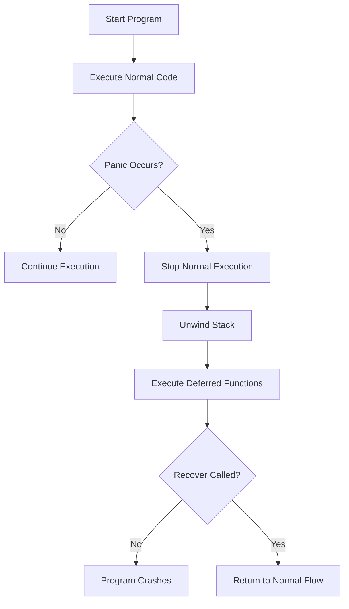

# Go Panic Recovery

## Introduction

When writing Go programs, you'll primarily use error handling with the `error` type for expected error conditions. However, Go also provides a mechanism called **panic** for exceptional situations where normal error handling isn't sufficient. A panic typically indicates a programmer error or an unexpected condition that prevents your program from continuing normally.

The good news is that Go provides a way to recover from panics using the built-in `recover` function, allowing your program to regain control rather than crashing completely. This concept is called **panic recovery** and is an important part of writing robust Go applications.

## Understanding Panics in Go

### What is a Panic?

A panic in Go is similar to exceptions in other programming languages. It's a runtime error that interrupts the normal flow of a program and begins unwinding the stack, executing deferred functions along the way.

Panics can occur in two ways:
1. **Runtime panics**: Automatically triggered by the Go runtime for errors like out-of-bounds array access, nil pointer dereference, or division by zero.
2. **Explicit panics**: Triggered by your code using the `panic()` function.

Here's a simple example of a panic:

```go
package main

import "fmt"

func main() {
    fmt.Println("Starting the program")
    panic("Something went terribly wrong!")
    fmt.Println("This line will never be executed")
}
```

Output:
```
Starting the program
panic: Something went terribly wrong!

goroutine 1 [running]:
main.main()
        /tmp/sandbox2704262651/prog.go:7 +0x95
exit status 2
```

As you can see, when a panic occurs, the program prints the panic message along with a stack trace and then terminates.

## The Recover Mechanism

### What is Recover?

Go provides the built-in `recover()` function that can be used to regain control after a panic. When `recover()` is called within a deferred function, it captures the panic value and returns it, allowing your program to continue execution instead of crashing.

The `recover()` function:
- Must be called inside a deferred function to work
- Returns `nil` if there's no active panic
- Returns the panic value if called during a panic

### Basic Recovery Pattern

Here's the typical pattern for using recover:

```go
package main

import "fmt"

func main() {
    // Deferred function with recover
    defer func() {
        if r := recover(); r != nil {
            fmt.Println("Recovered from panic:", r)
        }
    }()
    
    fmt.Println("Starting the program")
    panic("Something went terribly wrong!")
    fmt.Println("This line will never be executed")
}
```

Output:
```
Starting the program
Recovered from panic: Something went terribly wrong!
```

Notice how the program doesn't crash! The deferred function catches the panic, and the program continues execution.

## How Panic and Recover Work Together

To understand panic and recover better, let's visualize the flow:



When a panic occurs:
1. Normal program execution stops
2. Any deferred functions are executed in LIFO order (last-in, first-out)
3. If any deferred function calls `recover()`, the panic stops propagating
4. If no deferred function recovers the panic, the program crashes

## Practical Examples

### Example 1: Recovering from Array Out of Bounds

```go
package main

import "fmt"

func accessArray(arr []int, index int) {
    // Recover from panic in a deferred function
    defer func() {
        if r := recover(); r != nil {
            fmt.Printf("Recovered from error: %v
", r)
        }
    }()
    
    // This will panic if index is out of bounds
    value := arr[index]
    fmt.Printf("Value at index %d is %d
", index, value)
}

func main() {
    numbers := []int{1, 2, 3, 4, 5}
    
    fmt.Println("Starting array access...")
    
    // Valid access
    accessArray(numbers, 2)
    
    // Invalid access - will cause panic but recover
    accessArray(numbers, 10)
    
    // Program continues executing
    fmt.Println("Program completed successfully!")
}
```

Output:
```
Starting array access...
Value at index 2 is 3
Recovered from error: runtime error: index out of range [10] with length 5
Program completed successfully!
```

### Example 2: Building a Simple Web Server with Panic Recovery

Here's a more practical example showing how to use recover in a web application:

```go
package main

import (
    "fmt"
    "log"
    "net/http"
)

// Middleware to recover from panics in HTTP handlers
func recoverMiddleware(next http.HandlerFunc) http.HandlerFunc {
    return func(w http.ResponseWriter, r *http.Request) {
        defer func() {
            if err := recover(); err != nil {
                log.Printf("Panic occurred: %v", err)
                http.Error(w, "Internal server error", http.StatusInternalServerError)
            }
        }()
        
        next(w, r)
    }
}

// A handler that might panic
func riskyHandler(w http.ResponseWriter, r *http.Request) {
    // Simulate some operation that might panic
    if r.URL.Query().Get("panic") == "true" {
        panic("Something went wrong in the handler!")
    }
    
    fmt.Fprintln(w, "Hello, everything worked fine!")
}

func main() {
    // Register our handler with the recovery middleware
    http.HandleFunc("/risky", recoverMiddleware(riskyHandler))
    
    fmt.Println("Starting server on :8080...")
    log.Fatal(http.ListenAndServe(":8080", nil))
}
```

In this example:
- The `recoverMiddleware` wraps any HTTP handler to catch panics
- If a panic occurs, it logs the error and returns a 500 status code
- The server continues running even if a handler panics

You can test this by:
1. Running the server
2. Visiting `http://localhost:8080/risky` (works normally)
3. Visiting `http://localhost:8080/risky?panic=true` (triggers panic but server recovers)

## Best Practices for Using Panic and Recover

### When to Use Panic and Recover

In Go, the general principle is:
- Use **error returns** for expected error conditions
- Use **panic and recover** for unexpected errors (programmer errors)

Good use cases for panic/recover:
1. **Initialization errors**: When your program cannot start properly
2. **Development/debugging**: To catch errors during development
3. **As a safety net**: To prevent program crashes in critical systems

### Guidelines for Using Panic and Recover

1. **Don't use panic for regular error handling** - Use the standard error pattern instead
2. **Keep panics local** - Try to recover panics close to where they occur
3. **Log panic details** - Always log the panic information when recovering
4. **Consider re-panicking** - Sometimes you should recover, log, and then re-panic
5. **Use in middleware** - In web servers, recover in middleware to prevent crashes

### Re-panicking Example

Sometimes you want to recover to log details but still let the program crash:

```go
package main

import (
    "fmt"
    "log"
)

func handlePanic() {
    defer func() {
        if r := recover(); r != nil {
            // Log the panic
            log.Printf("Panic occurred: %v", r)
            
            // Re-panic to let the program crash
            panic(r)
        }
    }()
    
    doSomethingRisky()
}

func doSomethingRisky() {
    // Simulate a critical error
    panic("Critical system failure")
}

func main() {
    defer func() {
        if r := recover(); r != nil {
            fmt.Println("Main recovered:", r)
        }
    }()
    
    handlePanic()
    
    fmt.Println("This line won't be executed")
}
```

Output:
```
2023/05/10 12:34:56 Panic occurred: Critical system failure
Main recovered: Critical system failure
```

## Advanced Patterns

### Selective Recovery

Sometimes you only want to recover from specific types of panics:

```go
package main

import "fmt"

func recoverSelectively() {
    defer func() {
        if r := recover(); r != nil {
            switch r.(type) {
            case string:
                // Recover from string panics
                fmt.Println("Recovered from string panic:", r)
            case error:
                // Recover from error panics
                fmt.Println("Recovered from error panic:", r)
            default:
                // Re-panic for other types
                fmt.Println("Unknown panic type, re-panicking")
                panic(r)
            }
        }
    }()
    
    // Trigger a string panic
    panic("This is a string panic")
}

func main() {
    recoverSelectively()
    fmt.Println("Program continues")
}
```

Output:
```
Recovered from string panic: This is a string panic
Program continues
```

### Panic in Goroutines

It's important to note that panics don't cross goroutine boundaries. Each goroutine needs its own recovery:

```go
package main

import (
    "fmt"
    "time"
)

func riskyGoroutine() {
    defer func() {
        if r := recover(); r != nil {
            fmt.Println("Recovered in goroutine:", r)
        }
    }()
    
    fmt.Println("Goroutine running...")
    panic("Panic in goroutine!")
}

func main() {
    // Launch a goroutine with a panic
    go riskyGoroutine()
    
    // Give the goroutine time to execute
    time.Sleep(time.Second)
    
    fmt.Println("Main function continues running")
}
```

Output:
```
Goroutine running...
Recovered in goroutine: Panic in goroutine!
Main function continues running
```

## Summary

Go's panic recovery mechanism provides a way to handle exceptional errors while maintaining the robustness of your applications:

- **Panic** indicates a serious problem that interrupts normal program flow
- **Recover** allows you to catch panics and prevent program crashes
- Use deferred functions with recover to implement safety nets
- Panic/recover is not meant to replace normal error handling
- Proper recovery can make your applications more resilient

Remember the Go philosophy: errors are values that should be explicitly handled, while panics are for exceptional cases. Use panic and recover judiciously, and your Go programs will be both robust and maintainable.

## Additional Resources

- [Go Documentation on Defer, Panic, and Recover](https://go.dev/blog/defer-panic-and-recover)
- [Effective Go - Panic](https://go.dev/doc/effective_go#panic)
- [Go by Example: Panic](https://gobyexample.com/panic)
- [Go by Example: Recover](https://gobyexample.com/recover)

## Exercises

1. Write a function that recovers from a divide-by-zero panic
2. Create a program that recovers from different types of panics and handles each differently
3. Implement a middleware for a web server that recovers from panics and logs detailed information about them
4. Write a function that intentionally panics after 5 seconds in a goroutine and demonstrate proper recovery
5. Create a chain of function calls where a panic occurs in the deepest function, and recover it at a higher level