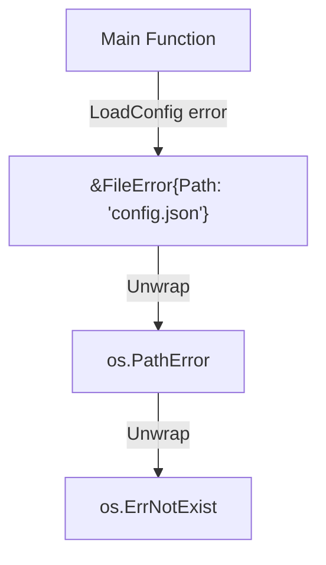

# Go Error Wrapping

## Introduction

Error handling is a critical aspect of writing robust and maintainable Go programs. One of the more powerful techniques in Go's error handling arsenal is **error wrapping**. Introduced in Go 1.13, error wrapping allows you to add context to errors as they propagate up the call stack, making debugging and error handling much more effective.

In this guide, we'll explore:
- What error wrapping is and why it's useful
- How to wrap errors in Go
- How to unwrap errors and extract information
- Real-world examples of error wrapping in action

## What is Error Wrapping?

Error wrapping is the practice of encapsulating an existing error within a new error that provides additional context. This creates a chain of errors that preserves the original error while adding information about where and why the error occurred as it travels up through your program's call stack.

Before error wrapping was standardized in Go 1.13, developers often dealt with errors in less elegant ways:

```go
// Without error wrapping (old approach)
if err != nil {
    return fmt.Errorf("failed to read config file: %v", err)
}
```

While this added some context, it lost the original error's type and any data it contained, making it difficult to programmatically inspect the underlying cause.

## How to Wrap Errors in Go

Go 1.13 introduced the `%w` verb for `fmt.Errorf()` to standardize error wrapping:

```go
// With error wrapping (Go 1.13+)
if err != nil {
    return fmt.Errorf("failed to read config file: %w", err)
}
```

Notice the difference between `%v` and `%w`. The `%w` verb not only formats the error message but also wraps the original error object, preserving its type and any methods or data associated with it.

## The errors Package Functions

Go's standard library `errors` package provides several functions for working with wrapped errors:

### 1. `errors.Is()`

This function checks if an error or any error it wraps matches a specific error value:

```go
// Example of errors.Is()
func processFile(path string) error {
    file, err := os.Open(path)
    if err != nil {
        return fmt.Errorf("failed to open file: %w", err)
    }
    defer file.Close()
    
    // Process file...
    return nil
}

func main() {
    err := processFile("config.json")
    if errors.Is(err, os.ErrNotExist) {
        fmt.Println("The config file doesn't exist!")
    } else if err != nil {
        fmt.Println("A different error occurred:", err)
    }
}
```

**Output if file doesn't exist:**
```
The config file doesn't exist!
```

Without `errors.Is()`, checking for specific error types in a wrapped error would be much more difficult.

### 2. `errors.As()`

This function helps extract a specific error type from an error chain:

```go
// Example of errors.As()
type ValidationError struct {
    Field string
    Message string
}

func (v *ValidationError) Error() string {
    return fmt.Sprintf("validation failed on %s: %s", v.Field, v.Message)
}

func validateUser(user User) error {
    if user.Name == "" {
        return &ValidationError{Field: "name", Message: "cannot be empty"}
    }
    return nil
}

func processUser(user User) error {
    if err := validateUser(user); err != nil {
        return fmt.Errorf("user validation error: %w", err)
    }
    // Process valid user...
    return nil
}

func main() {
    user := User{Name: ""}
    err := processUser(user)
    
    var validationErr *ValidationError
    if errors.As(err, &validationErr) {
        fmt.Printf("Validation error on field: %s
", validationErr.Field)
    } else if err != nil {
        fmt.Println("A different error occurred:", err)
    }
}
```

**Output:**
```
Validation error on field: name
```

The `errors.As()` function allows you to extract and examine the specific error type, even when it's wrapped inside other errors.

### 3. `errors.Unwrap()`

This function extracts the wrapped error:

```go
// Example of errors.Unwrap()
err := processFile("config.json")
wrappedErr := errors.Unwrap(err) // Returns the original os.PathError
```

While you'll typically use `errors.Is()` and `errors.As()` more often, `errors.Unwrap()` can be useful for custom error inspection.

## Creating Custom Error Types with Wrapping

You can create custom error types that support wrapping:

```go
// Example of custom error type with wrapping
type DatabaseError struct {
    Op string
    Err error
}

func (d *DatabaseError) Error() string {
    return fmt.Sprintf("database error during %s: %v", d.Op, d.Err)
}

// Unwrap method to support the error wrapping mechanism
func (d *DatabaseError) Unwrap() error {
    return d.Err
}

// Function that uses our custom error
func queryDatabase(query string) error {
    // Simulate a database error
    err := fmt.Errorf("connection timeout")
    return &DatabaseError{
        Op: "query",
        Err: err,
    }
}

func main() {
    err := queryDatabase("SELECT * FROM users")
    fmt.Println(err) // Output: database error during query: connection timeout
    
    // We can still unwrap to get the inner error
    unwrapped := errors.Unwrap(err)
    fmt.Println(unwrapped) // Output: connection timeout
}
```

By implementing the `Unwrap()` method, your custom error types can participate in the error wrapping mechanism.

## Error Wrapping Best Practices

Here are some best practices for effective error wrapping in Go:

1. **Add context, not redundancy**: Include information that isn't obvious from the error itself
   ```go
   // Good
   return fmt.Errorf("failed to parse config file %s: %w", filename, err)
   
   // Less helpful
   return fmt.Errorf("error: %w", err) // Adds no new information
   ```

2. **Wrap errors at API boundaries**: Particularly useful when crossing between packages or modules
   ```go
   // At package boundary
   func (s *Service) GetUser(id string) (*User, error) {
       user, err := s.repo.FindUser(id)
       if err != nil {
           return nil, fmt.Errorf("service: get user %s: %w", id, err)
       }
       return user, nil
   }
   ```

3. **Use `errors.Is()` and `errors.As()` for error inspection** rather than type assertions or string matching

4. **Consider wrapping with structured errors**: For errors that need to carry additional data

## Real-World Application: File Processing Pipeline

Let's examine a more comprehensive example that demonstrates error wrapping in a file processing pipeline:

```go
package main

import (
    "encoding/json"
    "errors"
    "fmt"
    "io/ioutil"
    "os"
)

// Custom error types
type FileError struct {
    Path string
    Err  error
}

func (f *FileError) Error() string {
    return fmt.Sprintf("file error with %s: %v", f.Path, f.Err)
}

func (f *FileError) Unwrap() error {
    return f.Err
}

type ParseError struct {
    Line int
    Err  error
}

func (p *ParseError) Error() string {
    return fmt.Sprintf("parse error at line %d: %v", p.Line, p.Err)
}

func (p *ParseError) Unwrap() error {
    return p.Err
}

// Config structure
type Config struct {
    Database struct {
        Host string `json:"host"`
        Port int    `json:"port"`
    } `json:"database"`
}

// Function to read and parse config
func LoadConfig(path string) (*Config, error) {
    // Read file
    data, err := ioutil.ReadFile(path)
    if err != nil {
        return nil, &FileError{Path: path, Err: err}
    }
    
    // Parse JSON
    var config Config
    if err := json.Unmarshal(data, &config); err != nil {
        return nil, &ParseError{Line: 1, Err: err} // Line is simplified
    }
    
    // Validate config
    if config.Database.Host == "" {
        return nil, fmt.Errorf("validation error: %w", 
            errors.New("database host cannot be empty"))
    }
    
    return &config, nil
}

func main() {
    config, err := LoadConfig("config.json")
    if err != nil {
        // Check for specific error types
        var fileErr *FileError
        var parseErr *ParseError
        
        switch {
        case errors.As(err, &fileErr):
            if errors.Is(fileErr.Err, os.ErrNotExist) {
                fmt.Println("The config file doesn't exist. Please create it first.")
            } else {
                fmt.Printf("File error: %v
", err)
            }
        case errors.As(err, &parseErr):
            fmt.Printf("Config file has syntax error at line %d
", parseErr.Line)
        default:
            fmt.Printf("Error loading config: %v
", err)
        }
        return
    }
    
    fmt.Printf("Successfully loaded config. Database at %s:%d
", 
        config.Database.Host, config.Database.Port)
}
```

This example demonstrates:
- Custom error types with the `Unwrap()` method
- Adding context to errors at each level
- Using `errors.As()` and `errors.Is()` to check for specific error types
- Providing helpful error messages based on the type of error

## Visualizing Error Wrapping

Error wrapping creates a chain of errors, where each error provides context about where and why it occurred:

