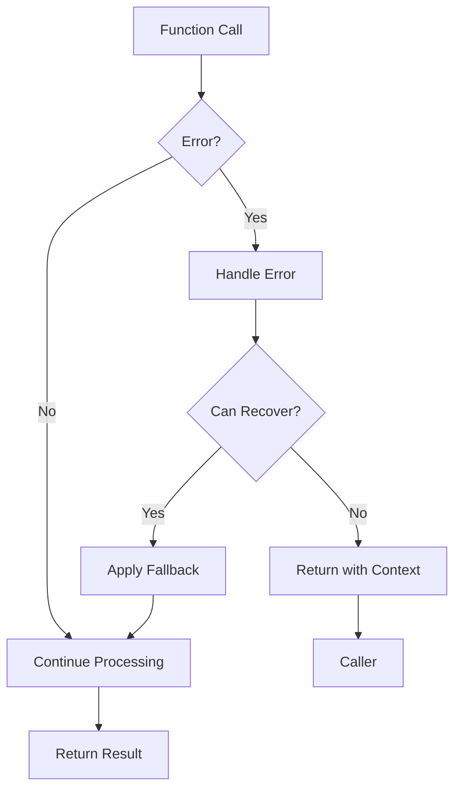

# Go Error Patterns

## Introduction

Error handling is a critical aspect of writing robust and reliable software. In Go, errors are values that can be handled with standard language constructs, making error handling explicit and straightforward. This guide explores common error patterns in Go that will help you write more maintainable and resilient code.

Unlike languages that use exceptions, Go treats errors as normal return values. This approach encourages developers to explicitly check and handle error conditions, leading to more deliberate error management. By understanding these error patterns, you'll be able to write code that gracefully handles failures and provides meaningful feedback to users and developers.

## Basic Error Handling

The most fundamental pattern in Go error handling is checking and handling errors immediately after they occur.

```go
func ReadFile(filename string) ([]byte, error) {
    data, err := os.ReadFile(filename)
    if err != nil {
        return nil, err
    }
    return data, nil
}

func main() {
    data, err := ReadFile("config.json")
    if err != nil {
        fmt.Fprintf(os.Stderr, "Error reading file: %v
", err)
        os.Exit(1)
    }
    // Process data...
}
```

This pattern ensures that errors are not ignored and are properly handled at each step of program execution.

## Error Creation Patterns

### Using errors.New

The simplest way to create an error is with `errors.New()`:

```go
import "errors"

func ValidateUsername(username string) error {
    if len(username) < 3 {
        return errors.New("username too short")
    }
    return nil
}

// Usage
func main() {
    err := ValidateUsername("ab")
    if err != nil {
        fmt.Println(err) // Output: username too short
    }
}
```

### Using fmt.Errorf

For more complex error messages that require formatting:

```go
import "fmt"

func ValidateUsername(username string) error {
    minLength := 3
    if len(username) < minLength {
        return fmt.Errorf("username must be at least %d characters", minLength)
    }
    return nil
}

// Usage
func main() {
    err := ValidateUsername("ab")
    if err != nil {
        fmt.Println(err) // Output: username must be at least 3 characters
    }
}
```

## Sentinel Errors

Sentinel errors are predefined error values that can be checked using equality operators:

```go
import (
    "errors"
    "fmt"
)

var (
    ErrNotFound = errors.New("resource not found")
    ErrPermissionDenied = errors.New("permission denied")
)

func GetResource(id string) (string, error) {
    // Simulate resource not found
    return "", ErrNotFound
}

func main() {
    resource, err := GetResource("resource-123")
    if err != nil {
        if errors.Is(err, ErrNotFound) {
            fmt.Println("Could not find the resource")
        } else {
            fmt.Println("Unexpected error:", err)
        }
    }
}
```

## Custom Error Types

For more sophisticated error handling, you can create custom error types:

```go
type ValidationError struct {
    Field string
    Message string
}

func (e *ValidationError) Error() string {
    return fmt.Sprintf("Validation error on field %s: %s", e.Field, e.Message)
}

func ValidateUser(user User) error {
    if len(user.Username) < 3 {
        return &ValidationError{
            Field: "username",
            Message: "must be at least 3 characters",
        }
    }
    return nil
}

// Usage
func main() {
    user := User{Username: "a"}
    err := ValidateUser(user)
    if err != nil {
        fmt.Println(err) // Output: Validation error on field username: must be at least 3 characters
        
        // Type assertion to access additional error information
        if validationErr, ok := err.(*ValidationError); ok {
            fmt.Printf("Failed field: %s
", validationErr.Field) // Output: Failed field: username
        }
    }
}
```

## Error Wrapping

Go 1.13 introduced error wrapping, allowing errors to be chained while preserving context:

```go
import (
    "errors"
    "fmt"
)

func ReadConfig() error {
    err := ReadFile("config.json")
    if err != nil {
        return fmt.Errorf("failed to read config: %w", err)
    }
    return nil
}

func ReadFile(filename string) error {
    return fmt.Errorf("file not found: %s", filename)
}

func main() {
    err := ReadConfig()
    if err != nil {
        fmt.Println(err) // Output: failed to read config: file not found: config.json
        
        // Unwrap to access the original error
        if wrappedErr := errors.Unwrap(err); wrappedErr != nil {
            fmt.Println("Original error:", wrappedErr) // Output: Original error: file not found: config.json
        }
    }
}
```

The `%w` verb wraps the error, allowing it to be examined later with `errors.Unwrap()`, `errors.Is()`, or `errors.As()`.

## Error Inspection

Go 1.13 also introduced new functions to inspect wrapped errors:

### errors.Is

Used to check if an error or any error it wraps matches a specific error value:

```go
var ErrPermissionDenied = errors.New("permission denied")

func AccessResource() error {
    return fmt.Errorf("cannot access database: %w", ErrPermissionDenied)
}

func main() {
    err := AccessResource()
    if errors.Is(err, ErrPermissionDenied) {
        fmt.Println("Permission issue detected") // This will be printed
    }
}
```

### errors.As

Used to check if an error or any error it wraps is of a specific type:

```go
type NotFoundError struct {
    Resource string
}

func (e *NotFoundError) Error() string {
    return fmt.Sprintf("resource not found: %s", e.Resource)
}

func GetUserData(userID string) error {
    err := &NotFoundError{Resource: "user"}
    return fmt.Errorf("failed to get user data: %w", err)
}

func main() {
    err := GetUserData("user-123")
    
    var notFoundErr *NotFoundError
    if errors.As(err, &notFoundErr) {
        fmt.Printf("Could not find resource: %s
", notFoundErr.Resource) // Output: Could not find resource: user
    }
}
```

## Multiple Error Handling Patterns

### Aggregating Errors

Sometimes, you need to collect multiple errors:

```go
import (
    "errors"
    "fmt"
    "strings"
)

type ErrorList []error

func (el ErrorList) Error() string {
    messages := make([]string, len(el))
    for i, err := range el {
        messages[i] = err.Error()
    }
    return strings.Join(messages, "; ")
}

func ValidateUserData(user User) error {
    var errs ErrorList
    
    if len(user.Username) < 3 {
        errs = append(errs, errors.New("username too short"))
    }
    
    if len(user.Password) < 8 {
        errs = append(errs, errors.New("password too short"))
    }
    
    if !strings.Contains(user.Email, "@") {
        errs = append(errs, errors.New("invalid email format"))
    }
    
    if len(errs) > 0 {
        return errs
    }
    
    return nil
}

// Usage
func main() {
    user := User{
        Username: "a",
        Password: "123",
        Email: "userexample.com",
    }
    
    err := ValidateUserData(user)
    if err != nil {
        fmt.Println(err) // Output: username too short; password too short; invalid email format
    }
}
```

For more sophisticated error aggregation, consider using third-party packages like `github.com/hashicorp/go-multierror` or `github.com/pkg/errors`.

## Error Patterns in Goroutines

Handling errors in concurrent code requires special patterns:

```go
func processItems(items []string) error {
    errorCh := make(chan error, len(items))
    
    // Launch goroutines
    for _, item := range items {
        go func(item string) {
            err := processItem(item)
            errorCh <- err // Send nil or an error
        }(item)
    }
    
    // Collect errors
    var errCount int
    for i := 0; i < len(items); i++ {
        if err := <-errorCh; err != nil {
            errCount++
            fmt.Printf("Error processing item: %v
", err)
        }
    }
    
    if errCount > 0 {
        return fmt.Errorf("%d items failed to process", errCount)
    }
    return nil
}

func processItem(item string) error {
    // Process logic here...
    if item == "bad-item" {
        return errors.New("invalid item")
    }
    return nil
}
```

## Functional Options for Error Handling

For functions with many options that can fail in different ways:

```go
type ServerConfig struct {
    Host string
    Port int
    Timeout int
}

type ServerOption func(*ServerConfig) error

func WithHost(host string) ServerOption {
    return func(config *ServerConfig) error {
        if host == "" {
            return errors.New("host cannot be empty")
        }
        config.Host = host
        return nil
    }
}

func WithPort(port int) ServerOption {
    return func(config *ServerConfig) error {
        if port < 1 || port > 65535 {
            return fmt.Errorf("invalid port number: %d", port)
        }
        config.Port = port
        return nil
    }
}

func NewServer(options ...ServerOption) (*Server, error) {
    config := &ServerConfig{
        Host: "localhost",
        Port: 8080,
        Timeout: 30,
    }
    
    for _, option := range options {
        if err := option(config); err != nil {
            return nil, err
        }
    }
    
    return &Server{Config: config}, nil
}

// Usage
func main() {
    server, err := NewServer(
        WithHost("example.com"),
        WithPort(70000), // Invalid port
    )
    
    if err != nil {
        fmt.Println("Failed to create server:", err)
        // Output: Failed to create server: invalid port number: 70000
    }
}
```

## Best Practices

Here are some best practices for error handling in Go:

1. **Always check errors**: Never ignore returned errors.
2. **Handle errors once**: Process an error at the appropriate level and avoid handling it multiple times.
3. **Provide context**: Wrap errors with additional information to make debugging easier.
4. **Be specific**: Return specific errors that describe what went wrong.
5. **Don't panic**: Use errors instead of panics for expected error conditions.
6. **Log the full error**: When logging errors, include the full error chain to preserve context.
7. **Consider error types**: Use custom error types or wrapped errors for more sophisticated error handling.

## Error Handling Flow

Let's visualize the typical error handling flow in Go:



## Real-World Example: Database Operations

Here's a more comprehensive example showing error handling in a database operation:

```go
package main

import (
    "database/sql"
    "errors"
    "fmt"
    "log"
    
    _ "github.com/go-sql-driver/mysql"
)

var (
    ErrUserNotFound = errors.New("user not found")
    ErrDBConnection = errors.New("database connection error")
)

type User struct {
    ID    int
    Name  string
    Email string
}

func GetUserByID(db *sql.DB, id int) (User, error) {
    var user User
    
    if db == nil {
        return user, ErrDBConnection
    }
    
    query := "SELECT id, name, email FROM users WHERE id = ?"
    err := db.QueryRow(query, id).Scan(&user.ID, &user.Name, &user.Email)
    
    if err != nil {
        if errors.Is(err, sql.ErrNoRows) {
            return user, fmt.Errorf("user with ID %d: %w", id, ErrUserNotFound)
        }
        return user, fmt.Errorf("database query error: %w", err)
    }
    
    return user, nil
}

func main() {
    // Connect to database
    db, err := sql.Open("mysql", "user:password@tcp(127.0.0.1:3306)/mydb")
    if err != nil {
        log.Fatalf("Failed to connect to database: %v", err)
    }
    defer db.Close()
    
    // Try to get a user
    user, err := GetUserByID(db, 123)
    if err != nil {
        if errors.Is(err, ErrUserNotFound) {
            fmt.Println("The user was not found in the database")
        } else if errors.Is(err, ErrDBConnection) {
            fmt.Println("There was a problem connecting to the database")
        } else {
            fmt.Printf("An unexpected error occurred: %v
", err)
        }
        return
    }
    
    fmt.Printf("Found user: %+v
", user)
}
```

## Summary

Go's approach to error handling makes errors explicit and encourages careful consideration of failure conditions. The key patterns to remember are:

1. **Basic error checking** using `if err != nil` constructs
2. **Error creation** with `errors.New()` and `fmt.Errorf()`
3. **Sentinel errors** for expected error conditions
4. **Custom error types** for more detailed error information
5. **Error wrapping** to preserve context with `fmt.Errorf("...%w", err)`
6. **Error inspection** using `errors.Is()` and `errors.As()`
7. **Error aggregation** for collecting multiple errors
8. **Concurrent error handling** in goroutines
9. **Functional options** for handling errors in configuration

By applying these patterns, you'll write Go code that is more robust, easier to debug, and provides better feedback when things go wrong.

## Additional Resources

For further learning, check out these resources:

- [Effective Go: Errors](https://golang.org/doc/effective_go#errors)
- [Go Blog: Error Handling and Go](https://blog.golang.org/error-handling-and-go)
- [Go Blog: Working with Errors in Go 1.13](https://blog.golang.org/go1.13-errors)
- Book: "The Go Programming Language" by Alan A. A. Donovan and Brian W. Kernighan

## Exercises

1. Create a custom error type for validation errors that includes the field name, current value, and reason for failure.
2. Implement a function that reads configuration from multiple sources and aggregates errors.
3. Write a program that launches multiple goroutines and handles errors from each one.
4. Refactor a function to use error wrapping to provide better context for debugging.
5. Implement the functional options pattern for a configuration object with proper error handling.