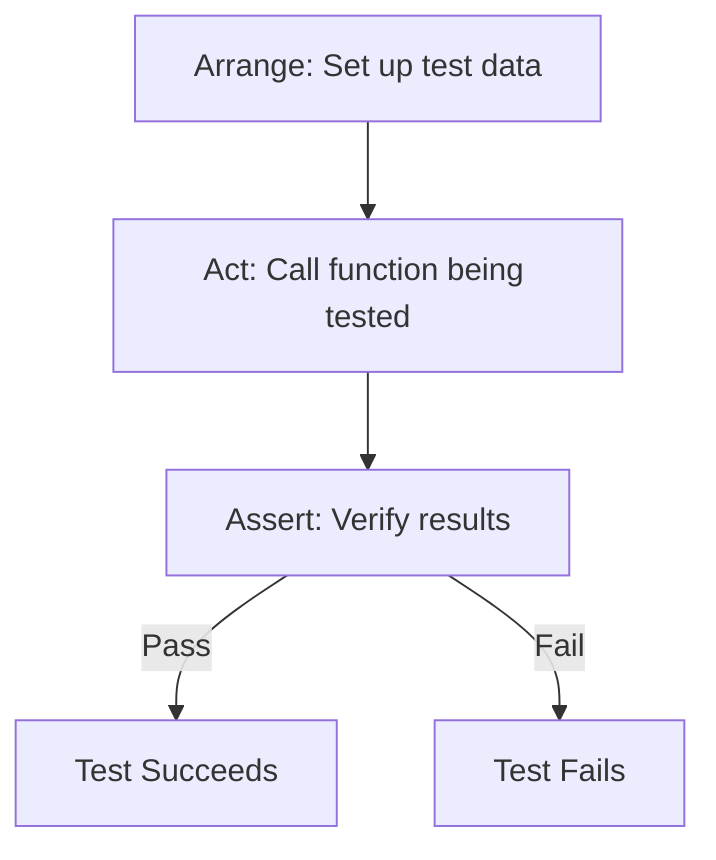

# Go Unit Tests

## Introduction

Unit testing is a fundamental practice in software development that involves testing individual components or "units" of code in isolation to ensure they work as expected. In Go, unit testing is built directly into the language's standard library through the `testing` package, making it straightforward to create and run tests.

This guide will walk you through the basics of writing unit tests in Go, from simple function tests to more complex scenarios. By the end, you'll have a solid understanding of how to test your Go code effectively.

## Why Unit Testing Matters

Before diving into the mechanics, let's understand why unit testing is crucial:

- **Catches bugs early**: Tests help identify issues before they reach production
- **Documents code behavior**: Well-written tests serve as documentation for how functions should work
- **Enables refactoring with confidence**: Tests verify that changes don't break existing functionality
- **Improves code design**: Writing testable code often leads to better architecture

## Getting Started with Go Unit Tests

### Test File Naming Convention

In Go, test files follow a specific naming pattern:

- For a file named `example.go`, the test file should be named `example_test.go`
- Test files are placed in the same package as the code they test

### Writing Your First Test

Let's start with a simple function that adds two integers:

```go
// math.go
package math

func Add(a, b int) int {
    return a + b
}
```

Here's how we would write a test for this function:

```go
// math_test.go
package math

import "testing"

func TestAdd(t *testing.T) {
    // Arrange
    a, b := 2, 3
    expected := 5
    
    // Act
    result := Add(a, b)
    
    // Assert
    if result != expected {
        t.Errorf("Add(%d, %d) = %d; expected %d", a, b, result, expected)
    }
}
```

Let's break down the components:

1. The import statement brings in the `testing` package
2. Test functions must start with the word `Test` followed by a capitalized word
3. Test functions take a single parameter: `t *testing.T`
4. We use the `t.Errorf` method to report test failures

### Running Tests

To run tests, use the `go test` command in your terminal:

```bash
$ go test
PASS
ok      example.com/math   0.002s
```

To see more details, use the `-v` (verbose) flag:

```bash
$ go test -v
=== RUN   TestAdd
--- PASS: TestAdd (0.00s)
PASS
ok      example.com/math   0.002s
```

## Test Structure

A well-structured test typically follows the "AAA" pattern:

1. **Arrange**: Set up the test data and conditions
2. **Act**: Call the function or method being tested
3. **Assert**: Verify the result matches what's expected

Here's a visual representation of this pattern:



## Table-Driven Tests

For functions that need multiple test cases, Go developers commonly use "table-driven tests" - a pattern where multiple test cases are defined in a slice and then executed in a loop:

```go
func TestAdd(t *testing.T) {
    // Define test cases
    testCases := []struct {
        name     string
        a, b     int
        expected int
    }{
        {"positive numbers", 2, 3, 5},
        {"negative numbers", -2, -3, -5},
        {"mixed signs", -2, 3, 1},
        {"zeros", 0, 0, 0},
    }
    
    // Run all test cases
    for _, tc := range testCases {
        t.Run(tc.name, func(t *testing.T) {
            result := Add(tc.a, tc.b)
            if result != tc.expected {
                t.Errorf("Add(%d, %d) = %d; expected %d", 
                         tc.a, tc.b, result, tc.expected)
            }
        })
    }
}
```

The benefits of table-driven tests:
- More concise and maintainable
- Easy to add new test cases
- Clear test names through the use of `t.Run()`

## Testing More Complex Functions

Let's move to a slightly more complex example - a function that divides two numbers but returns an error if dividing by zero:

```go
// math.go
package math

import "errors"

var ErrDivideByZero = errors.New("cannot divide by zero")

func Divide(a, b float64) (float64, error) {
    if b == 0 {
        return 0, ErrDivideByZero
    }
    return a / b, nil
}
```

Testing this function requires checking both the return value and error:

```go
func TestDivide(t *testing.T) {
    testCases := []struct {
        name        string
        a, b        float64
        expected    float64
        expectedErr error
    }{
        {"valid division", 10, 2, 5, nil},
        {"divide by zero", 10, 0, 0, ErrDivideByZero},
        {"negative numbers", -10, -2, 5, nil},
    }
    
    for _, tc := range testCases {
        t.Run(tc.name, func(t *testing.T) {
            result, err := Divide(tc.a, tc.b)
            
            // Check error first
            if tc.expectedErr != nil {
                if err == nil {
                    t.Fatalf("expected error: %v, got nil", tc.expectedErr)
                }
                if err.Error() != tc.expectedErr.Error() {
                    t.Fatalf("expected error: %v, got: %v", tc.expectedErr, err)
                }
                return
            }
            
            // If no error expected, ensure none occurred
            if err != nil {
                t.Fatalf("unexpected error: %v", err)
            }
            
            // Check the actual result
            if result != tc.expected {
                t.Errorf("Divide(%f, %f) = %f; expected %f", 
                         tc.a, tc.b, result, tc.expected)
            }
        })
    }
}
```

Notice how we handle errors in tests:
1. Check for expected errors first
2. Use `t.Fatalf` for critical failures that should stop the test
3. Only check the result if no error was expected

## Testing with Subtests

Go's testing package supports running subtests using `t.Run()`, which we've already seen in our table-driven tests. This approach has several advantages:

- Each subtest gets its own name and can be run individually
- Test setup and teardown can be shared across subtests
- Failures in one subtest don't stop other subtests from running

Here's a more explicit example of using subtests:

```go
func TestMathOperations(t *testing.T) {
    t.Run("Addition", func(t *testing.T) {
        if Add(2, 3) != 5 {
            t.Error("Addition failed")
        }
    })
    
    t.Run("Division", func(t *testing.T) {
        result, err := Divide(10, 2)
        if err != nil {
            t.Fatalf("Unexpected error: %v", err)
        }
        if result != 5 {
            t.Error("Division failed")
        }
    })
}
```

To run just a specific subtest:

```bash
$ go test -run TestMathOperations/Division -v
=== RUN   TestMathOperations
=== RUN   TestMathOperations/Division
--- PASS: TestMathOperations (0.00s)
    --- PASS: TestMathOperations/Division (0.00s)
PASS
```

## Testing Helper Functions

For complex tests, we often need helper functions to reduce repetition. Go provides `t.Helper()` to improve error reporting in these functions:

```go
func checkDivision(t *testing.T, a, b, expected float64) {
    t.Helper() // This marks the function as a helper
    
    result, err := Divide(a, b)
    if err != nil {
        t.Fatalf("Unexpected error: %v", err)
    }
    if result != expected {
        t.Errorf("Divide(%f, %f) = %f; expected %f", a, b, result, expected)
    }
}

func TestDivideWithHelper(t *testing.T) {
    checkDivision(t, 10, 2, 5)
    checkDivision(t, 9, 3, 3)
    checkDivision(t, -8, -4, 2)
}
```

The `t.Helper()` call ensures that error reports point to the line in the test that called the helper, not within the helper itself.

## Test Setup and Teardown

For tests that require setup (like creating temp files or initializing data) and cleanup, we can use `t.Cleanup()`:

```go
func TestWithCleanup(t *testing.T) {
    // Setup
    tempFile, err := os.CreateTemp("", "test")
    if err != nil {
        t.Fatalf("Failed to create temp file: %v", err)
    }
    
    // Register cleanup function
    t.Cleanup(func() {
        os.Remove(tempFile.Name())
    })
    
    // Test code that uses tempFile...
}
```

The cleanup function runs even if the test fails, ensuring resources are properly released.

## Testing Practices in Go

### What to Test

Focus on testing:
- Public API functions
- Complex logic
- Edge cases
- Error conditions
- Boundary conditions

### Test Naming

Use descriptive names that indicate:
- What is being tested
- Under what conditions
- What the expected outcome is

For example: `TestDivide_WithZeroDivisor_ReturnsError`

### TestMain

For package-level setup and teardown, Go provides a special function called `TestMain`:

```go
func TestMain(m *testing.M) {
    // Setup code
    fmt.Println("Setting up tests...")
    
    // Run tests
    exitCode := m.Run()
    
    // Teardown code
    fmt.Println("Cleaning up after tests...")
    
    // Exit with the same code returned by m.Run()
    os.Exit(exitCode)
}
```

This function runs before any tests in the package and is useful for:
- Database initialization
- Server startup/shutdown
- Global resource management

## Real-world Example: Testing a User Service

Let's look at a more practical example - testing a simple user service:

```go
// user.go
package user

import "errors"

type User struct {
    ID   int
    Name string
    Age  int
}

var ErrInvalidAge = errors.New("age must be positive")
var ErrEmptyName = errors.New("name cannot be empty")

type Service struct {
    users map[int]User
    nextID int
}

func NewService() *Service {
    return &Service{
        users: make(map[int]User),
        nextID: 1,
    }
}

func (s *Service) Create(name string, age int) (User, error) {
    if name == "" {
        return User{}, ErrEmptyName
    }
    
    if age <= 0 {
        return User{}, ErrInvalidAge
    }
    
    user := User{
        ID:   s.nextID,
        Name: name,
        Age:  age,
    }
    
    s.users[user.ID] = user
    s.nextID++
    
    return user, nil
}

func (s *Service) Get(id int) (User, bool) {
    user, exists := s.users[id]
    return user, exists
}
```

And here's how we would test it:

```go
// user_test.go
package user

import (
    "testing"
)

func TestUserService_Create(t *testing.T) {
    testCases := []struct {
        name        string
        userName    string
        userAge     int
        expectedErr error
    }{
        {"valid user", "Alice", 25, nil},
        {"empty name", "", 25, ErrEmptyName},
        {"zero age", "Bob", 0, ErrInvalidAge},
        {"negative age", "Charlie", -5, ErrInvalidAge},
    }
    
    for _, tc := range testCases {
        t.Run(tc.name, func(t *testing.T) {
            // Create a fresh service for each test
            service := NewService()
            
            // Act
            user, err := service.Create(tc.userName, tc.userAge)
            
            // Assert - check error
            if tc.expectedErr != nil {
                if err == nil {
                    t.Fatalf("expected error: %v, got nil", tc.expectedErr)
                }
                if err.Error() != tc.expectedErr.Error() {
                    t.Fatalf("expected error: %v, got: %v", tc.expectedErr, err)
                }
                return
            }
            
            // If no error expected, ensure none occurred
            if err != nil {
                t.Fatalf("unexpected error: %v", err)
            }
            
            // Check user fields
            if user.Name != tc.userName {
                t.Errorf("expected name %s, got %s", tc.userName, user.Name)
            }
            
            if user.Age != tc.userAge {
                t.Errorf("expected age %d, got %d", tc.userAge, user.Age)
            }
            
            if user.ID != 1 {
                t.Errorf("expected ID 1 for first user, got %d", user.ID)
            }
            
            // Check that user was actually stored
            storedUser, exists := service.Get(user.ID)
            if !exists {
                t.Error("user was not stored in service")
            }
            
            if storedUser.ID != user.ID {
                t.Errorf("stored user ID %d doesn't match created user ID %d", 
                         storedUser.ID, user.ID)
            }
        })
    }
}

func TestUserService_Get(t *testing.T) {
    service := NewService()
    
    // Create a user
    user, err := service.Create("Test User", 30)
    if err != nil {
        t.Fatalf("Failed to create test user: %v", err)
    }
    
    // Test getting existing user
    t.Run("existing user", func(t *testing.T) {
        foundUser, exists := service.Get(user.ID)
        
        if !exists {
            t.Fatal("user should exist")
        }
        
        if foundUser.ID != user.ID {
            t.Errorf("expected ID %d, got %d", user.ID, foundUser.ID)
        }
        
        if foundUser.Name != "Test User" {
            t.Errorf("expected name 'Test User', got '%s'", foundUser.Name)
        }
    })
    
    // Test getting non-existent user
    t.Run("non-existent user", func(t *testing.T) {
        _, exists := service.Get(999)
        
        if exists {
            t.Error("non-existent user should not be found")
        }
    })
}
```

This example demonstrates how to test multiple aspects of a service with more complex behavior, including:
- Different test cases with various inputs
- Checking both success and error cases
- Verifying that the service properly stores data
- Testing retrieval functionality

## Best Practices for Go Unit Tests

1. **Keep tests simple**: Each test should focus on a specific functionality
2. **Use table-driven tests**: For testing multiple scenarios
3. **Test error cases**: Ensure functions handle edge cases correctly
4. **Use descriptive names**: Make it clear what each test is checking
5. **Avoid testing private implementation details**: Focus on the public API
6. **Don't test the Go standard library**: Assume it works as documented
7. **Mock external dependencies**: For testing code that interacts with databases, APIs, etc.
8. **Aim for test isolation**: Tests shouldn't depend on each other
9. **Monitor test coverage**: Use `go test -cover` to identify untested code

## Test Coverage

Go includes built-in tools to measure test coverage:

```bash
$ go test -cover
PASS
coverage: 85.7% of statements
ok      example.com/math   0.002s
```

For a more detailed view, you can generate a coverage profile and visualize it:

```bash
$ go test -coverprofile=coverage.out
$ go tool cover -html=coverage.out
```

This opens a browser window showing exactly which lines of code are and aren't covered by tests.

## Summary

Unit testing in Go is straightforward thanks to the built-in `testing` package. By following the conventions and patterns we've explored, you can write effective tests that help ensure your code works correctly.

To recap what we've learned:
- Go test files are named with a `_test.go` suffix
- Test functions start with `Test` and take a `*testing.T` parameter
- Table-driven tests help test multiple scenarios efficiently
- The AAA (Arrange-Act-Assert) pattern helps structure tests
- Subtests allow for better organization and selective test running
- Go provides tools like `t.Helper()` and `t.Cleanup()` to make testing easier
- Test coverage can be measured and visualized with built-in tools

## Exercises

To practice what you've learned, try these exercises:

1. Write unit tests for a function that returns the maximum value in a slice of integers
2. Create a table-driven test for a function that checks if a string is a palindrome
3. Write tests for a simple calculator package with add, subtract, multiply, and divide functions
4. Test a function that reads from a file, handling both success and error cases
5. Implement and test a stack data structure with push, pop, and peek operations

## Additional Resources

- [Go Testing Package Documentation](https://pkg.go.dev/testing)
- [Go Blog: Using Subtests and Sub-benchmarks](https://blog.golang.org/subtests)
- [Go Blog: Cover Story (Test Coverage)](https://blog.golang.org/cover)
- [Effective Go: Tests](https://golang.org/doc/effective_go.html#tests)
- [Go by Example: Testing](https://gobyexample.com/testing)
- [The Go Programming Language](https://www.gopl.io/) - Book with an excellent chapter on testing