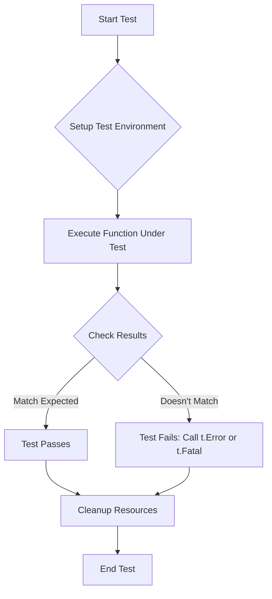

# Go Test Functions

## Introduction

Testing is a critical part of software development that helps ensure your code works as expected. Go comes with a built-in testing framework in its standard library, making it straightforward to write and run tests. In this guide, we'll explore how to create and use test functions in Go, which are the fundamental building blocks of Go's testing infrastructure.

Test functions in Go follow specific conventions that make them recognizable to the Go testing tool. They allow you to validate your code's behavior, catch bugs early, and build confidence in your codebase.

## What Are Go Test Functions?

In Go, a test function:

1. Lives in a file named with the `_test.go` suffix
2. Takes a pointer to `testing.T` as a parameter
3. Is named with the prefix `Test` followed by a name that starts with a capital letter
4. Is part of a package with the same name as the code it tests or with the `_test` suffix

Let's start with a simple example to understand the basics.

## Basic Test Function Example

Imagine we have a simple addition function in a file called `math.go`:

```go
// math.go
package math

// Add returns the sum of two integers
func Add(a, b int) int {
    return a + b
}
```

Now, let's write a test for this function in a file named `math_test.go`:

```go
// math_test.go
package math

import (
    "testing"
)

func TestAdd(t *testing.T) {
    // Arrange
    a, b := 2, 3
    expected := 5
    
    // Act
    result := Add(a, b)
    
    // Assert
    if result != expected {
        t.Errorf("Add(%d, %d) = %d; expected %d", a, b, result, expected)
    }
}
```

### Running the Test

To run the test, navigate to the directory containing your test file and run:

```bash
go test
```

Output:
```
PASS
ok      example/math   0.002s
```

If the test fails, you'd see an error message:

```
--- FAIL: TestAdd (0.00s)
    math_test.go:16: Add(2, 3) = 6; expected 5
FAIL
exit status 1
FAIL    example/math   0.002s
```

## Anatomy of a Test Function

Let's break down the essential components of a Go test function:

1. **Test Function Signature**:
   ```go
   func TestAdd(t *testing.T)
   ```
   - The function name starts with `Test` followed by a capitalized name
   - It takes a single parameter: `t *testing.T`

2. **The testing.T Type**:
   The `*testing.T` parameter gives you access to testing methods like:
   - `t.Error()` / `t.Errorf()`: Log an error and mark the test as failed
   - `t.Fatal()` / `t.Fatalf()`: Log an error, mark the test as failed, and stop execution
   - `t.Log()` / `t.Logf()`: Log information without failing the test
   - `t.Skip()` / `t.Skipf()`: Skip the current test

3. **Assertions**:
   Go doesn't have built-in assertions, so we typically use conditional statements and error reporting:
   ```go
   if result != expected {
       t.Errorf("Add(%d, %d) = %d; expected %d", a, b, result, expected)
   }
   ```

## Table-Driven Tests

One of Go's testing best practices is to use table-driven tests. This approach lets you test multiple inputs and expected outputs within a single test function.

```go
func TestAdd_TableDriven(t *testing.T) {
    // Define test cases
    testCases := []struct {
        name     string
        a, b     int
        expected int
    }{
        {"Positive numbers", 2, 3, 5},
        {"Zero and positive", 0, 5, 5},
        {"Negative numbers", -2, -3, -5},
        {"Mixed signs", -2, 5, 3},
    }

    // Run all test cases
    for _, tc := range testCases {
        t.Run(tc.name, func(t *testing.T) {
            result := Add(tc.a, tc.b)
            if result != tc.expected {
                t.Errorf("Add(%d, %d) = %d; expected %d", 
                          tc.a, tc.b, result, tc.expected)
            }
        })
    }
}
```

This approach has several advantages:
- Organized test cases with clear names
- Easy to add new test cases
- Each case can be run individually
- Failures show which specific case failed

Running this test with `go test -v` will show:

```
=== RUN   TestAdd_TableDriven
=== RUN   TestAdd_TableDriven/Positive_numbers
=== RUN   TestAdd_TableDriven/Zero_and_positive
=== RUN   TestAdd_TableDriven/Negative_numbers
=== RUN   TestAdd_TableDriven/Mixed_signs
--- PASS: TestAdd_TableDriven (0.00s)
    --- PASS: TestAdd_TableDriven/Positive_numbers (0.00s)
    --- PASS: TestAdd_TableDriven/Zero_and_positive (0.00s)
    --- PASS: TestAdd_TableDriven/Negative_numbers (0.00s)
    --- PASS: TestAdd_TableDriven/Mixed_signs (0.00s)
PASS
```

## Testing More Complex Functions

Let's test a slightly more complex function that validates email addresses:

```go
// validator.go
package validator

import (
    "regexp"
    "strings"
)

// IsValidEmail checks if the provided string is a valid email
func IsValidEmail(email string) bool {
    // Remove spaces
    email = strings.TrimSpace(email)
    
    // Basic email pattern
    pattern := `^[a-zA-Z0-9._%+-]+@[a-zA-Z0-9.-]+\.[a-zA-Z]{2,}$`
    
    // Compile and match
    re := regexp.MustCompile(pattern)
    return re.MatchString(email)
}
```

And now the test:

```go
// validator_test.go
package validator

import (
    "testing"
)

func TestIsValidEmail(t *testing.T) {
    testCases := []struct {
        name     string
        email    string
        expected bool
    }{
        {"Valid email", "user@example.com", true},
        {"Valid email with numbers", "user123@example.com", true},
        {"Valid email with special chars", "user.name+tag@example.com", true},
        {"No @ symbol", "userexample.com", false},
        {"No domain", "user@", false},
        {"No username", "@example.com", false},
        {"Invalid TLD", "user@example.c", false},
        {"With spaces", "  user@example.com  ", true}, // should trim spaces
    }
    
    for _, tc := range testCases {
        t.Run(tc.name, func(t *testing.T) {
            result := IsValidEmail(tc.email)
            if result != tc.expected {
                t.Errorf("IsValidEmail(%q) = %v; expected %v", 
                          tc.email, result, tc.expected)
            }
        })
    }
}
```

## Subtest Functions with `t.Run()`

As shown in the table-driven test examples, Go allows you to create subtests using `t.Run()`. This is useful for:

1. Grouping related test cases
2. Creating setup and teardown logic
3. Running specific subtests with `go test -run`

```go
func TestExample(t *testing.T) {
    // Setup code
    data := setupTestData()
    
    // Clean up when done
    defer cleanupTestData()
    
    t.Run("FirstCase", func(t *testing.T) {
        // Test the first case
        if !checkCondition1(data) {
            t.Error("First condition failed")
        }
    })
    
    t.Run("SecondCase", func(t *testing.T) {
        // Test the second case
        if !checkCondition2(data) {
            t.Error("Second condition failed")
        }
    })
}
```

## Parallel Testing

Go allows tests to run in parallel, which can significantly speed up your test suite:

```go
func TestParallel(t *testing.T) {
    t.Run("Group1", func(t *testing.T) {
        t.Parallel() // This test will run in parallel with others
        // Test code here
    })
    
    t.Run("Group2", func(t *testing.T) {
        t.Parallel() // This test will run in parallel with others
        // Test code here
    })
}
```

## Test Helper Functions

When you have common test logic, you can create helper functions. Mark them with `t.Helper()` so that error messages point to the calling test, not the helper:

```go
func assertEquality(t *testing.T, got, want interface{}) {
    t.Helper() // Mark this as a helper function
    if got != want {
        t.Errorf("Got %v, want %v", got, want)
    }
}

func TestWithHelper(t *testing.T) {
    result := Add(2, 3)
    assertEquality(t, result, 5) // Error will point to this line, not inside the helper
}
```

## Testing Edge Cases

Good test functions should cover edge cases. For a numerical function, that might include:

```go
func TestAdd_EdgeCases(t *testing.T) {
    testCases := []struct {
        name     string
        a, b     int
        expected int
    }{
        {"Max integers", int(^uint(0)>>1), 1, int(^uint(0)>>1)}, // This will overflow
        {"Min integers", -int(^uint(0)>>1)-1, -1, -int(^uint(0)>>1)}, // This will overflow
        {"Large difference", 1000000, -1000000, 0},
    }
    
    for _, tc := range testCases {
        t.Run(tc.name, func(t *testing.T) {
            if tc.name == "Max integers" || tc.name == "Min integers" {
                t.Skip("Skipping overflow tests for now")
            }
            
            result := Add(tc.a, tc.b)
            if result != tc.expected {
                t.Errorf("Add(%d, %d) = %d; expected %d", 
                          tc.a, tc.b, result, tc.expected)
            }
        })
    }
}
```

## Test Setup and Teardown

Go doesn't have built-in setup/teardown hooks like some testing frameworks, but you can achieve similar functionality:

```go
func TestWithSetupAndTeardown(t *testing.T) {
    // Setup
    resource := createTestResource()
    defer cleanupTestResource(resource) // Teardown
    
    // Test using the resource
    result := resource.Process()
    if result != "expected" {
        t.Errorf("Got %q, want %q", result, "expected")
    }
}
```

## Best Practices for Go Test Functions

1. **Name tests clearly**: Use descriptive names like `TestUserRegistration_ValidInput`.
2. **Keep tests independent**: Each test should run independently without relying on others.
3. **Test one thing per function**: Focus each test on a specific behavior.
4. **Use table-driven tests**: For multiple similar test cases.
5. **Test both happy paths and error cases**: Don't just test when things work.
6. **Keep tests simple**: Complex test logic can have its own bugs.
7. **Test exported functionality**: Focus on testing the public API.
8. **Use `testdata` directory**: For test fixtures.
9. **Use `t.Parallel()` when appropriate**: Speed up test execution.
10. **Use test coverage**: Run `go test -cover` to identify untested code.

## Example Workflow

Let's tie everything together with a real-world example. Imagine we're building a user service:

```go
// user/service.go
package user

import (
    "errors"
    "regexp"
    "strings"
)

type User struct {
    ID    int
    Name  string
    Email string
}

type Service struct {
    users map[int]User
    nextID int
}

func NewService() *Service {
    return &Service{
        users: make(map[int]User),
        nextID: 1,
    }
}

func (s *Service) Create(name, email string) (User, error) {
    // Validate input
    name = strings.TrimSpace(name)
    if name == "" {
        return User{}, errors.New("name cannot be empty")
    }
    
    email = strings.TrimSpace(email)
    if !isValidEmail(email) {
        return User{}, errors.New("invalid email format")
    }
    
    // Create user
    user := User{
        ID:    s.nextID,
        Name:  name,
        Email: email,
    }
    
    // Save user
    s.users[user.ID] = user
    s.nextID++
    
    return user, nil
}

func (s *Service) Get(id int) (User, error) {
    user, exists := s.users[id]
    if !exists {
        return User{}, errors.New("user not found")
    }
    return user, nil
}

func isValidEmail(email string) bool {
    pattern := `^[a-zA-Z0-9._%+-]+@[a-zA-Z0-9.-]+\.[a-zA-Z]{2,}$`
    re := regexp.MustCompile(pattern)
    return re.MatchString(email)
}
```

And now the test file:

```go
// user/service_test.go
package user

import (
    "testing"
)

func TestService_Create(t *testing.T) {
    t.Run("Valid user creation", func(t *testing.T) {
        // Arrange
        service := NewService()
        name := "John Doe"
        email := "john@example.com"
        
        // Act
        user, err := service.Create(name, email)
        
        // Assert
        if err != nil {
            t.Fatalf("Expected no error, got %v", err)
        }
        
        if user.ID != 1 {
            t.Errorf("Expected ID 1, got %d", user.ID)
        }
        
        if user.Name != name {
            t.Errorf("Expected name %q, got %q", name, user.Name)
        }
        
        if user.Email != email {
            t.Errorf("Expected email %q, got %q", email, user.Email)
        }
    })
    
    t.Run("Empty name", func(t *testing.T) {
        // Arrange
        service := NewService()
        name := "   "  // Empty after trimming
        email := "john@example.com"
        
        // Act
        _, err := service.Create(name, email)
        
        // Assert
        if err == nil {
            t.Error("Expected error for empty name, got nil")
        }
    })
    
    t.Run("Invalid email", func(t *testing.T) {
        // Arrange
        service := NewService()
        name := "John Doe"
        email := "not-an-email"
        
        // Act
        _, err := service.Create(name, email)
        
        // Assert
        if err == nil {
            t.Error("Expected error for invalid email, got nil")
        }
    })
}

func TestService_Get(t *testing.T) {
    // Setup
    service := NewService()
    user, _ := service.Create("John Doe", "john@example.com")
    
    t.Run("Get existing user", func(t *testing.T) {
        // Act
        foundUser, err := service.Get(user.ID)
        
        // Assert
        if err != nil {
            t.Fatalf("Expected no error, got %v", err)
        }
        
        if foundUser.ID != user.ID {
            t.Errorf("Expected ID %d, got %d", user.ID, foundUser.ID)
        }
    })
    
    t.Run("Get non-existent user", func(t *testing.T) {
        // Act
        _, err := service.Get(999)
        
        // Assert
        if err == nil {
            t.Error("Expected error for non-existent user, got nil")
        }
    })
}
```

## Test Visualization

Here's a diagram representing the flow of a typical Go test function:



## Summary

Go test functions are a powerful and straightforward way to verify your code's correctness. In this guide, we've covered:

- The basic structure of a Go test function
- How to write simple unit tests
- Table-driven tests for multiple test cases
- Subtests with `t.Run()`
- Parallel testing for improved performance
- Helper functions to reduce duplication
- Testing edge cases and handling errors
- Best practices for effective Go testing

By following these patterns and practices, you can build a comprehensive test suite that gives you confidence in your Go code.

## Additional Resources

- [Go Testing Package Documentation](https://golang.org/pkg/testing/)
- [Go Blog: Using Subtests and Sub-benchmarks](https://blog.golang.org/subtests)
- [Go Blog: Testable Examples in Go](https://blog.golang.org/examples)
- [Write good unit tests for Go](https://bitfieldconsulting.com/golang/test-summary)

## Exercises

1. Write a test function for a function that reverses a string.
2. Create a table-driven test for a function that converts temperatures between Celsius and Fahrenheit.
3. Write a test that uses `t.Parallel()` to run multiple subtests in parallel.
4. Create a test for a function that reads data from a file, using a temporary test file.
5. Write tests that cover edge cases for a function that divides two numbers.