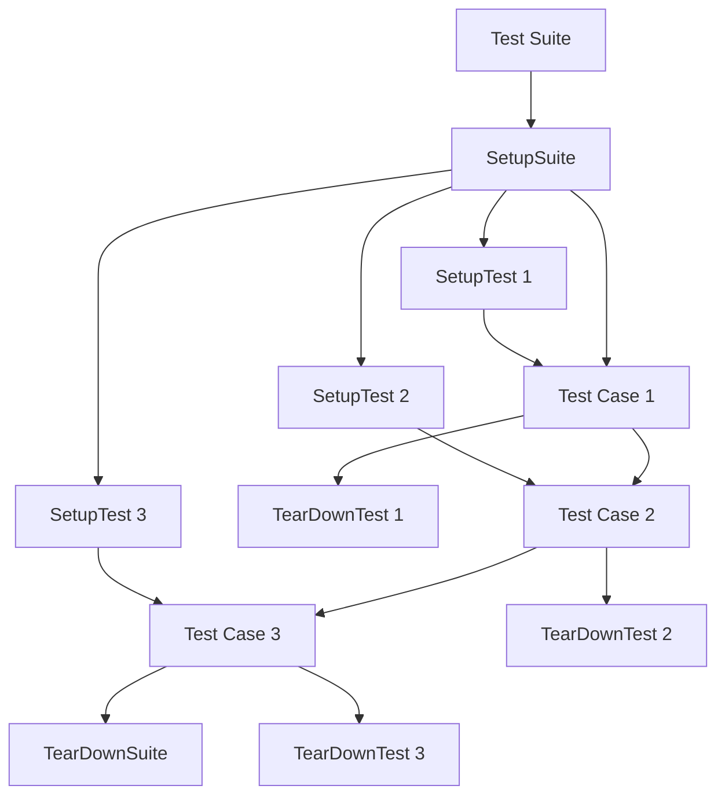

# Go Test Suites

## Introduction

When your Go application grows in complexity, managing individual test functions can become challenging. Test suites provide a structured way to organize related tests, share setup and teardown code, and control test execution. In this tutorial, we'll explore how to create and use test suites in Go.

While Go's standard testing package doesn't explicitly include the concept of "test suites," developers have established patterns and third-party libraries to implement this functionality. We'll cover both approaches: using Go's built-in features and using the popular `testify` suite package.

## What is a Test Suite?

A test suite is a collection of related test cases that are grouped together. These tests typically:

- Test related functionality
- Share common setup and teardown code
- Require similar resources or configurations
- Need to be run together or in a specific order

Test suites help you organize tests logically, reduce code duplication, and provide cleaner test output.

## Creating Test Suites with Go's Standard Library

Go's standard library provides features that can be used to create simple test suites without external dependencies.

### Using Subtests to Group Related Tests

The `t.Run()` function allows you to create subtests, which can effectively serve as a test suite:

```go
func TestUserOperations(t *testing.T) {
    // Setup code for all tests
    db := setupTestDatabase()
    defer cleanupTestDatabase(db)
    
    // Subtest 1
    t.Run("CreateUser", func(t *testing.T) {
        user := createTestUser(db, "alice")
        if user.ID == 0 {
            t.Errorf("Expected user ID to be set, got 0")
        }
    })
    
    // Subtest 2
    t.Run("GetUser", func(t *testing.T) {
        user := createTestUser(db, "bob")
        fetchedUser, err := getUser(db, user.ID)
        if err != nil {
            t.Errorf("Failed to get user: %v", err)
        }
        if fetchedUser.Name != "bob" {
            t.Errorf("Expected name 'bob', got '%s'", fetchedUser.Name)
        }
    })
    
    // Subtest 3
    t.Run("DeleteUser", func(t *testing.T) {
        user := createTestUser(db, "charlie")
        err := deleteUser(db, user.ID)
        if err != nil {
            t.Errorf("Failed to delete user: %v", err)
        }
        
        _, err = getUser(db, user.ID)
        if err == nil {
            t.Errorf("Expected error when getting deleted user, got nil")
        }
    })
}
```

In this example, `TestUserOperations` serves as a test suite containing three related subtests. They share the same database setup and teardown code.

### Running Specific Subtests

You can run specific subtests using the `-run` flag with a pattern:

```bash
go test -run=TestUserOperations/CreateUser
```

This would run only the `CreateUser` subtest within the `TestUserOperations` test suite.

### Using Test Helper Functions

Another approach is to use helper functions to create a suite-like structure:

```go
type userTestSuite struct {
    db *Database
}

func setupUserTestSuite() *userTestSuite {
    return &userTestSuite{
        db: setupTestDatabase(),
    }
}

func (s *userTestSuite) teardown() {
    cleanupTestDatabase(s.db)
}

func TestUserCreation(t *testing.T) {
    suite := setupUserTestSuite()
    defer suite.teardown()
    
    user := createTestUser(suite.db, "alice")
    if user.ID == 0 {
        t.Errorf("Expected user ID to be set, got 0")
    }
}

func TestUserRetrieval(t *testing.T) {
    suite := setupUserTestSuite()
    defer suite.teardown()
    
    user := createTestUser(suite.db, "bob")
    fetchedUser, err := getUser(suite.db, user.ID)
    if err != nil {
        t.Errorf("Failed to get user: %v", err)
    }
    if fetchedUser.Name != "bob" {
        t.Errorf("Expected name 'bob', got '%s'", fetchedUser.Name)
    }
}
```

## Creating Test Suites with Testify

The [github.com/stretchr/testify/suite](https://pkg.go.dev/github.com/stretchr/testify/suite) package provides a more structured way to create test suites in Go.

### Installation

First, install the testify package:

```bash
go get github.com/stretchr/testify/suite
```

### Basic Suite Structure

Here's how to create a basic test suite using testify:

```go
package user

import (
    "testing"
    
    "github.com/stretchr/testify/suite"
)

// UserTestSuite defines a test suite for user-related functionality
type UserTestSuite struct {
    suite.Suite
    db *Database
}

// SetupSuite runs once before all tests in the suite
func (s *UserTestSuite) SetupSuite() {
    s.db = setupTestDatabase()
}

// TearDownSuite runs once after all tests in the suite
func (s *UserTestSuite) TearDownSuite() {
    cleanupTestDatabase(s.db)
}

// SetupTest runs before each test
func (s *UserTestSuite) SetupTest() {
    // Add any per-test setup code here
    s.db.Exec("DELETE FROM users")
}

// TestCreateUser tests user creation
func (s *UserTestSuite) TestCreateUser() {
    user := createTestUser(s.db, "alice")
    s.NotEqual(0, user.ID, "User ID should be set")
}

// TestGetUser tests user retrieval
func (s *UserTestSuite) TestGetUser() {
    user := createTestUser(s.db, "bob")
    fetchedUser, err := getUser(s.db, user.ID)
    s.NoError(err, "Should fetch user without error")
    s.Equal("bob", fetchedUser.Name, "Fetched username should match")
}

// TestDeleteUser tests user deletion
func (s *UserTestSuite) TestDeleteUser() {
    user := createTestUser(s.db, "charlie")
    err := deleteUser(s.db, user.ID)
    s.NoError(err, "Should delete user without error")
    
    _, err = getUser(s.db, user.ID)
    s.Error(err, "Should get error when fetching deleted user")
}

// TestUserSuite runs the test suite
func TestUserSuite(t *testing.T) {
    suite.Run(t, new(UserTestSuite))
}
```

### Suite Lifecycle Methods

Testify's suite package provides several lifecycle methods:

1. `SetupSuite`: Runs once before any test in the suite
2. `TearDownSuite`: Runs once after all tests in the suite
3. `SetupTest`: Runs before each test method
4. `TearDownTest`: Runs after each test method

These methods help manage resources and ensure a clean state for each test.

### Running Testify Suites

Run your suite like any other Go test:

```bash
go test -v ./user
```

The `-v` flag provides verbose output, showing each test in the suite:

```
=== RUN   TestUserSuite
=== RUN   TestUserSuite/TestCreateUser
=== RUN   TestUserSuite/TestGetUser
=== RUN   TestUserSuite/TestDeleteUser
--- PASS: TestUserSuite (0.15s)
    --- PASS: TestUserSuite/TestCreateUser (0.03s)
    --- PASS: TestUserSuite/TestGetUser (0.05s)
    --- PASS: TestUserSuite/TestDeleteUser (0.07s)
PASS
```

## Real-World Example: API Test Suite

Let's look at a more practical example testing a REST API:

```go
package api

import (
    "net/http"
    "net/http/httptest"
    "testing"
    
    "github.com/gin-gonic/gin"
    "github.com/stretchr/testify/suite"
)

// APITestSuite tests our API endpoints
type APITestSuite struct {
    suite.Suite
    router *gin.Engine
    server *httptest.Server
}

// SetupSuite initializes the test suite
func (s *APITestSuite) SetupSuite() {
    // Set Gin to test mode
    gin.SetMode(gin.TestMode)
    
    // Create a router with our API routes
    s.router = setupRouter()
    
    // Create a test server
    s.server = httptest.NewServer(s.router)
}

// TearDownSuite cleans up resources
func (s *APITestSuite) TearDownSuite() {
    s.server.Close()
}

// TestGetUserEndpoint tests the GET /users/:id endpoint
func (s *APITestSuite) TestGetUserEndpoint() {
    // Create a test user first
    userID := createTestUserViaAPI(s.server.URL)
    
    // Test getting the user
    resp, err := http.Get(s.server.URL + "/users/" + userID)
    s.NoError(err, "HTTP request should not error")
    defer resp.Body.Close()
    
    s.Equal(http.StatusOK, resp.StatusCode, "Status code should be 200 OK")
    
    // Verify response body
    var user User
    err = json.NewDecoder(resp.Body).Decode(&user)
    s.NoError(err, "Should decode JSON response")
    s.Equal(userID, user.ID, "User ID should match")
}

// TestCreateUserEndpoint tests the POST /users endpoint
func (s *APITestSuite) TestCreateUserEndpoint() {
    // Create user payload
    userData := map[string]string{
        "name": "alice",
        "email": "alice@example.com",
    }
    jsonData, _ := json.Marshal(userData)
    
    // Send request
    resp, err := http.Post(
        s.server.URL+"/users",
        "application/json",
        bytes.NewBuffer(jsonData),
    )
    s.NoError(err, "HTTP request should not error")
    defer resp.Body.Close()
    
    s.Equal(http.StatusCreated, resp.StatusCode, "Status code should be 201 Created")
    
    // Verify response
    var response map[string]string
    err = json.NewDecoder(resp.Body).Decode(&response)
    s.NoError(err, "Should decode JSON response")
    s.Contains(response, "id", "Response should contain user ID")
}

// TestAPITestSuite runs the API test suite
func TestAPITestSuite(t *testing.T) {
    suite.Run(t, new(APITestSuite))
}
```

## Organizing Multiple Test Suites

For larger projects, you might have multiple test suites. Here's how to organize them:

```go
package tests

import (
    "testing"
    
    "github.com/stretchr/testify/suite"
)

// Run all test suites
func TestAllSuites(t *testing.T) {
    // Run user tests
    t.Run("UserSuite", func(t *testing.T) {
        suite.Run(t, new(UserTestSuite))
    })
    
    // Run API tests
    t.Run("APISuite", func(t *testing.T) {
        suite.Run(t, new(APITestSuite))
    })
    
    // Run database tests
    t.Run("DBSuite", func(t *testing.T) {
        suite.Run(t, new(DatabaseTestSuite))
    })
}
```

This allows you to run all suites with a single command or run them individually.

## Visualizing Test Suite Structure

Here's a diagram showing the relationship between test suites, test cases, and setup/teardown methods:



## Best Practices for Test Suites

1. **Group related tests**: Keep tests that share resources or test related functionality in the same suite.

2. **Use descriptive names**: Name your test suites and methods clearly to indicate what they're testing.

3. **Clean up resources**: Always clean up resources in teardown methods to prevent test pollution.

4. **Keep suites focused**: Don't try to test too many different things in a single suite.

5. **Avoid dependencies between tests**: Each test should be able to run independently, even within a suite.

6. **Use parallel execution when possible**: If your tests are truly independent, enable parallel execution:

```go
func TestMain(m *testing.M) {
    // Set up global test environment
    
    // Enable parallel test execution
    flag.Parse()
    if *parallel {
        runtime.GOMAXPROCS(runtime.NumCPU())
    }
    
    // Run tests
    os.Exit(m.Run())
}
```

7. **Use table-driven tests within suites**: Combine the power of table-driven tests with suites:

```go
func (s *MathTestSuite) TestAddition() {
    testCases := []struct {
        name     string
        a, b     int
        expected int
    }{
        {"positive numbers", 2, 3, 5},
        {"negative numbers", -2, -3, -5},
        {"mixed signs", 2, -3, -1},
    }
    
    for _, tc := range testCases {
        s.Run(tc.name, func() {
            result := Add(tc.a, tc.b)
            s.Equal(tc.expected, result, "Addition result should match expected")
        })
    }
}
```

## Summary

Test suites in Go provide a structured way to organize your tests, share setup and teardown code, and control test execution. While Go's standard library doesn't include explicit test suite functionality, you can create effective test suites using subtests or helper functions. For more complex testing scenarios, the testify suite package offers a comprehensive solution with lifecycle methods and assertions.

By organizing your tests into suites, you'll improve:
- Test maintainability
- Code reuse
- Test clarity
- Resource management

## Exercises

1. Convert a set of related test functions into a test suite using Go's standard library.
2. Implement a test suite using the testify package for a simple CRUD application.
3. Create a test suite that tests a REST API with setup and teardown methods.
4. Write a test suite that uses table-driven tests for multiple test cases.
5. Organize multiple test suites for a larger application with different components.

## Additional Resources

- [Go Testing Package Documentation](https://golang.org/pkg/testing/)
- [Testify Suite Package](https://pkg.go.dev/github.com/stretchr/testify/suite)
- [Effective Go: Testing](https://golang.org/doc/effective_go#testing)
- [Go by Example: Testing](https://gobyexample.com/testing)
- [Advanced Testing in Go](https://speakerdeck.com/mitchellh/advanced-testing-in-go)