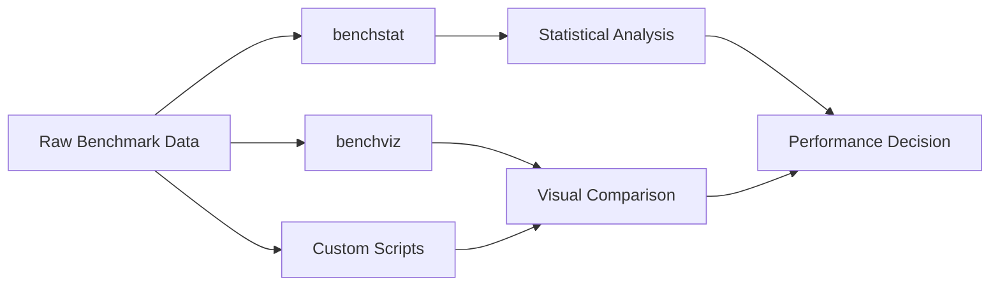

# Go Benchmarking

## Introduction

When developing applications, it's important not only to ensure your code works correctly but also that it performs efficiently. Go provides built-in benchmarking tools as part of its testing package, making it easy to measure and compare the performance of your code.

Benchmarking in Go allows you to:
- Measure execution time of functions
- Compare different implementations
- Identify performance bottlenecks
- Make data-driven optimization decisions

This guide will walk you through the fundamentals of Go benchmarking, from writing basic benchmarks to interpreting results and implementing real-world performance optimizations.

## Benchmarking Basics

### Setting Up Your First Benchmark

In Go, benchmarks are functions that live in `*_test.go` files, just like tests. The key differences are:

1. Benchmark functions start with `Benchmark` instead of `Test`
2. They take a `*testing.B` parameter instead of `*testing.T`
3. They measure performance rather than correctness

Let's create a simple benchmark:

```go
// main.go
package main

func Fibonacci(n int) int {
    if n <= 1 {
        return n
    }
    return Fibonacci(n-1) + Fibonacci(n-2)
}
```

```go
// main_test.go
package main

import "testing"

func BenchmarkFibonacci(b *testing.B) {
    // Run the Fibonacci function b.N times
    for i := 0; i < b.N; i++ {
        Fibonacci(10)
    }
}
```

### Running Benchmarks

To run a benchmark, use the `go test` command with the `-bench` flag:

```bash
go test -bench=.
```

Output:
```
goos: linux
goarch: amd64
BenchmarkFibonacci-8       702256              1693 ns/op
PASS
ok      example.com/myproject     1.425s
```

Let's break down this output:
- `BenchmarkFibonacci-8`: Name of the benchmark function followed by the number of CPUs used
- `702256`: Number of iterations executed
- `1693 ns/op`: Average time per operation in nanoseconds
- `PASS`: Indicates the benchmark ran without errors
- `1.425s`: Total time taken to run all benchmarks

### The b.N Loop

The `b.N` loop is a fundamental part of Go's benchmarking. The testing framework:

1. First tries `b.N = 1`
2. Then increases `b.N` until the benchmark runs long enough for reliable timing
3. Adjusts iterations automatically based on how fast your function runs

This adaptive approach ensures that both fast and slow functions can be benchmarked accurately.

## Advanced Benchmarking Techniques

### Benchmarking with Input Data

Often you'll want to benchmark how your function performs with different inputs:

```go
func BenchmarkFibonacciWithInput(b *testing.B) {
    for n := 5; n <= 10; n++ {
        b.Run(fmt.Sprintf("input=%d", n), func(b *testing.B) {
            for i := 0; i < b.N; i++ {
                Fibonacci(n)
            }
        })
    }
}
```

Output:
```
BenchmarkFibonacciWithInput/input=5-8         10000000          113 ns/op
BenchmarkFibonacciWithInput/input=6-8          5000000          215 ns/op
BenchmarkFibonacciWithInput/input=7-8          3000000          357 ns/op
BenchmarkFibonacciWithInput/input=8-8          2000000          582 ns/op
BenchmarkFibonacciWithInput/input=9-8          1000000          944 ns/op
BenchmarkFibonacciWithInput/input=10-8          500000         1698 ns/op
```

This shows how performance scales with different inputs, providing valuable insights for optimization.

### Measuring Memory Allocations

Go benchmarks can also measure memory allocations:

```go
func BenchmarkSliceAppend(b *testing.B) {
    b.ReportAllocs() // Enable allocation reporting
    for i := 0; i < b.N; i++ {
        s := make([]int, 0)
        for j := 0; j < 100; j++ {
            s = append(s, j)
        }
    }
}
```

Output:
```
BenchmarkSliceAppend-8    1000000        1234 ns/op    1024 B/op    8 allocs/op
```

The additional metrics tell us:
- `1024 B/op`: Bytes allocated per operation
- `8 allocs/op`: Number of heap allocations per operation

### Avoiding Benchmark Pitfalls

To ensure accurate benchmarks:

#### 1. Reset the timer for setup

```go
func BenchmarkComplexOperation(b *testing.B) {
    // Setup phase
    data := generateLargeTestData()
    
    b.ResetTimer() // Reset timer before the actual benchmark
    
    for i := 0; i < b.N; i++ {
        processData(data)
    }
}
```

#### 2. Prevent compiler optimizations

```go
func BenchmarkComputation(b *testing.B) {
    var result int
    for i := 0; i < b.N; i++ {
        result = complexCalculation(10)
    }
    // Use the result to prevent the compiler from optimizing it away
    benchmarkResult = result
}
```

## Comparative Benchmarking

One of the most valuable uses of benchmarking is comparing different implementations.

### Example: Comparing String Concatenation Methods

```go
func BenchmarkStringConcat(b *testing.B) {
    b.Run("plus-operator", func(b *testing.B) {
        var s string
        for i := 0; i < b.N; i++ {
            s = ""
            for j := 0; j < 100; j++ {
                s = s + "a"
            }
        }
    })

    b.Run("strings-builder", func(b *testing.B) {
        var sb strings.Builder
        for i := 0; i < b.N; i++ {
            sb.Reset()
            for j := 0; j < 100; j++ {
                sb.WriteString("a")
            }
            _ = sb.String()
        }
    })
}
```

Output:
```
BenchmarkStringConcat/plus-operator-8          100000         15234 ns/op    9400 B/op    99 allocs/op
BenchmarkStringConcat/strings-builder-8       1000000          1235 ns/op     168 B/op     1 allocs/op
```

From this, we can clearly see that `strings.Builder` is approximately 12 times faster and allocates significantly less memory than using the `+` operator for repeated string concatenation.

## Visualizing Benchmark Results

Visualization can help interpret benchmark results more intuitively. There are several tools available:

