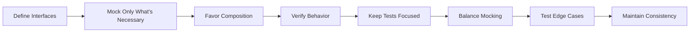

# Go Mocking

## Introduction

When writing tests in Go, you'll often encounter situations where your code depends on external systems like databases, APIs, or file systems. Testing these dependencies directly can be challenging - they might be slow, unavailable during testing, or have side effects. This is where **mocking** comes into play.

**Mocking** is a technique where you replace real dependencies with fake versions that simulate the behavior of the real ones. This allows you to test your code in isolation, making your tests faster, more reliable, and focused on the logic you're trying to verify.

In this tutorial, we'll learn how to effectively use mocking in Go to write better unit tests.

## Why Use Mocks?

Before diving into implementation, let's understand why mocking is essential for effective testing:

1. **Isolation**: Test your code without relying on external systems
2. **Speed**: Tests run faster when they don't interact with real databases or APIs
3. **Reliability**: Tests don't fail due to external system failures
4. **Control**: Simulate different scenarios, including error conditions
5. **Predictability**: Know exactly what your dependencies will return

## Basic Mocking in Go

Go's interface system makes mocking particularly elegant. Let's start with a simple example.

### Example: User Service

Imagine we have a service that fetches user data:

```go
// user.go
package user

type User struct {
    ID   int
    Name string
    Email string
}

type UserRepository interface {
    GetUserByID(id int) (User, error)
    SaveUser(user User) error
}

type UserService struct {
    repo UserRepository
}

func NewUserService(repo UserRepository) *UserService {
    return &UserService{repo: repo}
}

func (s *UserService) GetUserNameByID(id int) (string, error) {
    user, err := s.repo.GetUserByID(id)
    if err != nil {
        return "", err
    }
    return user.Name, nil
}
```

To test the `GetUserNameByID` method without using a real database, we can create a mock implementation of the `UserRepository` interface:

```go
// user_test.go
package user

import (
    "errors"
    "testing"
)

// MockUserRepository is our mock implementation of UserRepository
type MockUserRepository struct {
    users map[int]User
}

func NewMockUserRepository() *MockUserRepository {
    return &MockUserRepository{
        users: make(map[int]User),
    }
}

func (m *MockUserRepository) GetUserByID(id int) (User, error) {
    user, exists := m.users[id]
    if !exists {
        return User{}, errors.New("user not found")
    }
    return user, nil
}

func (m *MockUserRepository) SaveUser(user User) error {
    m.users[user.ID] = user
    return nil
}

func TestGetUserNameByID(t *testing.T) {
    // Create mock repository
    mockRepo := NewMockUserRepository()
    
    // Add test data
    mockRepo.users[1] = User{ID: 1, Name: "Alice", Email: "alice@example.com"}
    
    // Create service with mock repository
    service := NewUserService(mockRepo)
    
    // Test successful case
    name, err := service.GetUserNameByID(1)
    if err != nil {
        t.Fatalf("Expected no error, got %v", err)
    }
    if name != "Alice" {
        t.Errorf("Expected name 'Alice', got '%s'", name)
    }
    
    // Test user not found case
    _, err = service.GetUserNameByID(999)
    if err == nil {
        t.Error("Expected error for non-existent user, got nil")
    }
}
```

This is a basic example of manual mocking in Go. We've created a mock implementation of our `UserRepository` interface to test our `UserService` without needing a real database.

## Using Mocking Libraries

While manual mocking works well for simple cases, it can become tedious for complex interfaces. Go has several libraries that make mocking easier.

### Testify/mock

One popular mocking library is [testify/mock](https://github.com/stretchr/testify). Let's rewrite our test using testify:

First, install the package:

```shell
go get github.com/stretchr/testify/mock
```

Then, create a mock repository:

```go
// user_test.go
package user

import (
    "errors"
    "testing"
    
    "github.com/stretchr/testify/assert"
    "github.com/stretchr/testify/mock"
)

type MockUserRepository struct {
    mock.Mock
}

func (m *MockUserRepository) GetUserByID(id int) (User, error) {
    args := m.Called(id)
    return args.Get(0).(User), args.Error(1)
}

func (m *MockUserRepository) SaveUser(user User) error {
    args := m.Called(user)
    return args.Error(0)
}

func TestGetUserNameByIDWithTestify(t *testing.T) {
    // Create mock repository
    mockRepo := new(MockUserRepository)
    
    // Set up expectations
    mockRepo.On("GetUserByID", 1).Return(User{ID: 1, Name: "Alice"}, nil)
    mockRepo.On("GetUserByID", 999).Return(User{}, errors.New("user not found"))
    
    // Create service with mock repository
    service := NewUserService(mockRepo)
    
    // Test successful case
    name, err := service.GetUserNameByID(1)
    assert.NoError(t, err)
    assert.Equal(t, "Alice", name)
    
    // Test user not found case
    name, err = service.GetUserNameByID(999)
    assert.Error(t, err)
    assert.Equal(t, "", name)
    
    // Verify all expectations were met
    mockRepo.AssertExpectations(t)
}
```

With testify/mock, we define behavior expectations using the `.On()` and `.Return()` methods. This makes our tests more expressive and easier to understand.

### GoMock

Another popular choice is [GoMock](https://github.com/golang/mock), which generates mock implementations from interfaces.

First, install GoMock and its code generator:

```shell
go install github.com/golang/mock/mockgen@v1.6.0
```

Generate a mock for our UserRepository interface:

```shell
mockgen -source=user.go -destination=mocks/mock_user.go -package=mocks
```

This creates a mock implementation in the `mocks` directory. Now we can use it in our tests:

```go
// user_test.go
package user

import (
    "errors"
    "testing"
    
    "github.com/golang/mock/gomock"
    "your-module/mocks" // Generated mocks package
)

func TestGetUserNameByIDWithGoMock(t *testing.T) {
    // Create a new controller
    ctrl := gomock.NewController(t)
    defer ctrl.Finish()
    
    // Create mock repository
    mockRepo := mocks.NewMockUserRepository(ctrl)
    
    // Set up expectations
    mockRepo.EXPECT().GetUserByID(1).Return(User{ID: 1, Name: "Alice"}, nil)
    mockRepo.EXPECT().GetUserByID(999).Return(User{}, errors.New("user not found"))
    
    // Create service with mock repository
    service := NewUserService(mockRepo)
    
    // Test successful case
    name, err := service.GetUserNameByID(1)
    if err != nil {
        t.Fatalf("Expected no error, got %v", err)
    }
    if name != "Alice" {
        t.Errorf("Expected name 'Alice', got '%s'", name)
    }
    
    // Test user not found case
    name, err = service.GetUserNameByID(999)
    if err == nil {
        t.Error("Expected error for non-existent user, got nil")
    }
    if name != "" {
        t.Errorf("Expected empty name, got '%s'", name)
    }
}
```

GoMock generates the mock implementation for us, saving time and reducing the chance of errors.

## Mocking HTTP Responses

A common use case for mocking is testing code that makes HTTP requests. Go's `httptest` package makes this easy:

```go
// client.go
package client

import (
    "encoding/json"
    "fmt"
    "net/http"
)

type User struct {
    ID   int    `json:"id"`
    Name string `json:"name"`
}

type UserClient struct {
    baseURL    string
    httpClient *http.Client
}

func NewUserClient(baseURL string) *UserClient {
    return &UserClient{
        baseURL:    baseURL,
        httpClient: &http.Client{},
    }
}

func (c *UserClient) GetUser(id int) (User, error) {
    resp, err := c.httpClient.Get(fmt.Sprintf("%s/users/%d", c.baseURL, id))
    if err != nil {
        return User{}, err
    }
    defer resp.Body.Close()
    
    if resp.StatusCode != http.StatusOK {
        return User{}, fmt.Errorf("unexpected status code: %d", resp.StatusCode)
    }
    
    var user User
    if err := json.NewDecoder(resp.Body).Decode(&user); err != nil {
        return User{}, err
    }
    
    return user, nil
}
```

Testing this without making real HTTP requests:

```go
// client_test.go
package client

import (
    "net/http"
    "net/http/httptest"
    "testing"
)

func TestGetUser(t *testing.T) {
    // Create a test server
    server := httptest.NewServer(http.HandlerFunc(func(w http.ResponseWriter, r *http.Request) {
        if r.URL.Path == "/users/1" {
            w.WriteHeader(http.StatusOK)
            w.Write([]byte(`{"id": 1, "name": "Alice"}`))
            return
        }
        
        w.WriteHeader(http.StatusNotFound)
    }))
    defer server.Close()
    
    // Create client pointing to test server
    client := NewUserClient(server.URL)
    
    // Test successful case
    user, err := client.GetUser(1)
    if err != nil {
        t.Fatalf("Expected no error, got %v", err)
    }
    if user.ID != 1 || user.Name != "Alice" {
        t.Errorf("Expected user {1, Alice}, got %+v", user)
    }
    
    // Test not found case
    _, err = client.GetUser(999)
    if err == nil {
        t.Error("Expected error for non-existent user, got nil")
    }
}
```

The `httptest` package provides an in-memory HTTP server that responds exactly as we program it to, allowing us to test our HTTP client without making real network calls.

## Advanced Mocking Techniques

### Mocking Time

Testing time-dependent code can be challenging. Let's see how to mock time:

```go
// expiry.go
package expiry

import (
    "time"
)

type TimeProvider interface {
    Now() time.Time
}

type RealTimeProvider struct{}

func (p RealTimeProvider) Now() time.Time {
    return time.Now()
}

type ExpiryChecker struct {
    timeProvider TimeProvider
}

func NewExpiryChecker(provider TimeProvider) *ExpiryChecker {
    if provider == nil {
        provider = RealTimeProvider{}
    }
    return &ExpiryChecker{timeProvider: provider}
}

func (c *ExpiryChecker) IsExpired(expiryTime time.Time) bool {
    return c.timeProvider.Now().After(expiryTime)
}
```

Testing with a mocked time provider:

```go
// expiry_test.go
package expiry

import (
    "testing"
    "time"
)

type MockTimeProvider struct {
    CurrentTime time.Time
}

func (m MockTimeProvider) Now() time.Time {
    return m.CurrentTime
}

func TestIsExpired(t *testing.T) {
    // Reference date: January 1, 2023
    refDate := time.Date(2023, 1, 1, 12, 0, 0, 0, time.UTC)
    
    // Create mock time provider with fixed time
    mockTime := MockTimeProvider{CurrentTime: refDate}
    
    // Create checker with mock time
    checker := NewExpiryChecker(mockTime)
    
    // Test with expiry in the past
    pastExpiry := refDate.Add(-1 * time.Hour) // 11:00 AM
    if !checker.IsExpired(pastExpiry) {
        t.Error("Expected pastExpiry to be expired, but it wasn't")
    }
    
    // Test with expiry in the future
    futureExpiry := refDate.Add(1 * time.Hour) // 1:00 PM
    if checker.IsExpired(futureExpiry) {
        t.Error("Expected futureExpiry not to be expired, but it was")
    }
}
```

By mocking time, we can test time-dependent code with predictable results.

### Mocking File System

To test code that interacts with the file system, we can create an interface for file operations and mock it:

```go
// filemanager.go
package filemanager

import (
    "io"
    "os"
)

type FileSystem interface {
    Open(name string) (File, error)
    Create(name string) (File, error)
    Remove(name string) error
}

type File interface {
    io.ReadWriteCloser
}

type RealFileSystem struct{}

func (fs RealFileSystem) Open(name string) (File, error) {
    return os.Open(name)
}

func (fs RealFileSystem) Create(name string) (File, error) {
    return os.Create(name)
}

func (fs RealFileSystem) Remove(name string) error {
    return os.Remove(name)
}

type FileManager struct {
    fs FileSystem
}

func NewFileManager(fs FileSystem) *FileManager {
    if fs == nil {
        fs = RealFileSystem{}
    }
    return &FileManager{fs: fs}
}

func (m *FileManager) ReadTextFile(path string) (string, error) {
    file, err := m.fs.Open(path)
    if err != nil {
        return "", err
    }
    defer file.Close()
    
    data, err := io.ReadAll(file)
    if err != nil {
        return "", err
    }
    
    return string(data), nil
}
```

Testing with a mocked file system:

```go
// filemanager_test.go
package filemanager

import (
    "errors"
    "io"
    "strings"
    "testing"
)

// MockFile implements the File interface
type MockFile struct {
    Content string
    Closed  bool
}

func (m *MockFile) Read(p []byte) (n int, err error) {
    if m.Closed {
        return 0, errors.New("file is closed")
    }
    
    return strings.NewReader(m.Content).Read(p)
}

func (m *MockFile) Write(p []byte) (n int, err error) {
    if m.Closed {
        return 0, errors.New("file is closed")
    }
    
    m.Content = string(p)
    return len(p), nil
}

func (m *MockFile) Close() error {
    m.Closed = true
    return nil
}

// MockFileSystem implements the FileSystem interface
type MockFileSystem struct {
    Files map[string]*MockFile
}

func NewMockFileSystem() *MockFileSystem {
    return &MockFileSystem{
        Files: make(map[string]*MockFile),
    }
}

func (m *MockFileSystem) Open(name string) (File, error) {
    file, exists := m.Files[name]
    if !exists {
        return nil, errors.New("file not found")
    }
    return file, nil
}

func (m *MockFileSystem) Create(name string) (File, error) {
    file := &MockFile{Content: "", Closed: false}
    m.Files[name] = file
    return file, nil
}

func (m *MockFileSystem) Remove(name string) error {
    if _, exists := m.Files[name]; !exists {
        return errors.New("file not found")
    }
    delete(m.Files, name)
    return nil
}

func TestReadTextFile(t *testing.T) {
    // Create mock file system
    mockFS := NewMockFileSystem()
    
    // Add a test file
    mockFS.Files["test.txt"] = &MockFile{Content: "Hello, World!", Closed: false}
    
    // Create file manager with mock file system
    manager := NewFileManager(mockFS)
    
    // Test successful read
    content, err := manager.ReadTextFile("test.txt")
    if err != nil {
        t.Fatalf("Expected no error, got %v", err)
    }
    if content != "Hello, World!" {
        t.Errorf("Expected content 'Hello, World!', got '%s'", content)
    }
    
    // Test file not found
    _, err = manager.ReadTextFile("nonexistent.txt")
    if err == nil {
        t.Error("Expected error for non-existent file, got nil")
    }
}
```

By mocking the file system, we can test our file operations without touching the real file system.

## Best Practices for Mocking in Go

