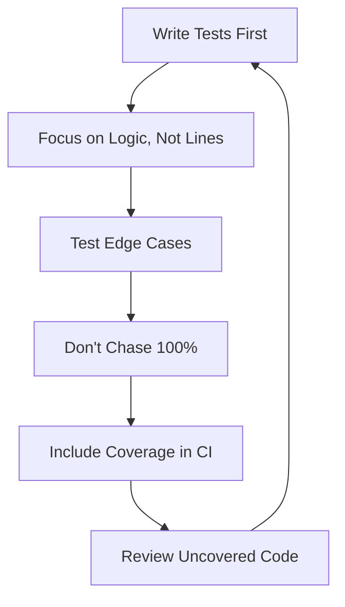

# Go Coverage

## Introduction

Code coverage is a metric that helps you understand how much of your Go code is being tested by your test suite. It identifies which lines of code are executed during your tests and which are not. By measuring code coverage, you can identify untested code, potential bugs, and improve the overall quality of your application.

In this guide, we'll explore Go's built-in coverage tools, how to generate and interpret coverage reports, and best practices for improving your test coverage.

## Understanding Code Coverage in Go

Go provides native support for code coverage through the `go test` command with the `-cover` flag. This built-in functionality makes it easy to start measuring how thoroughly your code is tested without needing external tools.

### What Code Coverage Measures

Coverage analysis in Go tracks:

- **Statement coverage**: Which lines of code are executed during tests
- **Branch coverage**: Whether conditional branches (if/else, switch cases) are tested
- **Function coverage**: Which functions are called during test execution

### Why Code Coverage Matters

- Identifies untested parts of your codebase
- Helps prevent bugs and regressions
- Encourages writing testable code
- Provides confidence in your test suite
- Serves as a quality metric for your project

## Basic Coverage Testing

Let's start with a simple example to demonstrate how Go's coverage tools work.

### Example: A Simple Calculator Package

First, let's create a simple calculator package:

```go
// calculator/calculator.go
package calculator

// Add returns the sum of two integers
func Add(a, b int) int {
    return a + b
}

// Subtract returns the difference between two integers
func Subtract(a, b int) int {
    return a - b
}

// Multiply returns the product of two integers
func Multiply(a, b int) int {
    return a * b
}

// Divide returns the quotient of two integers
// If b is 0, it returns 0 to avoid division by zero
func Divide(a, b int) int {
    if b == 0 {
        return 0
    }
    return a / b
}
```

Now let's write a test file that only tests some of the functions:

```go
// calculator/calculator_test.go
package calculator

import "testing"

func TestAdd(t *testing.T) {
    sum := Add(2, 3)
    if sum != 5 {
        t.Errorf("Expected Add(2, 3) = 5, got %d", sum)
    }
}

func TestSubtract(t *testing.T) {
    difference := Subtract(5, 3)
    if difference != 2 {
        t.Errorf("Expected Subtract(5, 3) = 2, got %d", difference)
    }
}
```

### Running Basic Coverage Test

To see the basic coverage information, run:

```bash
go test -cover ./calculator
```

Output:
```
ok      example.com/calculator    0.004s  coverage: 50.0% of statements
```

This tells us that our tests are covering only 50% of the statements in the package. We've written tests for `Add` and `Subtract`, but not for `Multiply` and `Divide`.

## Generating Coverage Profiles

For a more detailed analysis, we can generate a coverage profile and use Go's tools to examine it.

```bash
go test -coverprofile=coverage.out ./calculator
```

This creates a file called `coverage.out` containing detailed coverage information. We can view this information in different formats.

### Viewing Coverage in the Terminal

To see a line-by-line breakdown of coverage in the terminal:

```bash
go tool cover -func=coverage.out
```

Output:
```
example.com/calculator/calculator.go:4:   Add         100.0%
example.com/calculator/calculator.go:9:   Subtract    100.0%
example.com/calculator/calculator.go:14:  Multiply    0.0%
example.com/calculator/calculator.go:19:  Divide      0.0%
total:                                    (statements) 50.0%
```

This shows that `Add` and `Subtract` are fully covered, while `Multiply` and `Divide` are not covered at all.

### Generating HTML Coverage Report

For a more visual representation, we can generate an HTML report:

```bash
go tool cover -html=coverage.out -o coverage.html
```

This creates an HTML file that color-codes your source code:
- Green: Code that is covered by tests
- Red: Code that is not covered by tests


## Improving Code Coverage

Let's improve our code coverage by adding tests for the remaining functions:

```go
// Adding to calculator/calculator_test.go
func TestMultiply(t *testing.T) {
    product := Multiply(2, 3)
    if product != 6 {
        t.Errorf("Expected Multiply(2, 3) = 6, got %d", product)
    }
}

func TestDivide(t *testing.T) {
    // Test normal division
    quotient := Divide(6, 3)
    if quotient != 2 {
        t.Errorf("Expected Divide(6, 3) = 2, got %d", quotient)
    }
    
    // Test division by zero
    quotient = Divide(6, 0)
    if quotient != 0 {
        t.Errorf("Expected Divide(6, 0) = 0, got %d", quotient)
    }
}
```

Running the coverage test again:

```bash
go test -cover ./calculator
```

Output:
```
ok      example.com/calculator    0.004s  coverage: 100.0% of statements
```

Now we have 100% code coverage! Every line of our code is being executed during tests.

## Coverage in Real-World Applications

In real-world applications, achieving 100% coverage is often challenging and may not always be necessary. Let's look at a more practical example.

### Example: HTTP Server

Here's a simple HTTP server with an endpoint that requires more comprehensive testing:

```go
// server/server.go
package server

import (
    "encoding/json"
    "net/http"
)

type Response struct {
    Message string `json:"message"`
    Status  int    `json:"status"`
}

func HelloHandler(w http.ResponseWriter, r *http.Request) {
    if r.Method != http.MethodGet {
        w.WriteHeader(http.StatusMethodNotAllowed)
        json.NewEncoder(w).Encode(Response{
            Message: "Method not allowed",
            Status:  http.StatusMethodNotAllowed,
        })
        return
    }

    name := r.URL.Query().Get("name")
    if name == "" {
        name = "World"
    }

    w.Header().Set("Content-Type", "application/json")
    json.NewEncoder(w).Encode(Response{
        Message: "Hello, " + name + "!",
        Status:  http.StatusOK,
    })
}
```

Here's how we could test this handler with good coverage:

```go
// server/server_test.go
package server

import (
    "encoding/json"
    "net/http"
    "net/http/httptest"
    "testing"
)

func TestHelloHandler(t *testing.T) {
    // Test case 1: GET request without name parameter
    req, err := http.NewRequest("GET", "/hello", nil)
    if err != nil {
        t.Fatal(err)
    }
    rr := httptest.NewRecorder()
    handler := http.HandlerFunc(HelloHandler)
    handler.ServeHTTP(rr, req)

    if status := rr.Code; status != http.StatusOK {
        t.Errorf("handler returned wrong status code: got %v want %v",
            status, http.StatusOK)
    }

    var response Response
    err = json.Unmarshal(rr.Body.Bytes(), &response)
    if err != nil {
        t.Fatal(err)
    }
    
    expected := "Hello, World!"
    if response.Message != expected {
        t.Errorf("handler returned unexpected message: got %v want %v",
            response.Message, expected)
    }

    // Test case 2: GET request with name parameter
    req, err = http.NewRequest("GET", "/hello?name=Go", nil)
    if err != nil {
        t.Fatal(err)
    }
    rr = httptest.NewRecorder()
    handler.ServeHTTP(rr, req)

    err = json.Unmarshal(rr.Body.Bytes(), &response)
    if err != nil {
        t.Fatal(err)
    }
    
    expected = "Hello, Go!"
    if response.Message != expected {
        t.Errorf("handler returned unexpected message: got %v want %v",
            response.Message, expected)
    }

    // Test case 3: POST request (method not allowed)
    req, err = http.NewRequest("POST", "/hello", nil)
    if err != nil {
        t.Fatal(err)
    }
    rr = httptest.NewRecorder()
    handler.ServeHTTP(rr, req)

    if status := rr.Code; status != http.StatusMethodNotAllowed {
        t.Errorf("handler returned wrong status code: got %v want %v",
            status, http.StatusMethodNotAllowed)
    }
}
```

When we run the coverage test for this package:

```bash
go test -cover ./server
```

Output:
```
ok      example.com/server    0.005s  coverage: 100.0% of statements
```

We've achieved 100% coverage by testing all the different paths through our handler.

## Advanced Coverage Features

### Setting Coverage Thresholds

In CI/CD pipelines, it's common to enforce minimum coverage thresholds. You can write a simple script to fail the build if coverage falls below a certain percentage:

```bash
#!/bin/bash
go test -cover ./... | grep -v "no test files" > coverage.txt
COVERAGE=$(grep -o "[0-9\.]*%" coverage.txt | grep -o "[0-9\.]*" | awk '{s+=$1}END{print s/NR}')
THRESHOLD=80
echo "Coverage: $COVERAGE%"
if (( $(echo "$COVERAGE < $THRESHOLD" | bc -l) )); then
  echo "Code coverage is below threshold of $THRESHOLD%"
  exit 1
fi
```

### Generating Coverage for Multiple Packages

To generate coverage across multiple packages, use:

```bash
go test -coverprofile=coverage.out ./...
```

This will run tests for all packages in your module and generate a combined coverage profile.

### Understanding Coverage Modes

Go offers three different coverage modes:

```bash
go test -covermode=set -coverprofile=coverage.out ./...       # Default: reports whether each statement was executed
go test -covermode=count -coverprofile=coverage.out ./...     # Counts how many times each statement was executed
go test -covermode=atomic -coverprofile=coverage.out ./...    # Like count, but safe for concurrent tests
```

- **set**: Records whether statements were executed at least once (fastest)
- **count**: Records how many times each statement was executed
- **atomic**: Like count, but safe for concurrent tests

For most purposes, the default `set` mode is sufficient. Use `count` or `atomic` when you want to identify hot spots in your code.

## Best Practices for Code Coverage

