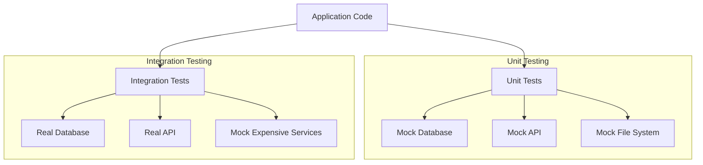

# Go Integration Testing

## Introduction

Integration testing is a crucial phase in software testing where individual modules are combined and tested as a group. Unlike unit tests that focus on isolated components, integration tests verify that different parts of your application work together correctly.

In Go, integration testing extends beyond the standard unit testing approach to ensure that your code interacts properly with external dependencies like databases, file systems, or web services. This guide will walk you through the fundamentals of integration testing in Go, with practical examples to help you implement effective tests in your own projects.

## Why Integration Testing Matters

Before diving into the code, let's understand why integration testing is important:

- **Validates Component Interactions**: Ensures different parts of your application communicate correctly
- **Catches Interface Mismatches**: Identifies issues in how components connect with each other
- **Tests External Dependencies**: Verifies your application works with databases, APIs, and other services
- **Increases Confidence**: Provides assurance that your system works as a whole

## Basic Integration Test Structure

Let's start with a basic example of an integration test in Go. Imagine we have a simple user service that interacts with a database:

```go
// user/service.go
package user

import "database/sql"

type Service struct {
    db *sql.DB
}

type User struct {
    ID    int
    Name  string
    Email string
}

func NewService(db *sql.DB) *Service {
    return &Service{db: db}
}

func (s *Service) GetUserByID(id int) (User, error) {
    var user User
    err := s.db.QueryRow("SELECT id, name, email FROM users WHERE id = ?", id).Scan(&user.ID, &user.Name, &user.Email)
    return user, err
}

func (s *Service) CreateUser(name, email string) (int, error) {
    result, err := s.db.Exec("INSERT INTO users (name, email) VALUES (?, ?)", name, email)
    if err != nil {
        return 0, err
    }
    id, err := result.LastInsertId()
    return int(id), err
}
```

Now, let's write an integration test for this service:

```go
// user/service_integration_test.go
package user

import (
    "database/sql"
    "testing"
    
    _ "github.com/go-sql-driver/mysql"
)

func setupTestDB(t *testing.T) *sql.DB {
    // Connect to test database
    db, err := sql.Open("mysql", "user:password@tcp(localhost:3306)/testdb")
    if err != nil {
        t.Fatalf("Failed to connect to test database: %v", err)
    }
    
    // Ensure we have a clean test table
    db.Exec("DROP TABLE IF EXISTS users")
    _, err = db.Exec(`
        CREATE TABLE users (
            id INT AUTO_INCREMENT PRIMARY KEY,
            name VARCHAR(100) NOT NULL,
            email VARCHAR(100) NOT NULL UNIQUE
        )
    `)
    if err != nil {
        t.Fatalf("Failed to create test table: %v", err)
    }
    
    return db
}

func TestUserService_Integration(t *testing.T) {
    // Skip integration tests if short flag is provided
    if testing.Short() {
        t.Skip("Skipping integration test in short mode")
    }
    
    // Setup test database
    db := setupTestDB(t)
    defer db.Close()
    
    // Initialize service
    service := NewService(db)
    
    // Test CreateUser
    t.Run("CreateUser", func(t *testing.T) {
        id, err := service.CreateUser("John Doe", "john@example.com")
        if err != nil {
            t.Fatalf("Failed to create user: %v", err)
        }
        if id <= 0 {
            t.Errorf("Expected positive user ID, got %d", id)
        }
    })
    
    // Test GetUserByID
    t.Run("GetUserByID", func(t *testing.T) {
        // First create a user
        id, err := service.CreateUser("Jane Smith", "jane@example.com")
        if err != nil {
            t.Fatalf("Failed to create user: %v", err)
        }
        
        // Then retrieve the user
        user, err := service.GetUserByID(id)
        if err != nil {
            t.Fatalf("Failed to get user: %v", err)
        }
        
        // Verify user data
        if user.Name != "Jane Smith" {
            t.Errorf("Expected name 'Jane Smith', got '%s'", user.Name)
        }
        if user.Email != "jane@example.com" {
            t.Errorf("Expected email 'jane@example.com', got '%s'", user.Email)
        }
    })
}
```

## Best Practices for Integration Testing

Let's look at some best practices for writing effective integration tests in Go:

### 1. Use Test Flags

Use the `-short` flag to differentiate between unit and integration tests:

```go
func TestIntegration(t *testing.T) {
    if testing.Short() {
        t.Skip("Skipping integration test in short mode")
    }
    // Test code here
}
```

This allows developers to run only unit tests during quick development cycles with `go test -short` and run all tests including integration tests in CI/CD pipelines with `go test`.

### 2. Separate Test Files

Keep integration tests in separate files with a clear naming convention:

```
service.go                   // Main implementation
service_test.go              // Unit tests
service_integration_test.go  // Integration tests
```

### 3. Setup and Teardown

Properly initialize and clean up resources:

```go
func TestMain(m *testing.M) {
    // Setup before all tests
    setupTestEnvironment()
    
    // Run tests
    exitCode := m.Run()
    
    // Cleanup after all tests
    teardownTestEnvironment()
    
    // Exit with the test exit code
    os.Exit(exitCode)
}
```

## Using Test Containers

For more isolated testing environments, you can use Docker containers. The [testcontainers-go](https://github.com/testcontainers/testcontainers-go) library makes this easy:

```go
package user

import (
    "context"
    "database/sql"
    "testing"
    
    _ "github.com/go-sql-driver/mysql"
    "github.com/testcontainers/testcontainers-go"
    "github.com/testcontainers/testcontainers-go/wait"
)

func TestServiceWithContainer(t *testing.T) {
    if testing.Short() {
        t.Skip("Skipping integration test in short mode")
    }
    
    ctx := context.Background()
    
    // Define container request
    req := testcontainers.ContainerRequest{
        Image:        "mysql:8.0",
        ExposedPorts: []string{"3306/tcp"},
        Env: map[string]string{
            "MYSQL_ROOT_PASSWORD": "password",
            "MYSQL_DATABASE":      "testdb",
        },
        WaitingFor: wait.ForLog("port: 3306  MySQL Community Server"),
    }
    
    // Start container
    mysqlC, err := testcontainers.GenericContainer(ctx, testcontainers.GenericContainerRequest{
        ContainerRequest: req,
        Started:          true,
    })
    if err != nil {
        t.Fatalf("Failed to start container: %v", err)
    }
    defer mysqlC.Terminate(ctx)
    
    // Get host and port
    host, err := mysqlC.Host(ctx)
    if err != nil {
        t.Fatalf("Failed to get container host: %v", err)
    }
    
    port, err := mysqlC.MappedPort(ctx, "3306/tcp")
    if err != nil {
        t.Fatalf("Failed to get container port: %v", err)
    }
    
    // Connect to MySQL
    db, err := sql.Open("mysql", 
        fmt.Sprintf("root:password@tcp(%s:%s)/testdb", host, port.Port()))
    if err != nil {
        t.Fatalf("Failed to connect to database: %v", err)
    }
    defer db.Close()
    
    // Create test table
    _, err = db.Exec(`
        CREATE TABLE users (
            id INT AUTO_INCREMENT PRIMARY KEY,
            name VARCHAR(100) NOT NULL,
            email VARCHAR(100) NOT NULL UNIQUE
        )
    `)
    if err != nil {
        t.Fatalf("Failed to create table: %v", err)
    }
    
    // Initialize service and run tests
    service := NewService(db)
    
    // Test creating and retrieving user
    userId, err := service.CreateUser("Test User", "test@example.com")
    if err != nil {
        t.Fatalf("Failed to create user: %v", err)
    }
    
    user, err := service.GetUserByID(userId)
    if err != nil {
        t.Fatalf("Failed to get user: %v", err)
    }
    
    if user.Name != "Test User" || user.Email != "test@example.com" {
        t.Errorf("User data doesn't match. Got: %+v", user)
    }
}
```

## Testing HTTP APIs

Let's see how to test a simple HTTP API using integration tests:

```go
// handler/user.go
package handler

import (
    "encoding/json"
    "net/http"
    "strconv"
    
    "myapp/user"
)

type UserHandler struct {
    service *user.Service
}

func NewUserHandler(service *user.Service) *UserHandler {
    return &UserHandler{service: service}
}

func (h *UserHandler) GetUser(w http.ResponseWriter, r *http.Request) {
    // Extract user ID from URL path or query
    idStr := r.URL.Query().Get("id")
    id, err := strconv.Atoi(idStr)
    if err != nil {
        http.Error(w, "Invalid user ID", http.StatusBadRequest)
        return
    }
    
    // Get user from service
    user, err := h.service.GetUserByID(id)
    if err != nil {
        http.Error(w, "User not found", http.StatusNotFound)
        return
    }
    
    // Return user as JSON
    w.Header().Set("Content-Type", "application/json")
    json.NewEncoder(w).Encode(user)
}
```

Now, let's write an integration test for this handler:

```go
// handler/user_integration_test.go
package handler

import (
    "database/sql"
    "encoding/json"
    "net/http"
    "net/http/httptest"
    "testing"
    
    _ "github.com/go-sql-driver/mysql"
    "myapp/user"
)

func TestUserHandler_Integration(t *testing.T) {
    if testing.Short() {
        t.Skip("Skipping integration test in short mode")
    }
    
    // Setup test database
    db, err := sql.Open("mysql", "user:password@tcp(localhost:3306)/testdb")
    if err != nil {
        t.Fatalf("Failed to connect to test database: %v", err)
    }
    defer db.Close()
    
    // Create test table
    db.Exec("DROP TABLE IF EXISTS users")
    _, err = db.Exec(`
        CREATE TABLE users (
            id INT AUTO_INCREMENT PRIMARY KEY,
            name VARCHAR(100) NOT NULL,
            email VARCHAR(100) NOT NULL UNIQUE
        )
    `)
    if err != nil {
        t.Fatalf("Failed to create test table: %v", err)
    }
    
    // Setup service and handler
    userService := user.NewService(db)
    userHandler := NewUserHandler(userService)
    
    // Create a test user
    userId, err := userService.CreateUser("Test User", "test@example.com")
    if err != nil {
        t.Fatalf("Failed to create test user: %v", err)
    }
    
    // Create a test server
    server := httptest.NewServer(http.HandlerFunc(userHandler.GetUser))
    defer server.Close()
    
    // Make a request to get the user
    resp, err := http.Get(server.URL + "?id=" + strconv.Itoa(userId))
    if err != nil {
        t.Fatalf("Failed to send request: %v", err)
    }
    defer resp.Body.Close()
    
    // Check status code
    if resp.StatusCode != http.StatusOK {
        t.Errorf("Expected status OK, got %v", resp.Status)
    }
    
    // Decode and verify the response
    var user user.User
    if err := json.NewDecoder(resp.Body).Decode(&user); err != nil {
        t.Fatalf("Failed to decode response: %v", err)
    }
    
    if user.ID != userId {
        t.Errorf("Expected user ID %d, got %d", userId, user.ID)
    }
    if user.Name != "Test User" {
        t.Errorf("Expected name 'Test User', got '%s'", user.Name)
    }
    if user.Email != "test@example.com" {
        t.Errorf("Expected email 'test@example.com', got '%s'", user.Email)
    }
}
```

## Test Mocking vs. Real Dependencies

Integration tests typically use real dependencies, but sometimes a mixed approach is useful:

