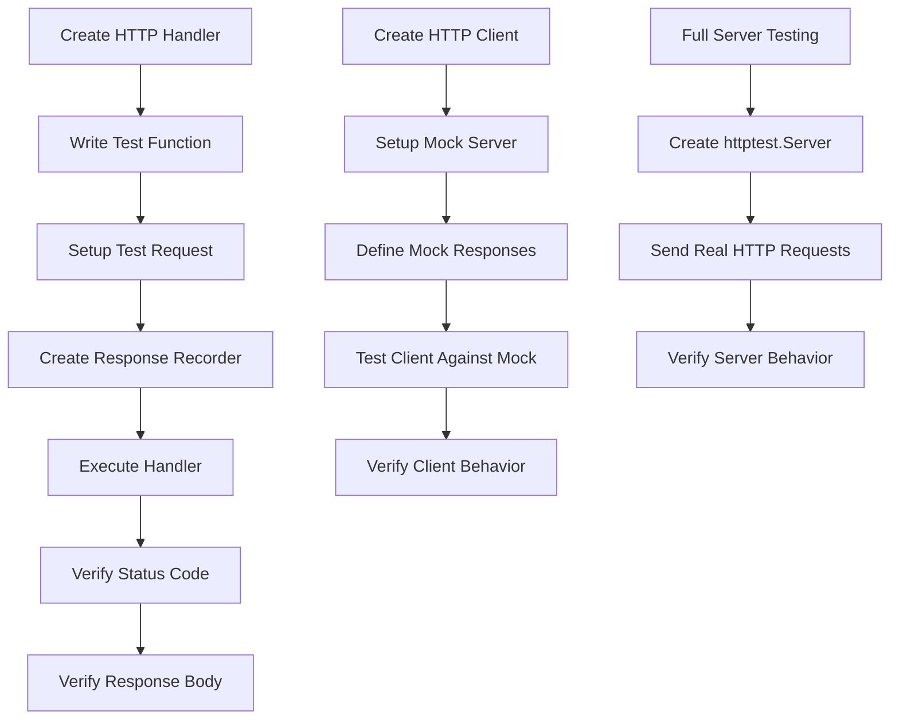

# Go HTTP Testing

## Introduction

Testing HTTP functionality is a crucial skill for Go developers building web services, APIs, or applications that communicate over HTTP. This guide explores Go's powerful built-in tools for testing HTTP servers and clients, helping you ensure your web applications work correctly and reliably.

Go's standard library provides excellent support for HTTP testing through the `net/http/httptest` package, which allows you to:

- Test HTTP handlers without starting a real server
- Create mock HTTP servers for testing client code
- Simulate HTTP requests and validate responses
- Test error conditions and edge cases

This guide will walk you through the fundamentals of HTTP testing in Go with practical examples that you can adapt for your own projects.

## Testing HTTP Handlers

### The Basics

When building a web application in Go, you'll typically define HTTP handlers to process incoming requests. Testing these handlers directly is more efficient than launching a full server.

Let's start with a simple HTTP handler that returns a greeting:

```go
// handler.go
package main

import (
    "fmt"
    "net/http"
)

func GreetingHandler(w http.ResponseWriter, r *http.Request) {
    name := r.URL.Query().Get("name")
    if name == "" {
        name = "Guest"
    }
    fmt.Fprintf(w, "Hello, %s!", name)
}
```

Now, let's test this handler:

```go
// handler_test.go
package main

import (
    "net/http"
    "net/http/httptest"
    "testing"
)

func TestGreetingHandler(t *testing.T) {
    // Create a request to pass to our handler
    req, err := http.NewRequest("GET", "/greeting?name=John", nil)
    if err != nil {
        t.Fatal(err)
    }

    // Create a ResponseRecorder to record the response
    rr := httptest.NewRecorder()
    handler := http.HandlerFunc(GreetingHandler)

    // Call the handler directly, passing in the request and response recorder
    handler.ServeHTTP(rr, req)

    // Check the status code
    if status := rr.Code; status != http.StatusOK {
        t.Errorf("handler returned wrong status code: got %v want %v",
            status, http.StatusOK)
    }

    // Check the response body
    expected := "Hello, John!"
    if rr.Body.String() != expected {
        t.Errorf("handler returned unexpected body: got %v want %v",
            rr.Body.String(), expected)
    }
}
```

In this test:
1. We create an HTTP request using `http.NewRequest`
2. We use `httptest.NewRecorder()` to capture the response
3. We call the handler directly with `handler.ServeHTTP(rr, req)`
4. We check that the status code and response body match our expectations

### Testing Different HTTP Methods

Let's extend our example to test a handler that responds differently based on the HTTP method:

```go
// method_handler.go
package main

import (
    "encoding/json"
    "net/http"
)

type User struct {
    Name string `json:"name"`
    Age  int    `json:"age"`
}

func UserHandler(w http.ResponseWriter, r *http.Request) {
    w.Header().Set("Content-Type", "application/json")
    
    switch r.Method {
    case http.MethodGet:
        // Return a sample user
        user := User{Name: "Alice", Age: 30}
        json.NewEncoder(w).Encode(user)
    case http.MethodPost:
        // Parse the user from request body
        var user User
        err := json.NewDecoder(r.Body).Decode(&user)
        if err != nil {
            w.WriteHeader(http.StatusBadRequest)
            return
        }
        // In a real app, we might save the user here
        w.WriteHeader(http.StatusCreated)
        json.NewEncoder(w).Encode(user)
    default:
        w.WriteHeader(http.StatusMethodNotAllowed)
    }
}
```

Test for this handler:

```go
// method_handler_test.go
package main

import (
    "bytes"
    "encoding/json"
    "net/http"
    "net/http/httptest"
    "reflect"
    "testing"
)

func TestUserHandlerGet(t *testing.T) {
    // Create a GET request
    req, err := http.NewRequest("GET", "/user", nil)
    if err != nil {
        t.Fatal(err)
    }

    rr := httptest.NewRecorder()
    handler := http.HandlerFunc(UserHandler)
    handler.ServeHTTP(rr, req)

    // Check status code
    if status := rr.Code; status != http.StatusOK {
        t.Errorf("handler returned wrong status code: got %v want %v",
            status, http.StatusOK)
    }

    // Check response body
    var got User
    expected := User{Name: "Alice", Age: 30}
    err = json.NewDecoder(rr.Body).Decode(&got)
    if err != nil {
        t.Fatal(err)
    }
    
    if !reflect.DeepEqual(got, expected) {
        t.Errorf("handler returned unexpected body: got %v want %v",
            got, expected)
    }
}

func TestUserHandlerPost(t *testing.T) {
    // Create user data
    user := User{Name: "Bob", Age: 25}
    userJSON, err := json.Marshal(user)
    if err != nil {
        t.Fatal(err)
    }

    // Create a POST request with the user data
    req, err := http.NewRequest("POST", "/user", bytes.NewBuffer(userJSON))
    if err != nil {
        t.Fatal(err)
    }
    req.Header.Set("Content-Type", "application/json")

    rr := httptest.NewRecorder()
    handler := http.HandlerFunc(UserHandler)
    handler.ServeHTTP(rr, req)

    // Check status code
    if status := rr.Code; status != http.StatusCreated {
        t.Errorf("handler returned wrong status code: got %v want %v",
            status, http.StatusCreated)
    }

    // Check response body
    var got User
    err = json.NewDecoder(rr.Body).Decode(&got)
    if err != nil {
        t.Fatal(err)
    }
    
    if !reflect.DeepEqual(got, user) {
        t.Errorf("handler returned unexpected body: got %v want %v",
            got, user)
    }
}
```

## Testing with Request Context

Go's context functionality is often used in HTTP handlers. Here's how to test handlers that use context values:

```go
// context_handler.go
package main

import (
    "context"
    "fmt"
    "net/http"
)

type contextKey string

const userIDKey contextKey = "userID"

// Middleware to add userID to request context
func WithUserID(next http.Handler) http.Handler {
    return http.HandlerFunc(func(w http.ResponseWriter, r *http.Request) {
        // In a real app, this might come from authentication
        userID := r.Header.Get("X-User-ID")
        if userID == "" {
            http.Error(w, "User ID required", http.StatusUnauthorized)
            return
        }
        
        // Add userID to request context
        ctx := context.WithValue(r.Context(), userIDKey, userID)
        next.ServeHTTP(w, r.WithContext(ctx))
    })
}

// Handler that uses the userID from context
func ProfileHandler(w http.ResponseWriter, r *http.Request) {
    userID, ok := r.Context().Value(userIDKey).(string)
    if !ok {
        http.Error(w, "User ID not found in context", http.StatusInternalServerError)
        return
    }
    
    fmt.Fprintf(w, "Profile for user: %s", userID)
}
```

Testing the middleware and handler:

```go
// context_handler_test.go
package main

import (
    "net/http"
    "net/http/httptest"
    "testing"
)

func TestWithUserIDMiddleware(t *testing.T) {
    // Create a simple handler for testing the middleware
    nextHandler := http.HandlerFunc(func(w http.ResponseWriter, r *http.Request) {
        userID, ok := r.Context().Value(userIDKey).(string)
        if !ok {
            t.Error("userID not found in request context")
        }
        if userID != "123" {
            t.Errorf("userID is %s, want 123", userID)
        }
        w.WriteHeader(http.StatusOK)
    })

    // Wrap with our middleware
    handlerToTest := WithUserID(nextHandler)

    // Create a request with the required header
    req, err := http.NewRequest("GET", "/", nil)
    if err != nil {
        t.Fatal(err)
    }
    req.Header.Set("X-User-ID", "123")

    // Test with the middleware
    rr := httptest.NewRecorder()
    handlerToTest.ServeHTTP(rr, req)

    // Check status code
    if status := rr.Code; status != http.StatusOK {
        t.Errorf("handler returned wrong status code: got %v want %v",
            status, http.StatusOK)
    }

    // Test without the required header
    req, err = http.NewRequest("GET", "/", nil)
    if err != nil {
        t.Fatal(err)
    }

    rr = httptest.NewRecorder()
    handlerToTest.ServeHTTP(rr, req)

    // Should get Unauthorized error
    if status := rr.Code; status != http.StatusUnauthorized {
        t.Errorf("handler returned wrong status code: got %v want %v",
            status, http.StatusUnauthorized)
    }
}

func TestProfileHandler(t *testing.T) {
    // Create a request
    req, err := http.NewRequest("GET", "/profile", nil)
    if err != nil {
        t.Fatal(err)
    }
    
    // Add userID to context manually for testing
    ctx := context.WithValue(req.Context(), userIDKey, "456")
    req = req.WithContext(ctx)

    // Test the handler
    rr := httptest.NewRecorder()
    handler := http.HandlerFunc(ProfileHandler)
    handler.ServeHTTP(rr, req)

    // Check status code
    if status := rr.Code; status != http.StatusOK {
        t.Errorf("handler returned wrong status code: got %v want %v",
            status, http.StatusOK)
    }

    // Check response body
    expected := "Profile for user: 456"
    if rr.Body.String() != expected {
        t.Errorf("handler returned unexpected body: got %v want %v",
            rr.Body.String(), expected)
    }
}
```

## Testing a Complete HTTP Server

Sometimes you need to test an entire HTTP server. The `httptest.NewServer` function makes this easy:

```go
// server.go
package main

import (
    "encoding/json"
    "net/http"
)

type Server struct {
    db map[string]string // Simple in-memory database
}

func NewServer() *Server {
    return &Server{
        db: make(map[string]string),
    }
}

func (s *Server) ServeHTTP(w http.ResponseWriter, r *http.Request) {
    w.Header().Set("Content-Type", "application/json")
    
    switch r.URL.Path {
    case "/api/items":
        s.handleItems(w, r)
    default:
        http.NotFound(w, r)
    }
}

func (s *Server) handleItems(w http.ResponseWriter, r *http.Request) {
    switch r.Method {
    case http.MethodGet:
        // Return all items
        json.NewEncoder(w).Encode(s.db)
    case http.MethodPost:
        // Add a new item
        var item struct {
            Key   string `json:"key"`
            Value string `json:"value"`
        }
        
        if err := json.NewDecoder(r.Body).Decode(&item); err != nil {
            http.Error(w, err.Error(), http.StatusBadRequest)
            return
        }
        
        s.db[item.Key] = item.Value
        w.WriteHeader(http.StatusCreated)
    default:
        w.WriteHeader(http.StatusMethodNotAllowed)
    }
}
```

Test for the server:

```go
// server_test.go
package main

import (
    "bytes"
    "encoding/json"
    "io"
    "net/http"
    "net/http/httptest"
    "reflect"
    "testing"
)

func TestServerIntegration(t *testing.T) {
    // Create a new server instance
    server := NewServer()
    
    // Start a test HTTP server
    ts := httptest.NewServer(server)
    defer ts.Close()
    
    // Test POST request to add an item
    item := struct {
        Key   string `json:"key"`
        Value string `json:"value"`
    }{
        Key:   "test-key",
        Value: "test-value",
    }
    
    itemJSON, err := json.Marshal(item)
    if err != nil {
        t.Fatal(err)
    }
    
    resp, err := http.Post(ts.URL+"/api/items", "application/json", bytes.NewBuffer(itemJSON))
    if err != nil {
        t.Fatal(err)
    }
    defer resp.Body.Close()
    
    if resp.StatusCode != http.StatusCreated {
        t.Errorf("POST returned wrong status code: got %v want %v",
            resp.StatusCode, http.StatusCreated)
    }
    
    // Test GET request to retrieve all items
    resp, err = http.Get(ts.URL + "/api/items")
    if err != nil {
        t.Fatal(err)
    }
    defer resp.Body.Close()
    
    if resp.StatusCode != http.StatusOK {
        t.Errorf("GET returned wrong status code: got %v want %v",
            resp.StatusCode, http.StatusOK)
    }
    
    body, err := io.ReadAll(resp.Body)
    if err != nil {
        t.Fatal(err)
    }
    
    var got map[string]string
    err = json.Unmarshal(body, &got)
    if err != nil {
        t.Fatal(err)
    }
    
    expected := map[string]string{"test-key": "test-value"}
    if !reflect.DeepEqual(got, expected) {
        t.Errorf("GET returned unexpected body: got %v want %v",
            got, expected)
    }
}
```

## Testing HTTP Clients

Not only can you test HTTP servers, but you can also test code that makes HTTP requests to external services:

```go
// client.go
package main

import (
    "encoding/json"
    "fmt"
    "net/http"
)

type Client struct {
    BaseURL    string
    HTTPClient *http.Client
}

type WeatherResponse struct {
    Location string  `json:"location"`
    Temp     float64 `json:"temp"`
    Unit     string  `json:"unit"`
}

func NewClient(baseURL string) *Client {
    return &Client{
        BaseURL:    baseURL,
        HTTPClient: &http.Client{},
    }
}

func (c *Client) GetWeather(city string) (*WeatherResponse, error) {
    url := fmt.Sprintf("%s/api/weather?city=%s", c.BaseURL, city)
    
    resp, err := c.HTTPClient.Get(url)
    if err != nil {
        return nil, err
    }
    defer resp.Body.Close()
    
    if resp.StatusCode != http.StatusOK {
        return nil, fmt.Errorf("unexpected status code: %d", resp.StatusCode)
    }
    
    var weather WeatherResponse
    if err := json.NewDecoder(resp.Body).Decode(&weather); err != nil {
        return nil, err
    }
    
    return &weather, nil
}
```

Let's test this client using a mock server:

```go
// client_test.go
package main

import (
    "encoding/json"
    "net/http"
    "net/http/httptest"
    "reflect"
    "testing"
)

func TestGetWeather(t *testing.T) {
    // Create a mock server that returns predefined weather data
    server := httptest.NewServer(http.HandlerFunc(func(w http.ResponseWriter, r *http.Request) {
        // Check request parameters
        if r.URL.Path != "/api/weather" {
            t.Errorf("Expected to request '/api/weather', got: %s", r.URL.Path)
        }
        
        city := r.URL.Query().Get("city")
        if city != "London" {
            t.Errorf("Expected city query parameter 'London', got: %s", city)
        }
        
        // Return a predefined response
        w.Header().Set("Content-Type", "application/json")
        w.WriteHeader(http.StatusOK)
        
        weather := WeatherResponse{
            Location: "London",
            Temp:     21.5,
            Unit:     "C",
        }
        
        json.NewEncoder(w).Encode(weather)
    }))
    defer server.Close()
    
    // Create a client that uses the mock server
    client := NewClient(server.URL)
    
    // Test the GetWeather method
    weather, err := client.GetWeather("London")
    if err != nil {
        t.Fatal(err)
    }
    
    expected := &WeatherResponse{
        Location: "London",
        Temp:     21.5,
        Unit:     "C",
    }
    
    if !reflect.DeepEqual(weather, expected) {
        t.Errorf("Expected %v, got %v", expected, weather)
    }
}

func TestGetWeatherError(t *testing.T) {
    // Create a mock server that returns an error
    server := httptest.NewServer(http.HandlerFunc(func(w http.ResponseWriter, r *http.Request) {
        w.WriteHeader(http.StatusNotFound)
    }))
    defer server.Close()
    
    // Create a client that uses the mock server
    client := NewClient(server.URL)
    
    // Test the GetWeather method with an error response
    _, err := client.GetWeather("InvalidCity")
    if err == nil {
        t.Error("Expected error, got nil")
    }
}
```

## Testing Timeouts and Failures

Testing error scenarios like timeouts is crucial for robust applications:

```go
// timeout_test.go
package main

import (
    "net/http"
    "net/http/httptest"
    "testing"
    "time"
)

func TestClientTimeout(t *testing.T) {
    // Create a server that sleeps before responding
    server := httptest.NewServer(http.HandlerFunc(func(w http.ResponseWriter, r *http.Request) {
        time.Sleep(100 * time.Millisecond) // Delay response
        w.WriteHeader(http.StatusOK)
    }))
    defer server.Close()
    
    // Create a client with a very short timeout
    client := &Client{
        BaseURL: server.URL,
        HTTPClient: &http.Client{
            Timeout: 50 * time.Millisecond, // Shorter than server delay
        },
    }
    
    // The request should timeout
    _, err := client.GetWeather("London")
    if err == nil {
        t.Error("Expected timeout error, got nil")
    }
}
```

## Table-Driven Tests

For comprehensive testing of HTTP handlers, table-driven tests are often the best approach:

```go
// table_test.go
package main

import (
    "bytes"
    "encoding/json"
    "net/http"
    "net/http/httptest"
    "testing"
)

func CalculateHandler(w http.ResponseWriter, r *http.Request) {
    if r.Method != http.MethodPost {
        w.WriteHeader(http.StatusMethodNotAllowed)
        return
    }
    
    var input struct {
        Operation string  `json:"operation"`
        A         float64 `json:"a"`
        B         float64 `json:"b"`
    }
    
    if err := json.NewDecoder(r.Body).Decode(&input); err != nil {
        w.WriteHeader(http.StatusBadRequest)
        return
    }
    
    var result float64
    
    switch input.Operation {
    case "add":
        result = input.A + input.B
    case "subtract":
        result = input.A - input.B
    case "multiply":
        result = input.A * input.B
    case "divide":
        if input.B == 0 {
            w.WriteHeader(http.StatusBadRequest)
            json.NewEncoder(w).Encode(map[string]string{
                "error": "division by zero",
            })
            return
        }
        result = input.A / input.B
    default:
        w.WriteHeader(http.StatusBadRequest)
        json.NewEncoder(w).Encode(map[string]string{
            "error": "unknown operation",
        })
        return
    }
    
    w.Header().Set("Content-Type", "application/json")
    json.NewEncoder(w).Encode(map[string]float64{
        "result": result,
    })
}

func TestCalculateHandler(t *testing.T) {
    tests := []struct {
        name           string
        operation      string
        a, b           float64
        expectedStatus int
        expectedResult float64
        expectError    bool
    }{
        {"add", "add", 5, 3, http.StatusOK, 8, false},
        {"subtract", "subtract", 5, 3, http.StatusOK, 2, false},
        {"multiply", "multiply", 5, 3, http.StatusOK, 15, false},
        {"divide", "divide", 6, 3, http.StatusOK, 2, false},
        {"divide by zero", "divide", 6, 0, http.StatusBadRequest, 0, true},
        {"unknown operation", "power", 2, 3, http.StatusBadRequest, 0, true},
    }
    
    for _, tt := range tests {
        t.Run(tt.name, func(t *testing.T) {
            // Create the request body
            input := struct {
                Operation string  `json:"operation"`
                A         float64 `json:"a"`
                B         float64 `json:"b"`
            }{
                Operation: tt.operation,
                A:         tt.a,
                B:         tt.b,
            }
            
            body, _ := json.Marshal(input)
            req, err := http.NewRequest("POST", "/calculate", bytes.NewBuffer(body))
            if err != nil {
                t.Fatal(err)
            }
            
            rr := httptest.NewRecorder()
            handler := http.HandlerFunc(CalculateHandler)
            handler.ServeHTTP(rr, req)
            
            // Check status code
            if status := rr.Code; status != tt.expectedStatus {
                t.Errorf("handler returned wrong status code: got %v want %v",
                    status, tt.expectedStatus)
            }
            
            // Check response
            if tt.expectError {
                var errorResp map[string]string
                json.NewDecoder(rr.Body).Decode(&errorResp)
                if _, ok := errorResp["error"]; !ok {
                    t.Errorf("expected error message in response")
                }
            } else {
                var resp map[string]float64
                json.NewDecoder(rr.Body).Decode(&resp)
                if result, ok := resp["result"]; !ok || result != tt.expectedResult {
                    t.Errorf("handler returned unexpected result: got %v want %v",
                        result, tt.expectedResult)
                }
            }
        })
    }
}
```

## HTTP Testing Workflow Diagram

Here's a visual representation of the HTTP testing workflow in Go:



## Best Practices for HTTP Testing in Go

1. **Use httptest package**: The `net/http/httptest` package is designed specifically for testing HTTP handlers and servers.

2. **Test both success and error cases**: Make sure to test how your code handles failures, timeouts, and malformed requests.

3. **Use table-driven tests**: For comprehensive testing of various scenarios with different inputs and expected outcomes.

4. **Test middleware separately**: Middleware functions should be tested in isolation to verify they work correctly.

5. **Mock external dependencies**: When testing HTTP clients, use mock servers to simulate external services.

6. **Use subtests**: Organize your tests with `t.Run()` for better test output and selective test execution.

7. **Check headers and content types**: Verify that your handlers set appropriate headers and content types.

8. **Test request validation**: Ensure your handlers properly validate request parameters, headers, and bodies.

9. **Keep tests focused**: Each test should focus on a specific behavior or functionality.

10. **Test with different HTTP methods**: Make sure your handlers respond correctly to different HTTP methods (GET, POST, PUT, etc.).

## Summary

HTTP testing is an essential skill for Go developers building web applications. The standard library provides powerful tools through the `net/http/httptest` package that make it easy to test both HTTP servers and clients.

In this guide, we covered:
- Testing individual HTTP handlers
- Testing handlers with different HTTP methods
- Testing middleware and request context
- Testing complete HTTP servers
- Testing HTTP clients using mock servers
- Testing timeouts and error conditions
- Using table-driven tests for comprehensive testing

By following these patterns and best practices, you can build robust, reliable HTTP services in Go with confidence that they work as expected.

## Additional Resources

- [Go Documentation for httptest package](https://pkg.go.dev/net/http/httptest)
- [Go Blog: HTTP testing article](https://blog.golang.org/httptest)
- [Effective Go: Testing section](https://golang.org/doc/effective_go.html#testing)

## Exercises

1. Write tests for an HTTP handler that processes form data instead of JSON.
2. Create a test for a handler that serves static files.
3. Implement and test a middleware that logs request information.
4. Write a test for an HTTP client that handles pagination in API responses.
5. Create a test suite for a RESTful API with CRUD operations.