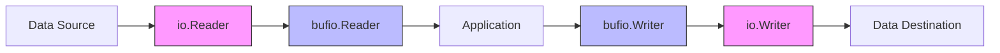

# Go IO Operations

## Introduction

Input/Output (IO) operations are fundamental to almost any practical program. Whether you're reading from files, processing user input, or communicating over a network, you'll need to understand how Go handles IO. This guide covers Go's approach to IO operations through its standard library packages, which provide a clean, consistent, and powerful set of tools for working with different data sources and destinations.

Go's IO design is centered around a few key interfaces in the `io` package, allowing for a unified approach to reading from and writing to various sources. This design is both elegant and practical, making Go's IO operations a joy to work with.

## Core IO Interfaces

At the heart of Go's IO operations are several important interfaces defined in the `io` package:

### Reader and Writer

The most fundamental interfaces are `io.Reader` and `io.Writer`:

```go
type Reader interface {
    Read(p []byte) (n int, err error)
}

type Writer interface {
    Write(p []byte) (n int, err error)
}
```

These simple interfaces form the foundation for all IO operations in Go:

- A `Reader` reads data into a provided byte slice and returns the number of bytes read
- A `Writer` writes data from a provided byte slice and returns the number of bytes written

Let's see these interfaces in action with a simple example:

```go
package main

import (
    "fmt"
    "io"
    "strings"
)

func main() {
    // Create a Reader from a string
    r := strings.NewReader("Hello, Go IO!")
    
    // Create a buffer to read into
    buf := make([]byte, 8)
    
    // Read data in chunks
    for {
        n, err := r.Read(buf)
        if err == io.EOF {
            break // End of file reached
        }
        if err != nil {
            fmt.Println("Error:", err)
            break
        }
        fmt.Printf("Read %d bytes: %s
", n, buf[:n])
    }
}
```

**Output:**
```
Read 8 bytes: Hello, G
Read 6 bytes: o IO!
```

This example demonstrates how to read data in chunks from a `strings.Reader`, which implements the `io.Reader` interface.

### Other Key Interfaces

Go's IO system includes several other important interfaces:

- `io.Closer`: For resources that need to be closed
- `io.Seeker`: For random access to data
- `io.ReaderAt` and `io.WriterAt`: For reading/writing at specific positions
- Combined interfaces like `io.ReadWriter`, `io.ReadCloser`, etc.

Here's how these interfaces are defined:

```go
type Closer interface {
    Close() error
}

type Seeker interface {
    Seek(offset int64, whence int) (int64, error)
}

type ReadWriter interface {
    Reader
    Writer
}

type ReadCloser interface {
    Reader
    Closer
}

// And so on...
```

## File Operations

One of the most common uses of IO is working with files. Go's `os` package provides functions for file operations.

### Reading Files

Here are a few ways to read files in Go:

#### Reading an Entire File

```go
package main

import (
    "fmt"
    "os"
)

func main() {
    // Read entire file content
    data, err := os.ReadFile("sample.txt")
    if err != nil {
        fmt.Println("Error reading file:", err)
        return
    }
    
    fmt.Println("File content:")
    fmt.Println(string(data))
}
```

#### Reading a File Line by Line

```go
package main

import (
    "bufio"
    "fmt"
    "os"
)

func main() {
    // Open file
    file, err := os.Open("sample.txt")
    if err != nil {
        fmt.Println("Error opening file:", err)
        return
    }
    defer file.Close() // Ensure the file is closed when the function exits
    
    // Create scanner to read line by line
    scanner := bufio.NewScanner(file)
    lineNum := 1
    
    // Scan each line
    for scanner.Scan() {
        fmt.Printf("Line %d: %s
", lineNum, scanner.Text())
        lineNum++
    }
    
    // Check for errors during scanning
    if err := scanner.Err(); err != nil {
        fmt.Println("Error reading file:", err)
    }
}
```

### Writing Files

Writing to files is just as straightforward:

#### Writing an Entire File

```go
package main

import (
    "fmt"
    "os"
)

func main() {
    content := []byte("Hello, Go IO!
This is a sample file.")
    
    // Write data to file (creates or truncates the file)
    err := os.WriteFile("output.txt", content, 0644)
    if err != nil {
        fmt.Println("Error writing file:", err)
        return
    }
    
    fmt.Println("File written successfully!")
}
```

#### Writing to a File Incrementally

```go
package main

import (
    "fmt"
    "os"
)

func main() {
    // Open file for writing (create if not exists, truncate if exists)
    file, err := os.Create("output.txt")
    if err != nil {
        fmt.Println("Error creating file:", err)
        return
    }
    defer file.Close()
    
    // Write string to file
    _, err = file.WriteString("Hello, Go IO!
")
    if err != nil {
        fmt.Println("Error writing to file:", err)
        return
    }
    
    // Write bytes to file
    _, err = file.Write([]byte("This is the second line.
"))
    if err != nil {
        fmt.Println("Error writing to file:", err)
        return
    }
    
    fmt.Println("Data written to file successfully!")
}
```

## Buffered IO Operations

For improved performance, Go provides buffered IO operations through the `bufio` package. Buffering reduces the number of system calls by reading or writing data in larger chunks.

### Buffered Reading

```go
package main

import (
    "bufio"
    "fmt"
    "os"
    "strings"
)

func main() {
    // Create a reader from a string
    sr := strings.NewReader("The quick brown fox jumps over the lazy dog")
    
    // Create a buffered reader
    br := bufio.NewReader(sr)
    
    // Read word by word (delimited by space)
    for {
        word, err := br.ReadString(' ')
        fmt.Print(word)
        
        if err != nil {
            fmt.Println("
End of reading or error:", err)
            break
        }
    }
}
```

### Buffered Writing

```go
package main

import (
    "bufio"
    "fmt"
    "os"
)

func main() {
    // Create a file for writing
    file, err := os.Create("buffered_output.txt")
    if err != nil {
        fmt.Println("Error creating file:", err)
        return
    }
    defer file.Close()
    
    // Create a buffered writer
    writer := bufio.NewWriter(file)
    
    // Write strings to the buffer
    fmt.Fprintln(writer, "Line 1: This is buffered IO in action.")
    fmt.Fprintln(writer, "Line 2: Data is stored in a buffer before being written to disk.")
    fmt.Fprintln(writer, "Line 3: This improves performance for many small writes.")
    
    // Check how many bytes are in the buffer
    bufferedBytes := writer.Buffered()
    fmt.Printf("Bytes buffered before flush: %d
", bufferedBytes)
    
    // Flush the buffer to make sure data is written to the file
    err = writer.Flush()
    if err != nil {
        fmt.Println("Error flushing buffer:", err)
        return
    }
    
    fmt.Println("Data successfully written to file!")
}
```

## IO Utilities and Best Practices

Go's standard library provides several utilities to make IO operations easier and more efficient.

### IO Utility Functions

The `io` package includes useful functions like:

- `io.Copy`: Copies from a Reader to a Writer
- `io.ReadAll`: Reads until EOF
- `io.ReadFull`: Reads exactly the requested amount of data
- `io.WriteString`: Writes a string to a Writer

Here's an example using `io.Copy`:

```go
package main

import (
    "fmt"
    "io"
    "os"
    "strings"
)

func main() {
    // Create a source reader
    src := strings.NewReader("This data will be copied to a file.")
    
    // Create a destination file
    dst, err := os.Create("copied_data.txt")
    if err != nil {
        fmt.Println("Error creating file:", err)
        return
    }
    defer dst.Close()
    
    // Copy data from source to destination
    bytesWritten, err := io.Copy(dst, src)
    if err != nil {
        fmt.Println("Error copying data:", err)
        return
    }
    
    fmt.Printf("Copied %d bytes to the file successfully!
", bytesWritten)
}
```

### Error Handling in IO Operations

Proper error handling is crucial in IO operations. The most common error is `io.EOF` (End of File), which indicates that there's no more data to read.

```go
package main

import (
    "fmt"
    "io"
    "strings"
)

func main() {
    r := strings.NewReader("Some example data")
    
    buf := make([]byte, 4)
    for {
        n, err := r.Read(buf)
        
        // Always check the number of bytes read first
        if n > 0 {
            fmt.Printf("Read %d bytes: %s
", n, buf[:n])
        }
        
        // Then check for errors
        if err == io.EOF {
            fmt.Println("Reached end of file")
            break
        }
        if err != nil {
            fmt.Println("Error reading:", err)
            break
        }
    }
}
```

### The "defer" Pattern

When working with resources like files, it's important to ensure they are properly closed. Go's `defer` statement is perfect for this:

```go
file, err := os.Open("file.txt")
if err != nil {
    // Handle error
    return
}
defer file.Close() // This will be executed when the surrounding function returns

// Work with the file...
```

## IO Flow Visualization

Here's a visualization of how data flows through different IO components in Go:



## Real-World Examples

Let's explore a few practical examples of IO operations in Go.

### Example 1: Simple File Copy Utility

```go
package main

import (
    "fmt"
    "io"
    "os"
)

func main() {
    if len(os.Args) != 3 {
        fmt.Println("Usage: go run copy.go <source> <destination>")
        os.Exit(1)
    }
    
    sourceFile := os.Args[1]
    destFile := os.Args[2]
    
    // Open source file
    src, err := os.Open(sourceFile)
    if err != nil {
        fmt.Printf("Error opening source file: %v
", err)
        os.Exit(1)
    }
    defer src.Close()
    
    // Create destination file
    dst, err := os.Create(destFile)
    if err != nil {
        fmt.Printf("Error creating destination file: %v
", err)
        os.Exit(1)
    }
    defer dst.Close()
    
    // Copy contents
    bytesCopied, err := io.Copy(dst, src)
    if err != nil {
        fmt.Printf("Error copying file: %v
", err)
        os.Exit(1)
    }
    
    fmt.Printf("Successfully copied %d bytes from %s to %s
", 
        bytesCopied, sourceFile, destFile)
}
```

### Example 2: Reading and Parsing CSV Data

```go
package main

import (
    "encoding/csv"
    "fmt"
    "io"
    "os"
)

func main() {
    // Open the CSV file
    file, err := os.Open("data.csv")
    if err != nil {
        fmt.Println("Error opening CSV file:", err)
        return
    }
    defer file.Close()
    
    // Create a new CSV reader
    reader := csv.NewReader(file)
    
    // Read and display header
    header, err := reader.Read()
    if err != nil {
        fmt.Println("Error reading CSV header:", err)
        return
    }
    fmt.Println("CSV Headers:", header)
    
    // Read and process each record
    for {
        record, err := reader.Read()
        if err == io.EOF {
            break // End of file
        }
        if err != nil {
            fmt.Println("Error reading CSV record:", err)
            return
        }
        
        // Process the record
        fmt.Println("Record:", record)
        
        // Example: Access specific fields (assuming the CSV has at least 3 columns)
        if len(record) >= 3 {
            fmt.Printf("  Field 1: %s
", record[0])
            fmt.Printf("  Field 2: %s
", record[1])
            fmt.Printf("  Field 3: %s
", record[2])
        }
    }
}
```

### Example 3: Creating a Simple HTTP Client

```go
package main

import (
    "fmt"
    "io"
    "net/http"
    "os"
)

func main() {
    // Make an HTTP GET request
    resp, err := http.Get("https://golang.org")
    if err != nil {
        fmt.Println("Error making HTTP request:", err)
        return
    }
    defer resp.Body.Close()
    
    // Check if the request was successful
    if resp.StatusCode != http.StatusOK {
        fmt.Printf("Unexpected status code: %d
", resp.StatusCode)
        return
    }
    
    // Create a file to save the response
    file, err := os.Create("golang_homepage.html")
    if err != nil {
        fmt.Println("Error creating file:", err)
        return
    }
    defer file.Close()
    
    // Copy the response body to the file
    bytesCopied, err := io.Copy(file, resp.Body)
    if err != nil {
        fmt.Println("Error saving response:", err)
        return
    }
    
    fmt.Printf("Downloaded %d bytes and saved to golang_homepage.html
", bytesCopied)
}
```

## Summary

Go's approach to IO operations is based on a few simple interfaces that provide a unified way to work with different data sources and destinations. By understanding these core interfaces and the standard library packages built around them, you can effectively handle any IO operation in Go.

Key points to remember:

1. The `io.Reader` and `io.Writer` interfaces are the foundation of Go's IO system
2. The `os` package provides functions for file operations
3. The `bufio` package offers buffered IO for improved performance
4. Always handle errors properly and use `defer` to ensure resources are closed
5. Go's standard library provides utility functions that simplify common IO tasks

IO operations are essential for real-world applications, and Go's design makes them both powerful and straightforward to use.

## Exercises

1. Create a program that reads a text file and counts the occurrences of each word.
2. Write a utility that merges multiple text files into a single file.
3. Implement a simple logging system that rotates log files when they reach a certain size.
4. Create a program that downloads an image from a URL and saves it to disk.
5. Write a CSV parser that reads a CSV file and converts it to JSON format.

## Additional Resources

- [Go Documentation: io package](https://golang.org/pkg/io/)
- [Go Documentation: os package](https://golang.org/pkg/os/)
- [Go Documentation: bufio package](https://golang.org/pkg/bufio/)
- [Go Blog: Working with Files in Go](https://blog.golang.org/go-file-operations)
- [Effective Go: The defer statement](https://golang.org/doc/effective_go.html#defer)