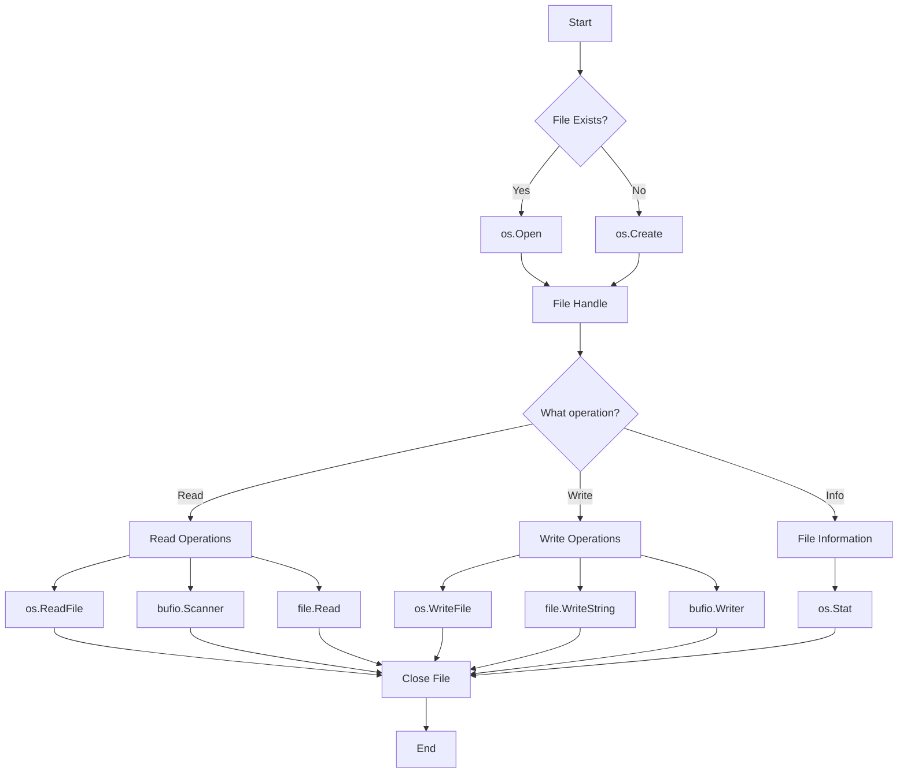

# Go File Handling

## Introduction

File handling is a fundamental skill for any programmer. Whether you're reading configuration files, processing data, or saving application state, understanding how to interact with the file system is essential. Go provides a rich set of packages in its standard library to make file operations straightforward and efficient.

In this tutorial, we'll explore how to:
- Create and open files
- Read file content using different methods
- Write data to files
- Handle file paths
- Work with directories
- Handle common file operation errors

By the end, you'll have a solid understanding of how to incorporate file handling in your Go applications.

## Basic File Operations

### Importing Required Packages

Go's file handling functionality is primarily contained in these packages:

```go
import (
    "os"        // Core file operations
    "io"        // Basic I/O utilities
    "io/ioutil" // Simplified I/O utilities (deprecated in Go 1.16+)
    "bufio"     // Buffered I/O
    "path/filepath" // Path manipulation
)
```

For Go 1.16+, many `ioutil` functions have been moved to the `os` and `io` packages, but we'll mention both approaches.

### Opening a File

To open a file in Go, use the `os.Open()` function:

```go
package main

import (
    "fmt"
    "os"
)

func main() {
    file, err := os.Open("example.txt")
    if err != nil {
        fmt.Println("Error opening file:", err)
        return
    }
    defer file.Close() // Always close files when done
    
    fmt.Println("Successfully opened example.txt")
}
```

The `defer file.Close()` statement ensures the file will be closed when the function exits, regardless of how it exits. This is a common pattern in Go for resource management.

### Creating a File

To create a new file or truncate an existing one, use `os.Create()`:

```go
file, err := os.Create("newfile.txt")
if err != nil {
    fmt.Println("Error creating file:", err)
    return
}
defer file.Close()

fmt.Println("Successfully created newfile.txt")
```

### Opening with Options

For more control, use `os.OpenFile()` which allows you to specify flags and permissions:

```go
// Open for read and write, create if not exists, append to file
file, err := os.OpenFile(
    "logfile.txt", 
    os.O_RDWR|os.O_CREATE|os.O_APPEND, 
    0644,
)
if err != nil {
    fmt.Println("Error opening file:", err)
    return
}
defer file.Close()
```

Common flags include:
- `os.O_RDONLY`: Read only
- `os.O_WRONLY`: Write only
- `os.O_RDWR`: Read and write
- `os.O_CREATE`: Create file if it doesn't exist
- `os.O_APPEND`: Append to file instead of truncating
- `os.O_TRUNC`: Truncate file when opening

The permission value (`0644`) controls file access rights when creating files.

## Reading Files

Go offers several ways to read files, each suited for different scenarios.

### Reading an Entire File at Once

For small files, you can read the entire content into memory:

```go
package main

import (
    "fmt"
    "os"
)

func main() {
    // In Go 1.16+:
    content, err := os.ReadFile("example.txt")
    
    // For older Go versions:
    // content, err := ioutil.ReadFile("example.txt")
    
    if err != nil {
        fmt.Println("Error reading file:", err)
        return
    }
    
    // Convert bytes to string for display
    fmt.Println("File content:")
    fmt.Println(string(content))
}
```

**Example Output:**
```
File content:
Hello, this is an example file.
It has multiple lines.
This is the third line.
```

### Reading Line by Line

For larger files or when processing line-by-line, use a `bufio.Scanner`:

```go
package main

import (
    "bufio"
    "fmt"
    "os"
)

func main() {
    file, err := os.Open("example.txt")
    if err != nil {
        fmt.Println("Error opening file:", err)
        return
    }
    defer file.Close()
    
    scanner := bufio.NewScanner(file)
    lineNum := 1
    
    // Scan through the file line by line
    for scanner.Scan() {
        fmt.Printf("Line %d: %s
", lineNum, scanner.Text())
        lineNum++
    }
    
    // Check for errors during scanning
    if err := scanner.Err(); err != nil {
        fmt.Println("Error reading file:", err)
    }
}
```

**Example Output:**
```
Line 1: Hello, this is an example file.
Line 2: It has multiple lines.
Line 3: This is the third line.
```

### Reading Fixed Chunks

To read a file in fixed-size chunks, use a buffer and `Read()` method:

```go
package main

import (
    "fmt"
    "os"
)

func main() {
    file, err := os.Open("example.txt")
    if err != nil {
        fmt.Println("Error opening file:", err)
        return
    }
    defer file.Close()
    
    // Create a buffer of 8 bytes
    buffer := make([]byte, 8)
    
    for {
        // Read up to 8 bytes
        bytesRead, err := file.Read(buffer)
        
        // If we've reached the end of the file
        if err != nil {
            if err.Error() == "EOF" {
                break // End of file reached
            }
            fmt.Println("Error reading file:", err)
            return
        }
        
        // Print the bytes read
        fmt.Printf("Bytes read: %d
", bytesRead)
        fmt.Printf("Content: %s
", buffer[:bytesRead])
    }
}
```

**Example Output:**
```
Bytes read: 8
Content: Hello, t
Bytes read: 8
Content: his is a
Bytes read: 8
Content: n exampl
...
```

## Writing to Files

Go provides several methods for writing data to files, similar to reading.

### Writing a String

To write a simple string to a file:

```go
package main

import (
    "fmt"
    "os"
)

func main() {
    // Create or truncate the file
    file, err := os.Create("output.txt")
    if err != nil {
        fmt.Println("Error creating file:", err)
        return
    }
    defer file.Close()
    
    // Write a string to the file
    bytesWritten, err := file.WriteString("Hello, Go file handling!
This is a test file.
")
    if err != nil {
        fmt.Println("Error writing to file:", err)
        return
    }
    
    fmt.Printf("Wrote %d bytes to file
", bytesWritten)
}
```

**Example Output:**
```
Wrote 45 bytes to file
```

The resulting `output.txt` file contains:
```
Hello, Go file handling!
This is a test file.
```

### Writing Bytes

To write raw bytes to a file:

```go
package main

import (
    "fmt"
    "os"
)

func main() {
    file, err := os.Create("bytes.txt")
    if err != nil {
        fmt.Println("Error creating file:", err)
        return
    }
    defer file.Close()
    
    data := []byte{72, 101, 108, 108, 111, 33} // "Hello!" in ASCII
    bytesWritten, err := file.Write(data)
    if err != nil {
        fmt.Println("Error writing to file:", err)
        return
    }
    
    fmt.Printf("Wrote %d bytes to file
", bytesWritten)
}
```

### Using a Buffered Writer

For better performance with many small writes, use a buffered writer:

```go
package main

import (
    "bufio"
    "fmt"
    "os"
)

func main() {
    file, err := os.Create("buffered.txt")
    if err != nil {
        fmt.Println("Error creating file:", err)
        return
    }
    defer file.Close()
    
    // Create a buffered writer
    writer := bufio.NewWriter(file)
    
    // Write strings to the buffer
    writer.WriteString("Line 1: Buffered writing is efficient
")
    writer.WriteString("Line 2: For multiple small writes
")
    writer.WriteString("Line 3: Like this example
")
    
    // Check how many bytes are waiting in the buffer
    fmt.Printf("Buffered: %d bytes
", writer.Buffered())
    
    // Write buffered data to disk
    writer.Flush()
    
    fmt.Println("Data successfully written to file")
}
```

**Example Output:**
```
Buffered: 89 bytes
Data successfully written to file
```

### Writing an Entire File at Once

For simple cases where you have all content ready:

```go
package main

import (
    "fmt"
    "os"
)

func main() {
    data := []byte("This entire content will be written to the file at once.")
    
    // In Go 1.16+:
    err := os.WriteFile("quickwrite.txt", data, 0644)
    
    // For older Go versions:
    // err := ioutil.WriteFile("quickwrite.txt", data, 0644)
    
    if err != nil {
        fmt.Println("Error writing file:", err)
        return
    }
    
    fmt.Println("File written successfully")
}
```

## Working with File Paths

The `path/filepath` package provides functions for manipulating file paths in a platform-independent way.

### Path Manipulation

```go
package main

import (
    "fmt"
    "path/filepath"
)

func main() {
    // Join path elements
    fullPath := filepath.Join("dir", "subdir", "file.txt")
    fmt.Println("Joined path:", fullPath)
    
    // Get the directory name
    dir := filepath.Dir(fullPath)
    fmt.Println("Directory:", dir)
    
    // Get the base filename
    base := filepath.Base(fullPath)
    fmt.Println("Base name:", base)
    
    // Split path into directory and file
    dirPath, fileName := filepath.Split(fullPath)
    fmt.Println("Dir path:", dirPath)
    fmt.Println("File name:", fileName)
    
    // Get file extension
    ext := filepath.Ext(fullPath)
    fmt.Println("Extension:", ext)
    
    // Clean up path by removing extra separators, etc.
    messy := "dir//subdir/..//./file.txt"
    clean := filepath.Clean(messy)
    fmt.Println("Cleaned path:", clean)
    
    // Get absolute path
    absPath, err := filepath.Abs("relative/path")
    if err == nil {
        fmt.Println("Absolute path:", absPath)
    }
}
```

**Example Output:**
```
Joined path: dir/subdir/file.txt
Directory: dir/subdir
Base name: file.txt
Dir path: dir/subdir/
File name: file.txt
Extension: .txt
Cleaned path: dir/file.txt
Absolute path: /home/user/relative/path
```

Note: The actual output of `filepath.Abs()` will depend on your current working directory.

## Working with Directories

Go makes it easy to create, read, and manipulate directories.

### Creating Directories

```go
package main

import (
    "fmt"
    "os"
)

func main() {
    // Create a single directory
    err := os.Mkdir("newdir", 0755)
    if err != nil {
        fmt.Println("Error creating directory:", err)
    } else {
        fmt.Println("Directory created successfully")
    }
    
    // Create directories with parent directories if needed
    err = os.MkdirAll("parent/child/grandchild", 0755)
    if err != nil {
        fmt.Println("Error creating nested directories:", err)
    } else {
        fmt.Println("Nested directories created successfully")
    }
}
```

### Reading Directory Contents

```go
package main

import (
    "fmt"
    "os"
)

func main() {
    // In Go 1.16+:
    entries, err := os.ReadDir(".")
    
    // For older Go versions:
    // entries, err := ioutil.ReadDir(".")
    
    if err != nil {
        fmt.Println("Error reading directory:", err)
        return
    }
    
    fmt.Println("Directory contents:")
    for _, entry := range entries {
        if entry.IsDir() {
            fmt.Printf("📁 %s (directory)
", entry.Name())
        } else {
            fmt.Printf("📄 %s (file)
", entry.Name())
        }
    }
}
```

**Example Output:**
```
Directory contents:
📁 bin (directory)
📁 pkg (directory)
📁 src (directory)
📄 go.mod (file)
📄 main.go (file)
```

### Walking a Directory Tree

To recursively traverse directories:

```go
package main

import (
    "fmt"
    "os"
    "path/filepath"
)

func main() {
    root := "."
    
    err := filepath.Walk(root, func(path string, info os.FileInfo, err error) error {
        if err != nil {
            fmt.Printf("Error accessing path %s: %v
", path, err)
            return err
        }
        
        // Print indentation based on path depth
        indent := ""
        for i := 0; i < len(filepath.SplitList(path))-1; i++ {
            indent += "  "
        }
        
        if info.IsDir() {
            fmt.Printf("%s📁 %s
", indent, info.Name())
        } else {
            fmt.Printf("%s📄 %s (%d bytes)
", indent, info.Name(), info.Size())
        }
        
        return nil
    })
    
    if err != nil {
        fmt.Printf("Error walking directory tree: %v
", err)
    }
}
```

**Example Output:**
```
📁 .
  📄 main.go (145 bytes)
  📁 images
    📄 logo.png (4582 bytes)
    📄 banner.jpg (15783 bytes)
  📁 docs
    📄 readme.md (256 bytes)
```

## File Information and Manipulation

### Getting File Info

```go
package main

import (
    "fmt"
    "os"
    "time"
)

func main() {
    fileInfo, err := os.Stat("example.txt")
    if err != nil {
        if os.IsNotExist(err) {
            fmt.Println("File does not exist")
        } else {
            fmt.Println("Error:", err)
        }
        return
    }
    
    fmt.Println("File Information:")
    fmt.Printf("Name: %s
", fileInfo.Name())
    fmt.Printf("Size: %d bytes
", fileInfo.Size())
    fmt.Printf("Mode: %s
", fileInfo.Mode())
    fmt.Printf("Modified: %s
", fileInfo.ModTime().Format(time.RFC1123))
    fmt.Printf("Is Directory: %t
", fileInfo.IsDir())
}
```

**Example Output:**
```
File Information:
Name: example.txt
Size: 75 bytes
Mode: -rw-r--r--
Modified: Mon, 02 Jan 2023 15:04:05 GMT
Is Directory: false
```

### Renaming and Moving Files

```go
package main

import (
    "fmt"
    "os"
)

func main() {
    // Create a test file
    os.WriteFile("original.txt", []byte("Test content"), 0644)
    
    // Rename/move the file
    err := os.Rename("original.txt", "moved.txt")
    if err != nil {
        fmt.Println("Error renaming file:", err)
        return
    }
    
    fmt.Println("File renamed successfully")
}
```

### Removing Files and Directories

```go
package main

import (
    "fmt"
    "os"
)

func main() {
    // Remove a file
    err := os.Remove("unwanted.txt")
    if err != nil {
        fmt.Println("Error removing file:", err)
    } else {
        fmt.Println("File removed successfully")
    }
    
    // Remove directory and all contents
    err = os.RemoveAll("tempdir")
    if err != nil {
        fmt.Println("Error removing directory:", err)
    } else {
        fmt.Println("Directory removed successfully")
    }
}
```

## Temporary Files and Directories

Go provides built-in support for temporary files and directories that automatically handle unique naming.

```go
package main

import (
    "fmt"
    "os"
)

func main() {
    // Create a temporary file
    tempFile, err := os.CreateTemp("", "example-*.txt")
    if err != nil {
        fmt.Println("Error creating temp file:", err)
        return
    }
    defer os.Remove(tempFile.Name()) // Clean up
    defer tempFile.Close()
    
    fmt.Println("Created temporary file:", tempFile.Name())
    
    // Write some data
    tempFile.WriteString("This is temporary data")
    
    // Create a temporary directory
    tempDir, err := os.MkdirTemp("", "example-dir-*")
    if err != nil {
        fmt.Println("Error creating temp directory:", err)
        return
    }
    defer os.RemoveAll(tempDir) // Clean up
    
    fmt.Println("Created temporary directory:", tempDir)
}
```

**Example Output:**
```
Created temporary file: /tmp/example-123456.txt
Created temporary directory: /tmp/example-dir-789012
```

## Error Handling in File Operations

Go encourages explicit error handling, which is especially important for file operations. Here are common file-related errors and how to handle them:

```go
package main

import (
    "fmt"
    "os"
)

func main() {
    // Check if file exists
    _, err := os.Stat("nonexistent.txt")
    if os.IsNotExist(err) {
        fmt.Println("The file doesn't exist")
    }
    
    // Check file permissions
    file, err := os.Open("readonly.txt")
    if os.IsPermission(err) {
        fmt.Println("Permission denied")
    }
    
    // Try to create file in non-existent directory
    _, err = os.Create("/nonexistent/test.txt")
    if pathError, ok := err.(*os.PathError); ok {
        fmt.Printf("Operation: %s, Path: %s, Error: %v
", 
            pathError.Op, 
            pathError.Path, 
            pathError.Err,
        )
    }
    
    // Always close files
    if file != nil {
        file.Close()
    }
}
```

## Practical Examples

### Example 1: Simple Log Writer

Here's a simple logger that appends to a log file:

```go
package main

import (
    "fmt"
    "os"
    "time"
)

// Logger writes log messages to a file
type Logger struct {
    file *os.File
}

// NewLogger creates a new logger that writes to the specified file
func NewLogger(filename string) (*Logger, error) {
    file, err := os.OpenFile(filename, os.O_APPEND|os.O_CREATE|os.O_WRONLY, 0644)
    if err != nil {
        return nil, err
    }
    
    return &Logger{file: file}, nil
}

// Log writes a message to the log file
func (l *Logger) Log(message string) error {
    timestamp := time.Now().Format("2006-01-02 15:04:05")
    _, err := l.file.WriteString(fmt.Sprintf("[%s] %s
", timestamp, message))
    return err
}

// Close closes the log file
func (l *Logger) Close() error {
    return l.file.Close()
}

func main() {
    logger, err := NewLogger("application.log")
    if err != nil {
        fmt.Println("Error creating logger:", err)
        return
    }
    defer logger.Close()
    
    logger.Log("Application started")
    logger.Log("Processing data...")
    logger.Log("Operation completed")
    
    fmt.Println("Logs written to application.log")
}
```

This creates a log file with content like:
```
[2023-01-02 15:04:05] Application started
[2023-01-02 15:04:05] Processing data...
[2023-01-02 15:04:05] Operation completed
```

### Example 2: CSV File Processing

Here's how to read and write CSV data:

```go
package main

import (
    "encoding/csv"
    "fmt"
    "os"
    "strconv"
)

type Product struct {
    ID    int
    Name  string
    Price float64
}

func main() {
    // Create sample data
    products := []Product{
        {1, "Laptop", 999.99},
        {2, "Mouse", 24.99},
        {3, "Keyboard", 59.99},
    }
    
    // Write CSV file
    file, err := os.Create("products.csv")
    if err != nil {
        fmt.Println("Error creating file:", err)
        return
    }
    defer file.Close()
    
    writer := csv.NewWriter(file)
    defer writer.Flush()
    
    // Write header
    header := []string{"ID", "Name", "Price"}
    writer.Write(header)
    
    // Write data
    for _, product := range products {
        record := []string{
            strconv.Itoa(product.ID),
            product.Name,
            strconv.FormatFloat(product.Price, 'f', 2, 64),
        }
        writer.Write(record)
    }
    
    fmt.Println("CSV file written successfully")
    
    // Read CSV file back
    readFile, err := os.Open("products.csv")
    if err != nil {
        fmt.Println("Error opening file:", err)
        return
    }
    defer readFile.Close()
    
    reader := csv.NewReader(readFile)
    records, err := reader.ReadAll()
    if err != nil {
        fmt.Println("Error reading CSV:", err)
        return
    }
    
    var readProducts []Product
    
    // Skip header row (index 0)
    for i := 1; i < len(records); i++ {
        id, _ := strconv.Atoi(records[i][0])
        price, _ := strconv.ParseFloat(records[i][2], 64)
        
        product := Product{
            ID:    id,
            Name:  records[i][1],
            Price: price,
        }
        
        readProducts = append(readProducts, product)
    }
    
    // Display read products
    fmt.Println("
Products read from CSV:")
    for _, p := range readProducts {
        fmt.Printf("ID: %d, Name: %s, Price: $%.2f
", p.ID, p.Name, p.Price)
    }
}
```

**Example Output:**
```
CSV file written successfully

Products read from CSV:
ID: 1, Name: Laptop, Price: $999.99
ID: 2, Name: Mouse, Price: $24.99
ID: 3, Name: Keyboard, Price: $59.99
```

### Example 3: Config File Reader

Here's a simple configuration file reader:

```go
package main

import (
    "bufio"
    "fmt"
    "os"
    "strings"
)

type Config map[string]string

func ReadConfig(filename string) (Config, error) {
    config := make(Config)
    
    file, err := os.Open(filename)
    if err != nil {
        return nil, err
    }
    defer file.Close()
    
    scanner := bufio.NewScanner(file)
    lineNum := 0
    
    for scanner.Scan() {
        lineNum++
        line := scanner.Text()
        
        // Skip empty lines and comments
        if line == "" || strings.HasPrefix(line, "#") {
            continue
        }
        
        // Split by '=' and trim spaces
        parts := strings.SplitN(line, "=", 2)
        if len(parts) != 2 {
            fmt.Printf("Warning: Invalid config at line %d: %s
", lineNum, line)
            continue
        }
        
        key := strings.TrimSpace(parts[0])
        value := strings.TrimSpace(parts[1])
        
        config[key] = value
    }
    
    if err := scanner.Err(); err != nil {
        return nil, err
    }
    
    return config, nil
}

func main() {
    // First, create a config file
    configContent := `# Application Configuration
app_name = Go File Example
version = 1.0.0
debug = true

# Database Settings
db_host = localhost
db_port = 5432
db_name = myapp
`
    
    err := os.WriteFile("config.ini", []byte(configContent), 0644)
    if err != nil {
        fmt.Println("Error creating config file:", err)
        return
    }
    
    // Read the config
    config, err := ReadConfig("config.ini")
    if err != nil {
        fmt.Println("Error reading config:", err)
        return
    }
    
    // Use the config
    fmt.Println("Configuration:")
    fmt.Printf("App Name: %s
", config["app_name"])
    fmt.Printf("Version: %s
", config["version"])
    fmt.Printf("Debug Mode: %s
", config["debug"])
    fmt.Printf("Database: %s:%s/%s
", 
        config["db_host"], 
        config["db_port"], 
        config["db_name"],
    )
}
```

**Example Output:**
```
Configuration:
App Name: Go File Example
Version: 1.0.0
Debug Mode: true
Database: localhost:5432/myapp
```

## File I/O Flow

Here's a diagram showing the common file I/O operations in Go:

