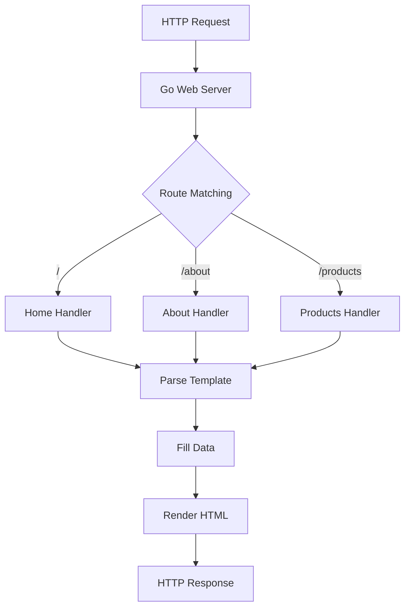

# Go Templates

## Introduction

Go Templates are a powerful feature of Go's standard library that allow you to create dynamic text outputs based on predefined patterns. Templates are particularly useful for generating HTML pages, configuration files, or any text-based output where you need to inject variable data into a fixed structure.

The Go standard library provides two main template packages:
- `text/template`: For generating any text-based format
- `html/template`: A specialized version of `text/template` that provides automatic HTML escaping to prevent security vulnerabilities like cross-site scripting (XSS)

In this tutorial, we'll explore how templates work in Go, learn the template syntax, and see practical examples of how to use templates in real-world applications.

## Basic Template Concepts

At its core, a Go template is a text file that contains static text mixed with "actions" (special commands enclosed in double curly braces, like `{{.}}`). These actions can:

- Insert data
- Control flow with conditionals and loops
- Define reusable blocks
- Include other templates

Let's start with a simple example to understand the basics.

### Your First Template

Here's a basic example of a Go template and how to use it:

```go
package main

import (
	"os"
	"text/template"
)

func main() {
	// Define a simple template
	tmpl := template.Must(template.New("example").Parse("Hello, {{.}}!"))
	
	// Execute the template with data
	tmpl.Execute(os.Stdout, "World")
}
```

Output:
```
Hello, World!
```

Let's break down what's happening:

1. We create a new template named "example"
2. We parse a simple template string: `"Hello, {{.}}!"`
3. The `{{.}}` is a template action that means "insert the current data value here"
4. We execute the template with the string `"World"` as the data value
5. The template replaces `{{.}}` with `"World"` and outputs `"Hello, World!"`

## Template Data

Templates can work with more complex data structures like structs, maps, and slices. The dot (`.`) represents the current data that was passed to the template.

### Using Structs as Data

Let's see how to use a struct with templates:

```go
package main

import (
	"os"
	"text/template"
)

// User is a sample data structure
type User struct {
	Name  string
	Email string
	Age   int
}

func main() {
	// Create a template with multiple fields
	tmpl := template.Must(template.New("user").Parse(`
User Information:
Name: {{.Name}}
Email: {{.Email}}
Age: {{.Age}}
`))
	
	// Create a user
	user := User{
		Name:  "Alice",
		Email: "alice@example.com",
		Age:   28,
	}
	
	// Execute the template with the user data
	tmpl.Execute(os.Stdout, user)
}
```

Output:
```
User Information:
Name: Alice
Email: alice@example.com
Age: 28
```

## Template Actions

Go templates support various actions for data manipulation and control flow.

### Variables

You can define and use variables within templates:

```go
package main

import (
	"os"
	"text/template"
)

func main() {
	tmpl := template.Must(template.New("vars").Parse(`
{{$name := "Bob"}}
Hello, {{$name}}!
`))
	
	tmpl.Execute(os.Stdout, nil)
}
```

Output:
```
Hello, Bob!
```

### Conditionals

Templates support if-else conditions:

```go
package main

import (
	"os"
	"text/template"
)

type Person struct {
	Name string
	Age  int
}

func main() {
	tmpl := template.Must(template.New("conditional").Parse(`
Name: {{.Name}}
{{if ge .Age 18}}
Status: Adult
{{else}}
Status: Minor
{{end}}
`))
	
	adult := Person{Name: "Alice", Age: 28}
	child := Person{Name: "Bob", Age: 15}
	
	// Print adult
	tmpl.Execute(os.Stdout, adult)
	
	// Print child
	tmpl.Execute(os.Stdout, child)
}
```

Output:
```
Name: Alice
Status: Adult

Name: Bob
Status: Minor
```

### Loops

You can iterate over arrays, slices, maps, or channels using the `range` action:

```go
package main

import (
	"os"
	"text/template"
)

func main() {
	// Define a template that ranges over a slice
	tmpl := template.Must(template.New("loop").Parse(`
Grocery List:
{{range .}}
- {{.}}
{{end}}
`))
	
	// Sample data
	groceries := []string{"Apples", "Milk", "Bread", "Eggs"}
	
	// Execute template
	tmpl.Execute(os.Stdout, groceries)
}
```

Output:
```
Grocery List:
- Apples
- Milk
- Bread
- Eggs
```

## Template Functions

Go templates provide built-in functions for various operations. Here are some commonly used ones:

- `eq`: Equal
- `ne`: Not equal
- `lt`: Less than
- `le`: Less than or equal
- `gt`: Greater than
- `ge`: Greater than or equal
- `and`: Logical AND
- `or`: Logical OR
- `not`: Logical NOT
- `len`: Length of a collection
- `index`: Get item at index
- `print`, `printf`, `println`: Formatted output

You can also define custom functions:

```go
package main

import (
	"os"
	"strings"
	"text/template"
)

func main() {
	// Create a function map
	funcMap := template.FuncMap{
		"upper": strings.ToUpper,
		"lower": strings.ToLower,
	}
	
	// Create a template with custom functions
	tmpl := template.New("functions").Funcs(funcMap)
	
	// Parse the template
	tmpl, _ = tmpl.Parse(`
Original: {{.}}
Uppercase: {{upper .}}
Lowercase: {{lower .}}
`)
	
	// Execute the template
	tmpl.Execute(os.Stdout, "Hello, World!")
}
```

Output:
```
Original: Hello, World!
Uppercase: HELLO, WORLD!
Lowercase: hello, world!
```

## HTML Templates

When generating HTML, you should use the `html/template` package instead of `text/template`. It provides automatic contextual escaping to prevent XSS vulnerabilities:

```go
package main

import (
	"html/template"
	"os"
)

type Product struct {
	Name  string
	Price float64
	Description string
}

func main() {
	// Create a product with potentially unsafe HTML
	product := Product{
		Name:  "Awesome Product",
		Price: 49.99,
		Description: "<script>alert('XSS attack!');</script> This is a great product.",
	}
	
	// Create a template for a product page
	tmpl := template.Must(template.New("product").Parse(`
<!DOCTYPE html>
<html>
<head>
    <title>{{.Name}}</title>
</head>
<body>
    <h1>{{.Name}}</h1>
    <p>Price: ${{.Price}}</p>
    <div class="description">
        {{.Description}}
    </div>
</body>
</html>
`))
	
	// Execute the template
	tmpl.Execute(os.Stdout, product)
}
```

Output (notice how the script tag is escaped):
```html
<!DOCTYPE html>
<html>
<head>
    <title>Awesome Product</title>
</head>
<body>
    <h1>Awesome Product</h1>
    <p>Price: $49.99</p>
    <div class="description">
        &lt;script&gt;alert(&#39;XSS attack!&#39;);&lt;/script&gt; This is a great product.
    </div>
</body>
</html>
```

## Template Files

In real applications, you'll typically store templates in external files rather than hardcoding them in your Go code. Here's how to load templates from files:

```go
package main

import (
	"html/template"
	"os"
)

type PageData struct {
	Title string
	Items []string
}

func main() {
	// Load template from file (template.html)
	tmpl, err := template.ParseFiles("template.html")
	if err != nil {
		panic(err)
	}
	
	// Sample data
	data := PageData{
		Title: "My Shopping List",
		Items: []string{"Apples", "Milk", "Bread", "Eggs"},
	}
	
	// Execute the template
	tmpl.Execute(os.Stdout, data)
}
```

Contents of template.html:
```html
<!DOCTYPE html>
<html>
<head>
    <title>{{.Title}}</title>
</head>
<body>
    <h1>{{.Title}}</h1>
    <ul>
        {{range .Items}}
        <li>{{.}}</li>
        {{end}}
    </ul>
</body>
</html>
```

## Template Composition

Templates can be composed of other templates, allowing for reuse and modularity.

### Defining and Using Template Blocks

```go
package main

import (
	"html/template"
	"os"
)

func main() {
	// Define multiple templates in a single string
	templates := `
{{define "base"}}
<!DOCTYPE html>
<html>
<head>
    <title>{{.Title}}</title>
</head>
<body>
    <header>{{template "header" .}}</header>
    <main>{{template "content" .}}</main>
    <footer>{{template "footer" .}}</footer>
</body>
</html>
{{end}}

{{define "header"}}
<h1>{{.Title}}</h1>
<nav>
    <a href="/">Home</a> |
    <a href="/about">About</a> |
    <a href="/contact">Contact</a>
</nav>
{{end}}

{{define "content"}}
<p>Welcome to our website!</p>
{{end}}

{{define "footer"}}
<p>&copy; 2025 My Website</p>
{{end}}
`
	
	// Parse all template definitions
	tmpl, err := template.New("base").Parse(templates)
	if err != nil {
		panic(err)
	}
	
	// Execute the "base" template
	data := struct {
		Title string
	}{
		Title: "Template Composition Example",
	}
	
	err = tmpl.ExecuteTemplate(os.Stdout, "base", data)
	if err != nil {
		panic(err)
	}
}
```

## Template Loading Patterns

In a real web application, you might need to load multiple template files. Here's a common pattern:

```go
package main

import (
	"html/template"
	"net/http"
	"path/filepath"
)

var templates *template.Template

// Load all templates at startup
func init() {
	// Find all template files in the templates directory
	pattern := filepath.Join("templates", "*.html")
	templates = template.Must(template.ParseGlob(pattern))
}

func homeHandler(w http.ResponseWriter, r *http.Request) {
	data := struct {
		Title string
		Message string
	}{
		Title: "Home Page",
		Message: "Welcome to our website!",
	}
	
	// Execute the specific template
	templates.ExecuteTemplate(w, "home.html", data)
}

func aboutHandler(w http.ResponseWriter, r *http.Request) {
	data := struct {
		Title string
		Content string
	}{
		Title: "About Us",
		Content: "We are a company that specializes in Go programming.",
	}
	
	templates.ExecuteTemplate(w, "about.html", data)
}

func main() {
	http.HandleFunc("/", homeHandler)
	http.HandleFunc("/about", aboutHandler)
	http.ListenAndServe(":8080", nil)
}
```

## Practical Example: Building a Simple Web Server with Templates

Let's put everything together in a complete example of a web server that uses templates:

