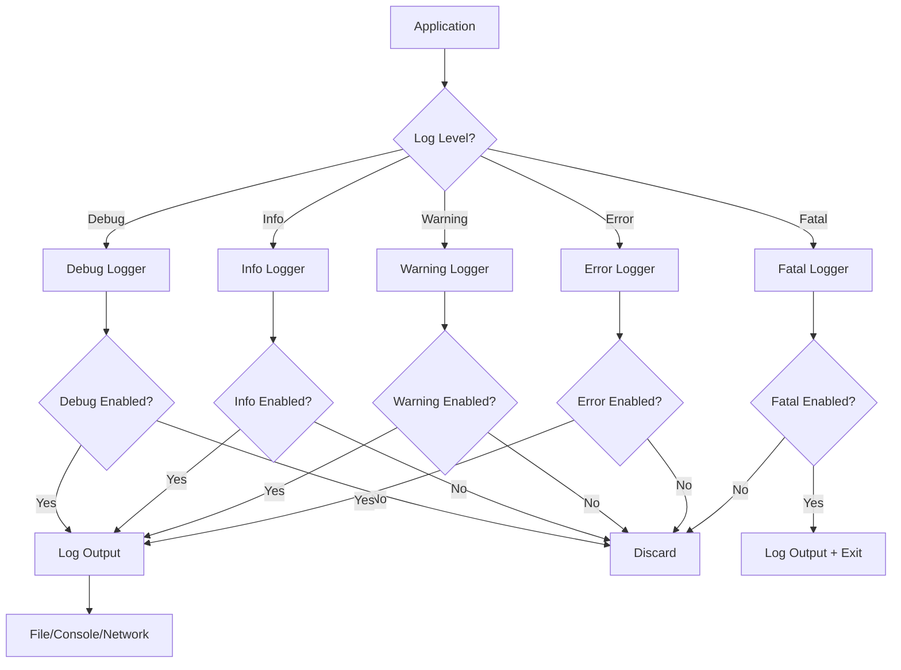

# Go Logging

## Introduction

Logging is an essential part of any application development process. It helps developers track the execution flow, debug issues, and monitor application behavior. Go's standard library provides a simple yet powerful logging package called `log` that allows you to integrate logging functionality into your applications with minimal effort.

In this tutorial, we'll explore Go's built-in logging capabilities, learn how to configure loggers with different options, and see how to implement logging in real-world applications.

## The Basics of Go Logging

The `log` package in Go's standard library provides basic logging functionality. It's designed to be simple to use while offering enough flexibility for most applications.

### Importing the Log Package

To start using the logging functionality, you need to import the `log` package:

```go
import "log"
```

### Simple Logging

The simplest way to log a message is using the `log.Println()` function:

```go
package main

import "log"

func main() {
    log.Println("This is a log message")
}
```

**Output:**
```
2023/01/01 12:00:00 This is a log message
```

There are several standard logging functions:

- `log.Print()`, `log.Printf()`, `log.Println()` - Print log messages
- `log.Fatal()`, `log.Fatalf()`, `log.Fatalln()` - Print log messages and call `os.Exit(1)`
- `log.Panic()`, `log.Panicf()`, `log.Panicln()` - Print log messages and call `panic()`

Here's an example using different logging functions:

```go
package main

import "log"

func main() {
    // Standard logging
    log.Println("This is a standard log message")
    
    // Formatted logging
    log.Printf("A formatted %s with a number: %d", "message", 42)
    
    // Uncomment to see Fatal in action (will exit the program)
    // log.Fatal("This is a fatal error")
    
    // Uncomment to see Panic in action (will cause a panic)
    // log.Panic("This is a panic")
}
```

**Output:**
```
2023/01/01 12:00:00 This is a standard log message
2023/01/01 12:00:00 A formatted message with a number: 42
```

## Configuring the Logger

By default, the standard logger writes to the standard error output (stderr) and includes the date and time with each log message. However, you can customize this behavior.

### Setting Output Destination

You can direct log output to any `io.Writer` implementation:

```go
package main

import (
    "log"
    "os"
)

func main() {
    // Create a log file
    logFile, err := os.Create("application.log")
    if err != nil {
        log.Fatal("Error creating log file:", err)
    }
    defer logFile.Close()
    
    // Set log output to the file
    log.SetOutput(logFile)
    
    log.Println("This message will be written to application.log")
    
    // You can also write to multiple destinations
    multiWriter := io.MultiWriter(os.Stdout, logFile)
    log.SetOutput(multiWriter)
    
    log.Println("This message will be written to both stdout and application.log")
}
```

### Setting Log Flags

The `log` package provides flags that control the format of the log output. You can set these flags using the `log.SetFlags()` function:

```go
package main

import "log"

func main() {
    // Default flags: date and time
    log.Println("Default flags")
    
    // Set flags to show date, time, and filename with line number
    log.SetFlags(log.Ldate | log.Ltime | log.Lshortfile)
    log.Println("Custom flags with file info")
    
    // Set flags to show time with microseconds
    log.SetFlags(log.Ltime | log.Lmicroseconds)
    log.Println("Custom flags with microseconds")
}
```

**Output:**
```
2023/01/01 12:00:00 Default flags
2023/01/01 12:00:00 main.go:10: Custom flags with file info
12:00:00.123456 Custom flags with microseconds
```

Here are the available flags:

| Flag | Description |
|------|-------------|
| `Ldate` | Include the date: 2023/01/01 |
| `Ltime` | Include the time: 12:00:00 |
| `Lmicroseconds` | Include microseconds: 12:00:00.123456 |
| `Llongfile` | Full file path and line number: /path/to/file.go:10 |
| `Lshortfile` | Just filename and line number: file.go:10 |
| `LUTC` | Use UTC rather than local time |
| `Lmsgprefix` | Treat the prefix as a message prefix |
| `LstdFlags` | Standard flags (default): Ldate \| Ltime |

### Setting a Prefix

You can add a prefix to your log messages using the `log.SetPrefix()` function:

```go
package main

import "log"

func main() {
    log.SetPrefix("[INFO] ")
    log.Println("This message has a prefix")
    
    log.SetPrefix("[ERROR] ")
    log.Println("This message has a different prefix")
}
```

**Output:**
```
[INFO] 2023/01/01 12:00:00 This message has a prefix
[ERROR] 2023/01/01 12:00:00 This message has a different prefix
```

## Creating Custom Loggers

While the default logger is convenient, you might want to create custom loggers for different purposes (e.g., error logging, debug logging, etc.). The `log` package allows you to create custom logger instances:

```go
package main

import (
    "log"
    "os"
)

func main() {
    // Create an info logger
    infoLog := log.New(os.Stdout, "[INFO] ", log.Ldate|log.Ltime)
    
    // Create an error logger
    errorLog := log.New(os.Stderr, "[ERROR] ", log.Ldate|log.Ltime|log.Lshortfile)
    
    // Create a debug logger
    debugLog := log.New(os.Stdout, "[DEBUG] ", log.Ltime|log.Lmicroseconds)
    
    // Use the loggers
    infoLog.Println("This is an informational message")
    errorLog.Println("This is an error message")
    debugLog.Println("This is a debug message")
}
```

**Output:**
```
[INFO] 2023/01/01 12:00:00 This is an informational message
[ERROR] 2023/01/01 12:00:00 main.go:17: This is an error message
[DEBUG] 12:00:00.123456 This is a debug message
```

## Practical Example: Application with Logging

Let's create a more practical example to demonstrate how to implement logging in a real-world application. We'll build a simple web server that logs requests and errors:

```go
package main

import (
    "fmt"
    "log"
    "net/http"
    "os"
    "time"
)

// Logger setup
var (
    InfoLogger  *log.Logger
    ErrorLogger *log.Logger
)

func init() {
    // Create log file
    logFile, err := os.OpenFile("server.log", os.O_APPEND|os.O_CREATE|os.O_WRONLY, 0666)
    if err != nil {
        log.Fatal("Failed to open log file:", err)
    }
    
    // Initialize custom loggers
    InfoLogger = log.New(logFile, "INFO: ", log.Ldate|log.Ltime)
    ErrorLogger = log.New(logFile, "ERROR: ", log.Ldate|log.Ltime|log.Lshortfile)
}

// Middleware for logging HTTP requests
func loggingMiddleware(next http.Handler) http.Handler {
    return http.HandlerFunc(func(w http.ResponseWriter, r *http.Request) {
        start := time.Now()
        
        // Call the next handler
        next.ServeHTTP(w, r)
        
        // Log the request details
        InfoLogger.Printf(
            "Method: %s | Path: %s | IP: %s | Duration: %v",
            r.Method,
            r.URL.Path,
            r.RemoteAddr,
            time.Since(start),
        )
    })
}

func homeHandler(w http.ResponseWriter, r *http.Request) {
    if r.URL.Path != "/" {
        ErrorLogger.Printf("Not found: %s", r.URL.Path)
        http.NotFound(w, r)
        return
    }
    
    fmt.Fprintf(w, "Welcome to the Home Page!")
}

func main() {
    // Create a simple HTTP server
    mux := http.NewServeMux()
    mux.HandleFunc("/", homeHandler)
    
    // Wrap with logging middleware
    loggedMux := loggingMiddleware(mux)
    
    // Start the server
    InfoLogger.Println("Starting server on :8080")
    err := http.ListenAndServe(":8080", loggedMux)
    if err != nil {
        ErrorLogger.Fatal("Server failed to start:", err)
    }
}
```

This example demonstrates:
1. Creating custom loggers for different log levels (info and error)
2. Writing logs to a file
3. Using middleware to log HTTP requests
4. Logging important application events (server startup) and errors

## Log Rotation

For production applications, log files can grow very large. You might want to implement log rotation to manage log files effectively. Although the standard library doesn't provide built-in log rotation, you can use third-party packages like `gopkg.in/natefinch/lumberjack.v2`:

```go
package main

import (
    "log"
    "gopkg.in/natefinch/lumberjack.v2"
)

func main() {
    // Set up log rotation
    logWriter := &lumberjack.Logger{
        Filename:   "app.log",
        MaxSize:    10, // megabytes
        MaxBackups: 3,
        MaxAge:     28, // days
        Compress:   true,
    }
    
    // Create a logger that uses the rotating log file
    logger := log.New(logWriter, "[APP] ", log.LstdFlags)
    
    // Log messages
    for i := 0; i < 100; i++ {
        logger.Printf("This is log message #%d", i)
    }
}
```

## Logging Levels

The standard `log` package doesn't provide built-in support for log levels (like DEBUG, INFO, WARN, ERROR). However, you can implement a simple log level system yourself:

```go
package main

import (
    "io"
    "log"
    "os"
)

// LogLevel represents the severity of a log message
type LogLevel int

// Log levels
const (
    DEBUG LogLevel = iota
    INFO
    WARNING
    ERROR
    FATAL
)

// Logger wraps the standard logger with levels
type Logger struct {
    debugLogger   *log.Logger
    infoLogger    *log.Logger
    warningLogger *log.Logger
    errorLogger   *log.Logger
    fatalLogger   *log.Logger
    minLevel      LogLevel
}

// NewLogger creates a new leveled logger
func NewLogger(out io.Writer, minLevel LogLevel) *Logger {
    return &Logger{
        debugLogger:   log.New(out, "DEBUG: ", log.Ldate|log.Ltime|log.Lshortfile),
        infoLogger:    log.New(out, "INFO: ", log.Ldate|log.Ltime),
        warningLogger: log.New(out, "WARNING: ", log.Ldate|log.Ltime),
        errorLogger:   log.New(out, "ERROR: ", log.Ldate|log.Ltime|log.Lshortfile),
        fatalLogger:   log.New(out, "FATAL: ", log.Ldate|log.Ltime|log.Lshortfile),
        minLevel:      minLevel,
    }
}

// Debug logs a debug message if the minimum log level allows it
func (l *Logger) Debug(v ...interface{}) {
    if l.minLevel <= DEBUG {
        l.debugLogger.Println(v...)
    }
}

// Info logs an info message if the minimum log level allows it
func (l *Logger) Info(v ...interface{}) {
    if l.minLevel <= INFO {
        l.infoLogger.Println(v...)
    }
}

// Warning logs a warning message if the minimum log level allows it
func (l *Logger) Warning(v ...interface{}) {
    if l.minLevel <= WARNING {
        l.warningLogger.Println(v...)
    }
}

// Error logs an error message if the minimum log level allows it
func (l *Logger) Error(v ...interface{}) {
    if l.minLevel <= ERROR {
        l.errorLogger.Println(v...)
    }
}

// Fatal logs a fatal message and exits the program
func (l *Logger) Fatal(v ...interface{}) {
    if l.minLevel <= FATAL {
        l.fatalLogger.Fatal(v...)
    }
}

func main() {
    // Create a new logger with minimum level INFO
    logger := NewLogger(os.Stdout, INFO)
    
    // These messages will be logged
    logger.Info("This is an info message")
    logger.Warning("This is a warning message")
    logger.Error("This is an error message")
    
    // This message won't be logged because DEBUG < INFO
    logger.Debug("This debug message won't be displayed")
    
    // Uncommenting this would exit the program
    // logger.Fatal("This is a fatal message")
}
```

## Logging Flow and Best Practices

