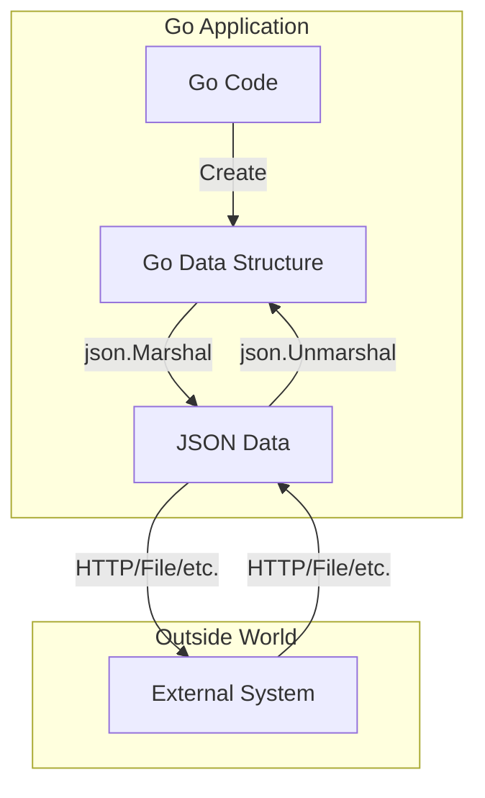

# Go JSON Processing

## Introduction

JSON (JavaScript Object Notation) is a lightweight data interchange format that has become the standard for web APIs and configuration files. Go's standard library provides robust support for working with JSON through the `encoding/json` package, making it easy to convert between JSON data and Go data structures.

This guide will walk you through the fundamentals of JSON processing in Go, from basic encoding and decoding to handling complex scenarios. Whether you're building a web service, working with APIs, or storing configuration data, understanding how to effectively work with JSON in Go is an essential skill.

## The Basics: encoding/json Package

Go's standard library includes the `encoding/json` package which provides functions and types to work with JSON data. The two primary operations are:

1. **Marshaling** - converting Go data structures to JSON
2. **Unmarshaling** - converting JSON data to Go data structures

Let's start with importing the package:

```go
import (
    "encoding/json"
    "fmt"
)
```

## Marshaling: Go to JSON

Marshaling is the process of converting Go data structures into JSON. The `json.Marshal()` function handles this conversion.

### Basic Example

```go
package main

import (
    "encoding/json"
    "fmt"
)

func main() {
    // A simple struct
    type Person struct {
        Name    string
        Age     int
        Email   string
    }

    // Create an instance
    person := Person{
        Name:  "John Doe",
        Age:   30,
        Email: "john@example.com",
    }

    // Marshal the struct to JSON
    jsonData, err := json.Marshal(person)
    if err != nil {
        fmt.Println("Error marshaling:", err)
        return
    }

    // Print the JSON as a string
    fmt.Println(string(jsonData))
}
```

**Output:**
```
{"Name":"John Doe","Age":30,"Email":"john@example.com"}
```

### Field Tags

By default, Go uses the struct field names as JSON property names. However, you can customize this using field tags:

```go
type Person struct {
    Name    string `json:"name"`
    Age     int    `json:"age"`
    Email   string `json:"email"`
}
```

With field tags, the JSON output will use the specified names:

```
{"name":"John Doe","age":30,"email":"john@example.com"}
```

### Controlling JSON Output

Field tags provide powerful options for controlling JSON output:

```go
type Person struct {
    Name     string `json:"name"`
    Age      int    `json:"age,omitempty"`  // Omit if empty
    Email    string `json:"email"`
    Password string `json:"-"`              // Never include in JSON
    Address  string `json:",omitempty"`     // Use field name, omit if empty
}
```

- `omitempty`: Omits the field if it has an empty/zero value
- `-`: Completely excludes the field from JSON output
- `,string`: Formats numeric values as strings

## Unmarshaling: JSON to Go

Unmarshaling is the process of converting JSON data into Go data structures using `json.Unmarshal()`.

### Basic Example

```go
package main

import (
    "encoding/json"
    "fmt"
)

func main() {
    // JSON data as a string
    jsonData := `{"name":"Jane Smith","age":25,"email":"jane@example.com"}`

    // Create a struct to hold the data
    type Person struct {
        Name  string `json:"name"`
        Age   int    `json:"age"`
        Email string `json:"email"`
    }

    // Create an empty instance
    var person Person

    // Unmarshal the JSON into the struct
    err := json.Unmarshal([]byte(jsonData), &person)
    if err != nil {
        fmt.Println("Error unmarshaling:", err)
        return
    }

    // Access the data
    fmt.Printf("Name: %s
Age: %d
Email: %s
", 
        person.Name, person.Age, person.Email)
}
```

**Output:**
```
Name: Jane Smith
Age: 25
Email: jane@example.com
```

### Handling Flexible JSON

Sometimes you may not know the exact structure of incoming JSON. Go provides several approaches for this:

#### Using map[string]interface{}

```go
package main

import (
    "encoding/json"
    "fmt"
)

func main() {
    // JSON with unknown structure
    jsonData := `{"name":"Product X","price":29.99,"features":["Durable","Lightweight"]}`

    // Create a map to hold any JSON object
    var result map[string]interface{}

    // Unmarshal the JSON into the map
    if err := json.Unmarshal([]byte(jsonData), &result); err != nil {
        fmt.Println("Error:", err)
        return
    }

    // Access values
    fmt.Println("Name:", result["name"])
    fmt.Println("Price:", result["price"])
    
    // Type assertions for nested data
    if features, ok := result["features"].([]interface{}); ok {
        fmt.Println("Features:")
        for i, feature := range features {
            fmt.Printf("  %d. %s
", i+1, feature)
        }
    }
}
```

**Output:**
```
Name: Product X
Price: 29.99
Features:
  1. Durable
  2. Lightweight
```

#### Using json.RawMessage

The `json.RawMessage` type allows you to delay the parsing of parts of the JSON:

```go
package main

import (
    "encoding/json"
    "fmt"
)

func main() {
    // JSON with mixed content
    jsonData := `{"type":"person","data":{"name":"Alice","age":28}}`

    // Define structs
    type Message struct {
        Type string          `json:"type"`
        Data json.RawMessage `json:"data"`
    }

    type Person struct {
        Name string `json:"name"`
        Age  int    `json:"age"`
    }

    // First parse into the generic structure
    var message Message
    if err := json.Unmarshal([]byte(jsonData), &message); err != nil {
        fmt.Println("Error:", err)
        return
    }

    fmt.Println("Message type:", message.Type)

    // Based on the type, parse the data portion
    if message.Type == "person" {
        var person Person
        if err := json.Unmarshal(message.Data, &person); err != nil {
            fmt.Println("Error:", err)
            return
        }
        fmt.Printf("Person: %s, %d years old
", person.Name, person.Age)
    }
}
```

**Output:**
```
Message type: person
Person: Alice, 28 years old
```

## Pretty Printing JSON

For debugging or human-readable output, you can use `json.MarshalIndent()`:

```go
package main

import (
    "encoding/json"
    "fmt"
)

func main() {
    type Book struct {
        Title  string   `json:"title"`
        Author string   `json:"author"`
        Pages  int      `json:"pages"`
        Tags   []string `json:"tags"`
    }

    book := Book{
        Title:  "Go Programming",
        Author: "John Doe",
        Pages:  250,

    }

    // Marshal with indentation
    prettyJSON, err := json.MarshalIndent(book, "", "  ")
    if err != nil {
        fmt.Println("Error:", err)
        return
    }

    fmt.Println(string(prettyJSON))
}
```

**Output:**
```json
{
  "title": "Go Programming",
  "author": "John Doe",
  "pages": 250,
  "tags": [
    "programming",
    "go",
    "tutorial"
  ]
}
```

## Working with JSON Streams

For handling large JSON files or streams, Go provides `json.Decoder` and `json.Encoder`:

```go
package main

import (
    "encoding/json"
    "fmt"
    "strings"
)

func main() {
    // JSON data as a reader (could be a file or network stream)
    jsonStream := strings.NewReader(`
        {"name": "Alice", "age": 25}
        {"name": "Bob", "age": 30}
        {"name": "Charlie", "age": 35}
    `)

    // Create a decoder
    decoder := json.NewDecoder(jsonStream)

    // Define a struct for the data
    type Person struct {
        Name string `json:"name"`
        Age  int    `json:"age"`
    }

    // Read multiple JSON objects from the stream
    fmt.Println("People:")
    for {
        var person Person
        if err := decoder.Decode(&person); err != nil {
            fmt.Println("End of stream or error:", err)
            break
        }
        fmt.Printf("  - %s (%d years old)
", person.Name, person.Age)
    }
}
```

**Output:**
```
People:
  - Alice (25 years old)
  - Bob (30 years old)
  - Charlie (35 years old)
End of stream or error: EOF
```

Similarly, you can use `json.Encoder` to write JSON to a stream:

```go
package main

import (
    "encoding/json"
    "os"
)

func main() {
    // Create an encoder writing to stdout
    encoder := json.NewEncoder(os.Stdout)
    encoder.SetIndent("", "  ")

    // Write some structs as JSON
    type Person struct {
        Name string `json:"name"`
        Age  int    `json:"age"`
    }

    people := []Person{
        {Name: "Alice", Age: 25},
        {Name: "Bob", Age: 30},
        {Name: "Charlie", Age: 35},
    }

    // Encode each person to the stream
    for _, person := range people {
        encoder.Encode(person)
    }
}
```

## Error Handling and Validation

When working with JSON, it's important to handle errors properly:

```go
package main

import (
    "encoding/json"
    "fmt"
)

func main() {
    // Invalid JSON
    invalidJSON := `{"name":"John", "age":30, invalid}`

    var person struct {
        Name string `json:"name"`
        Age  int    `json:"age"`
    }

    // Try to unmarshal
    err := json.Unmarshal([]byte(invalidJSON), &person)
    if err != nil {
        fmt.Println("JSON parsing error:", err)
        // Handle the error appropriately
        return
    }

    fmt.Println("Person:", person)
}
```

**Output:**
```
JSON parsing error: invalid character 'i' looking for beginning of object key string
```

### Custom Marshaling and Unmarshaling

For complete control over the JSON encoding/decoding process, you can implement the `json.Marshaler` and `json.Unmarshaler` interfaces:

```go
package main

import (
    "encoding/json"
    "fmt"
    "time"
)

// A custom date struct
type Date struct {
    Year  int
    Month int
    Day   int
}

// Implement json.Marshaler
func (d Date) MarshalJSON() ([]byte, error) {
    return []byte(fmt.Sprintf(`"%04d-%02d-%02d"`, d.Year, d.Month, d.Day)), nil
}

// Implement json.Unmarshaler
func (d *Date) UnmarshalJSON(data []byte) error {
    var dateStr string
    if err := json.Unmarshal(data, &dateStr); err != nil {
        return err
    }

    // Parse the date string
    t, err := time.Parse("2006-01-02", dateStr)
    if err != nil {
        return err
    }

    d.Year = t.Year()
    d.Month = int(t.Month())
    d.Day = t.Day()
    return nil
}

func main() {
    // Create a struct with our custom Date type
    type Event struct {
        Name string `json:"name"`
        Date Date   `json:"date"`
    }

    // Create an event
    event := Event{
        Name: "Conference",
        Date: Date{2023, 11, 15},
    }

    // Marshal to JSON
    jsonData, _ := json.MarshalIndent(event, "", "  ")
    fmt.Println("JSON output:")
    fmt.Println(string(jsonData))

    // Unmarshal from JSON
    jsonInput := `{"name":"Workshop","date":"2023-12-10"}`
    var newEvent Event
    _ = json.Unmarshal([]byte(jsonInput), &newEvent)
    
    fmt.Println("
Parsed event:")
    fmt.Printf("Name: %s
", newEvent.Name)
    fmt.Printf("Date: %04d-%02d-%02d
", 
        newEvent.Date.Year, newEvent.Date.Month, newEvent.Date.Day)
}
```

**Output:**
```
JSON output:
{
  "name": "Conference",
  "date": "2023-11-15"
}

Parsed event:
Name: Workshop
Date: 2023-12-10
```

## JSON and HTTP

JSON is commonly used in web APIs. Here's a complete example of a simple HTTP server that accepts and returns JSON:

```go
package main

import (
    "encoding/json"
    "fmt"
    "log"
    "net/http"
)

// User represents user data
type User struct {
    ID    int    `json:"id"`
    Name  string `json:"name"`
    Email string `json:"email"`
}

// In-memory "database"
var users = []User{
    {ID: 1, Name: "Alice", Email: "alice@example.com"},
    {ID: 2, Name: "Bob", Email: "bob@example.com"},
}

func main() {
    // Handler for GET /users
    http.HandleFunc("/users", func(w http.ResponseWriter, r *http.Request) {
        if r.Method == "GET" {
            // Set content type
            w.Header().Set("Content-Type", "application/json")
            
            // Encode and send the users slice
            json.NewEncoder(w).Encode(users)
            return
        }
        
        if r.Method == "POST" {
            // Decode the incoming JSON
            var newUser User
            err := json.NewDecoder(r.Body).Decode(&newUser)
            if err != nil {
                http.Error(w, err.Error(), http.StatusBadRequest)
                return
            }
            
            // Assign an ID and add to users
            newUser.ID = len(users) + 1
            users = append(users, newUser)
            
            // Respond with the created user
            w.Header().Set("Content-Type", "application/json")
            w.WriteHeader(http.StatusCreated)
            json.NewEncoder(w).Encode(newUser)
            return
        }
        
        // Method not allowed
        http.Error(w, "Method not allowed", http.StatusMethodNotAllowed)
    })

    // Start the server
    fmt.Println("Server running at http://localhost:8080")
    log.Fatal(http.ListenAndServe(":8080", nil))
}
```

To test this server:

1. GET request: `curl http://localhost:8080/users`
2. POST request: `curl -X POST -d '{"name":"Charlie","email":"charlie@example.com"}' http://localhost:8080/users`

## JSON Processing Flow

