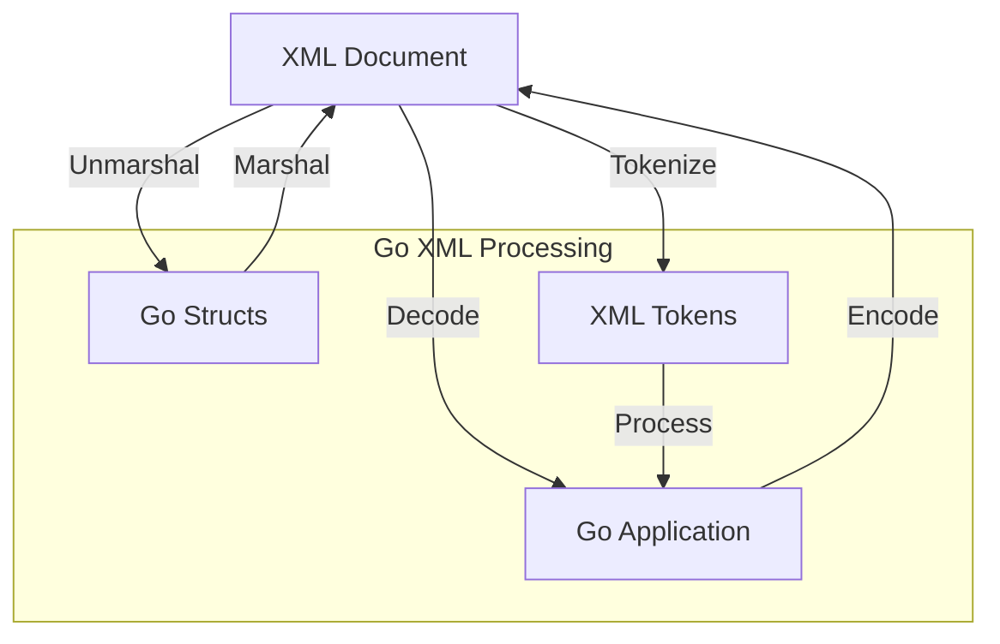

# Go XML Processing

## Introduction

XML (eXtensible Markup Language) is a widely used format for storing and exchanging structured data. Go's standard library provides robust support for working with XML through the `encoding/xml` package. This guide will introduce you to XML processing in Go, from basic parsing to advanced manipulation techniques.

Whether you're building APIs that consume XML data, working with configuration files, or integrating with legacy systems, understanding how to process XML efficiently in Go is a valuable skill for any developer.

## XML Basics

Before diving into Go's XML processing capabilities, let's quickly review the structure of XML:

```xml
<?xml version="1.0" encoding="UTF-8"?>
<bookstore>
  <book category="fiction">
    <title>The Hitchhiker's Guide to the Galaxy</title>
    <author>Douglas Adams</author>
    <year>1979</year>
    <price>12.99</price>
  </book>
  <book category="children">
    <title>Harry Potter and the Philosopher's Stone</title>
    <author>J.K. Rowling</author>
    <year>1997</year>
    <price>19.99</price>
  </book>
</bookstore>
```

XML documents consist of:
- **Elements**: Defined by start and end tags (e.g., `<book>...</book>`)
- **Attributes**: Name-value pairs within start tags (e.g., `category="fiction"`)
- **Text Content**: Data between start and end tags
- **Comments**: Notes that aren't part of the data structure (`<!-- This is a comment -->`)

## The `encoding/xml` Package

Go's standard library provides the `encoding/xml` package for XML processing. The main components include:

1. **Marshaling**: Converting Go structures to XML
2. **Unmarshaling**: Converting XML to Go structures
3. **Encoding**: Writing Go data as XML to an output stream
4. **Decoding**: Reading XML from an input stream into Go data structures
5. **Tokenizing**: Processing XML as a sequence of tokens

Let's explore each of these operations in detail.

## Unmarshaling XML

Unmarshaling is the process of parsing XML data into Go structs. Here's a basic example:

```go
package main

import (
    "encoding/xml"
    "fmt"
)

// Book represents a book in our XML
type Book struct {
    Title    string `xml:"title"`
    Author   string `xml:"author"`
    Year     int    `xml:"year"`
    Price    float64 `xml:"price"`
    Category string `xml:"category,attr"` // XML attribute
}

// Bookstore represents our XML root element
type Bookstore struct {
    XMLName xml.Name `xml:"bookstore"`
    Books   []Book   `xml:"book"`
}

func main() {
    // XML data to parse
    xmlData := `
    <bookstore>
      <book category="fiction">
        <title>The Hitchhiker's Guide to the Galaxy</title>
        <author>Douglas Adams</author>
        <year>1979</year>
        <price>12.99</price>
      </book>
      <book category="children">
        <title>Harry Potter and the Philosopher's Stone</title>
        <author>J.K. Rowling</author>
        <year>1997</year>
        <price>19.99</price>
      </book>
    </bookstore>
    `

    var bookstore Bookstore
    
    // Unmarshal XML into the Bookstore struct
    err := xml.Unmarshal([]byte(xmlData), &bookstore)
    if err != nil {
        fmt.Printf("Error unmarshaling XML: %v
", err)
        return
    }
    
    // Display the parsed data
    fmt.Println("Bookstore contains", len(bookstore.Books), "books:")
    
    for i, book := range bookstore.Books {
        fmt.Printf("Book %d:
", i+1)
        fmt.Printf("  Category: %s
", book.Category)
        fmt.Printf("  Title: %s
", book.Title)
        fmt.Printf("  Author: %s
", book.Author)
        fmt.Printf("  Year: %d
", book.Year)
        fmt.Printf("  Price: $%.2f
", book.Price)
    }
}
```

**Output:**
```
Bookstore contains 2 books:
Book 1:
  Category: fiction
  Title: The Hitchhiker's Guide to the Galaxy
  Author: Douglas Adams
  Year: 1979
  Price: $12.99
Book 2:
  Category: children
  Title: Harry Potter and the Philosopher's Stone
  Author: J.K. Rowling
  Year: 1997
  Price: $19.99
```

### Struct Tag Syntax

The struct tags used in XML unmarshaling follow this format:
- `xml:"name"` - Maps to an XML element named "name"
- `xml:"name,attr"` - Maps to an XML attribute named "name"
- `xml:",chardata"` - Maps to character data within an element
- `xml:",innerxml"` - Maps to raw XML within an element
- `xml:",omitempty"` - Omits the field if it's empty
- `xml:"-"` - Ignores the field

## Marshaling Go Structs to XML

Marshaling is the process of converting Go structs into XML data:

```go
package main

import (
    "encoding/xml"
    "fmt"
    "os"
)

type Person struct {
    XMLName   xml.Name `xml:"person"`
    ID        int      `xml:"id,attr"`
    FirstName string   `xml:"name>first"`
    LastName  string   `xml:"name>last"`
    Age       int      `xml:"age"`
    Addresses []Address `xml:"addresses>address"`
}

type Address struct {
    City  string `xml:"city"`
    State string `xml:"state"`
    Type  string `xml:"type,attr"`
}

func main() {
    person := Person{
        ID:        42,
        FirstName: "John",
        LastName:  "Doe",
        Age:       30,
        Addresses: []Address{
            {City: "New York", State: "NY", Type: "home"},
            {City: "Boston", State: "MA", Type: "work"},
        },
    }
    
    // Marshal the Person struct to XML
    output, err := xml.MarshalIndent(person, "", "  ")
    if err != nil {
        fmt.Printf("Error marshaling to XML: %v
", err)
        return
    }
    
    // Add XML header
    output = append([]byte(xml.Header), output...)
    
    // Print the XML
    fmt.Println(string(output))
    
    // Write to a file
    err = os.WriteFile("person.xml", output, 0644)
    if err != nil {
        fmt.Printf("Error writing to file: %v
", err)
    }
}
```

**Output (person.xml):**
```xml
<?xml version="1.0" encoding="UTF-8"?>
<person id="42">
  <name>
    <first>John</first>
    <last>Doe</last>
  </name>
  <age>30</age>
  <addresses>
    <address type="home">
      <city>New York</city>
      <state>NY</state>
    </address>
    <address type="work">
      <city>Boston</city>
      <state>MA</state>
    </address>
  </addresses>
</person>
```

Note that `xml.MarshalIndent` adds indentation for a more readable output. For production systems where size matters, you might use `xml.Marshal` instead.

## XML Encoding and Decoding

For streaming XML processing, Go offers the `Encoder` and `Decoder` types:

### XML Decoding

```go
package main

import (
    "encoding/xml"
    "fmt"
    "strings"
)

type Item struct {
    XMLName xml.Name `xml:"item"`
    Name    string   `xml:"name"`
    Price   float64  `xml:"price"`
}

func main() {
    xmlData := `
    <items>
        <item>
            <name>Laptop</name>
            <price>999.99</price>
        </item>
        <item>
            <name>Smartphone</name>
            <price>499.99</price>
        </item>
        <item>
            <name>Headphones</name>
            <price>149.99</price>
        </item>
    </items>
    `
    
    decoder := xml.NewDecoder(strings.NewReader(xmlData))
    
    var totalPrice float64
    
    for {
        // Read tokens from the XML document
        token, err := decoder.Token()
        if err != nil {
            break // End of document
        }
        
        // Check if token is a start element named "item"
        if startElement, ok := token.(xml.StartElement); ok && startElement.Name.Local == "item" {
            var item Item
            // Decode the current element into the item
            decoder.DecodeElement(&item, &startElement)
            
            fmt.Printf("Found item: %s, price: $%.2f
", item.Name, item.Price)
            totalPrice += item.Price
        }
    }
    
    fmt.Printf("Total price of all items: $%.2f
", totalPrice)
}
```

**Output:**
```
Found item: Laptop, price: $999.99
Found item: Smartphone, price: $499.99
Found item: Headphones, price: $149.99
Total price of all items: $1649.97
```

### XML Encoding

```go
package main

import (
    "encoding/xml"
    "fmt"
    "os"
)

type Product struct {
    XMLName     xml.Name `xml:"product"`
    ID          string   `xml:"id,attr"`
    Name        string   `xml:"name"`
    Description string   `xml:"description,omitempty"`
    Price       float64  `xml:"price"`
    InStock     bool     `xml:"in_stock"`
}

func main() {
    products := []Product{
        {
            ID:          "P001",
            Name:        "Wireless Mouse",
            Description: "Ergonomic wireless mouse with long battery life",
            Price:       29.99,
            InStock:     true,
        },
        {
            ID:          "P002",
            Name:        "Mechanical Keyboard",
            Description: "Mechanical keyboard with RGB lighting",
            Price:       89.99,
            InStock:     false,
        },
    }
    
    // Create an encoder that writes to stdout
    encoder := xml.NewEncoder(os.Stdout)
    encoder.Indent("", "  ")
    
    // Start the document with a header and root element
    fmt.Println(xml.Header)
    fmt.Println("<products>")
    
    // Encode each product
    for _, product := range products {
        err := encoder.Encode(product)
        if err != nil {
            fmt.Printf("Error encoding product: %v
", err)
        }
    }
    
    // Close the root element
    fmt.Println("</products>")
}
```

**Output:**
```xml
<?xml version="1.0" encoding="UTF-8"?>

<products>
  <product id="P001">
    <name>Wireless Mouse</name>
    <description>Ergonomic wireless mouse with long battery life</description>
    <price>29.99</price>
    <in_stock>true</in_stock>
  </product>
  <product id="P002">
    <name>Mechanical Keyboard</name>
    <description>Mechanical keyboard with RGB lighting</description>
    <price>89.99</price>
    <in_stock>false</in_stock>
  </product>
</products>
```

## Working with Namespaces

XML namespaces help avoid naming conflicts. Here's how to handle them in Go:

```go
package main

import (
    "encoding/xml"
    "fmt"
)

type RSS struct {
    XMLName xml.Name `xml:"rss"`
    Version string   `xml:"version,attr"`
    Channel Channel  `xml:"channel"`
}

type Channel struct {
    Title       string `xml:"title"`
    Link        string `xml:"link"`
    Description string `xml:"description"`
    Items       []Item `xml:"item"`
}

type Item struct {
    Title       string `xml:"title"`
    Link        string `xml:"link"`
    Description string `xml:"description"`
    PubDate     string `xml:"pubDate"`
    GUID        string `xml:"guid"`
    Creator     string `xml:"http://purl.org/dc/elements/1.1/ creator"` // Dublin Core namespace
}

func main() {
    xmlData := `<?xml version="1.0" encoding="UTF-8"?>
    <rss version="2.0" xmlns:dc="http://purl.org/dc/elements/1.1/">
      <channel>
        <title>Go Programming Blog</title>
        <link>https://example.com/blog</link>
        <description>Latest news about Go programming</description>
        <item>
          <title>Working with XML in Go</title>
          <link>https://example.com/blog/xml-in-go</link>
          <description>A comprehensive guide to XML processing in Go</description>
          <pubDate>Tue, 10 Mar 2023 14:00:00 GMT</pubDate>
          <guid>https://example.com/blog/xml-in-go</guid>
          <dc:creator>Jane Developer</dc:creator>
        </item>
      </channel>
    </rss>`
    
    var rss RSS
    err := xml.Unmarshal([]byte(xmlData), &rss)
    if err != nil {
        fmt.Printf("Error unmarshaling XML: %v
", err)
        return
    }
    
    fmt.Printf("RSS Version: %s
", rss.Version)
    fmt.Printf("Blog Title: %s
", rss.Channel.Title)
    
    for i, item := range rss.Channel.Items {
        fmt.Printf("Article %d:
", i+1)
        fmt.Printf("  Title: %s
", item.Title)
        fmt.Printf("  Author: %s
", item.Creator)
        fmt.Printf("  Published: %s
", item.PubDate)
    }
}
```

**Output:**
```
RSS Version: 2.0
Blog Title: Go Programming Blog
Article 1:
  Title: Working with XML in Go
  Author: Jane Developer
  Published: Tue, 10 Mar 2023 14:00:00 GMT
```

## Tokenized XML Processing

For more complex XML processing, the tokenization approach gives you fine-grained control:

```go
package main

import (
    "encoding/xml"
    "fmt"
    "strings"
)

func main() {
    xmlData := `
    <library>
        <book id="1">
            <title>The Go Programming Language</title>
            <author>Alan A. A. Donovan</author>
            <author>Brian W. Kernighan</author>
            <year>2015</year>
            <subjects>
                <subject>Computer Science</subject>
                <subject>Programming Languages</subject>
            </subjects>
        </book>
        <book id="2">
            <title>Effective Go</title>
            <author>Google</author>
            <year>2009</year>
            <subjects>
                <subject>Go</subject>
                <subject>Programming</subject>
            </subjects>
            <!-- This is a comment about the book -->
        </book>
    </library>
    `
    
    decoder := xml.NewDecoder(strings.NewReader(xmlData))
    
    // Keep track of the current element path
    var path []string
    
    for {
        token, err := decoder.Token()
        if err != nil {
            break // End of document
        }
        
        switch t := token.(type) {
        case xml.StartElement:
            // Add element to path
            path = append(path, t.Name.Local)
            
            // Print element with attributes
            fmt.Printf("Start Element: %s
", strings.Join(path, " > "))
            
            if len(t.Attr) > 0 {
                fmt.Print("  Attributes: ")
                for _, attr := range t.Attr {
                    fmt.Printf("%s=%q ", attr.Name.Local, attr.Value)
                }
                fmt.Println()
            }
            
        case xml.EndElement:
            // Remove last element from path
            if len(path) > 0 {
                path = path[:len(path)-1]
            }
            
        case xml.CharData:
            // Print text content
            content := strings.TrimSpace(string(t))
            if content != "" {
                fmt.Printf("  Text: %q
", content)
            }
            
        case xml.Comment:
            // Print comment
            fmt.Printf("  Comment: %s
", string(t))
        }
    }
}
```

**Output:**
```
Start Element: library
Start Element: library > book
  Attributes: id="1" 
Start Element: library > book > title
  Text: "The Go Programming Language"
Start Element: library > book > author
  Text: "Alan A. A. Donovan"
Start Element: library > book > author
  Text: "Brian W. Kernighan"
Start Element: library > book > year
  Text: "2015"
Start Element: library > book > subjects
Start Element: library > book > subjects > subject
  Text: "Computer Science"
Start Element: library > book > subjects > subject
  Text: "Programming Languages"
Start Element: library > book
  Attributes: id="2" 
Start Element: library > book > title
  Text: "Effective Go"
Start Element: library > book > author
  Text: "Google"
Start Element: library > book > year
  Text: "2009"
Start Element: library > book > subjects
Start Element: library > book > subjects > subject
  Text: "Go"
Start Element: library > book > subjects > subject
  Text: "Programming"
  Comment: This is a comment about the book
```

This approach is particularly useful for:
- Processing very large XML files without loading the entire document into memory
- Custom validation
- Extracting specific information from complex documents
- Converting XML to other formats

## Handling CDATA

XML can include CDATA sections that contain text that shouldn't be parsed. Here's how to handle them:

```go
package main

import (
    "encoding/xml"
    "fmt"
)

type Message struct {
    XMLName xml.Name `xml:"message"`
    Content string   `xml:",cdata"`
}

func main() {
    // CDATA example
    xmlData := `
    <message><![CDATA[<greeting>Hello, World!</greeting>]]></message>
    `
    
    var message Message
    err := xml.Unmarshal([]byte(xmlData), &message)
    if err != nil {
        fmt.Printf("Error unmarshaling XML: %v
", err)
        return
    }
    
    fmt.Printf("CDATA content: %s
", message.Content)
    
    // Create a new message with CDATA
    newMessage := Message{
        Content: "<script>alert('Hello!');</script>",
    }
    
    output, err := xml.MarshalIndent(newMessage, "", "  ")
    if err != nil {
        fmt.Printf("Error marshaling XML: %v
", err)
        return
    }
    
    fmt.Println(string(output))
}
```

**Output:**
```
CDATA content: <greeting>Hello, World!</greeting>
<message>
  <![CDATA[<script>alert('Hello!');</script>]]>
</message>
```

## Real-World Example: Processing Weather Data

Let's create a more comprehensive example that processes weather data from an XML feed:

```go
package main

import (
    "encoding/xml"
    "fmt"
    "io"
    "net/http"
    "os"
    "time"
)

// WeatherData represents the root element of our weather XML
type WeatherData struct {
    XMLName   xml.Name  `xml:"weatherdata"`
    Location  Location  `xml:"location"`
    Forecast  Forecast  `xml:"forecast"`
    Credit    string    `xml:"credit"`
    UpdatedAt time.Time `xml:"lastupdate,attr"`
}

// Location represents a geographic location
type Location struct {
    Name      string  `xml:"name"`
    Country   string  `xml:"country"`
    Latitude  float64 `xml:"latitude"`
    Longitude float64 `xml:"longitude"`
}

// Forecast contains weather predictions
type Forecast struct {
    Days []Day `xml:"day"`
}

// Day contains weather information for a specific day
type Day struct {
    Date        string  `xml:"date,attr"`
    MaxTemp     float64 `xml:"maxtemp"`
    MinTemp     float64 `xml:"mintemp"`
    Conditions  string  `xml:"conditions"`
    Humidity    int     `xml:"humidity"`
    WindSpeed   float64 `xml:"windspeed"`
    WindDir     string  `xml:"winddir"`
    Precipitation float64 `xml:"precipitation"`
}

func main() {
    // In a real-world scenario, you would fetch from an API
    // For this example, we'll read from a local file
    file, err := os.Open("weather.xml")
    if err != nil {
        // If the file doesn't exist, create a sample one
        createSampleWeatherFile()
        file, err = os.Open("weather.xml")
        if err != nil {
            fmt.Printf("Failed to open weather.xml: %v
", err)
            return
        }
    }
    defer file.Close()
    
    // Read and parse the XML
    var weather WeatherData
    decoder := xml.NewDecoder(file)
    err = decoder.Decode(&weather)
    if err != nil {
        fmt.Printf("Error decoding XML: %v
", err)
        return
    }
    
    // Display the weather information
    fmt.Printf("Weather for %s, %s
", weather.Location.Name, weather.Location.Country)
    fmt.Printf("Coordinates: %.2f, %.2f
", weather.Location.Latitude, weather.Location.Longitude)
    fmt.Printf("Last updated: %s
", weather.UpdatedAt.Format(time.RFC1123))
    fmt.Printf("Data provided by: %s

", weather.Credit)
    
    fmt.Println("5-Day Forecast:")
    fmt.Println("==============")
    
    for _, day := range weather.Forecast.Days {
        fmt.Printf("Date: %s
", day.Date)
        fmt.Printf("  Conditions: %s
", day.Conditions)
        fmt.Printf("  Temperature: %.1f°C to %.1f°C
", day.MinTemp, day.MaxTemp)
        fmt.Printf("  Humidity: %d%%
", day.Humidity)
        fmt.Printf("  Wind: %.1f km/h from %s
", day.WindSpeed, day.WindDir)
        fmt.Printf("  Precipitation: %.1f mm

", day.Precipitation)
    }
}

// createSampleWeatherFile creates a sample XML file for demonstration
func createSampleWeatherFile() {
    weather := WeatherData{
        Location: Location{
            Name:      "San Francisco",
            Country:   "USA",
            Latitude:  37.7749,
            Longitude: -122.4194,
        },
        Forecast: Forecast{
            Days: []Day{
                {
                    Date:        "2023-03-01",
                    MaxTemp:     18.5,
                    MinTemp:     12.0,
                    Conditions:  "Partly Cloudy",
                    Humidity:    65,
                    WindSpeed:   12.5,
                    WindDir:     "SW",
                    Precipitation: 0.0,
                },
                {
                    Date:        "2023-03-02",
                    MaxTemp:     19.2,
                    MinTemp:     13.5,
                    Conditions:  "Sunny",
                    Humidity:    60,
                    WindSpeed:   10.0,
                    WindDir:     "W",
                    Precipitation: 0.0,
                },
                {
                    Date:        "2023-03-03",
                    MaxTemp:     17.0,
                    MinTemp:     12.8,
                    Conditions:  "Cloudy",
                    Humidity:    75,
                    WindSpeed:   15.0,
                    WindDir:     "NW",
                    Precipitation: 2.5,
                },
                {
                    Date:        "2023-03-04",
                    MaxTemp:     16.0,
                    MinTemp:     11.5,
                    Conditions:  "Rain",
                    Humidity:    85,
                    WindSpeed:   18.0,
                    WindDir:     "N",
                    Precipitation: 15.0,
                },
                {
                    Date:        "2023-03-05",
                    MaxTemp:     15.5,
                    MinTemp:     10.0,
                    Conditions:  "Light Rain",
                    Humidity:    80,
                    WindSpeed:   12.0,
                    WindDir:     "NE",
                    Precipitation: 5.0,
                },
            },
        },
        Credit:    "Weather Data Providers Inc.",
        UpdatedAt: time.Now(),
    }
    
    // Marshal the data to XML
    output, err := xml.MarshalIndent(weather, "", "  ")
    if err != nil {
        fmt.Printf("Error marshaling to XML: %v
", err)
        return
    }
    
    // Add XML header
    output = append([]byte(xml.Header), output...)
    
    // Write to file
    err = os.WriteFile("weather.xml", output, 0644)
    if err != nil {
        fmt.Printf("Error writing to file: %v
", err)
    }
}
```

**Sample Output:**
```
Weather for San Francisco, USA
Coordinates: 37.77, -122.42
Last updated: Wed, 01 Mar 2023 12:34:56 MST
Data provided by: Weather Data Providers Inc.

5-Day Forecast:
==============
Date: 2023-03-01
  Conditions: Partly Cloudy
  Temperature: 12.0°C to 18.5°C
  Humidity: 65%
  Wind: 12.5 km/h from SW
  Precipitation: 0.0 mm

Date: 2023-03-02
  Conditions: Sunny
  Temperature: 13.5°C to 19.2°C
  Humidity: 60%
  Wind: 10.0 km/h from W
  Precipitation: 0.0 mm

Date: 2023-03-03
  Conditions: Cloudy
  Temperature: 12.8°C to 17.0°C
  Humidity: 75%
  Wind: 15.0 km/h from NW
  Precipitation: 2.5 mm

Date: 2023-03-04
  Conditions: Rain
  Temperature: 11.5°C to 16.0°C
  Humidity: 85%
  Wind: 18.0 km/h from N
  Precipitation: 15.0 mm

Date: 2023-03-05
  Conditions: Light Rain
  Temperature: 10.0°C to 15.5°C
  Humidity: 80%
  Wind: 12.0 km/h from NE
  Precipitation: 5.0 mm
```

## XML Processing Workflow Diagram

Here's a visual representation of the XML processing workflow in Go:



## Best Practices for XML Processing in Go

1. **Define clear struct mappings:** Use struct tags to clearly define how your Go types map to XML elements and attributes.

2. **Validation:** Validate XML data before attempting to process it, especially when dealing with external sources.

3. **Error handling:** Always check for errors during XML processing operations.

4. **Namespaces:** Be explicit about XML namespaces when working with documents that use them.

5. **Memory usage:** For large XML files, prefer streaming approaches using encoders/decoders or token-based processing to avoid loading the entire document into memory.

6. **Performance considerations:**
   - Preallocate slices when possible
   - Reuse decoders for multiple documents
   - For large documents, consider using SAX-like tokenization rather than DOM-like unmarshaling

7. **Security:** Be careful with untrusted XML data - XML can contain entities that might cause issues like XML entity expansion attacks.

