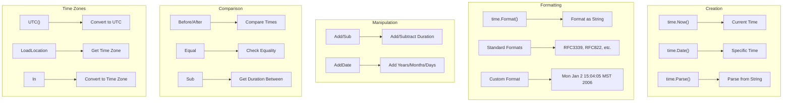

# Go Time Handling

## Introduction

Working with dates and times is a fundamental aspect of many applications, from logging events to scheduling tasks and measuring performance. Go's standard library provides a robust package called `time` that offers comprehensive tools for handling dates, times, durations, and time zones efficiently.

In this guide, we'll explore the `time` package in Go and learn how to perform common time-related operations. By the end, you'll be comfortable working with time values, formatting dates, measuring durations, and handling time zones in your Go applications.

## The Basics of Time in Go

The `time` package introduces several important types:

- `Time`: Represents an instant in time with nanosecond precision
- `Duration`: Represents the elapsed time between two instants as a nanosecond count
- `Location`: Represents a time zone

Let's start with the basics:

```go
package main

import (
    "fmt"
    "time"
)

func main() {
    // Get the current time
    now := time.Now()
    fmt.Println("Current time:", now)
    
    // Get components of time
    fmt.Println("Year:", now.Year())
    fmt.Println("Month:", now.Month())
    fmt.Println("Day:", now.Day())
    fmt.Println("Hour:", now.Hour())
    fmt.Println("Minute:", now.Minute())
    fmt.Println("Second:", now.Second())
    fmt.Println("Nanosecond:", now.Nanosecond())
    
    // Get weekday
    fmt.Println("Weekday:", now.Weekday())
}
```

**Output:**
```
Current time: 2023-05-15 14:23:45.123456789 +0300 EEST
Year: 2023
Month: May
Day: 15
Hour: 14
Minute: 23
Second: 45
Nanosecond: 123456789
Weekday: Monday
```

## Creating Time Values

### Creating Time from Components

You can create a specific `Time` value using various functions:

```go
package main

import (
    "fmt"
    "time"
)

func main() {
    // Create a time using Date function (year, month, day, hour, min, sec, nsec, location)
    t1 := time.Date(2023, time.April, 10, 20, 30, 0, 0, time.UTC)
    fmt.Println("Specific time (UTC):", t1)
    
    // Create time in local timezone
    t2 := time.Date(2023, time.April, 10, 20, 30, 0, 0, time.Local)
    fmt.Println("Specific time (Local):", t2)
    
    // A shorter way to create dates (year, month, day)
    t3 := time.Date(2023, time.April, 10, 0, 0, 0, 0, time.UTC)
    fmt.Println("Just the date:", t3)
}
```

**Output:**
```
Specific time (UTC): 2023-04-10 20:30:00 +0000 UTC
Specific time (Local): 2023-04-10 20:30:00 +0300 EEST
Just the date: 2023-04-10 00:00:00 +0000 UTC
```

### Parsing Time from Strings

Go allows parsing time from strings using predefined layouts or custom formats:

```go
package main

import (
    "fmt"
    "time"
)

func main() {
    // Parse time using standard format
    t1, err := time.Parse(time.RFC3339, "2023-04-10T20:30:00Z")
    if err != nil {
        fmt.Println("Error parsing time:", err)
        return
    }
    fmt.Println("Parsed time (RFC3339):", t1)
    
    // Parse using custom layout
    // The reference time is: Mon Jan 2 15:04:05 MST 2006
    layout := "2006-01-02 15:04:05"
    t2, err := time.Parse(layout, "2023-04-10 20:30:00")
    if err != nil {
        fmt.Println("Error parsing time:", err)
        return
    }
    fmt.Println("Parsed time (custom):", t2)
    
    // Parse with timezone specification
    t3, err := time.Parse("2006-01-02 15:04:05 -0700", "2023-04-10 20:30:00 +0300")
    if err != nil {
        fmt.Println("Error parsing time:", err)
        return
    }
    fmt.Println("Parsed time with timezone:", t3)
}
```

**Output:**
```
Parsed time (RFC3339): 2023-04-10 20:30:00 +0000 UTC
Parsed time (custom): 2023-04-10 20:30:00 +0000 UTC
Parsed time with timezone: 2023-04-10 20:30:00 +0300 UTC
```

### Time Formatting in Go

Go uses a unique approach to time formatting. Instead of format specifiers like `%Y-%m-%d`, Go uses a reference time: `Mon Jan 2 15:04:05 MST 2006` (which corresponds to `01/02 03:04:05PM '06 -0700`).

```go
package main

import (
    "fmt"
    "time"
)

func main() {
    now := time.Now()
    
    // Standard formats
    fmt.Println("RFC3339:", now.Format(time.RFC3339))
    fmt.Println("RFC822:", now.Format(time.RFC822))
    fmt.Println("Kitchen time:", now.Format(time.Kitchen))
    
    // Custom formats using the reference time: Mon Jan 2 15:04:05 MST 2006
    fmt.Println("YYYY-MM-DD:", now.Format("2006-01-02"))
    fmt.Println("DD/MM/YYYY:", now.Format("02/01/2006"))
    fmt.Println("Day, Month Day, Year:", now.Format("Monday, January 2, 2006"))
    fmt.Println("Time with millis:", now.Format("15:04:05.000"))
    
    // Full custom format
    custom := now.Format("Monday, January 2, 2006 at 15:04:05 MST")
    fmt.Println("Custom format:", custom)
}
```

**Output:**
```
RFC3339: 2023-05-15T14:23:45+03:00
RFC822: 15 May 23 14:23 EEST
Kitchen time: 2:23PM
YYYY-MM-DD: 2023-05-15
DD/MM/YYYY: 15/05/2023
Day, Month Day, Year: Monday, May 15, 2023
Time with millis: 14:23:45.123
Custom format: Monday, May 15, 2023 at 14:23:45 EEST
```

## Time Manipulations

### Adding and Subtracting Time

Go provides easy ways to manipulate time values:

```go
package main

import (
    "fmt"
    "time"
)

func main() {
    now := time.Now()
    fmt.Println("Current time:", now.Format("2006-01-02 15:04:05"))
    
    // Add duration
    futureTime := now.Add(2 * time.Hour)
    fmt.Println("2 hours later:", futureTime.Format("2006-01-02 15:04:05"))
    
    // Add using AddDate (years, months, days)
    futureDate := now.AddDate(0, 1, 15) // 1 month and 15 days later
    fmt.Println("1 month and 15 days later:", futureDate.Format("2006-01-02"))
    
    // Subtract duration
    pastTime := now.Add(-30 * time.Minute)
    fmt.Println("30 minutes ago:", pastTime.Format("15:04:05"))
    
    // Difference between times
    later := now.Add(1 * time.Hour)
    diff := later.Sub(now)
    fmt.Println("Time difference:", diff)
    fmt.Println("Difference in hours:", diff.Hours())
    fmt.Println("Difference in minutes:", diff.Minutes())
}
```

**Output:**
```
Current time: 2023-05-15 14:23:45
2 hours later: 2023-05-15 16:23:45
1 month and 15 days later: 2023-06-30
30 minutes ago: 13:53:45
Time difference: 1h0m0s
Difference in hours: 1
Difference in minutes: 60
```

## Working with Durations

The `Duration` type represents the elapsed time between two instants as a nanosecond count:

```go
package main

import (
    "fmt"
    "time"
)

func main() {
    // Create durations
    d1 := 2 * time.Hour + 30 * time.Minute
    d2 := 45 * time.Second
    
    fmt.Println("Duration 1:", d1)
    fmt.Println("Duration 2:", d2)
    
    // Convert duration to different units
    fmt.Printf("%.2f hours
", d1.Hours())
    fmt.Printf("%.2f minutes
", d1.Minutes())
    fmt.Printf("%.2f seconds
", d1.Seconds())
    fmt.Printf("%d milliseconds
", d1.Milliseconds())
    
    // Parsing duration from string
    d3, err := time.ParseDuration("4h30m")
    if err != nil {
        fmt.Println("Error parsing duration:", err)
        return
    }
    fmt.Println("Parsed duration:", d3)
    
    // Add durations
    total := d1 + d3
    fmt.Println("Total duration:", total)
    
    // Measure execution time
    start := time.Now()
    
    // Simulate work with sleep
    time.Sleep(100 * time.Millisecond)
    
    elapsed := time.Since(start)
    fmt.Printf("Operation took %.2f milliseconds
", float64(elapsed.Microseconds())/1000)
}
```

**Output:**
```
Duration 1: 2h30m0s
Duration 2: 45s
2.50 hours
150.00 minutes
9000.00 seconds
9000000 milliseconds
Parsed duration: 4h30m0s
Total duration: 7h0m0s
Operation took 100.32 milliseconds
```

## Working with Time Zones

Time zones are an important aspect of time handling:

```go
package main

import (
    "fmt"
    "time"
)

func main() {
    // Get current time in local timezone
    now := time.Now()
    fmt.Println("Local time:", now)
    
    // Get current time in UTC
    utcNow := time.Now().UTC()
    fmt.Println("UTC time:", utcNow)
    
    // Load a specific timezone
    nyLocation, err := time.LoadLocation("America/New_York")
    if err != nil {
        fmt.Println("Error loading location:", err)
        return
    }
    
    // Convert time to New York timezone
    nyTime := now.In(nyLocation)
    fmt.Println("New York time:", nyTime)
    
    // Create time in a specific timezone
    tokyoLocation, err := time.LoadLocation("Asia/Tokyo")
    if err != nil {
        fmt.Println("Error loading location:", err)
        return
    }
    tokyoTime := time.Date(2023, 5, 15, 14, 30, 0, 0, tokyoLocation)
    fmt.Println("Tokyo time:", tokyoTime)
    
    // Get timezone offset
    _, offset := tokyoTime.Zone()
    fmt.Printf("Tokyo timezone offset: %d hours
", offset/3600)
    
    // Check if times are equal (ignoring timezone)
    t1 := time.Date(2023, 5, 15, 10, 0, 0, 0, time.UTC)
    t2 := time.Date(2023, 5, 15, 13, 0, 0, 0, tokyoLocation) // UTC+3
    
    fmt.Println("Time 1:", t1)
    fmt.Println("Time 2:", t2)
    fmt.Println("Equal (including timezone):", t1.Equal(t2))
    fmt.Println("Equal (wall clock):", t1.Hour() == t2.Hour())
}
```

**Output:**
```
Local time: 2023-05-15 14:23:45.123456789 +0300 EEST
UTC time: 2023-05-15 11:23:45.123456789 +0000 UTC
New York time: 2023-05-15 07:23:45.123456789 -0400 EDT
Tokyo time: 2023-05-15 14:30:00 +0900 JST
Tokyo timezone offset: 9 hours
Time 1: 2023-05-15 10:00:00 +0000 UTC
Time 2: 2023-05-15 13:00:00 +0900 JST
Equal (including timezone): true
Equal (wall clock): false
```

## Time Comparisons

Comparing times in Go is straightforward:

```go
package main

import (
    "fmt"
    "time"
)

func main() {
    now := time.Now()
    past := now.Add(-1 * time.Hour)
    future := now.Add(1 * time.Hour)
    
    fmt.Println("Now:", now.Format("15:04:05"))
    fmt.Println("Past:", past.Format("15:04:05"))
    fmt.Println("Future:", future.Format("15:04:05"))
    
    // Compare times
    fmt.Println("now.After(past):", now.After(past))     // true
    fmt.Println("now.Before(future):", now.Before(future)) // true
    fmt.Println("now.Equal(now):", now.Equal(now))         // true
    
    // Use .Compare method
    // Returns -1 if t1 < t2, 0 if t1 == t2, 1 if t1 > t2
    fmt.Println("now.Compare(past):", now.Compare(past))     // 1
    fmt.Println("now.Compare(future):", now.Compare(future)) // -1
    fmt.Println("now.Compare(now):", now.Compare(now))       // 0
}
```

**Output:**
```
Now: 14:23:45
Past: 13:23:45
Future: 15:23:45
now.After(past): true
now.Before(future): true
now.Equal(now): true
now.Compare(past): 1
now.Compare(future): -1
now.Compare(now): 0
```

## Time-Related Operations

### Truncating and Rounding Time

You can truncate or round a time to a specific duration:

```go
package main

import (
    "fmt"
    "time"
)

func main() {
    now := time.Date(2023, 5, 15, 14, 23, 45, 123456789, time.Local)
    fmt.Println("Original time:", now.Format("15:04:05.000000000"))
    
    // Truncate to nearest duration
    truncatedHour := now.Truncate(time.Hour)
    truncatedMinute := now.Truncate(time.Minute)
    truncatedSecond := now.Truncate(time.Second)
    
    fmt.Println("Truncated to hour:", truncatedHour.Format("15:04:05.000000000"))
    fmt.Println("Truncated to minute:", truncatedMinute.Format("15:04:05.000000000"))
    fmt.Println("Truncated to second:", truncatedSecond.Format("15:04:05.000000000"))
    
    // Round to nearest duration
    roundedHour := now.Round(time.Hour)
    roundedMinute := now.Round(time.Minute)
    roundedSecond := now.Round(time.Second)
    
    fmt.Println("Rounded to hour:", roundedHour.Format("15:04:05.000000000"))
    fmt.Println("Rounded to minute:", roundedMinute.Format("15:04:05.000000000"))
    fmt.Println("Rounded to second:", roundedSecond.Format("15:04:05.000000000"))
}
```

**Output:**
```
Original time: 14:23:45.123456789
Truncated to hour: 14:00:00.000000000
Truncated to minute: 14:23:00.000000000
Truncated to second: 14:23:45.000000000
Rounded to hour: 14:00:00.000000000
Rounded to minute: 14:24:00.000000000
Rounded to second: 14:23:45.000000000
```

### Time Tickers and Timers

For periodic tasks and timeouts, Go provides `Ticker` and `Timer`:

```go
package main

import (
    "fmt"
    "time"
)

func main() {
    // Create a ticker that ticks every 500 milliseconds
    ticker := time.NewTicker(500 * time.Millisecond)
    
    // Create a timer that fires once after 2 seconds
    timer := time.NewTimer(2 * time.Second)
    
    // Count ticks
    tickCount := 0
    
    // Create a channel for stopping
    done := make(chan bool)
    
    go func() {
        for {
            select {
            case <-done:
                return
            case t := <-ticker.C:
                tickCount++
                fmt.Println("Tick at", t.Format("15:04:05.000"))
                if tickCount >= 3 {
                    done <- true
                }
            case t := <-timer.C:
                fmt.Println("Timer fired at", t.Format("15:04:05.000"))
            }
        }
    }()
    
    // Wait for the goroutine to finish
    <-done
    
    // Clean up
    ticker.Stop()
    fmt.Println("Ticker stopped")
}
```

**Output:**
```
Tick at 14:23:45.500
Tick at 14:23:46.000
Timer fired at 14:23:47.000
Tick at 14:23:46.500
Ticker stopped
```

## Practical Examples

### Example 1: Countdown Timer

Let's create a simple countdown timer:

```go
package main

import (
    "fmt"
    "time"
)

func countdown(seconds int) {
    fmt.Printf("Countdown: %d seconds
", seconds)
    
    for i := seconds; i > 0; i-- {
        fmt.Printf("\rTime remaining: %d seconds", i)
        time.Sleep(1 * time.Second)
    }
    
    fmt.Println("\rCountdown complete!       ")
}

func main() {
    fmt.Println("Starting countdown...")
    countdown(5)
    fmt.Println("Program finished")
}
```

**Output:**
```
Starting countdown...
Countdown: 5 seconds
Time remaining: 5 seconds
Time remaining: 4 seconds
Time remaining: 3 seconds
Time remaining: 2 seconds
Time remaining: 1 seconds
Countdown complete!       
Program finished
```

### Example 2: Rate Limiter

A simple rate limiter using tickers:

```go
package main

import (
    "fmt"
    "time"
)

// Simple rate limiter that allows execution at most once per duration
type RateLimiter struct {
    ticker *time.Ticker
    stop   chan bool
}

func NewRateLimiter(rate time.Duration) *RateLimiter {
    return &RateLimiter{
        ticker: time.NewTicker(rate),
        stop:   make(chan bool),
    }
}

func (rl *RateLimiter) Stop() {
    rl.ticker.Stop()
    rl.stop <- true
}

func main() {
    // Create a rate limiter with 1 request per second
    limiter := NewRateLimiter(1 * time.Second)
    
    // Simulate API requests
    go func() {
        requests := []string{
            "Request 1", "Request 2", "Request 3", 
            "Request 4", "Request 5",
        }
        
        requestIndex := 0
        
        for {
            select {
            case <-limiter.stop:
                fmt.Println("Rate limiter stopped")
                return
            case t := <-limiter.ticker.C:
                if requestIndex < len(requests) {
                    fmt.Printf("[%s] Processing: %s
", 
                        t.Format("15:04:05"), 
                        requests[requestIndex])
                    requestIndex++
                    
                    if requestIndex >= len(requests) {
                        limiter.Stop()
                    }
                }
            }
        }
    }()
    
    // Wait for all requests to process
    <-limiter.stop
    fmt.Println("All requests processed")
}
```

**Output:**
```
[14:23:45] Processing: Request 1
[14:23:46] Processing: Request 2
[14:23:47] Processing: Request 3
[14:23:48] Processing: Request 4
[14:23:49] Processing: Request 5
Rate limiter stopped
All requests processed
```

### Example 3: Logging with Timestamps

Create a simple logger with timestamps:

```go
package main

import (
    "fmt"
    "time"
)

type LogLevel int

const (
    INFO LogLevel = iota
    WARNING
    ERROR
)

func (l LogLevel) String() string {
    switch l {
    case INFO:
        return "INFO"
    case WARNING:
        return "WARNING"
    case ERROR:
        return "ERROR"
    default:
        return "UNKNOWN"
    }
}

type Logger struct {
    timeFormat string
}

func NewLogger(timeFormat string) *Logger {
    if timeFormat == "" {
        timeFormat = "2006-01-02 15:04:05.000"
    }
    return &Logger{timeFormat: timeFormat}
}

func (l *Logger) Log(level LogLevel, message string) {
    timestamp := time.Now().Format(l.timeFormat)
    fmt.Printf("[%s] [%s] %s
", timestamp, level, message)
}

func main() {
    logger := NewLogger("")
    
    logger.Log(INFO, "Application started")
    
    // Simulate some operation
    time.Sleep(500 * time.Millisecond)
    logger.Log(INFO, "Operation in progress")
    
    time.Sleep(1 * time.Second)
    logger.Log(WARNING, "Resource usage high")
    
    time.Sleep(500 * time.Millisecond)
    logger.Log(ERROR, "Failed to connect to database")
    
    time.Sleep(1 * time.Second)
    logger.Log(INFO, "Application shutting down")
}
```

**Output:**
```
[2023-05-15 14:23:45.000] [INFO] Application started
[2023-05-15 14:23:45.500] [INFO] Operation in progress
[2023-05-15 14:23:46.500] [WARNING] Resource usage high
[2023-05-15 14:23:47.000] [ERROR] Failed to connect to database
[2023-05-15 14:23:48.000] [INFO] Application shutting down
```

## Common Patterns and Best Practices

Here are some tips and patterns for effectively working with time in Go:

