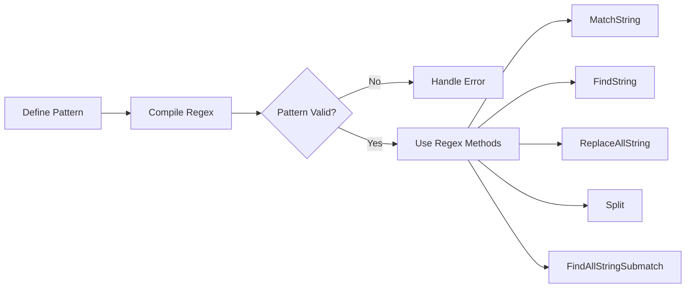

# Go Regular Expressions

Regular expressions (regex) are powerful patterns used to match character combinations in strings. In Go, the `regexp` package provides support for regular expressions, allowing you to perform pattern matching and text manipulation efficiently.

## Introduction to Regular Expressions in Go

Go's standard library includes the `regexp` package, which implements regular expression search with syntax similar to Perl's. This package allows you to:

- Check if a string contains a pattern
- Extract matching substrings
- Replace matching patterns with new text
- Split strings based on pattern matches

Regular expressions are particularly useful when you need to:
- Validate input formats (emails, phone numbers, etc.)
- Extract information from structured text
- Transform text by replacing patterns
- Parse and process text data

## Getting Started with Go's regexp Package

Let's start by importing the package and creating a simple regex pattern:

```go
package main

import (
    "fmt"
    "regexp"
)

func main() {
    // Check if a string contains any digits
    matched, err := regexp.MatchString(`\d`, "Hello123")
    if err != nil {
        fmt.Println("Error:", err)
        return
    }
    
    if matched {
        fmt.Println("String contains at least one digit")
    } else {
        fmt.Println("String doesn't contain any digits")
    }
}
```

**Output:**
```
String contains at least one digit
```

In this example:
- We used the `MatchString` function to check if a pattern exists in a string
- `\d` is a regex pattern that matches any digit
- The function returns a boolean indicating if there's a match and an error (if any)

## Compiling Regular Expressions

For better performance, especially when you use the same pattern multiple times, you should compile the regular expression first:

```go
package main

import (
    "fmt"
    "regexp"
)

func main() {
    // Compile the regular expression
    re, err := regexp.Compile(`\d+`)
    if err != nil {
        fmt.Println("Error compiling regex:", err)
        return
    }
    
    // Use the compiled regex
    fmt.Println(re.MatchString("Hello123"))  // true
    fmt.Println(re.MatchString("HelloWorld")) // false
    
    // Find all matches
    digits := re.FindAllString("There are 42 apples and 15 oranges", -1)
    fmt.Println(digits) // [42 15]
}
```

**Output:**
```
true
false
[42 15]
```

Compiling a pattern creates a `Regexp` object with methods for different matching operations.

## Basic Pattern Matching Operations

Here are the most common pattern matching operations:

```go
package main

import (
    "fmt"
    "regexp"
)

func main() {
    text := "Contact: john.doe@example.com or jane_smith@company.org"
    emailPattern := regexp.MustCompile(`[a-zA-Z0-9_.+-]+@[a-zA-Z0-9-]+\.[a-zA-Z0-9-.]+`)
    
    // Check if there's a match
    fmt.Println("Contains email?", emailPattern.MatchString(text)) // true
    
    // Find the first match
    firstEmail := emailPattern.FindString(text)
    fmt.Println("First email:", firstEmail) // john.doe@example.com
    
    // Find all matches
    allEmails := emailPattern.FindAllString(text, -1)
    fmt.Println("All emails:", allEmails) // [john.doe@example.com jane_smith@company.org]
    
    // Find location of first match
    loc := emailPattern.FindStringIndex(text)
    fmt.Printf("First email found at positions %d to %d
", loc[0], loc[1])
    
    // Find locations of all matches
    allLocs := emailPattern.FindAllStringIndex(text, -1)
    fmt.Println("All email locations:", allLocs)
}
```

**Output:**
```
Contains email? true
First email: john.doe@example.com
All emails: [john.doe@example.com jane_smith@company.org]
First email found at positions 9 to 30
All email locations: [[9 30] [34 57]]
```

Note that `MustCompile` is a variant of `Compile` that panics if the pattern is invalid, which is useful when you're certain about your pattern's correctness.

## Regular Expression Syntax

Go's regular expressions use syntax similar to Perl, with some differences. Here are the basic elements:

| Pattern | Description | Example |
|---------|-------------|---------|
| `.` | Matches any character except newline | `a.c` matches "abc", "adc", etc. |
| `^` | Matches the start of a string | `^Hello` matches strings starting with "Hello" |
| `$` | Matches the end of a string | `World$` matches strings ending with "World" |
| `*` | Matches 0 or more of the preceding element | `a*` matches "", "a", "aa", etc. |
| `+` | Matches 1 or more of the preceding element | `a+` matches "a", "aa", etc. but not "" |
| `?` | Matches 0 or 1 of the preceding element | `colou?r` matches "color" and "colour" |
| `\d` | Matches any digit | `\d{3}` matches "123", "456", etc. |
| `\w` | Matches any word character (alphanumeric + underscore) | `\w+` matches words |
| `\s` | Matches any whitespace character | `a\sb` matches "a b" |
| `[...]` | Matches any character within brackets | `[aeiou]` matches any vowel |
| `[^...]` | Matches any character not in brackets | `[^0-9]` matches any non-digit |
| `\b` | Word boundary | `\bthe\b` matches "the" as a complete word |
| `(...)` | Capturing group | `(go)+` matches "go", "gogo", etc. |
| `a{n}` | Matches exactly n of a | `a{3}` matches "aaa" |
| `a{n,}` | Matches n or more of a | `a{2,}` matches "aa", "aaa", etc. |
| `a{n,m}` | Matches between n and m of a | `a{2,4}` matches "aa", "aaa", or "aaaa" |

Let's see some examples:

```go
package main

import (
    "fmt"
    "regexp"
)

func main() {
    // Different pattern examples
    patterns := []struct {
        regex string
        text  string
    }{
        {`^Go`, "Go is fun"},          // Starts with "Go"
        {`fun$`, "Go is fun"},         // Ends with "fun"
        {`G.`, "Go is fun"},           // G followed by any character
        {`\bGo\b`, "The Go language"}, // "Go" as a complete word
        {`[aeiou]`, "Go"},             // Any vowel
        {`[^aeiou]`, "Go"},            // Any non-vowel
        {`\d{3}-\d{4}`, "123-4567"},   // Pattern like 123-4567
        {`Go{2,}gle`, "Gooogle"},      // "G" followed by 2+ "o"s and "gle"
    }
    
    for _, test := range patterns {
        re := regexp.MustCompile(test.regex)
        fmt.Printf("Pattern %q matches %q: %v
", 
            test.regex, test.text, re.MatchString(test.text))
    }
}
```

**Output:**
```
Pattern "^Go" matches "Go is fun": true
Pattern "fun$" matches "Go is fun": true
Pattern "G." matches "Go is fun": true
Pattern "\bGo\b" matches "The Go language": true
Pattern "[aeiou]" matches "Go": true
Pattern "[^aeiou]" matches "Go": true
Pattern "\d{3}-\d{4}" matches "123-4567": true
Pattern "Go{2,}gle" matches "Gooogle": true
```

## Capturing Groups

One of the most powerful features of regular expressions is the ability to capture and extract parts of the matched text using parentheses:

```go
package main

import (
    "fmt"
    "regexp"
)

func main() {
    // Parse dates in format: YYYY-MM-DD
    dateStr := "Important dates: 2023-01-15 and 2023-02-28"
    datePattern := regexp.MustCompile(`(\d{4})-(\d{2})-(\d{2})`)
    
    // Find all matches with submatches (capturing groups)
    matches := datePattern.FindAllStringSubmatch(dateStr, -1)
    
    for i, match := range matches {
        fmt.Printf("Date %d:
", i+1)
        fmt.Printf("  Full date: %s
", match[0])
        fmt.Printf("  Year: %s
", match[1])
        fmt.Printf("  Month: %s
", match[2])
        fmt.Printf("  Day: %s
", match[3])
    }
}
```

**Output:**
```
Date 1:
  Full date: 2023-01-15
  Year: 2023
  Month: 01
  Day: 15
Date 2:
  Full date: 2023-02-28
  Year: 2023
  Month: 02
  Day: 28
```

The `FindAllStringSubmatch` method returns an array where:
- Index 0 contains the entire match
- Indices 1 and onwards contain the submatches for each capturing group

You can also use named capturing groups for clarity:

```go
package main

import (
    "fmt"
    "regexp"
)

func main() {
    log := `[2023-03-14 15:30:45] ERROR: Database connection failed
[2023-03-14 15:31:22] INFO: Retry successful
[2023-03-14 16:45:01] WARNING: High memory usage detected`
    
    // Named capturing groups
    logPattern := regexp.MustCompile(`\[(?P<date>\d{4}-\d{2}-\d{2}) (?P<time>\d{2}:\d{2}:\d{2})\] (?P<level>\w+): (?P<message>.+)`)
    
    matches := logPattern.FindAllStringSubmatch(log, -1)
    names := logPattern.SubexpNames()
    
    for _, match := range matches {
        fmt.Println("Log entry:")
        for i, value := range match {
            if i > 0 && names[i] != "" {
                fmt.Printf("  %s: %s
", names[i], value)
            }
        }
        fmt.Println()
    }
}
```

**Output:**
```
Log entry:
  date: 2023-03-14
  time: 15:30:45
  level: ERROR
  message: Database connection failed

Log entry:
  date: 2023-03-14
  time: 15:31:22
  level: INFO
  message: Retry successful

Log entry:
  date: 2023-03-14
  time: 16:45:01
  level: WARNING
  message: High memory usage detected
```

## String Manipulation with Regular Expressions

### Replacing Matches

The `regexp` package allows you to replace matched patterns in strings:

```go
package main

import (
    "fmt"
    "regexp"
)

func main() {
    text := "My phone numbers are 555-123-4567 and 555-987-6543."
    
    // Simple replacement
    re := regexp.MustCompile(`\d{3}-\d{3}-\d{4}`)
    censored := re.ReplaceAllString(text, "XXX-XXX-XXXX")
    fmt.Println(censored)
    
    // Using a function for replacement
    customCensored := re.ReplaceAllStringFunc(text, func(match string) string {
        // Keep the area code but censor the rest
        return match[:3] + "-XXX-XXXX"
    })
    fmt.Println(customCensored)
    
    // Using submatch references in replacement
    phonePattern := regexp.MustCompile(`(\d{3})-(\d{3})-(\d{4})`)
    formatted := phonePattern.ReplaceAllString(text, "($1) $2-$3")
    fmt.Println(formatted)
}
```

**Output:**
```
My phone numbers are XXX-XXX-XXXX and XXX-XXX-XXXX.
My phone numbers are 555-XXX-XXXX and 555-XXX-XXXX.
My phone numbers are (555) 123-4567 and (555) 987-6543.
```

### Splitting Strings

You can split strings using regular expressions as delimiters:

```go
package main

import (
    "fmt"
    "regexp"
)

func main() {
    // Split by any whitespace or punctuation
    text := "Hello, world! This is a test."
    re := regexp.MustCompile(`[\s,.!?]+`)
    words := re.Split(text, -1)
    fmt.Println(words)
    
    // Split CSV with handling of quoted fields
    csvLine := `field1,"field,2,with,commas",field3`
    csvPattern := regexp.MustCompile(`,(?=(?:[^"]*"[^"]*")*[^"]*$)`)
    fields := csvPattern.Split(csvLine, -1)
    fmt.Println(fields)
}
```

**Output:**
```
[Hello world This is a test]
[field1 "field,2,with,commas" field3]
```

## Performance Considerations

When working with regular expressions in Go, keep these performance tips in mind:

1. **Compile Once, Use Many Times**: Always compile your regular expressions once and reuse them, especially in loops or frequently called functions.

2. **Be Specific**: Make your patterns as specific as possible to avoid backtracking.

3. **Avoid Greedy Quantifiers**: Use non-greedy quantifiers (`*?`, `+?`, `??`) when appropriate.

4. **Limit Capturing Groups**: Only use capturing groups when necessary.

5. **Use `FindAllString` with Limit**: When finding multiple matches, set a reasonable limit if you don't need all matches.

Here's an example showing good practice:

```go
package main

import (
    "fmt"
    "regexp"
    "time"
)

// Compile patterns once at package level
var (
    emailPattern = regexp.MustCompile(`[a-zA-Z0-9._%+-]+@[a-zA-Z0-9.-]+\.[a-zA-Z]{2,}`)
    phonePattern = regexp.MustCompile(`\b\d{3}[-.]?\d{3}[-.]?\d{4}\b`)
)

func processText(text string) {
    emails := emailPattern.FindAllString(text, -1)
    phones := phonePattern.FindAllString(text, -1)
    
    fmt.Printf("Found %d emails and %d phone numbers
", len(emails), len(phones))
}

func main() {
    text := `Contact us at support@example.com or call 555-123-4567.
    For sales, email sales@example.com or dial 555.987.6543.`
    
    // Measure performance
    start := time.Now()
    for i := 0; i < 1000; i++ {
        processText(text)
    }
    fmt.Printf("Processing took %v
", time.Since(start))
}
```

## Real-world Applications

Let's look at some practical examples of using regular expressions in Go:

### Example 1: Input Validation

```go
package main

import (
    "fmt"
    "regexp"
)

// Validation patterns
var (
    emailPattern    = regexp.MustCompile(`^[a-zA-Z0-9._%+-]+@[a-zA-Z0-9.-]+\.[a-zA-Z]{2,}$`)
    passwordPattern = regexp.MustCompile(`^(?=.*[A-Z])(?=.*[a-z])(?=.*\d)(?=.*[@$!%*?&])[A-Za-z\d@$!%*?&]{8,}$`)
    usernamePattern = regexp.MustCompile(`^[a-zA-Z0-9_-]{3,16}$`)
)

type ValidationResult struct {
    Field   string
    Valid   bool
    Message string
}

func validateInput(email, username, password string) []ValidationResult {
    results := []ValidationResult{}
    
    // Validate email
    results = append(results, ValidationResult{
        Field:   "Email",
        Valid:   emailPattern.MatchString(email),
        Message: "Email must be a valid format",
    })
    
    // Validate username
    results = append(results, ValidationResult{
        Field:   "Username",
        Valid:   usernamePattern.MatchString(username),
        Message: "Username must be 3-16 characters and contain only letters, numbers, underscores, or hyphens",
    })
    
    // Validate password
    results = append(results, ValidationResult{
        Field:   "Password",
        Valid:   passwordPattern.MatchString(password),
        Message: "Password must be at least 8 characters and include uppercase, lowercase, number, and special character",
    })
    
    return results
}

func main() {
    // Test with valid and invalid inputs
    testCases := []struct {
        email    string
        username string
        password string
    }{
        {"valid@example.com", "valid_user", "Valid123!"},
        {"invalid@", "a", "weak"},
    }
    
    for i, tc := range testCases {
        fmt.Printf("Test Case %d:
", i+1)
        results := validateInput(tc.email, tc.username, tc.password)
        
        for _, r := range results {
            status := "✓ Valid"
            if !r.Valid {
                status = "✗ Invalid"
            }
            fmt.Printf("  %s: %s
", r.Field, status)
            if !r.Valid {
                fmt.Printf("    Message: %s
", r.Message)
            }
        }
        fmt.Println()
    }
}
```

### Example 2: Log Parser

```go
package main

import (
    "fmt"
    "regexp"
    "strings"
)

type LogEntry struct {
    Timestamp string
    Level     string
    Message   string
    Source    string
    RequestID string
}

func parseLogFile(logContent string) []LogEntry {
    // Pattern for parsing log entries
    logPattern := regexp.MustCompile(
        `(\d{4}-\d{2}-\d{2} \d{2}:\d{2}:\d{2}) ` + // Timestamp
        `\[(\w+)\] ` +                             // Level
        `(.*?) ` +                                 // Message
        `\(source: (\w+)\)` +                      // Source
        `(?:, request_id: ([a-f0-9-]+))?`,         // Optional request ID
    )
    
    var entries []LogEntry
    
    matches := logPattern.FindAllStringSubmatch(logContent, -1)
    for _, match := range matches {
        entry := LogEntry{
            Timestamp: match[1],
            Level:     match[2],
            Message:   match[3],
            Source:    match[4],
            RequestID: match[5],
        }
        entries = append(entries, entry)
    }
    
    return entries
}

func main() {
    logs := `2023-03-15 08:12:45 [INFO] Application started (source: main)
2023-03-15 08:13:01 [DEBUG] Connected to database (source: db)
2023-03-15 08:13:15 [ERROR] Failed to process request (source: api), request_id: a1b2c3d4-e5f6
2023-03-15 08:14:30 [WARNING] High memory usage detected (source: monitor)
2023-03-15 08:15:27 [INFO] User authenticated (source: auth), request_id: 12345678-abcd`
    
    entries := parseLogFile(logs)
    
    // Display parsed entries
    fmt.Println("Parsed Log Entries:")
    for i, entry := range entries {
        fmt.Printf("%d. [%s] %s
", i+1, entry.Level, entry.Message)
        fmt.Printf("   Time: %s, Source: %s
", entry.Timestamp, entry.Source)
        if entry.RequestID != "" {
            fmt.Printf("   Request ID: %s
", entry.RequestID)
        }
        fmt.Println()
    }
    
    // Filter logs by level
    errorLogs := filterLogs(entries, func(e LogEntry) bool {
        return e.Level == "ERROR"
    })
    
    fmt.Println("Error Logs Only:")
    for _, entry := range errorLogs {
        fmt.Printf("[%s] %s (Source: %s)
", entry.Level, entry.Message, entry.Source)
    }
}

func filterLogs(logs []LogEntry, filterFn func(LogEntry) bool) []LogEntry {
    var filtered []LogEntry
    for _, log := range logs {
        if filterFn(log) {
            filtered = append(filtered, log)
        }
    }
    return filtered
}
```

### Example 3: URL Parser

```go
package main

import (
    "fmt"
    "regexp"
)

type URLComponents struct {
    Protocol string
    Host     string
    Path     string
    Query    map[string]string
    Fragment string
}

func parseURL(url string) (URLComponents, error) {
    components := URLComponents{
        Query: make(map[string]string),
    }
    
    // Pattern for parsing URL
    urlPattern := regexp.MustCompile(
        `^(?:([a-z]+)://)?` + // Protocol (optional)
        `([a-zA-Z0-9.-]+(?::\d+)?)` + // Host and optional port
        `(/[^?#]*)?` + // Path (optional)
        `(?:\?([^#]*))?` + // Query (optional)
        `(?:#(.*))?$`, // Fragment (optional)
    )
    
    matches := urlPattern.FindStringSubmatch(url)
    if matches == nil {
        return components, fmt.Errorf("invalid URL format")
    }
    
    // Extract basic components
    components.Protocol = matches[1]
    if components.Protocol == "" {
        components.Protocol = "http" // Default protocol
    }
    components.Host = matches[2]
    components.Path = matches[3]
    if components.Path == "" {
        components.Path = "/"
    }
    components.Fragment = matches[5]
    
    // Parse query parameters
    if matches[4] != "" {
        queryPattern := regexp.MustCompile(`([^&=]+)=([^&]*)`)
        queryMatches := queryPattern.FindAllStringSubmatch(matches[4], -1)
        
        for _, match := range queryMatches {
            components.Query[match[1]] = match[2]
        }
    }
    
    return components, nil
}

func main() {
    urls := []string{
        "https://example.com/path/to/resource?name=John&age=30#section-2",
        "example.org:8080/api/users",
        "http://localhost:3000",
    }
    
    for _, url := range urls {
        components, err := parseURL(url)
        if err != nil {
            fmt.Printf("Error parsing URL %s: %s
", url, err)
            continue
        }
        
        fmt.Printf("URL: %s
", url)
        fmt.Printf("  Protocol: %s
", components.Protocol)
        fmt.Printf("  Host: %s
", components.Host)
        fmt.Printf("  Path: %s
", components.Path)
        
        if len(components.Query) > 0 {
            fmt.Println("  Query Parameters:")
            for key, value := range components.Query {
                fmt.Printf("    %s: %s
", key, value)
            }
        }
        
        if components.Fragment != "" {
            fmt.Printf("  Fragment: %s
", components.Fragment)
        }
        
        fmt.Println()
    }
}
```

## Regular Expression Workflow

Here's a visual representation of the typical workflow when using regular expressions in Go:

