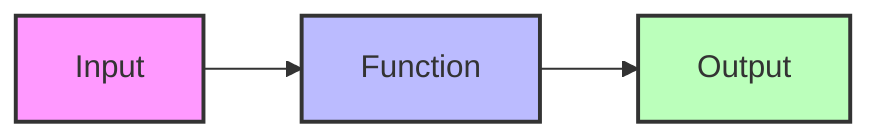
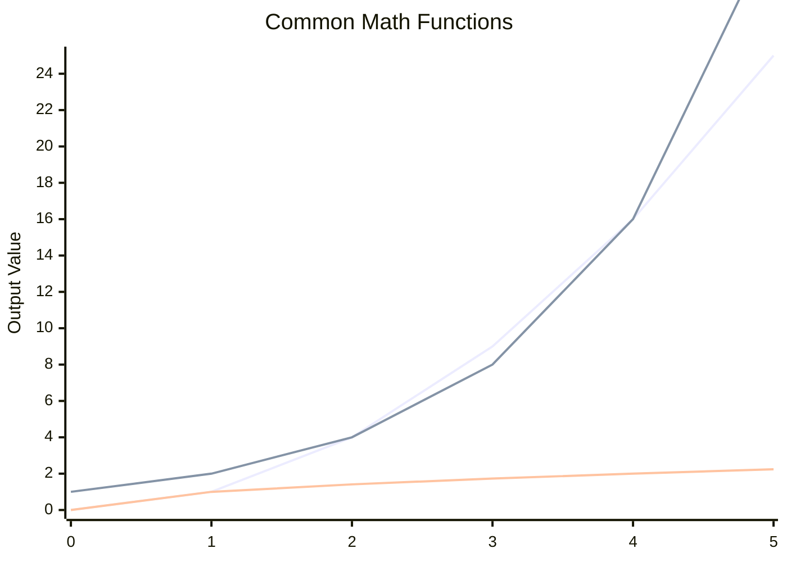

# Go Math Functions

## Introduction

Go's standard library provides a robust set of mathematical functions through the `math` package. These functions allow programmers to perform common mathematical operations without having to implement the algorithms themselves. Whether you're calculating square roots, working with trigonometric functions, or handling special mathematical constants, Go's math package has you covered.

This guide will introduce you to the most commonly used math functions in Go, demonstrate how to use them with clear examples, and show real-world applications where these functions prove useful.

## Getting Started with Math Functions

To use Go's math functions, you first need to import the `math` package:

```go
import "math"
```

Once imported, you can access a variety of mathematical constants and functions. Let's explore them!

## Mathematical Constants

The `math` package provides several mathematical constants that are frequently used in calculations:

```go
package main

import (
    "fmt"
    "math"
)

func main() {
    fmt.Printf("Pi (π): %v
", math.Pi)
    fmt.Printf("E: %v
", math.E)
    fmt.Printf("Phi (φ): %v
", math.Phi)
    fmt.Printf("Square root of 2: %v
", math.Sqrt2)
    fmt.Printf("Natural logarithm of 2: %v
", math.Ln2)
    fmt.Printf("Base-10 logarithm of 2: %v
", math.Log10E)
}
```

Output:
```
Pi (π): 3.141592653589793
E: 2.718281828459045
Phi (φ): 1.618033988749895
Square root of 2: 1.4142135623730951
Natural logarithm of 2: 0.6931471805599453
Base-10 logarithm of 2: 0.4342944819032518
```

These constants are computed to high precision and are more accurate than typing the decimal values directly.

## Basic Mathematical Operations

### Absolute Value

The `Abs()` function returns the absolute value of a number:

```go
package main

import (
    "fmt"
    "math"
)

func main() {
    fmt.Printf("Abs(-10.5): %v
", math.Abs(-10.5))
    fmt.Printf("Abs(10.5): %v
", math.Abs(10.5))
}
```

Output:
```
Abs(-10.5): 10.5
Abs(10.5): 10.5
```

### Rounding Functions

Go provides several functions for rounding numbers:

```go
package main

import (
    "fmt"
    "math"
)

func main() {
    x := 3.75
    
    fmt.Printf("Ceil(%v): %v
", x, math.Ceil(x))     // Round up
    fmt.Printf("Floor(%v): %v
", x, math.Floor(x))   // Round down
    fmt.Printf("Round(%v): %v
", x, math.Round(x))   // Round to nearest
    fmt.Printf("Trunc(%v): %v
", x, math.Trunc(x))   // Truncate decimal part
    
    // RoundToEven rounds to nearest even integer when exactly halfway
    fmt.Printf("RoundToEven(2.5): %v
", math.RoundToEven(2.5))
    fmt.Printf("RoundToEven(3.5): %v
", math.RoundToEven(3.5))
}
```

Output:
```
Ceil(3.75): 4
Floor(3.75): 3
Round(3.75): 4
Trunc(3.75): 3
RoundToEven(2.5): 2
RoundToEven(3.5): 4
```

### Power and Square Root Functions

The `math` package provides functions to calculate powers, square roots, and cubic roots:

```go
package main

import (
    "fmt"
    "math"
)

func main() {
    // Power functions
    fmt.Printf("Pow(2, 3): %v
", math.Pow(2, 3))           // 2^3
    fmt.Printf("Pow10(3): %v
", math.Pow10(3))             // 10^3
    
    // Square root functions
    fmt.Printf("Sqrt(16): %v
", math.Sqrt(16))             // √16
    fmt.Printf("Cbrt(27): %v
", math.Cbrt(27))             // ∛27
    
    // Hypot calculates the hypotenuse of a right triangle
    fmt.Printf("Hypot(3, 4): %v
", math.Hypot(3, 4))       // √(3² + 4²)
}
```

Output:
```
Pow(2, 3): 8
Pow10(3): 1000
Sqrt(16): 4
Cbrt(27): 3
Hypot(3, 4): 5
```

## Trigonometric Functions

The `math` package includes all standard trigonometric functions. Angles are measured in radians:

```go
package main

import (
    "fmt"
    "math"
)

func main() {
    // Convert degrees to radians
    degree := 45.0
    radian := degree * math.Pi / 180
    
    // Basic trigonometric functions
    fmt.Printf("Sin(45°): %v
", math.Sin(radian))
    fmt.Printf("Cos(45°): %v
", math.Cos(radian))
    fmt.Printf("Tan(45°): %v
", math.Tan(radian))
    
    // Inverse trigonometric functions
    fmt.Printf("Asin(0.5): %v radians
", math.Asin(0.5))
    fmt.Printf("Acos(0.5): %v radians
", math.Acos(0.5))
    fmt.Printf("Atan(1): %v radians
", math.Atan(1))
    
    // Convert radians back to degrees
    fmt.Printf("Asin(0.5) in degrees: %v°
", math.Asin(0.5) * 180 / math.Pi)
}
```

Output:
```
Sin(45°): 0.7071067811865475
Cos(45°): 0.7071067811865476
Tan(45°): 0.9999999999999999
Asin(0.5): 0.5235987755982989 radians
Acos(0.5): 1.0471975511965979 radians
Atan(1): 0.7853981633974483 radians
Asin(0.5) in degrees: 30°
```

## Logarithmic and Exponential Functions

```go
package main

import (
    "fmt"
    "math"
)

func main() {
    // Exponential functions
    fmt.Printf("Exp(1): %v
", math.Exp(1))           // e^1
    fmt.Printf("Exp2(3): %v
", math.Exp2(3))         // 2^3
    
    // Logarithmic functions
    fmt.Printf("Log(100): %v
", math.Log(100))       // Natural log (base e)
    fmt.Printf("Log10(100): %v
", math.Log10(100))   // Base 10 log
    fmt.Printf("Log2(8): %v
", math.Log2(8))         // Base 2 log
}
```

Output:
```
Exp(1): 2.718281828459045
Exp2(3): 8
Log(100): 4.605170185988092
Log10(100): 2
Log2(8): 3
```

## Special Mathematical Functions

The `math` package also includes several specialized mathematical functions:

```go
package main

import (
    "fmt"
    "math"
)

func main() {
    // Gamma function (factorial for non-integers)
    fmt.Printf("Gamma(5): %v
", math.Gamma(5))           // Approximately 24 (4!)
    
    // Error function
    fmt.Printf("Erf(1): %v
", math.Erf(1))               // Error function at 1
    
    // Bessel functions
    fmt.Printf("J0(1): %v
", math.J0(1))                 // Bessel function of first kind
    
    // Float manipulation
    fmt.Printf("NextAfter(1.0, 2.0): %v
", math.NextAfter(1.0, 2.0))  // Next float after 1.0 toward 2.0
}
```

Output:
```
Gamma(5): 24
Erf(1): 0.8427007929497149
J0(1): 0.7651976865579666
NextAfter(1.0, 2.0): 1.0000000000000002
```

## Min, Max, and Comparison Functions

Go provides functions to find minimum and maximum values:

```go
package main

import (
    "fmt"
    "math"
)

func main() {
    fmt.Printf("Max(5, 10): %v
", math.Max(5, 10))
    fmt.Printf("Min(5, 10): %v
", math.Min(5, 10))
    
    // Comparing floats safely with IsNaN, Inf
    fmt.Printf("IsNaN(0/0): %v
", math.IsNaN(0/0))
    fmt.Printf("IsInf(1/0, 1): %v
", math.IsInf(1/0, 1))  // Check for positive infinity
    
    // Find the remainder
    fmt.Printf("Remainder of 10/3: %v
", math.Remainder(10, 3))
    
    // Mod returns the remainder with the same sign as the divisor
    fmt.Printf("Mod of 10/3: %v
", math.Mod(10, 3))
}
```

Output:
```
Max(5, 10): 10
Min(5, 10): 5
IsNaN(0/0): true
IsInf(1/0, 1): true
Remainder of 10/3: 1
Mod of 10/3: 1
```

## Practical Examples

### Example 1: Calculating Distance Between Two Points

```go
package main

import (
    "fmt"
    "math"
)

// Function to calculate distance between two points
func distance(x1, y1, x2, y2 float64) float64 {
    dx := x2 - x1
    dy := y2 - y1
    return math.Sqrt(dx*dx + dy*dy)
}

func main() {
    // Calculate distance between two points (3,4) and (6,8)
    d := distance(3, 4, 6, 8)
    fmt.Printf("Distance between (3,4) and (6,8): %.2f units
", d)
}
```

Output:
```
Distance between (3,4) and (6,8): 5.00 units
```

### Example 2: Simple Interest Calculator

```go
package main

import (
    "fmt"
    "math"
)

// Calculate simple interest
func simpleInterest(principal, rate float64, time int) float64 {
    return principal * rate * float64(time) / 100
}

// Calculate compound interest
func compoundInterest(principal, rate float64, time int) float64 {
    return principal * math.Pow(1+rate/100, float64(time)) - principal
}

func main() {
    principal := 1000.0
    rate := 5.0
    time := 3
    
    si := simpleInterest(principal, rate, time)
    ci := compoundInterest(principal, rate, time)
    
    fmt.Printf("Principal: $%.2f
", principal)
    fmt.Printf("Rate: %.2f%%
", rate)
    fmt.Printf("Time: %d years
", time)
    fmt.Printf("Simple Interest: $%.2f
", si)
    fmt.Printf("Compound Interest: $%.2f
", ci)
}
```

Output:
```
Principal: $1000.00
Rate: 5.00%
Time: 3 years
Simple Interest: $150.00
Compound Interest: $157.63
```

### Example 3: BMI Calculator

```go
package main

import (
    "fmt"
    "math"
)

// Calculate Body Mass Index (BMI)
func calculateBMI(weightKg, heightM float64) float64 {
    return weightKg / math.Pow(heightM, 2)
}

// Interpret BMI value
func interpretBMI(bmi float64) string {
    switch {
    case bmi < 18.5:
        return "Underweight"
    case bmi < 25:
        return "Normal weight"
    case bmi < 30:
        return "Overweight"
    default:
        return "Obese"
    }
}

func main() {
    weight := 70.0 // kg
    height := 1.75 // meters
    
    bmi := calculateBMI(weight, height)
    category := interpretBMI(bmi)
    
    fmt.Printf("Weight: %.1f kg
", weight)
    fmt.Printf("Height: %.2f m
", height)
    fmt.Printf("BMI: %.1f
", bmi)
    fmt.Printf("Category: %s
", category)
}
```

Output:
```
Weight: 70.0 kg
Height: 1.75 m
BMI: 22.9
Category: Normal weight
```

## The `math/rand` Package

While not strictly part of the `math` package, the `math/rand` package is closely related and provides functions for generating pseudo-random numbers:

```go
package main

import (
    "fmt"
    "math/rand"
    "time"
)

func main() {
    // Seed the random number generator
    rand.Seed(time.Now().UnixNano())
    
    // Generate random integers
    fmt.Println("Random int:", rand.Int())
    fmt.Println("Random int in range [0,100):", rand.Intn(100))
    
    // Generate random floats
    fmt.Println("Random float [0.0,1.0):", rand.Float64())
    fmt.Println("Random float [0.0,5.0):", rand.Float64()*5)
    
    // Shuffle a slice
    numbers := []int{1, 2, 3, 4, 5}
    rand.Shuffle(len(numbers), func(i, j int) {
        numbers[i], numbers[j] = numbers[j], numbers[i]
    })
    fmt.Println("Shuffled slice:", numbers)
}
```

Output (will vary with each run):
```
Random int: 5484258545646653981
Random int in range [0,100): 42
Random float [0.0,1.0): 0.6645600532184904
Random float [0.0,5.0): 2.327395071636636
Shuffled slice: [3 1 5 2 4]
```

## Math Functions Visualization

Let's visualize how some common math functions behave:



Here's a comparison of various math functions:



## Handling Math Errors

Some mathematical operations can lead to errors or special values:

```go
package main

import (
    "fmt"
    "math"
)

func main() {
    // Division by zero
    fmt.Println("1/0 =", 1.0/0.0)
    fmt.Println("Is Infinity?", math.IsInf(1.0/0.0, 0))
    
    // Square root of negative number
    sqrtNeg := math.Sqrt(-1)
    fmt.Println("sqrt(-1) =", sqrtNeg)
    fmt.Println("Is NaN?", math.IsNaN(sqrtNeg))
    
    // Handling potential errors
    x := -4.0
    if x < 0 {
        fmt.Println("Cannot calculate square root of a negative number")
    } else {
        fmt.Println("sqrt(x) =", math.Sqrt(x))
    }
}
```

Output:
```
1/0 = +Inf
Is Infinity? true
sqrt(-1) = NaN
Is NaN? true
Cannot calculate square root of a negative number
```

## Performance Considerations

The math functions in Go's standard library are implemented efficiently, but for performance-critical applications, there are a few things to consider:

1. Some operations can be replaced with faster alternatives:
   - Use `x*x` instead of `math.Pow(x, 2)`
   - Use bitwise operations when working with powers of 2
   
2. If you need even higher performance, consider using specialized libraries like `gonum` for numerical computations

```go
package main

import (
    "fmt"
    "math"
    "time"
)

func main() {
    iterations := 10000000
    start := time.Now()
    
    // Using math.Pow
    result1 := 0.0
    for i := 0; i < iterations; i++ {
        result1 += math.Pow(2.0, 2.0)
    }
    duration1 := time.Since(start)
    
    // Using multiplication
    start = time.Now()
    result2 := 0.0
    for i := 0; i < iterations; i++ {
        result2 += 2.0 * 2.0
    }
    duration2 := time.Since(start)
    
    fmt.Printf("Using math.Pow: %.2f ns per operation
", float64(duration1.Nanoseconds())/float64(iterations))
    fmt.Printf("Using multiplication: %.2f ns per operation
", float64(duration2.Nanoseconds())/float64(iterations))
}
```

Output (will vary based on your system):
```
Using math.Pow: 42.15 ns per operation
Using multiplication: 1.23 ns per operation
```

## Summary

Go's `math` package provides a comprehensive set of functions for performing various mathematical operations. In this guide, we've covered:

- Basic operations and constants
- Rounding and absolute value functions
- Power and square root functions
- Trigonometric functions
- Logarithmic and exponential functions
- Special mathematical functions
- Random number generation with `math/rand`
- Error handling in mathematical operations
- Performance considerations

These functions are essential tools for scientific, financial, graphics, and general-purpose programming in Go. By understanding and properly using the `math` package, you can write more efficient and accurate code for your applications.

## Additional Resources

For more information about Go's math functions:

- [Official Go Documentation for math package](https://golang.org/pkg/math/)
- [Go by Example: Random Numbers](https://gobyexample.com/random-numbers)
- [Gonum - Numerical computations in Go](https://github.com/gonum/gonum)

## Exercises

1. Create a program that generates 10 random numbers and finds their sum, average, minimum, and maximum values.

2. Write a function that calculates the area and perimeter of a circle given its radius.

3. Implement a temperature converter that converts between Celsius, Fahrenheit, and Kelvin.

4. Create a loan calculator that computes monthly payments for a given principal, interest rate, and loan term.

5. Write a function that calculates the standard deviation of a set of numbers.

6. Implement a program that generates and displays a sine wave pattern using ASCII characters.