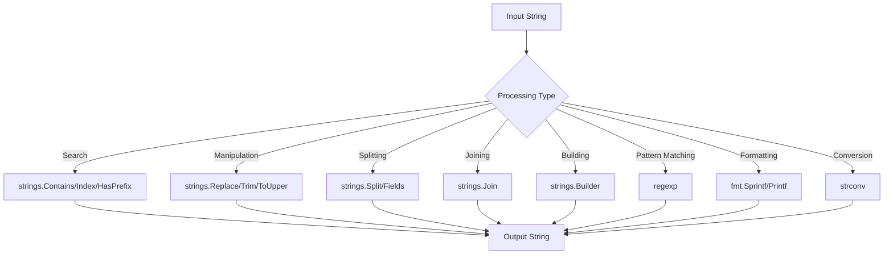

# Go String Processing

## Introduction

String processing is a fundamental aspect of almost any programming task. In Go, strings are immutable sequences of bytes, which are typically (but not necessarily) UTF-8 encoded text. The Go standard library provides powerful tools for manipulating and working with strings through the `strings` package and related functionality.

This guide will walk you through the essentials of string processing in Go, from basic operations to more advanced techniques. Whether you're parsing user input, formatting output, or transforming text data, understanding string processing in Go is crucial for effective programming.

## String Basics in Go

### What is a String in Go?

In Go, a string is a sequence of bytes, not characters. This distinction is important when working with non-ASCII text. Strings in Go are:

- Immutable (cannot be changed after creation)
- UTF-8 encoded by default
- Represented internally as a pointer to an array of bytes and a length

Let's start with some basic string declarations:

```go
package main

import "fmt"

func main() {
    // String declaration
    var greeting string = "Hello, Go!"
    
    // Short declaration
    message := "Strings are immutable"
    
    // Multi-line strings using backticks
    multiLine := `This is a multi-line string
that preserves line breaks
and doesn't require escape characters like 
`
    
    fmt.Println(greeting)
    fmt.Println(message)
    fmt.Println(multiLine)
}
```

Output:
```
Hello, Go!
Strings are immutable
This is a multi-line string
that preserves line breaks
and doesn't require escape characters like 

```

## The `strings` Package

The `strings` package in Go's standard library provides a wealth of functions for working with strings. Let's explore some of the most commonly used functions.

### String Comparison

```go
package main

import (
    "fmt"
    "strings"
)

func main() {
    s1 := "hello"
    s2 := "HELLO"
    
    // Case-sensitive comparison
    fmt.Println("Equal:", s1 == s2)
    
    // Case-insensitive comparison
    fmt.Println("Equal (case-insensitive):", strings.EqualFold(s1, s2))
    
    // Compare returns 0 if a==b, -1 if a < b, and +1 if a > b
    fmt.Println("Compare:", strings.Compare(s1, "hello"))
}
```

Output:
```
Equal: false
Equal (case-insensitive): true
Compare: 0
```

### Search Functions

```go
package main

import (
    "fmt"
    "strings"
)

func main() {
    text := "Go is an open source programming language that makes it easy to build simple, reliable, and efficient software."
    
    // Check if string contains substring
    fmt.Println("Contains 'programming':", strings.Contains(text, "programming"))
    
    // Find position of substring
    fmt.Println("Index of 'language':", strings.Index(text, "language"))
    
    // Check if string starts with prefix
    fmt.Println("Starts with 'Go':", strings.HasPrefix(text, "Go"))
    
    // Check if string ends with suffix
    fmt.Println("Ends with '.':", strings.HasSuffix(text, "."))
    
    // Find last occurrence of a substring
    fmt.Println("Last index of 'e':", strings.LastIndex(text, "e"))
}
```

Output:
```
Contains 'programming': true
Index of 'language': 29
Starts with 'Go': true
Ends with '.': true
Last index of 'e': 97
```

### Manipulation Functions

```go
package main

import (
    "fmt"
    "strings"
)

func main() {
    original := "  Go String Processing  "
    
    // Trimming whitespace
    trimmed := strings.TrimSpace(original)
    fmt.Println("Trimmed:", trimmed)
    
    // Converting case
    fmt.Println("Uppercase:", strings.ToUpper(trimmed))
    fmt.Println("Lowercase:", strings.ToLower(trimmed))
    
    // Replacing substrings
    replaced := strings.Replace(trimmed, "Processing", "Manipulation", 1)
    fmt.Println("Replaced:", replaced)
    
    // Replace all occurrences
    text := "one two three two one"
    replaceAll := strings.ReplaceAll(text, "two", "TWO")
    fmt.Println("Replace all:", replaceAll)
}
```

Output:
```
Trimmed: Go String Processing
Uppercase: GO STRING PROCESSING
Lowercase: go string processing
Replaced: Go String Manipulation
Replace all: one TWO three TWO one
```

### Splitting and Joining Strings

```go
package main

import (
    "fmt"
    "strings"
)

func main() {
    csvLine := "name,email,phone,address"
    
    // Split string by delimiter
    fields := strings.Split(csvLine, ",")
    fmt.Println("Split fields:", fields)
    
    // Join strings with delimiter
    joined := strings.Join(fields, " | ")
    fmt.Println("Joined with pipe:", joined)
    
    // Split with a limit on the number of substrings
    limitedSplit := strings.SplitN(csvLine, ",", 3)
    fmt.Println("Limited split:", limitedSplit)
    
    // Split by whitespace
    sentence := "This is a   sample   sentence with irregular spacing"
    words := strings.Fields(sentence)
    fmt.Println("Words:", words)
}
```

Output:
```
Split fields: [name email phone address]
Joined with pipe: name | email | phone | address
Limited split: [name email phone,address]
Words: [This is a sample sentence with irregular spacing]
```

## Working with String Characters and Runes

Since Go strings are UTF-8 encoded, we need to be careful when working with individual characters, especially non-ASCII ones. For this, Go provides the concept of "runes" (int32 values representing Unicode code points).

```go
package main

import (
    "fmt"
    "unicode/utf8"
)

func main() {
    s := "Hello, 世界"
    
    // Length in bytes
    fmt.Println("Bytes:", len(s))
    
    // Length in runes (Unicode characters)
    fmt.Println("Runes:", utf8.RuneCountInString(s))
    
    // Iterating bytes (incorrect for non-ASCII characters)
    fmt.Print("Bytes: ")
    for i := 0; i < len(s); i++ {
        fmt.Printf("%x ", s[i])
    }
    fmt.Println()
    
    // Iterating runes (correct for all Unicode characters)
    fmt.Print("Runes: ")
    for _, r := range s {
        fmt.Printf("%c ", r)
    }
    fmt.Println()
}
```

Output:
```
Bytes: 13
Runes: 9
Bytes: 48 65 6c 6c 6f 2c 20 e4 b8 96 e7 95 8c 
Runes: H e l l o ,   世 界 
```

## String Builder for Efficient String Concatenation

When you need to build a string incrementally, using the `+` operator can be inefficient because strings are immutable in Go. The `strings.Builder` type provides an efficient way to build strings:

```go
package main

import (
    "fmt"
    "strings"
)

func main() {
    var builder strings.Builder
    
    // Append strings
    builder.WriteString("Go")
    builder.WriteString(" ")
    builder.WriteString("String")
    builder.WriteString(" ")
    builder.WriteString("Processing")
    
    // Get the resulting string
    result := builder.String()
    fmt.Println(result)
    
    // Check capacity and length
    fmt.Printf("Length: %d, Capacity: %d
", builder.Len(), builder.Cap())
    
    // Reset the builder
    builder.Reset()
    fmt.Printf("After reset - Length: %d
", builder.Len())
}
```

Output:
```
Go String Processing
Length: 19, Capacity: 32
After reset - Length: 0
```

## Regular Expressions for Pattern Matching

The `regexp` package provides regular expression functionality for more advanced string pattern matching and manipulation:

```go
package main

import (
    "fmt"
    "regexp"
)

func main() {
    text := "Contact us at support@example.com or sales@example.org"
    
    // Create a regex pattern for email addresses
    pattern := regexp.MustCompile(`[a-zA-Z0-9._%+-]+@[a-zA-Z0-9.-]+\.[a-zA-Z]{2,}`)
    
    // Find all matches
    emails := pattern.FindAllString(text, -1)
    fmt.Println("Emails found:", emails)
    
    // Replace matches
    anonymized := pattern.ReplaceAllString(text, "[EMAIL REDACTED]")
    fmt.Println("Anonymized:", anonymized)
    
    // Check if string matches a pattern
    isValidEmail := regexp.MustCompile(`^[a-zA-Z0-9._%+-]+@[a-zA-Z0-9.-]+\.[a-zA-Z]{2,}$`)
    fmt.Println("Is valid email:", isValidEmail.MatchString("user@example.com"))
    fmt.Println("Is valid email:", isValidEmail.MatchString("invalid-email"))
}
```

Output:
```
Emails found: [support@example.com sales@example.org]
Anonymized: Contact us at [EMAIL REDACTED] or [EMAIL REDACTED]
Is valid email: true
Is valid email: false
```

## Formatting Strings with `fmt` Package

The `fmt` package provides formatting functions that are useful for creating formatted strings:

```go
package main

import "fmt"

func main() {
    name := "Alice"
    age := 30
    score := 95.5
    
    // Basic Printf formatting
    fmt.Printf("Name: %s, Age: %d, Score: %.1f
", name, age, score)
    
    // Sprintf returns a string instead of printing
    formatted := fmt.Sprintf("User %s (age %d) has score %.1f%%", name, age, score)
    fmt.Println(formatted)
    
    // Format specifiers
    fmt.Printf("Binary: %b
", 42)     // Binary
    fmt.Printf("Hex: %x
", 42)        // Hexadecimal
    fmt.Printf("Float: %e
", 123.456) // Scientific notation
    fmt.Printf("Padded: %6d
", 42)    // Right-padded with spaces
    fmt.Printf("Left aligned: %-10s
", "Go") // Left-aligned with padding
}
```

Output:
```
Name: Alice, Age: 30, Score: 95.5
User Alice (age 30) has score 95.5%
Binary: 101010
Hex: 2a
Float: 1.234560e+02
Padded:     42
Left aligned: Go        
```

## Reading and Writing Strings to Files

Working with strings often involves reading from or writing to files:

```go
package main

import (
    "fmt"
    "io/ioutil"
    "strings"
)

func main() {
    // Writing a string to a file
    content := "This is a sample text.
It has multiple lines.
Third line here."
    err := ioutil.WriteFile("sample.txt", []byte(content), 0644)
    if err != nil {
        fmt.Println("Error writing file:", err)
        return
    }
    
    // Reading a file into a string
    data, err := ioutil.ReadFile("sample.txt")
    if err != nil {
        fmt.Println("Error reading file:", err)
        return
    }
    
    fileContent := string(data)
    fmt.Println("File content:")
    fmt.Println(fileContent)
    
    // Count lines in the file
    lines := strings.Split(fileContent, "
")
    fmt.Printf("The file has %d lines
", len(lines))
}
```

Output:
```
File content:
This is a sample text.
It has multiple lines.
Third line here.
The file has 3 lines
```

## Converting Between Strings and Other Types

Go provides several ways to convert between strings and other data types:

```go
package main

import (
    "fmt"
    "strconv"
)

func main() {
    // String to integer
    numStr := "42"
    num, err := strconv.Atoi(numStr)
    if err != nil {
        fmt.Println("Error converting to int:", err)
    } else {
        fmt.Printf("Converted '%s' to integer: %d
", numStr, num)
    }
    
    // Integer to string
    intValue := 123
    strValue := strconv.Itoa(intValue)
    fmt.Printf("Converted %d to string: '%s'
", intValue, strValue)
    
    // String to float
    floatStr := "3.14159"
    floatVal, err := strconv.ParseFloat(floatStr, 64)
    if err != nil {
        fmt.Println("Error converting to float:", err)
    } else {
        fmt.Printf("Converted '%s' to float: %f
", floatStr, floatVal)
    }
    
    // Float to string
    pi := 3.14159
    piStr := strconv.FormatFloat(pi, 'f', 2, 64) // format with 2 decimal places
    fmt.Printf("Formatted float %f to string with 2 decimal places: '%s'
", pi, piStr)
    
    // String to boolean
    boolStr := "true"
    boolVal, err := strconv.ParseBool(boolStr)
    if err != nil {
        fmt.Println("Error converting to bool:", err)
    } else {
        fmt.Printf("Converted '%s' to bool: %t
", boolStr, boolVal)
    }
}
```

Output:
```
Converted '42' to integer: 42
Converted 123 to string: '123'
Converted '3.14159' to float: 3.141590
Formatted float 3.141590 to string with 2 decimal places: '3.14'
Converted 'true' to bool: true
```

## Real-World Example: Parsing a CSV File

Let's build a simple CSV parser using the string processing techniques we've learned:

```go
package main

import (
    "fmt"
    "strings"
)

func main() {
    // Sample CSV data
    csvData := `name,age,occupation
Alice,28,Software Engineer
Bob,35,Data Scientist
Carol,42,Product Manager
David,24,UX Designer`
    
    // Split into lines
    lines := strings.Split(csvData, "
")
    
    // Get headers
    headers := strings.Split(lines[0], ",")
    
    // Process each data row
    fmt.Println("Parsed data:")
    fmt.Println(strings.Repeat("-", 50))
    for i, header := range headers {
        fmt.Printf("%-20s", header)
        if i < len(headers)-1 {
            fmt.Print("| ")
        }
    }
    fmt.Println("
" + strings.Repeat("-", 50))
    
    for i := 1; i < len(lines); i++ {
        fields := strings.Split(lines[i], ",")
        for j, field := range fields {
            fmt.Printf("%-20s", field)
            if j < len(fields)-1 {
                fmt.Print("| ")
            }
        }
        fmt.Println()
    }
}
```

Output:
```
Parsed data:
--------------------------------------------------
name                | age                 | occupation          
--------------------------------------------------
Alice               | 28                  | Software Engineer   
Bob                 | 35                  | Data Scientist      
Carol               | 42                  | Product Manager     
David               | 24                  | UX Designer
```

## String Processing Workflow Diagram

Here's a visual representation of typical string processing workflows in Go:



## Summary

In this guide, we've explored the powerful string processing capabilities provided by Go's standard library. We've covered:

1. Basic string operations and concepts
2. The `strings` package for common string operations
3. Working with Unicode characters using runes
4. Efficient string concatenation with `strings.Builder`
5. Pattern matching with regular expressions
6. String formatting with the `fmt` package
7. Reading and writing strings to files
8. Converting between strings and other data types
9. A real-world example of parsing CSV data

Go's approach to strings as immutable byte sequences allows for efficient and predictable string handling. The standard library provides a rich set of functions that make string processing tasks straightforward and performant.

## Additional Resources and Exercises

### Resources
- [Go Standard Library Documentation - strings package](https://pkg.go.dev/strings)
- [Go Standard Library Documentation - regexp package](https://pkg.go.dev/regexp)
- [Go Standard Library Documentation - strconv package](https://pkg.go.dev/strconv)
- [Go Blog: Strings, bytes, runes and characters in Go](https://blog.golang.org/strings)

### Exercises

1. **Name Formatter**:
   Write a function that takes a full name (e.g., "john smith") and returns it in a properly capitalized format (e.g., "John Smith").

2. **Word Counter**:
   Create a program that counts the frequency of each word in a given text and displays the top 5 most common words.

3. **URL Parser**:
   Write a function that parses a URL string and extracts its components (protocol, domain, path, query parameters).

4. **Template Engine**:
   Build a simple template engine that replaces placeholders like `{{name}}` with actual values from a map.

5. **CSV to JSON Converter**:
   Create a program that reads a CSV file and converts it to JSON format.

Remember that regular practice is the key to mastering string processing in Go. Start with simple examples and gradually work your way up to more complex tasks.