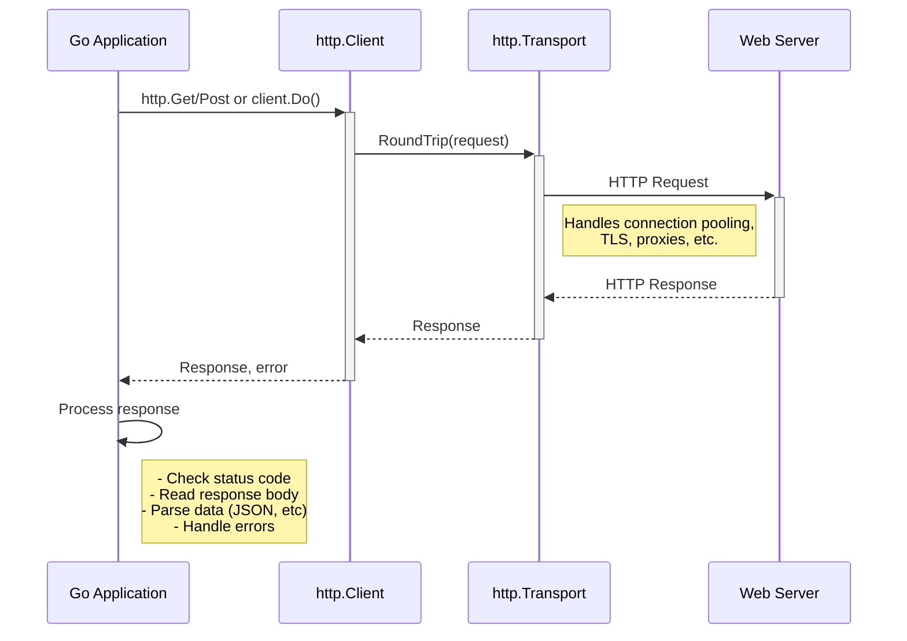

# Go HTTP Client

## Introduction

The Go programming language includes a powerful and flexible HTTP client in its standard library through the `net/http` package. This client allows your Go applications to communicate with web servers and APIs over HTTP, enabling you to fetch web pages, submit form data, consume RESTful services, and more—all without requiring external dependencies.

In this tutorial, we'll explore Go's HTTP client capabilities, from basic GET requests to more complex scenarios involving custom headers, authentication, and handling different types of responses. By the end, you'll be comfortable using Go to interact with web services in your applications.

## Basic HTTP GET Request

The simplest way to make an HTTP GET request in Go is using the `http.Get()` function:

```go
package main

import (
    "fmt"
    "io"
    "net/http"
    "os"
)

func main() {
    // Make an HTTP GET request
    response, err := http.Get("https://api.github.com/users/golang")
    if err != nil {
        fmt.Printf("Error making HTTP request: %s
", err)
        os.Exit(1)
    }
    
    // Always close the response body when done
    defer response.Body.Close()
    
    // Print the status code
    fmt.Printf("Status Code: %d
", response.StatusCode)
    
    // Read and print the response body
    body, err := io.ReadAll(response.Body)
    if err != nil {
        fmt.Printf("Error reading response body: %s
", err)
        os.Exit(1)
    }
    
    fmt.Printf("Body: %s
", body)
}
```

**Output:**
```
Status Code: 200
Body: {"login":"golang","id":4314092,"node_id":"MDEyOk9yZ2FuaXphdGlvbjQzMTQwOTI=","avatar_url":"https://avatars.githubusercontent.com/u/4314092?v=4",...}
```

In this example:
1. We use `http.Get()` to make a GET request to GitHub's API
2. We check for any errors that occurred during the request
3. We ensure we close the response body using `defer`
4. We read the entire response body using `io.ReadAll()`
5. We print the status code and response body

## Understanding the Response

The `http.Get()` function returns two values:
- An `*http.Response` object containing the response data
- An error value, which will be non-nil if something went wrong

The `http.Response` struct contains several useful fields:

```go
type Response struct {
    Status     string // e.g., "200 OK"
    StatusCode int    // e.g., 200
    Header     Header // Response headers
    Body       io.ReadCloser
    ContentLength int64
    Request    *Request // The original request
    // ... other fields
}
```

Let's examine a response in more detail:

```go
package main

import (
    "fmt"
    "io"
    "net/http"
    "os"
)

func main() {
    response, err := http.Get("https://go.dev")
    if err != nil {
        fmt.Printf("Error: %s
", err)
        os.Exit(1)
    }
    defer response.Body.Close()
    
    // Examine response details
    fmt.Printf("Status: %s
", response.Status)
    fmt.Printf("Status code: %d
", response.StatusCode)
    fmt.Printf("Content length: %d
", response.ContentLength)
    fmt.Printf("Content type: %s
", response.Header.Get("Content-Type"))
    
    // Print first 100 bytes of the body
    body, err := io.ReadAll(response.Body)
    if err != nil {
        fmt.Printf("Error reading body: %s
", err)
        os.Exit(1)
    }
    
    if len(body) > 100 {
        fmt.Printf("Body preview: %s...
", body[:100])
    } else {
        fmt.Printf("Body: %s
", body)
    }
}
```

**Output:**
```
Status: 200 OK
Status code: 200
Content length: -1
Content type: text/html; charset=utf-8
Body preview: <!DOCTYPE html><html lang="en"><head><meta charset="utf-8"/><meta name="viewport" content="width=device-wid...
```

## Making HTTP POST Requests

To send data to a server, you'll often use a POST request. Go provides multiple ways to do this:

### 1. Using `http.Post()` for simple requests:

```go
package main

import (
    "fmt"
    "io"
    "net/http"
    "strings"
)

func main() {
    // Create a string reader with our data
    data := strings.NewReader("name=Gopher&message=Hello+World")
    
    // Make a POST request with form data
    response, err := http.Post(
        "https://httpbin.org/post",
        "application/x-www-form-urlencoded",
        data,
    )
    if err != nil {
        fmt.Printf("Error making POST request: %s
", err)
        return
    }
    defer response.Body.Close()
    
    // Read the response
    body, err := io.ReadAll(response.Body)
    if err != nil {
        fmt.Printf("Error reading response: %s
", err)
        return
    }
    
    fmt.Printf("Response: %s
", body)
}
```

### 2. Using `http.PostForm()` for form submissions:

```go
package main

import (
    "fmt"
    "io"
    "net/http"
    "net/url"
)

func main() {
    // Create form data
    formData := url.Values{
        "name":    {"Gopher"},
        "message": {"Hello World"},
    }
    
    // Send the form data
    response, err := http.PostForm("https://httpbin.org/post", formData)
    if err != nil {
        fmt.Printf("Error posting form: %s
", err)
        return
    }
    defer response.Body.Close()
    
    // Read response
    body, err := io.ReadAll(response.Body)
    if err != nil {
        fmt.Printf("Error reading response: %s
", err)
        return
    }
    
    fmt.Printf("Response: %s
", body)
}
```

## Creating Custom HTTP Requests

For more control over your HTTP requests, you can create and customize an `http.Request` object:

```go
package main

import (
    "fmt"
    "io"
    "net/http"
    "strings"
)

func main() {
    // Create a new request
    req, err := http.NewRequest(
        "POST",
        "https://httpbin.org/post",
        strings.NewReader(`{"name":"Gopher","message":"Hello JSON World"}`),
    )
    if err != nil {
        fmt.Printf("Error creating request: %s
", err)
        return
    }
    
    // Set headers
    req.Header.Set("Content-Type", "application/json")
    req.Header.Set("User-Agent", "GoHTTPClientExample/1.0")
    
    // Create an HTTP client and send the request
    client := &http.Client{}
    resp, err := client.Do(req)
    if err != nil {
        fmt.Printf("Error sending request: %s
", err)
        return
    }
    defer resp.Body.Close()
    
    // Read the response
    body, err := io.ReadAll(resp.Body)
    if err != nil {
        fmt.Printf("Error reading response: %s
", err)
        return
    }
    
    fmt.Printf("Response: %s
", body)
}
```

## Using the HTTP Client

So far, we've been using helper functions like `http.Get()` and `http.Post()`. Behind the scenes, these functions use the default HTTP client from the `net/http` package. 

For more control, you can create your own `http.Client` instance:

```go
package main

import (
    "fmt"
    "io"
    "net/http"
    "time"
)

func main() {
    // Create a custom HTTP client with specific timeouts
    client := &http.Client{
        Timeout: 10 * time.Second,
    }
    
    // Use the client to make a request
    resp, err := client.Get("https://api.github.com/users/golang")
    if err != nil {
        fmt.Printf("Request error: %s
", err)
        return
    }
    defer resp.Body.Close()
    
    // Read response
    body, err := io.ReadAll(resp.Body)
    if err != nil {
        fmt.Printf("Error reading response: %s
", err)
        return
    }
    
    fmt.Printf("Status: %s
Body: %s
", resp.Status, body[:100])
}
```

Setting a custom client allows you to configure:
- Timeout behavior
- Redirect policies
- Cookie handling
- Transport options (like TLS settings)

## Configuring HTTP Transport

For even more control, you can customize the underlying transport used by the HTTP client:

```go
package main

import (
    "crypto/tls"
    "fmt"
    "io"
    "net/http"
    "time"
)

func main() {
    // Create a custom transport
    transport := &http.Transport{
        MaxIdleConns:        100,
        MaxIdleConnsPerHost: 10,
        IdleConnTimeout:     90 * time.Second,
        TLSClientConfig: &tls.Config{
            InsecureSkipVerify: false, // Don't use this in production!
        },
    }
    
    // Create client with custom transport
    client := &http.Client{
        Transport: transport,
        Timeout:   30 * time.Second,
    }
    
    // Make a request
    resp, err := client.Get("https://go.dev")
    if err != nil {
        fmt.Printf("Request error: %s
", err)
        return
    }
    defer resp.Body.Close()
    
    // Read just the first 50 bytes for a preview
    preview := make([]byte, 50)
    n, err := resp.Body.Read(preview)
    if err != nil && err != io.EOF {
        fmt.Printf("Error reading: %s
", err)
        return
    }
    
    fmt.Printf("Status: %s
Read %d bytes: %s
", resp.Status, n, preview[:n])
}
```

## Working with JSON APIs

Many modern web APIs use JSON for data exchange. Here's how to work with JSON responses in Go:

```go
package main

import (
    "encoding/json"
    "fmt"
    "net/http"
)

// Define structs to match the expected JSON response
type GithubUser struct {
    Login     string `json:"login"`
    ID        int    `json:"id"`
    Name      string `json:"name"`
    AvatarURL string `json:"avatar_url"`
    PublicRepos int  `json:"public_repos"`
}

func main() {
    // Make request
    resp, err := http.Get("https://api.github.com/users/golang")
    if err != nil {
        fmt.Printf("Request error: %s
", err)
        return
    }
    defer resp.Body.Close()
    
    // Check status code
    if resp.StatusCode != http.StatusOK {
        fmt.Printf("API returned status: %s
", resp.Status)
        return
    }
    
    // Decode JSON response
    var user GithubUser
    decoder := json.NewDecoder(resp.Body)
    if err := decoder.Decode(&user); err != nil {
        fmt.Printf("Error decoding JSON: %s
", err)
        return
    }
    
    // Print the decoded data
    fmt.Printf("GitHub User: %s (ID: %d)
", user.Login, user.ID)
    fmt.Printf("Name: %s
", user.Name)
    fmt.Printf("Public repos: %d
", user.PublicRepos)
    fmt.Printf("Avatar URL: %s
", user.AvatarURL)
}
```

## Sending JSON Data

To send JSON data in a request:

```go
package main

import (
    "bytes"
    "encoding/json"
    "fmt"
    "io"
    "net/http"
)

// Define a struct for our request payload
type PostData struct {
    Title   string `json:"title"`
    Content string `json:"content"`
    Author  string `json:"author"`
}

func main() {
    // Create data to send
    data := PostData{
        Title:   "Go HTTP Client",
        Content: "This is a post about using Go's HTTP client",
        Author:  "Gopher",
    }
    
    // Convert data to JSON
    jsonData, err := json.Marshal(data)
    if err != nil {
        fmt.Printf("Error marshalling JSON: %s
", err)
        return
    }
    
    // Create request with JSON body
    req, err := http.NewRequest("POST", "https://httpbin.org/post", bytes.NewBuffer(jsonData))
    if err != nil {
        fmt.Printf("Error creating request: %s
", err)
        return
    }
    
    // Set header
    req.Header.Set("Content-Type", "application/json")
    
    // Send request
    client := &http.Client{}
    resp, err := client.Do(req)
    if err != nil {
        fmt.Printf("Error sending request: %s
", err)
        return
    }
    defer resp.Body.Close()
    
    // Read and print response
    body, err := io.ReadAll(resp.Body)
    if err != nil {
        fmt.Printf("Error reading response: %s
", err)
        return
    }
    
    fmt.Printf("Response: %s
", body)
}
```

## Handling Authentication

Many APIs require authentication. Here's how to add basic authentication:

```go
package main

import (
    "fmt"
    "io"
    "net/http"
)

func main() {
    // Create a new request
    req, err := http.NewRequest("GET", "https://httpbin.org/basic-auth/user/pass", nil)
    if err != nil {
        fmt.Printf("Error creating request: %s
", err)
        return
    }
    
    // Add basic authentication
    req.SetBasicAuth("user", "pass")
    
    // Send the request
    client := &http.Client{}
    resp, err := client.Do(req)
    if err != nil {
        fmt.Printf("Error sending request: %s
", err)
        return
    }
    defer resp.Body.Close()
    
    // Check if authentication worked
    if resp.StatusCode == http.StatusUnauthorized {
        fmt.Println("Authentication failed!")
        return
    }
    
    // Read and print response
    body, err := io.ReadAll(resp.Body)
    if err != nil {
        fmt.Printf("Error reading response: %s
", err)
        return
    }
    
    fmt.Printf("Status: %s
Response: %s
", resp.Status, body)
}
```

For token-based authentication (like Bearer tokens):

```go
package main

import (
    "fmt"
    "io"
    "net/http"
)

func main() {
    // Create request
    req, err := http.NewRequest("GET", "https://httpbin.org/bearer", nil)
    if err != nil {
        fmt.Printf("Error creating request: %s
", err)
        return
    }
    
    // Add authorization header with bearer token
    req.Header.Add("Authorization", "Bearer my-secret-token")
    
    // Send request
    client := &http.Client{}
    resp, err := client.Do(req)
    if err != nil {
        fmt.Printf("Error sending request: %s
", err)
        return
    }
    defer resp.Body.Close()
    
    // Read response
    body, err := io.ReadAll(resp.Body)
    if err != nil {
        fmt.Printf("Error reading response: %s
", err)
        return
    }
    
    fmt.Printf("Status: %s
Response: %s
", resp.Status, body)
}
```

## Handling Different HTTP Methods

Go's HTTP client supports all standard HTTP methods:

```go
package main

import (
    "fmt"
    "io"
    "net/http"
    "strings"
)

func main() {
    // URLs we'll use for demonstration
    baseURL := "https://httpbin.org"
    
    // Helper function to make requests
    makeRequest := func(method, url string, body string) {
        var bodyReader io.Reader
        if body != "" {
            bodyReader = strings.NewReader(body)
        }
        
        req, err := http.NewRequest(method, url, bodyReader)
        if err != nil {
            fmt.Printf("Error creating %s request: %s
", method, err)
            return
        }
        
        if body != "" && method != "GET" {
            req.Header.Set("Content-Type", "application/json")
        }
        
        client := &http.Client{}
        resp, err := client.Do(req)
        if err != nil {
            fmt.Printf("Error sending %s request: %s
", method, err)
            return
        }
        defer resp.Body.Close()
        
        respBody, _ := io.ReadAll(resp.Body)
        fmt.Printf("
%s %s -> Status: %s
", method, url, resp.Status)
        if len(respBody) > 100 {
            fmt.Printf("Response: %s...
", respBody[:100])
        } else {
            fmt.Printf("Response: %s
", respBody)
        }
    }
    
    // Demonstrate different HTTP methods
    fmt.Println("---Testing different HTTP methods---")
    makeRequest("GET", baseURL + "/get?param=value", "")
    makeRequest("POST", baseURL + "/post", `{"title":"Post Request"}`)
    makeRequest("PUT", baseURL + "/put", `{"title":"Updated Title"}`)
    makeRequest("DELETE", baseURL + "/delete", "")
    makeRequest("PATCH", baseURL + "/patch", `{"title":"Patched Title"}`)
}
```

## Handling Timeouts and Cancellation

To prevent your application from hanging indefinitely on slow requests, use timeouts:

```go
package main

import (
    "context"
    "fmt"
    "io"
    "net/http"
    "time"
)

func main() {
    // Create a client with a timeout
    client := &http.Client{
        Timeout: 5 * time.Second, // Request will time out after 5 seconds
    }
    
    // Attempt to request a potentially slow endpoint
    fmt.Println("Making request with timeout...")
    resp, err := client.Get("https://httpbin.org/delay/10") // This will take 10 seconds
    if err != nil {
        fmt.Printf("Request failed: %s
", err)
        // Should print "Request failed: Get https://httpbin.org/delay/10: context deadline exceeded"
    } else {
        defer resp.Body.Close()
        body, _ := io.ReadAll(resp.Body)
        fmt.Printf("Response: %s
", body)
    }
    
    // Using context for cancellation
    ctx, cancel := context.WithTimeout(context.Background(), 3*time.Second)
    defer cancel() // Make sure to call cancel to release resources
    
    req, err := http.NewRequestWithContext(ctx, "GET", "https://httpbin.org/delay/5", nil)
    if err != nil {
        fmt.Printf("Error creating request: %s
", err)
        return
    }
    
    fmt.Println("
Making request with context timeout...")
    resp2, err := http.DefaultClient.Do(req)
    if err != nil {
        fmt.Printf("Request with context failed: %s
", err)
        // Should print something like "Request with context failed: Get https://httpbin.org/delay/5: context deadline exceeded"
    } else {
        defer resp2.Body.Close()
        body, _ := io.ReadAll(resp2.Body)
        fmt.Printf("Response: %s
", body)
    }
}
```

## Handling HTTP Status Codes

It's important to check status codes to handle different response scenarios:

```go
package main

import (
    "fmt"
    "io"
    "net/http"
)

func main() {
    // Helper function to check a URL and handle different status codes
    checkURL := func(url string) {
        resp, err := http.Get(url)
        if err != nil {
            fmt.Printf("Request error for %s: %s
", url, err)
            return
        }
        defer resp.Body.Close()
        
        body, _ := io.ReadAll(resp.Body)
        
        fmt.Printf("
URL: %s
", url)
        fmt.Printf("Status: %s
", resp.Status)
        
        switch resp.StatusCode {
        case http.StatusOK: // 200
            fmt.Println("✅ Success!")
            fmt.Printf("Response: %s
", body[:min(len(body), 50)])
            
        case http.StatusNotFound: // 404
            fmt.Println("❌ Resource not found")
            
        case http.StatusUnauthorized: // 401
            fmt.Println("🔒 Authentication required")
            
        case http.StatusForbidden: // 403
            fmt.Println("🚫 Access forbidden")
            
        case http.StatusInternalServerError: // 500
            fmt.Println("⚠️ Server error occurred")
            
        default:
            fmt.Printf("⚠️ Unexpected status code: %d
", resp.StatusCode)
        }
    }
    
    // Check different URLs that should return different status codes
    checkURL("https://httpbin.org/status/200") // OK
    checkURL("https://httpbin.org/status/404") // Not Found
    checkURL("https://httpbin.org/status/401") // Unauthorized
    checkURL("https://httpbin.org/status/500") // Server Error
}

// Helper function for min (Go 1.21+ has this built-in)
func min(a, b int) int {
    if a < b {
        return a
    }
    return b
}
```

## Uploading Files

Here's how to upload a file using Go's HTTP client:

```go
package main

import (
    "bytes"
    "fmt"
    "io"
    "mime/multipart"
    "net/http"
    "os"
)

func main() {
    // Create a buffer to hold the multipart form
    var requestBody bytes.Buffer
    multipartWriter := multipart.NewWriter(&requestBody)
    
    // Create a form file field
    fileWriter, err := multipartWriter.CreateFormFile("file", "example.txt")
    if err != nil {
        fmt.Printf("Error creating form file: %s
", err)
        return
    }
    
    // Write some content to the file part
    fileContent := []byte("This is a test file content created by Go HTTP client")
    if _, err := fileWriter.Write(fileContent); err != nil {
        fmt.Printf("Error writing to form file: %s
", err)
        return
    }
    
    // Add a text field
    if err := multipartWriter.WriteField("description", "File uploaded from Go HTTP client example"); err != nil {
        fmt.Printf("Error adding text field: %s
", err)
        return
    }
    
    // Close the multipart writer to finalize the form
    if err := multipartWriter.Close(); err != nil {
        fmt.Printf("Error closing multipart writer: %s
", err)
        return
    }
    
    // Create the request
    req, err := http.NewRequest("POST", "https://httpbin.org/post", &requestBody)
    if err != nil {
        fmt.Printf("Error creating request: %s
", err)
        return
    }
    
    // Set the content type header to the multipart form's content type
    req.Header.Set("Content-Type", multipartWriter.FormDataContentType())
    
    // Send the request
    client := &http.Client{}
    resp, err := client.Do(req)
    if err != nil {
        fmt.Printf("Error sending request: %s
", err)
        return
    }
    defer resp.Body.Close()
    
    // Read and print the response
    respBody, err := io.ReadAll(resp.Body)
    if err != nil {
        fmt.Printf("Error reading response: %s
", err)
        return
    }
    
    fmt.Printf("Status: %s
Response: %s
", resp.Status, respBody)
}
```

For uploading an actual file from disk:

```go
package main

import (
    "bytes"
    "fmt"
    "io"
    "mime/multipart"
    "net/http"
    "os"
    "path/filepath"
)

func main() {
    // Path to the file you want to upload
    filePath := "example.txt"
    
    // Create a sample file if it doesn't exist
    if _, err := os.Stat(filePath); os.IsNotExist(err) {
        file, err := os.Create(filePath)
        if err != nil {
            fmt.Printf("Error creating sample file: %s
", err)
            return
        }
        file.WriteString("This is a sample file for upload testing.
Created by Go HTTP client tutorial.")
        file.Close()
        fmt.Printf("Created sample file %s for the example
", filePath)
    }
    
    // Open the file
    file, err := os.Open(filePath)
    if err != nil {
        fmt.Printf("Error opening file: %s
", err)
        return
    }
    defer file.Close()
    
    // Create a buffer to hold the multipart form
    var requestBody bytes.Buffer
    multipartWriter := multipart.NewWriter(&requestBody)
    
    // Create a form file field using the actual file
    fileWriter, err := multipartWriter.CreateFormFile("file", filepath.Base(filePath))
    if err != nil {
        fmt.Printf("Error creating form file: %s
", err)
        return
    }
    
    // Copy the file content to the form field
    if _, err = io.Copy(fileWriter, file); err != nil {
        fmt.Printf("Error copying file to form: %s
", err)
        return
    }
    
    // Add a text field
    if err := multipartWriter.WriteField("description", "File uploaded from disk using Go HTTP client"); err != nil {
        fmt.Printf("Error adding text field: %s
", err)
        return
    }
    
    // Close the multipart writer to finalize the form
    if err := multipartWriter.Close(); err != nil {
        fmt.Printf("Error closing multipart writer: %s
", err)
        return
    }
    
    // Create the request
    req, err := http.NewRequest("POST", "https://httpbin.org/post", &requestBody)
    if err != nil {
        fmt.Printf("Error creating request: %s
", err)
        return
    }
    
    // Set the content type header
    req.Header.Set("Content-Type", multipartWriter.FormDataContentType())
    
    // Send the request
    client := &http.Client{}
    resp, err := client.Do(req)
    if err != nil {
        fmt.Printf("Error sending request: %s
", err)
        return
    }
    defer resp.Body.Close()
    
    // Read and print the response
    respBody, err := io.ReadAll(resp.Body)
    if err != nil {
        fmt.Printf("Error reading response: %s
", err)
        return
    }
    
    fmt.Printf("Status: %s
Upload Response: %s
", resp.Status, respBody)
}
```

## HTTP Request and Response Flow

