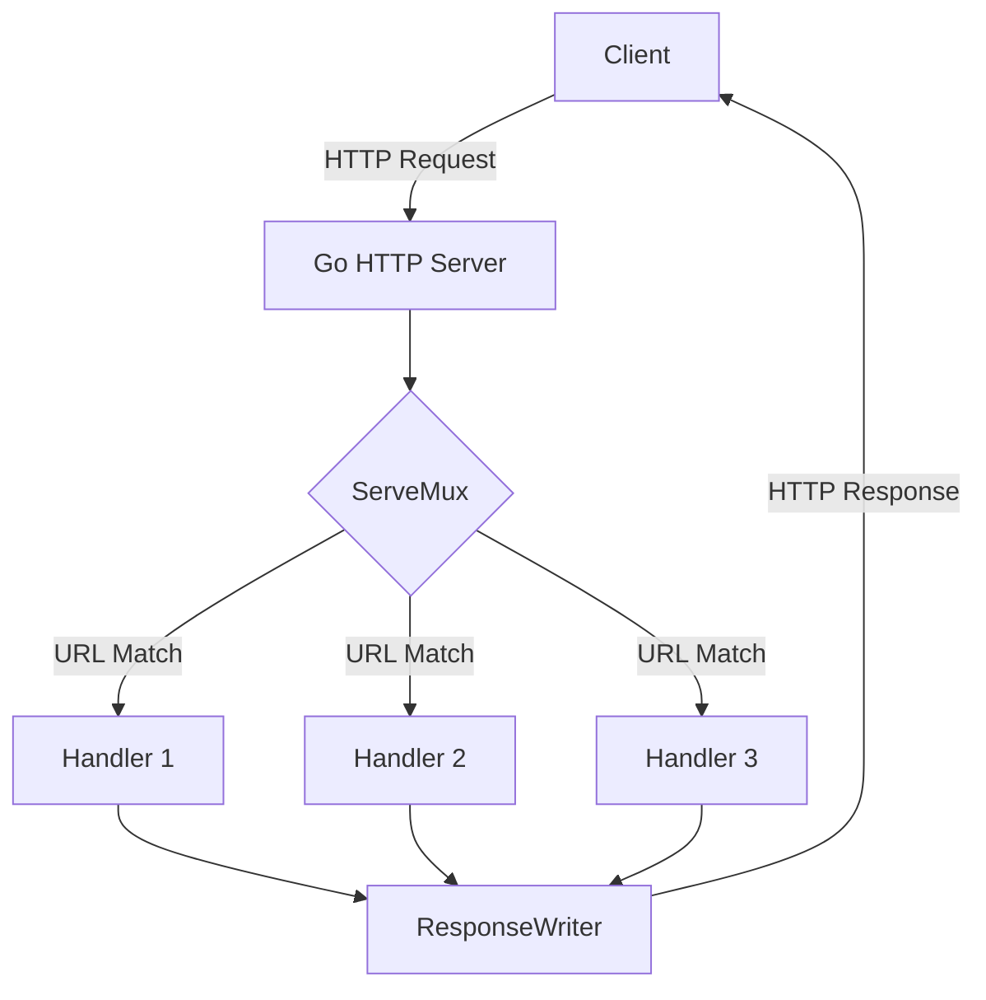

# Go HTTP Server

## Introduction

Go's standard library provides a powerful, efficient, and straightforward way to create HTTP servers through the `net/http` package. This makes Go an excellent choice for building web applications, APIs, and microservices without requiring additional frameworks or libraries.

In this tutorial, we'll explore how to create HTTP servers in Go, handle different types of requests, serve static files, and implement basic routing. By the end, you'll have a solid understanding of how to build web applications using Go's standard library.

## Prerequisites

- Basic knowledge of Go programming
- Understanding of HTTP concepts (requests, responses, methods)
- Go installed on your system

## Creating a Basic HTTP Server

Let's start with the simplest possible HTTP server in Go:

```go
package main

import (
    "fmt"
    "net/http"
)

func helloHandler(w http.ResponseWriter, r *http.Request) {
    fmt.Fprintf(w, "Hello, Go Web Development!")
}

func main() {
    http.HandleFunc("/", helloHandler)
    fmt.Println("Server starting on port 8080...")
    http.ListenAndServe(":8080", nil)
}
```

Save this as `server.go` and run it with:

```
go run server.go
```

Now open your browser and navigate to `http://localhost:8080`. You should see:

```
Hello, Go Web Development!
```

### How It Works

Let's break down what's happening:

1. We import the necessary packages:
   - `fmt` for formatted output
   - `net/http` for HTTP functionality

2. We define a handler function `helloHandler` that takes two parameters:
   - `w http.ResponseWriter`: Used to send the response back to the client
   - `r *http.Request`: Contains information about the HTTP request

3. In the `main` function, we:
   - Register our handler function with `http.HandleFunc("/", helloHandler)`
   - Start the server on port 8080 with `http.ListenAndServe(":8080", nil)`

The `nil` argument in `ListenAndServe` means we're using the default `ServeMux` (multiplexer) for routing.

## HTTP Request Handling

Let's expand our example to handle different HTTP methods:

```go
package main

import (
    "fmt"
    "net/http"
)

func handler(w http.ResponseWriter, r *http.Request) {
    // Print the request method and URL path
    fmt.Printf("Method: %s, Path: %s
", r.Method, r.URL.Path)
    
    switch r.Method {
    case "GET":
        fmt.Fprintf(w, "You sent a GET request to %s", r.URL.Path)
    case "POST":
        fmt.Fprintf(w, "You sent a POST request to %s", r.URL.Path)
    default:
        fmt.Fprintf(w, "You sent a %s request to %s", r.Method, r.URL.Path)
    }
}

func main() {
    http.HandleFunc("/", handler)
    fmt.Println("Server starting on port 8080...")
    http.ListenAndServe(":8080", nil)
}
```

Now our server responds differently based on the HTTP method used in the request.

### Testing Different Methods

You can test different HTTP methods using tools like curl:

For GET requests:
```bash
curl http://localhost:8080/hello
```

Output:
```
You sent a GET request to /hello
```

For POST requests:
```bash
curl -X POST http://localhost:8080/hello
```

Output:
```
You sent a POST request to /hello
```

## Handling URL Parameters

Go's HTTP server can handle URL parameters and extract values from URLs:

```go
package main

import (
    "fmt"
    "net/http"
    "strings"
)

func userHandler(w http.ResponseWriter, r *http.Request) {
    // Extract the username from the URL path
    path := strings.TrimPrefix(r.URL.Path, "/user/")
    
    if path == "" {
        fmt.Fprintf(w, "Please provide a username")
        return
    }
    
    fmt.Fprintf(w, "Hello, %s!", path)
}

func main() {
    http.HandleFunc("/user/", userHandler)
    fmt.Println("Server starting on port 8080...")
    http.ListenAndServe(":8080", nil)
}
```

Now you can visit `http://localhost:8080/user/gopher` and you'll see:

```
Hello, gopher!
```

## Processing Form Data

Let's create a simple form handler:

```go
package main

import (
    "fmt"
    "html/template"
    "net/http"
)

var formTemplate = `
<!DOCTYPE html>
<html>
<head>
    <title>Go Form Example</title>
</head>
<body>
    <h1>User Registration</h1>
    <form method="POST">
        <div>
            <label for="name">Name:</label>
            <input type="text" id="name" name="name">
        </div>
        <div>
            <label for="email">Email:</label>
            <input type="email" id="email" name="email">
        </div>
        <div>
            <input type="submit" value="Register">
        </div>
    </form>
    
    {{if .Success}}
    <div>
        <h2>Registration Successful!</h2>
        <p>Name: {{.Name}}</p>
        <p>Email: {{.Email}}</p>
    </div>
    {{end}}
</body>
</html>
`

type PageData struct {
    Success bool
    Name    string
    Email   string
}

func formHandler(w http.ResponseWriter, r *http.Request) {
    data := PageData{Success: false}
    
    if r.Method == "POST" {
        // Parse the form data
        err := r.ParseForm()
        if err != nil {
            http.Error(w, "Error parsing form", http.StatusBadRequest)
            return
        }
        
        // Get form values
        data.Name = r.FormValue("name")
        data.Email = r.FormValue("email")
        data.Success = true
    }
    
    // Parse and execute the template
    tmpl, err := template.New("form").Parse(formTemplate)
    if err != nil {
        http.Error(w, "Error creating template", http.StatusInternalServerError)
        return
    }
    
    tmpl.Execute(w, data)
}

func main() {
    http.HandleFunc("/form", formHandler)
    fmt.Println("Server starting on port 8080...")
    http.ListenAndServe(":8080", nil)
}
```

This example demonstrates:
1. Serving an HTML form
2. Processing submitted form data
3. Displaying results using Go templates

Visit `http://localhost:8080/form` to see the form. After submitting, the page will display the entered information.

## Serving Static Files

Web applications often need to serve static files like CSS, JavaScript, and images:

```go
package main

import (
    "fmt"
    "net/http"
)

func main() {
    // Create a file server that serves files from the "static" directory
    fs := http.FileServer(http.Dir("static"))
    
    // Register the file server to handle requests to "/static/"
    http.Handle("/static/", http.StripPrefix("/static/", fs))
    
    // Add a handler for the home page
    http.HandleFunc("/", func(w http.ResponseWriter, r *http.Request) {
        fmt.Fprintf(w, `
        <!DOCTYPE html>
        <html>
        <head>
            <title>Static Files Example</title>
            <link rel="stylesheet" href="/static/style.css">
        </head>
        <body>
            <h1>Static Files in Go</h1>
            
            <script src="/static/script.js"></script>
        </body>
        </html>
        `)
    })
    
    fmt.Println("Server starting on port 8080...")
    http.ListenAndServe(":8080", nil)
}
```

For this to work, create a folder named `static` in the same directory as your Go file, and create the following files:

**static/style.css**:
```css
body {
    font-family: Arial, sans-serif;
    max-width: 800px;
    margin: 0 auto;
    padding: 20px;
    text-align: center;
}

h1 {
    color: #00ADD8; /* Go blue */
}

img {
    max-width: 300px;
}
```

**static/script.js**:
```javascript
console.log("Go HTTP Server is awesome!");
```

You'll also need a gopher image (named `gopher.png`) in the static folder, or you can modify the HTML to use a different image.

## Custom Mux (Router)

While the default `ServeMux` works for simple cases, you might want more control over routing. Go allows creating custom multiplexers:

```go
package main

import (
    "fmt"
    "net/http"
)

func main() {
    // Create a new ServeMux
    mux := http.NewServeMux()
    
    // Register handlers with the custom mux
    mux.HandleFunc("/", func(w http.ResponseWriter, r *http.Request) {
        if r.URL.Path != "/" {
            http.NotFound(w, r)
            return
        }
        fmt.Fprintf(w, "Welcome to the Home Page!")
    })
    
    mux.HandleFunc("/about", func(w http.ResponseWriter, r *http.Request) {
        fmt.Fprintf(w, "This is the About Page!")
    })
    
    mux.HandleFunc("/contact", func(w http.ResponseWriter, r *http.Request) {
        fmt.Fprintf(w, "Contact us at example@example.com")
    })
    
    // Use the custom mux when starting the server
    fmt.Println("Server starting on port 8080...")
    http.ListenAndServe(":8080", mux)
}
```

This approach gives you more control over routing and better handling of 404 cases.

## Middleware in Go

Middleware functions can process requests before they reach your handlers. Here's a simple logging middleware example:

```go
package main

import (
    "fmt"
    "log"
    "net/http"
    "time"
)

// Logging middleware
func loggingMiddleware(next http.Handler) http.Handler {
    return http.HandlerFunc(func(w http.ResponseWriter, r *http.Request) {
        // Log the request
        startTime := time.Now()
        log.Printf("Request started: %s %s", r.Method, r.URL.Path)
        
        // Call the next handler
        next.ServeHTTP(w, r)
        
        // Log the completion time
        log.Printf("Request completed: %s %s in %v", r.Method, r.URL.Path, time.Since(startTime))
    })
}

func helloHandler(w http.ResponseWriter, r *http.Request) {
    fmt.Fprintf(w, "Hello, Go Web Development!")
}

func main() {
    // Create a new ServeMux
    mux := http.NewServeMux()
    
    // Register handlers
    mux.HandleFunc("/", helloHandler)
    
    // Wrap the mux with our middleware
    wrappedMux := loggingMiddleware(mux)
    
    fmt.Println("Server starting on port 8080...")
    http.ListenAndServe(":8080", wrappedMux)
}
```

Running this server, you'll see log messages in the console for each request:

```
2023/05/15 12:34:56 Request started: GET /
2023/05/15 12:34:56 Request completed: GET / in 23.5µs
```

## HTTP Server with Timeouts

For production servers, it's important to set timeouts to prevent resource exhaustion:

```go
package main

import (
    "fmt"
    "net/http"
    "time"
)

func helloHandler(w http.ResponseWriter, r *http.Request) {
    fmt.Fprintf(w, "Hello, Go Web Development!")
}

func main() {
    // Create a new ServeMux
    mux := http.NewServeMux()
    
    // Register handlers
    mux.HandleFunc("/", helloHandler)
    
    // Create a server with configurations
    server := &http.Server{
        Addr:         ":8080",
        Handler:      mux,
        ReadTimeout:  5 * time.Second,
        WriteTimeout: 10 * time.Second,
        IdleTimeout:  120 * time.Second,
    }
    
    fmt.Println("Server starting on port 8080...")
    server.ListenAndServe()
}
```

This configuration helps protect your server from slow clients and potential denial-of-service attacks.

## HTTP Server Architecture

Here's a diagram showing how Go's HTTP server processes requests:



## Practical Example: RESTful API

Let's create a simple RESTful API for a book collection:

```go
package main

import (
    "encoding/json"
    "fmt"
    "net/http"
    "strconv"
    "strings"
)

// Book represents a book in our collection
type Book struct {
    ID     int    `json:"id"`
    Title  string `json:"title"`
    Author string `json:"author"`
    Year   int    `json:"year"`
}

// In-memory database of books
var books = []Book{
    {ID: 1, Title: "The Go Programming Language", Author: "Alan A. A. Donovan & Brian W. Kernighan", Year: 2015},
    {ID: 2, Title: "Go in Action", Author: "William Kennedy", Year: 2015},
    {ID: 3, Title: "Concurrency in Go", Author: "Katherine Cox-Buday", Year: 2017},
}

func booksHandler(w http.ResponseWriter, r *http.Request) {
    w.Header().Set("Content-Type", "application/json")
    
    // Extract the ID from the path if present
    path := strings.TrimPrefix(r.URL.Path, "/books/")
    
    if path == "" {
        // Handle collection requests
        switch r.Method {
        case "GET":
            // Return all books
            json.NewEncoder(w).Encode(books)
        case "POST":
            // Add a new book
            var book Book
            err := json.NewDecoder(r.Body).Decode(&book)
            if err != nil {
                http.Error(w, err.Error(), http.StatusBadRequest)
                return
            }
            
            // Generate a new ID
            book.ID = len(books) + 1
            books = append(books, book)
            
            w.WriteHeader(http.StatusCreated)
            json.NewEncoder(w).Encode(book)
        default:
            http.Error(w, "Method not allowed", http.StatusMethodNotAllowed)
        }
        return
    }
    
    // Handle individual book requests
    id, err := strconv.Atoi(path)
    if err != nil {
        http.Error(w, "Invalid book ID", http.StatusBadRequest)
        return
    }
    
    // Find the book
    var book *Book
    for i := range books {
        if books[i].ID == id {
            book = &books[i]
            break
        }
    }
    
    if book == nil {
        http.Error(w, "Book not found", http.StatusNotFound)
        return
    }
    
    switch r.Method {
    case "GET":
        // Return the book
        json.NewEncoder(w).Encode(book)
    case "PUT":
        // Update the book
        var updatedBook Book
        err := json.NewDecoder(r.Body).Decode(&updatedBook)
        if err != nil {
            http.Error(w, err.Error(), http.StatusBadRequest)
            return
        }
        
        // Preserve the ID
        updatedBook.ID = book.ID
        *book = updatedBook
        
        json.NewEncoder(w).Encode(book)
    case "DELETE":
        // Remove the book
        for i := range books {
            if books[i].ID == id {
                // Remove the book from the slice
                books = append(books[:i], books[i+1:]...)
                break
            }
        }
        
        w.WriteHeader(http.StatusNoContent)
    default:
        http.Error(w, "Method not allowed", http.StatusMethodNotAllowed)
    }
}

func main() {
    http.HandleFunc("/books/", booksHandler)
    http.HandleFunc("/books", booksHandler)
    
    fmt.Println("REST API server starting on port 8080...")
    http.ListenAndServe(":8080", nil)
}
```

This example demonstrates a complete RESTful API with the following endpoints:

- `GET /books`: List all books
- `POST /books`: Create a new book
- `GET /books/{id}`: Get a specific book
- `PUT /books/{id}`: Update a specific book
- `DELETE /books/{id}`: Delete a specific book

You can test this API using tools like curl or Postman.

## Summary

In this tutorial, we've covered:

1. Creating a basic HTTP server in Go
2. Handling different HTTP methods
3. Processing URL parameters and form data
4. Serving static files
5. Creating custom routers
6. Implementing middleware
7. Setting up server timeouts
8. Building a complete RESTful API

Go's standard library provides all the tools needed to build powerful web applications without relying on external frameworks. The `net/http` package offers a simple yet flexible API for creating HTTP servers, while still allowing for advanced features like middleware and custom routing.

## Additional Resources

Here are some resources to further your learning:

1. [Go Documentation for net/http](https://pkg.go.dev/net/http)
2. [Effective Go](https://golang.org/doc/effective_go)
3. [Go Web Examples](https://gowebexamples.com/)

## Exercises

To practice what you've learned, try these exercises:

1. Extend the book API to include search functionality (e.g., search by title or author)
2. Add authentication middleware to protect certain endpoints
3. Implement a simple web application that uses templates to display data
4. Create a file upload handler
5. Build a simple WebSocket server for real-time communication

Remember, the best way to learn is by coding. Start with small projects and gradually build more complex applications as you become more comfortable with Go's HTTP server capabilities.